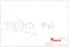

Contents
========

* [PRA1713 > Adafruit MAX9814 AGC Microphone PCB](#pra1713--adafruit-max9814-agc-microphone-pcb)
	* [Schematic](#schematic)
	* [PCB](#pcb)
	* [Interactive BOM](#interactive-bom)
	* [OOMP Parts](#oomp-parts)
	* [Images](#images)
	* [Tags](#tags)
  
![][im]
# PRA1713 > Adafruit MAX9814 AGC Microphone PCB

- ID: PROJ-ADAF-1713-STAN-01
- Hex ID: PRA1713
- Name: Adafruit
- Description: Adafruit
- Long Link: [http://oom.lt/PROJ-ADAF-1713-STAN-01](http://oom.lt/PROJ-ADAF-1713-STAN-01)
- Short Link: [http://oom.lt/PRA1713](http://oom.lt/PRA1713)

## Schematic
  

## PCB
  

## Interactive BOM

- Interactive BOM page: [ibom.html](https://htmlpreview.github.io/?https://github.com/oomlout/oomlout_OOMP_projects/blob/main/PROJ-ADAF-1713-STAN-01/kicad/bom/ibom.html)

## OOMP Parts
  

|OOMP Parts|
| :---: |
|[CAPC-0805-X-UF22D-V25  SMD (0805) 2.2 uF Capacitor (Ceramic) 25v  C1, C5](https://github.com/oomlout/oomlout_OOMP_parts/tree/main/CAPC-0805-X-UF22D-V25/)|
|[CAPC-0805-X-NF100-V50  SMD (0805) 100 nF Capacitor (Ceramic) 50v  C2, C9](https://github.com/oomlout/oomlout_OOMP_parts/tree/main/CAPC-0805-X-NF100-V50/)|
|CAPC-0805-X-UF47-01 C8|
|FERB-0805-X-UNMATCHED-01 FB1, FB2|
|[HEAD-I01-X-PI05-01  2.54 mm 5 Pin Header  J2](https://github.com/oomlout/oomlout_OOMP_parts/tree/main/HEAD-I01-X-PI05-01/)|
|UNMATCHED-UNMATCHED-X-UNMATCHED-01 Q1, U$1|
|RESE-0805-X-O1503-01 R1|
|RESE-0805-X-O1003-01 R2|
|[RESE-0805-X-O222-01  SMD (0805) 2.2k Ohm Resistor  R3](https://github.com/oomlout/oomlout_OOMP_parts/tree/main/RESE-0805-X-O222-01/)|

## Images
  
  

|bominteractivefront|bominteractiveback|kicadPcb3d|kicadPcb3dFront|kicadPcb3dBack|eagleImage|eagleSchemImage|pcbdraw|pcbdrawback|
| :---: | :---: | :---: | :---: | :---: | :---: | :---: | :---: | :---: |
||||||||||

## Tags

- hexID: PRA1713
- oompType: PROJ
- oompSize: ADAF
- oompColor: 1713
- oompDesc: STAN
- oompIndex: 01
- oompName: Adafruit MAX9814 AGC Microphone PCB
- sources: All source files from https://github.com/adafruit/Adafruit-MAX9814-AGC-Microphone-PCB (source licence details in srcLicense.md)
- linkBuyPage: http://www.adafruit.com/products/1713
- oompID: PROJ-ADAF-1713-STAN-01
- oompParts: C1,CAPC-0805-X-UF22D-V25
- oompParts: C2,CAPC-0805-X-NF100-V50
- oompParts: C5,CAPC-0805-X-UF22D-V25
- oompParts: C8,CAPC-0805-X-UF47-01
- oompParts: C9,CAPC-0805-X-NF100-V50
- oompParts: FB1,FERB-0805-X-UNMATCHED-01
- oompParts: FB2,FERB-0805-X-UNMATCHED-01
- oompParts: J2,HEAD-I01-X-PI05-01
- oompParts: Q1,UNMATCHED-UNMATCHED-X-UNMATCHED-01
- oompParts: R1,RESE-0805-X-O1503-01
- oompParts: R2,RESE-0805-X-O1003-01
- oompParts: R3,RESE-0805-X-O222-01
- oompParts: U$1,UNMATCHED-UNMATCHED-X-UNMATCHED-01
- rawParts: C1,2.2uF,C-USC0805K,C0805K,CAPACITOR, American symbol,,
- rawParts: C2,0.1uF,C-USC0805K,C0805K,CAPACITOR, American symbol,,
- rawParts: C5,2.2uF,C-USC0805K,C0805K,CAPACITOR, American symbol,,
- rawParts: C8,0.47uF,C-USC0805K,C0805K,CAPACITOR, American symbol,,
- rawParts: C9,0.1uF,C-USC0805K,C0805K,CAPACITOR, American symbol,,
- rawParts: FB1,FERRITE,FERRITE0805,0805,Ferrite Bead,,
- rawParts: FB2,FERRITE,FERRITE0805,0805,Ferrite Bead,,
- rawParts: J2,,HEADER-1X576MIL,1X05_ROUND_76,PIN HEADER,,
- rawParts: Q1,CMA-4544PF-W,ELECTRET,9.7ELECTRET,Electret microphone,,
- rawParts: R1,150k,R-US_R0805,R0805,RESISTOR, American symbol,,
- rawParts: R2,100k,R-US_R0805,R0805,RESISTOR, American symbol,,
- rawParts: R3,2.2K,R-US_R0805,R0805,RESISTOR, American symbol,,
- rawParts: U$1,MAX9814TDFN14,MAX9814TDFN14,TDFN14_3X3MM,,,
- rawParts: U$2,FIDUCIAL,FIDUCIAL,FIDUCIAL_1MM,For use by pick and place machines to calibrate the vision/machine, 1mm,,
- rawParts: U$3,FIDUCIAL,FIDUCIAL,FIDUCIAL_1MM,For use by pick and place machines to calibrate the vision/machine, 1mm,,
- rawParts: U$4,MOUNTINGHOLE2.0,MOUNTINGHOLE2.0,MOUNTINGHOLE_2.0_PLATED,Mounting Hole,,
- rawParts: U$5,MOUNTINGHOLE2.0,MOUNTINGHOLE2.0,MOUNTINGHOLE_2.0_PLATED,Mounting Hole,,

[im]: kicadPcb3d_450.png
