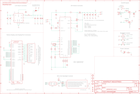

Contents
========

* [PRA1716 > Adafruit Qualia Driver PCB](#pra1716--adafruit-qualia-driver-pcb)
	* [Schematic](#schematic)
	* [PCB](#pcb)
	* [Interactive BOM](#interactive-bom)
	* [OOMP Parts](#oomp-parts)
	* [Images](#images)
	* [Tags](#tags)
  
![][im]
# PRA1716 > Adafruit Qualia Driver PCB

- ID: PROJ-ADAF-1716-STAN-01
- Hex ID: PRA1716
- Name: Adafruit
- Description: Adafruit
- Long Link: [http://oom.lt/PROJ-ADAF-1716-STAN-01](http://oom.lt/PROJ-ADAF-1716-STAN-01)
- Short Link: [http://oom.lt/PRA1716](http://oom.lt/PRA1716)

## Schematic
  

## PCB
  

## Interactive BOM

- Interactive BOM page: [ibom.html](https://htmlpreview.github.io/?https://github.com/oomlout/oomlout_OOMP_projects/blob/main/PROJ-ADAF-1716-STAN-01/kicad/bom/ibom.html)

## OOMP Parts
  

|OOMP ID|Name|Identifier|
| :---: | :---: | :---: |
|[CAPC-0805-X-UF10-V10](https://github.com/oomlout/oomlout_OOMP_parts/tree/main/CAPC-0805-X-UF10-V10/)|[SMD (0805) 10 uF Capacitor (Ceramic) 10v](https://github.com/oomlout/oomlout_OOMP_parts/tree/main/CAPC-0805-X-UF10-V10/)|[C1, C12, C13](https://github.com/oomlout/oomlout_OOMP_parts/tree/main/CAPC-0805-X-UF10-V10/)|
|CAPC-0805-X-UNMATCHED-01||C2, C4, C5, C6, C7, C8, C9, C10|
|CAPC-0805-X-PF47D-01||C3|
|CAPC-0805-X-NF22-01||C11|
|[CAPC-0805-X-NF100-V50](https://github.com/oomlout/oomlout_OOMP_parts/tree/main/CAPC-0805-X-NF100-V50/)|[SMD (0805) 100 nF Capacitor (Ceramic) 50v](https://github.com/oomlout/oomlout_OOMP_parts/tree/main/CAPC-0805-X-NF100-V50/)|[C14, C15](https://github.com/oomlout/oomlout_OOMP_parts/tree/main/CAPC-0805-X-NF100-V50/)|
|CAPE-PANC-X-UF47-V25||C16|
|DIOD-UNMATCHED-X-UNMATCHED-01||D1|
|[DIOD-S323-X-K4148-01](https://github.com/oomlout/oomlout_OOMP_parts/tree/main/DIOD-S323-X-K4148-01/)|[SMD (SOD-323) Diode](https://github.com/oomlout/oomlout_OOMP_parts/tree/main/DIOD-S323-X-K4148-01/)|[D2](https://github.com/oomlout/oomlout_OOMP_parts/tree/main/DIOD-S323-X-K4148-01/)|
|UNMATCHED-UNMATCHED-X-UNMATCHED-01||IC1, L1, L2, ON/OFF, T1, T2, U1, U2, X1, X2, X3|
|HEAD-I01-X-UNMATCHED-01||ISP1|
|HEAD-I01-X-PI01-01||JP1|
|[LEDS-0805-G-STAN-01](https://github.com/oomlout/oomlout_OOMP_parts/tree/main/LEDS-0805-G-STAN-01/)|[SMD (0805) Green LED](https://github.com/oomlout/oomlout_OOMP_parts/tree/main/LEDS-0805-G-STAN-01/)|[LED1](https://github.com/oomlout/oomlout_OOMP_parts/tree/main/LEDS-0805-G-STAN-01/)|
|MOSN-UNMATCHED-X-UNMATCHED-01||Q1|
|[RESE-0805-X-O471-01](https://github.com/oomlout/oomlout_OOMP_parts/tree/main/RESE-0805-X-O471-01/)|[SMD (0805) 470 Ohm Resistor](https://github.com/oomlout/oomlout_OOMP_parts/tree/main/RESE-0805-X-O471-01/)|[R1](https://github.com/oomlout/oomlout_OOMP_parts/tree/main/RESE-0805-X-O471-01/)|
|RESE-0805-X-O1003-01||R2, R3|
|[RESE-0805-X-O203-01](https://github.com/oomlout/oomlout_OOMP_parts/tree/main/RESE-0805-X-O203-01/)|[SMD (0805) 20k Ohm Resistor](https://github.com/oomlout/oomlout_OOMP_parts/tree/main/RESE-0805-X-O203-01/)|[R4, R6, R7, R9, R14](https://github.com/oomlout/oomlout_OOMP_parts/tree/main/RESE-0805-X-O203-01/)|
|[RESE-0805-X-O273-01](https://github.com/oomlout/oomlout_OOMP_parts/tree/main/RESE-0805-X-O273-01/)|[SMD (0805) 27k Ohm Resistor](https://github.com/oomlout/oomlout_OOMP_parts/tree/main/RESE-0805-X-O273-01/)|[R5](https://github.com/oomlout/oomlout_OOMP_parts/tree/main/RESE-0805-X-O273-01/)|
|[RESE-0805-X-O473-01](https://github.com/oomlout/oomlout_OOMP_parts/tree/main/RESE-0805-X-O473-01/)|[SMD (0805) 47k Ohm Resistor](https://github.com/oomlout/oomlout_OOMP_parts/tree/main/RESE-0805-X-O473-01/)|[R8, R10](https://github.com/oomlout/oomlout_OOMP_parts/tree/main/RESE-0805-X-O473-01/)|
|[RESE-0805-X-O153-01](https://github.com/oomlout/oomlout_OOMP_parts/tree/main/RESE-0805-X-O153-01/)|[SMD (0805) 15k Ohm Resistor](https://github.com/oomlout/oomlout_OOMP_parts/tree/main/RESE-0805-X-O153-01/)|[R11](https://github.com/oomlout/oomlout_OOMP_parts/tree/main/RESE-0805-X-O153-01/)|
|RESE-0805-X-UNMATCHED-01||R12|
|RESE-UNMATCHED-X-UNMATCHED-01||R13|
|[BUTA-6060-X-STAN-01](https://github.com/oomlout/oomlout_OOMP_parts/tree/main/BUTA-6060-X-STAN-01/)|[SMD (6060) Pushbutton (Tactile)](https://github.com/oomlout/oomlout_OOMP_parts/tree/main/BUTA-6060-X-STAN-01/)|[SW1, SW2, SW3](https://github.com/oomlout/oomlout_OOMP_parts/tree/main/BUTA-6060-X-STAN-01/)|

## Images
  
  

|bominteractivefront|bominteractiveback|kicadPcb3d|kicadPcb3dFront|kicadPcb3dBack|kicadSchem|eagleImage|eagleSchemImage|pcbdraw|pcbdrawback|
| :---: | :---: | :---: | :---: | :---: | :---: | :---: | :---: | :---: | :---: |
|||||||||||

## Tags

- hexID: PRA1716
- oompType: PROJ
- oompSize: ADAF
- oompColor: 1716
- oompDesc: STAN
- oompIndex: 01
- oompName: Adafruit Qualia Driver PCB
- sources: All source files from https://github.com/adafruit/Adafruit-Qualia-Driver-PCB (source licence details in srcLicense.md)
- linkBuyPage: http://www.adafruit.com/products/1716
- oompID: PROJ-ADAF-1716-STAN-01
- oompParts: C1,CAPC-0805-X-UF10-V10
- oompParts: C2,CAPC-0805-X-UNMATCHED-01
- oompParts: C3,CAPC-0805-X-PF47D-01
- oompParts: C4,CAPC-0805-X-UNMATCHED-01
- oompParts: C5,CAPC-0805-X-UNMATCHED-01
- oompParts: C6,CAPC-0805-X-UNMATCHED-01
- oompParts: C7,CAPC-0805-X-UNMATCHED-01
- oompParts: C8,CAPC-0805-X-UNMATCHED-01
- oompParts: C9,CAPC-0805-X-UNMATCHED-01
- oompParts: C10,CAPC-0805-X-UNMATCHED-01
- oompParts: C11,CAPC-0805-X-NF22-01
- oompParts: C12,CAPC-0805-X-UF10-V10
- oompParts: C13,CAPC-0805-X-UF10-V10
- oompParts: C14,CAPC-0805-X-NF100-V50
- oompParts: C15,CAPC-0805-X-NF100-V50
- oompParts: C16,CAPE-PANC-X-UF47-V25
- oompParts: D1,DIOD-UNMATCHED-X-UNMATCHED-01
- oompParts: D2,DIOD-S323-X-K4148-01
- oompParts: IC1,UNMATCHED-UNMATCHED-X-UNMATCHED-01
- oompParts: ISP1,HEAD-I01-X-UNMATCHED-01
- oompParts: JP1,HEAD-I01-X-PI01-01
- oompParts: L1,UNMATCHED-UNMATCHED-X-UNMATCHED-01
- oompParts: L2,UNMATCHED-UNMATCHED-X-UNMATCHED-01
- oompParts: LED1,LEDS-0805-G-STAN-01
- oompParts: ON/OFF,UNMATCHED-UNMATCHED-X-UNMATCHED-01
- oompParts: Q1,MOSN-UNMATCHED-X-UNMATCHED-01
- oompParts: R1,RESE-0805-X-O471-01
- oompParts: R2,RESE-0805-X-O1003-01
- oompParts: R3,RESE-0805-X-O1003-01
- oompParts: R4,RESE-0805-X-O203-01
- oompParts: R5,RESE-0805-X-O273-01
- oompParts: R6,RESE-0805-X-O203-01
- oompParts: R7,RESE-0805-X-O203-01
- oompParts: R8,RESE-0805-X-O473-01
- oompParts: R9,RESE-0805-X-O203-01
- oompParts: R10,RESE-0805-X-O473-01
- oompParts: R11,RESE-0805-X-O153-01
- oompParts: R12,RESE-0805-X-UNMATCHED-01
- oompParts: R13,RESE-UNMATCHED-X-UNMATCHED-01
- oompParts: R14,RESE-0805-X-O203-01
- oompParts: SW1,BUTA-6060-X-STAN-01
- oompParts: SW2,BUTA-6060-X-STAN-01
- oompParts: SW3,BUTA-6060-X-STAN-01
- oompParts: T1,UNMATCHED-UNMATCHED-X-UNMATCHED-01
- oompParts: T2,UNMATCHED-UNMATCHED-X-UNMATCHED-01
- oompParts: U1,UNMATCHED-UNMATCHED-X-UNMATCHED-01
- oompParts: U2,UNMATCHED-UNMATCHED-X-UNMATCHED-01
- oompParts: X1,UNMATCHED-UNMATCHED-X-UNMATCHED-01
- oompParts: X2,UNMATCHED-UNMATCHED-X-UNMATCHED-01
- oompParts: X3,UNMATCHED-UNMATCHED-X-UNMATCHED-01
- rawParts: C1,10uF,CAP_CERAMIC_0805,_0805,Ceramic Capacitors,,
- rawParts: C2,4.7uF/50V,CAP_CERAMIC_0805,_0805,Ceramic Capacitors,,
- rawParts: C3,4.7nF,CAP_CERAMIC_0805,_0805,Ceramic Capacitors,,
- rawParts: C4,4.7uF/50V,CAP_CERAMIC_0805,_0805,Ceramic Capacitors,,
- rawParts: C5,4.7uF/50V,CAP_CERAMIC_0805,_0805,Ceramic Capacitors,,
- rawParts: C6,4.7uF/50V,CAP_CERAMIC_0805,_0805,Ceramic Capacitors,,
- rawParts: C7,4.7uF/50V,CAP_CERAMIC_0805,_0805,Ceramic Capacitors,,
- rawParts: C8,4.7uF/50V,CAP_CERAMIC_0805,_0805,Ceramic Capacitors,,
- rawParts: C9,10uF/16V,CAP_CERAMIC_0805,_0805,Ceramic Capacitors,,
- rawParts: C10,10uF/16V,CAP_CERAMIC_0805,_0805,Ceramic Capacitors,,
- rawParts: C11,22nF,CAP_CERAMIC_0805,_0805,Ceramic Capacitors,,
- rawParts: C12,10uF,CAP_CERAMIC_0805,_0805,Ceramic Capacitors,,
- rawParts: C13,10uF,CAP_CERAMIC_0805,_0805,Ceramic Capacitors,,
- rawParts: C14,0.1uF,CAP_CERAMIC_0805,_0805,Ceramic Capacitors,,
- rawParts: C15,0.1uF,CAP_CERAMIC_0805,_0805,Ceramic Capacitors,,
- rawParts: C16,47uF 25V,CAP_ELECTROLYTICPANASONIC_C,PANASONIC_C,Electrolytic Capacitors,,
- rawParts: D1,PDS560-13,DIODEPOWERDI,POWERDI-5,Diode,,
- rawParts: D2,1N4148,DIODESOD-323,SOD-323,Diode,,
- rawParts: FID1,FIDUCIAL,FIDUCIAL,FIDUCIAL_1MM,Fiducial Alignment Points,EXCLUDE,
- rawParts: FID2,FIDUCIAL,FIDUCIAL,FIDUCIAL_1MM,Fiducial Alignment Points,EXCLUDE,
- rawParts: FID3,FIDUCIAL,FIDUCIAL,FIDUCIAL_1MM,Fiducial Alignment Points,EXCLUDE,
- rawParts: IC1,ATTINY85-20S,ATTINY85-20S,SOIC8,MICROCONTROLLER,,
- rawParts: ISP1,AVRISP-6,AVRISP-6,AVRISP,AVR ISP HEADER,,
- rawParts: JP1,,PINHD-1X1CB,1X01-CLEANBIG,Pin header 1x1 for 0.1 spacing,,
- rawParts: L1,22uH,INDUCTORCDRH5D28,INDUCTOR_6X6MM_SUMIDA_CDRH5D28,Inductors,,
- rawParts: L2,4.7uH (445-6526-1-ND),INDUCTORTDK_VLC5045,INDUCTOR_5X5MM_TDK_VLC5045,Inductors,,
- rawParts: LED1,green,LED0805,CHIPLED_0805,LED,,
- rawParts: ON/OFF,EG1390,DPDT-EG1390,EG1390,,,
- rawParts: Q1,IRLR024NTRPBF,MOSFET-NDPAK,DPAK,N-Channel Mosfet,,
- rawParts: R1,470,RESISTOR_0805,_0805,Resistors,,
- rawParts: R2,100K,RESISTOR_0805,_0805,Resistors,,
- rawParts: R3,100K,RESISTOR_0805,_0805,Resistors,,
- rawParts: R4,20K,RESISTOR_0805,_0805,Resistors,,
- rawParts: R5,27K,RESISTOR_0805,_0805,Resistors,,
- rawParts: R6,20K,RESISTOR_0805MP,_0805MP,Resistors,,
- rawParts: R7,20K,RESISTOR_0805MP,_0805MP,Resistors,,
- rawParts: R8,47K,RESISTOR_0805,_0805,Resistors,,
- rawParts: R9,20K,RESISTOR_0805,_0805,Resistors,,
- rawParts: R10,47K,RESISTOR_0805,_0805,Resistors,,
- rawParts: R11,15K,RESISTOR_0805,_0805,Resistors,,
- rawParts: R12,7.5K,RESISTOR_0805,_0805,Resistors,,
- rawParts: R13,0.058,RESISTOR2512,2512,Resistors,,
- rawParts: R14,20K,RESISTOR_0805,_0805,Resistors,,
- rawParts: SJ1,,SOLDERJUMPER_2WAY,SOLDERJUMPER_2WAY_OPEN_NOPASTE,2-Way Solder Jumper,,
- rawParts: SW1,SPST_TACT-EVQQ2,SPST_TACT-EVQQ2,EVQ-Q2,SMT 6mm switch, EVQQ2 series,,
- rawParts: SW2,SPST_TACT-EVQQ2,SPST_TACT-EVQQ2,EVQ-Q2,SMT 6mm switch, EVQQ2 series,,
- rawParts: SW3,SPST_TACT-EVQQ2,SPST_TACT-EVQQ2,EVQ-Q2,SMT 6mm switch, EVQQ2 series,,
- rawParts: T1,IRLML2246,PMOSSOT23,SOT-23,MOS FET,,
- rawParts: T2,IRLML2246,PMOSSOT23,SOT-23,MOS FET,,
- rawParts: TP1,GND,TESTPOINTROUND1MM,TESTPOINT_ROUND_1MM,Test Point,,
- rawParts: TP2,VIN,TESTPOINTROUND1MM,TESTPOINT_ROUND_1MM,Test Point,,
- rawParts: TP3,20V,TESTPOINTROUND1MM,TESTPOINT_ROUND_1MM,Test Point,,
- rawParts: TP4,GND,TESTPOINTROUND1MM,TESTPOINT_ROUND_1MM,Test Point,,
- rawParts: U$11,MOUNTINGHOLE3.0THIN,MOUNTINGHOLE3.0THIN,MOUNTINGHOLE_3.0_PLATEDTHIN,Mounting Hole,EXCLUDE,
- rawParts: U$32,MOUNTINGHOLE3.0THIN,MOUNTINGHOLE3.0THIN,MOUNTINGHOLE_3.0_PLATEDTHIN,Mounting Hole,EXCLUDE,
- rawParts: U$33,MOUNTINGHOLE3.0THIN,MOUNTINGHOLE3.0THIN,MOUNTINGHOLE_3.0_PLATEDTHIN,Mounting Hole,EXCLUDE,
- rawParts: U$34,MOUNTINGHOLE3.0THIN,MOUNTINGHOLE3.0THIN,MOUNTINGHOLE_3.0_PLATEDTHIN,Mounting Hole,EXCLUDE,
- rawParts: U1,LT3754,VREG_LT3754,QFN32_5MM,LT3754 - 16-Channel x 50mA per LED Boost,,
- rawParts: U2,MCP16321T-330E/NG ,VREG_MCP16321/2,QFN16_3MM,MCP16321/2 - 24V, 1A/2A Buck Regulator,,
- rawParts: X1,0472720001,DISPLAYPORTSINKSIDE,DISPLAYPORT_0472720001,20-Pin DisplayPort Connector,,
- rawParts: X2,502250-5191,DISP_DISPLAYPORT_LP097QX1-SPA1HANDSOLDERING,FPC_51PIN_502250-5191_EXT,Connector: Molex 502250-5191,,
- rawParts: X3,2.1mm,DCBARRELSMT_CORRECT,DCJACK_2MM_SMT,DC Barrel Jack,,

[im]: kicadPcb3d_450.png
