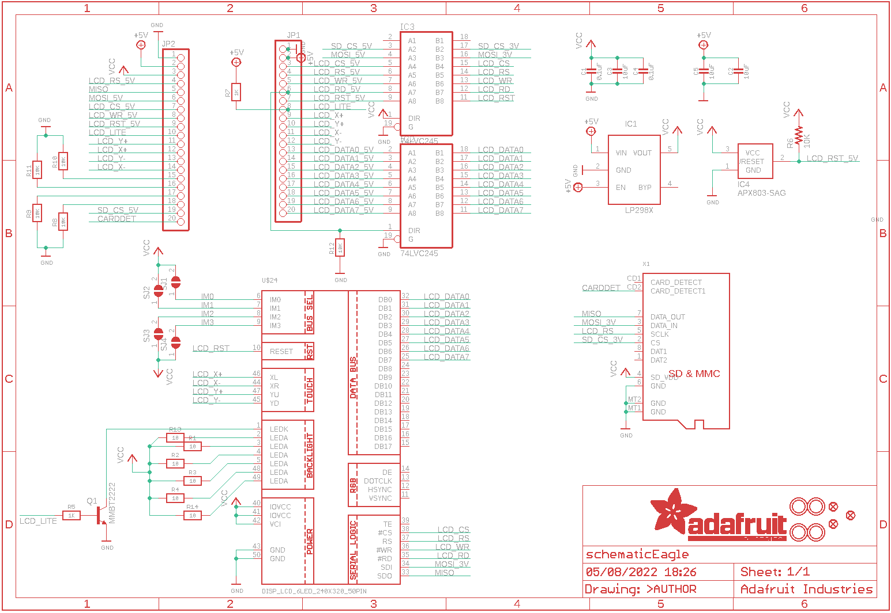
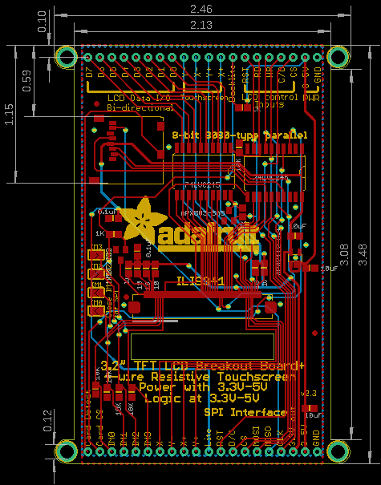
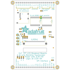
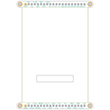
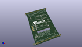
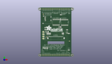
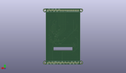
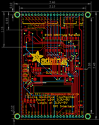
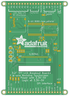
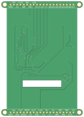

Contents
========

* [PRA1743 > Adafruit 3.2 TFT Breakout PCB](#pra1743--adafruit-32-tft-breakout-pcb)
	* [Schematic](#schematic)
	* [PCB](#pcb)
	* [Interactive BOM](#interactive-bom)
	* [OOMP Parts](#oomp-parts)
	* [Images](#images)
	* [Tags](#tags)
  
![][im]
# PRA1743 > Adafruit 3.2 TFT Breakout PCB

- ID: PROJ-ADAF-1743-STAN-01
- Hex ID: PRA1743
- Name: Adafruit
- Description: Adafruit
- Long Link: [http://oom.lt/PROJ-ADAF-1743-STAN-01](http://oom.lt/PROJ-ADAF-1743-STAN-01)
- Short Link: [http://oom.lt/PRA1743](http://oom.lt/PRA1743)

## Schematic
  

## PCB
  

## Interactive BOM

- Interactive BOM page: [ibom.html](https://htmlpreview.github.io/?https://github.com/oomlout/oomlout_OOMP_projects/blob/main/PROJ-ADAF-1743-STAN-01/kicad/bom/ibom.html)

## OOMP Parts
  

|OOMP ID|Name|Identifier|
| :---: | :---: | :---: |
|[CAPC-0805-X-NF100-V50](https://github.com/oomlout/oomlout_OOMP_parts/tree/main/CAPC-0805-X-NF100-V50/)|[SMD (0805) 100 nF Capacitor (Ceramic) 50v](https://github.com/oomlout/oomlout_OOMP_parts/tree/main/CAPC-0805-X-NF100-V50/)|[C1, C4](https://github.com/oomlout/oomlout_OOMP_parts/tree/main/CAPC-0805-X-NF100-V50/)|
|[CAPC-0805-X-UF10-V10](https://github.com/oomlout/oomlout_OOMP_parts/tree/main/CAPC-0805-X-UF10-V10/)|[SMD (0805) 10 uF Capacitor (Ceramic) 10v](https://github.com/oomlout/oomlout_OOMP_parts/tree/main/CAPC-0805-X-UF10-V10/)|[C2, C3, C5](https://github.com/oomlout/oomlout_OOMP_parts/tree/main/CAPC-0805-X-UF10-V10/)|
|VREG-SO235-X-KLP298XS-V33D||IC1|
|UNMATCHED-UNMATCHED-X-UNMATCHED-01||IC2, IC3, U$24, X1|
|UNMATCHED-SO23-X-UNMATCHED-01||IC4, Q1|
|[HEAD-I01-X-PI20-01](https://github.com/oomlout/oomlout_OOMP_parts/tree/main/HEAD-I01-X-PI20-01/)|[2.54 mm 20 Pin Header](https://github.com/oomlout/oomlout_OOMP_parts/tree/main/HEAD-I01-X-PI20-01/)|[JP1, JP2](https://github.com/oomlout/oomlout_OOMP_parts/tree/main/HEAD-I01-X-PI20-01/)|
|RESE-0805-X-O100-01||R1, R2, R3, R4, R13, R14|
|[RESE-0805-X-O102-01](https://github.com/oomlout/oomlout_OOMP_parts/tree/main/RESE-0805-X-O102-01/)|[SMD (0805) 1k Ohm Resistor](https://github.com/oomlout/oomlout_OOMP_parts/tree/main/RESE-0805-X-O102-01/)|[R5, R7](https://github.com/oomlout/oomlout_OOMP_parts/tree/main/RESE-0805-X-O102-01/)|
|[RESE-0805-X-O103-01](https://github.com/oomlout/oomlout_OOMP_parts/tree/main/RESE-0805-X-O103-01/)|[SMD (0805) 10k Ohm Resistor](https://github.com/oomlout/oomlout_OOMP_parts/tree/main/RESE-0805-X-O103-01/)|[R6, R8, R9, R10, R11, R12](https://github.com/oomlout/oomlout_OOMP_parts/tree/main/RESE-0805-X-O103-01/)|

## Images
  
  

|bominteractivefront|bominteractiveback|kicadPcb3d|kicadPcb3dFront|kicadPcb3dBack|eagleImage|eagleSchemImage|pcbdraw|pcbdrawback|
| :---: | :---: | :---: | :---: | :---: | :---: | :---: | :---: | :---: |
||||||||||

## Tags

- hexID: PRA1743
- oompType: PROJ
- oompSize: ADAF
- oompColor: 1743
- oompDesc: STAN
- oompIndex: 01
- oompName: Adafruit 3.2 TFT Breakout PCB
- sources: All source files from https://github.com/adafruit/Adafruit-3.2-TFT-Breakout-PCB (source licence details in srcLicense.md)
- linkBuyPage: http://www.adafruit.com/products/1743
- oompID: PROJ-ADAF-1743-STAN-01
- oompParts: C1,CAPC-0805-X-NF100-V50
- oompParts: C2,CAPC-0805-X-UF10-V10
- oompParts: C3,CAPC-0805-X-UF10-V10
- oompParts: C4,CAPC-0805-X-NF100-V50
- oompParts: C5,CAPC-0805-X-UF10-V10
- oompParts: IC1,VREG-SO235-X-KLP298XS-V33D
- oompParts: IC2,UNMATCHED-UNMATCHED-X-UNMATCHED-01
- oompParts: IC3,UNMATCHED-UNMATCHED-X-UNMATCHED-01
- oompParts: IC4,UNMATCHED-SO23-X-UNMATCHED-01
- oompParts: JP1,HEAD-I01-X-PI20-01
- oompParts: JP2,HEAD-I01-X-PI20-01
- oompParts: Q1,UNMATCHED-SO23-X-UNMATCHED-01
- oompParts: R1,RESE-0805-X-O100-01
- oompParts: R2,RESE-0805-X-O100-01
- oompParts: R3,RESE-0805-X-O100-01
- oompParts: R4,RESE-0805-X-O100-01
- oompParts: R5,RESE-0805-X-O102-01
- oompParts: R6,RESE-0805-X-O103-01
- oompParts: R7,RESE-0805-X-O102-01
- oompParts: R8,RESE-0805-X-O103-01
- oompParts: R9,RESE-0805-X-O103-01
- oompParts: R10,RESE-0805-X-O103-01
- oompParts: R11,RESE-0805-X-O103-01
- oompParts: R12,RESE-0805-X-O103-01
- oompParts: R13,RESE-0805-X-O100-01
- oompParts: R14,RESE-0805-X-O100-01
- oompParts: U$24,UNMATCHED-UNMATCHED-X-UNMATCHED-01
- oompParts: X1,UNMATCHED-UNMATCHED-X-UNMATCHED-01
- rawParts: C1,0.1uF,CAP_CERAMIC0805-NOOUTLINE,0805-NO,Ceramic Capacitors,,
- rawParts: C2,10uF,CAP_CERAMIC0805-NOOUTLINE,0805-NO,Ceramic Capacitors,,
- rawParts: C3,10uF,CAP_CERAMIC0805-NOOUTLINE,0805-NO,Ceramic Capacitors,,
- rawParts: C4,0.1uF,CAP_CERAMIC0805-NOOUTLINE,0805-NO,Ceramic Capacitors,,
- rawParts: C5,10uF,CAP_CERAMIC0805-NOOUTLINE,0805-NO,Ceramic Capacitors,,
- rawParts: IC1,APA2112-3.3,LP298XS,SOT23-5L,,,
- rawParts: IC2,74LVC245,74ACT245DW,SO20W,Octal BUS TRANSCEIVER, 3-state,,
- rawParts: IC3,74LVC245,74ACT245DW,SO20W,Octal BUS TRANSCEIVER, 3-state,,
- rawParts: IC4,APX803-SAG,AXP083-SAG,SOT23,,,
- rawParts: JP1,,HEADER-1X20ROUND,1X20_ROUND,,,
- rawParts: JP2,,HEADER-1X20ROUND,1X20_ROUND,,,
- rawParts: Q1,MMBT2222,MMBT2222ALT1-NPN-SOT23-BEC,SOT23-BEC,NPN Transistror,,
- rawParts: R1,10,RESISTOR0805_NOOUTLINE,0805-NO,Resistors,,
- rawParts: R2,10,RESISTOR0805_NOOUTLINE,0805-NO,Resistors,,
- rawParts: R3,10,RESISTOR0805_NOOUTLINE,0805-NO,Resistors,,
- rawParts: R4,10,RESISTOR0805_NOOUTLINE,0805-NO,Resistors,,
- rawParts: R5,1K,RESISTOR0805_NOOUTLINE,0805-NO,Resistors,,
- rawParts: R6,10K,R-US_R0805,R0805,RESISTOR, American symbol,,
- rawParts: R7,1K,RESISTOR0805_NOOUTLINE,0805-NO,Resistors,,
- rawParts: R8,10K,RESISTOR0805_NOOUTLINE,0805-NO,Resistors,,
- rawParts: R9,10K,RESISTOR0805_NOOUTLINE,0805-NO,Resistors,,
- rawParts: R10,10K,RESISTOR0805_NOOUTLINE,0805-NO,Resistors,,
- rawParts: R11,10K,RESISTOR0805_NOOUTLINE,0805-NO,Resistors,,
- rawParts: R12,10K,RESISTOR0805_NOOUTLINE,0805-NO,Resistors,,
- rawParts: R13,10,RESISTOR0805_NOOUTLINE,0805-NO,Resistors,,
- rawParts: R14,10,RESISTOR0805_NOOUTLINE,0805-NO,Resistors,,
- rawParts: SJ1,,SOLDERJUMPER,SOLDERJUMPER_ARROW_NOPASTE,SMD Solder JUMPER,EXCLUDE,
- rawParts: SJ2,,SOLDERJUMPER,SOLDERJUMPER_ARROW_NOPASTE,SMD Solder JUMPER,EXCLUDE,
- rawParts: SJ3,,SOLDERJUMPER,SOLDERJUMPER_ARROW_NOPASTE,SMD Solder JUMPER,EXCLUDE,
- rawParts: SJ4,,SOLDERJUMPER,SOLDERJUMPER_ARROW_NOPASTE,SMD Solder JUMPER,EXCLUDE,
- rawParts: U$7,MOUNTINGHOLE3.0THIN,MOUNTINGHOLE3.0THIN,MOUNTINGHOLE_3.0_PLATEDTHIN,Mounting Hole,EXCLUDE,
- rawParts: U$9,FIDUCIAL,FIDUCIAL,FIDUCIAL_1MM,Fiducial Alignment Points,EXCLUDE,
- rawParts: U$11,FIDUCIAL,FIDUCIAL,FIDUCIAL_1MM,Fiducial Alignment Points,EXCLUDE,
- rawParts: U$15,MOUNTINGHOLE3.0THIN,MOUNTINGHOLE3.0THIN,MOUNTINGHOLE_3.0_PLATEDTHIN,Mounting Hole,EXCLUDE,
- rawParts: U$16,MOUNTINGHOLE3.0THIN,MOUNTINGHOLE3.0THIN,MOUNTINGHOLE_3.0_PLATEDTHIN,Mounting Hole,EXCLUDE,
- rawParts: U$17,MOUNTINGHOLE3.0THIN,MOUNTINGHOLE3.0THIN,MOUNTINGHOLE_3.0_PLATEDTHIN,Mounting Hole,EXCLUDE,
- rawParts: U$23,FIDUCIAL,FIDUCIAL,FIDUCIAL_1MM,Fiducial Alignment Points,EXCLUDE,
- rawParts: U$24,DISP_LCD_6LED_240X320_50PIN,DISP_LCD_6LED_240X320_50PIN,TFT_3.2IN_240X320_50PIN,,,
- rawParts: X1,,MICROSD,MICROSD,MicroSD/Transflash Card Holder with SPI pinout,,

[im]: kicadPcb3d_450.png
