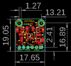
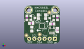
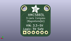
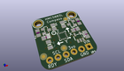

Contents
========

* [PROJ-ADAF-1746-STAN-01>Adafruit HMC5883 Mag Compass Sensor PCB](#proj-adaf-1746-stan-01adafruit-hmc5883-mag-compass-sensor-pcb)
	* [Images](#images)
	* [Interactive BOM](#interactive-bom)
	* [Tags](#tags)
  
![][im]
# PROJ-ADAF-1746-STAN-01>Adafruit HMC5883 Mag Compass Sensor PCB

- ID: PROJ-ADAF-1746-STAN-01
- Hex ID: PRA1746
- Name: Adafruit HMC5883 Mag Compass Sensor PCB
- Description: 

## Images
  
  

|eagleImage|kicadPcb3dFront|kicadPcb3dBack|kicadPcb3d|
| :---: | :---: | :---: | :---: |
|||||

## Interactive BOM

- Interactive BOM page: [ibom.html](kicad/bom/ibom.html)

## Tags

- hexID: PRA1746
- oompType: PROJ
- oompSize: ADAF
- oompColor: 1746
- oompDesc: STAN
- oompIndex: 01
- oompName: Adafruit HMC5883 Mag Compass Sensor PCB
- sources: All source files from https://github.com/adafruit/Adafruit-HMC5883-Mag-Compass-Sensor-PCB (source licence details in srcLicense.md)
- linkBuyPage: http://www.adafruit.com/products/1746
- oompPart: CAPC-UNMATCHED-X-UNMATCHED-01, C2, 3.8099999999999996, 7.238999999999999, 270
- oompPart: CAPC-0805-X-UF10-V25, C3, 13.97, 9.779, 0
- oompPart: CAPC-0805-X-UNMATCHED-01, C4, 3.556, 10.16, 0
- oompPart: CAPC-0805-X-UF10-V25, C5, 16.509999999999998, 6.731, 90
- oompPart: UNMATCHED-UNMATCHED-X-UNMATCHED-01, JP1, 8.889999999999999, 2.413, 180
- oompPart: UNMATCHED-UNMATCHED-X-UNMATCHED-01, Q1, 13.716, 12.7, 90
- oompPart: UNMATCHED-UNMATCHED-X-UNMATCHED-01, Q2, 4.3180000000000005, 12.827, 270
- oompPart: RESE-UNMATCHED-X-O103-01, R1, 16.509999999999998, 12.827, 270
- oompPart: RESE-UNMATCHED-X-O103-01, R2, 1.397, 12.827, 90
- oompPart: RESE-0805-X-O103-01, R3, 10.668, 13.462, 270
- oompPart: RESE-0805-X-O103-01, R4, 7.112, 13.462, 270
- oompPart: SKIP-UNMATCHED-X-UNMATCHED-01, U$8, 2.2859999999999996, 16.764, 0
- oompPart: SKIP-UNMATCHED-X-UNMATCHED-01, U$9, 15.493999999999998, 16.764, 0
- oompPart: SKIP-UNMATCHED-X-UNMATCHED-01, U$10, 1.1429999999999998, 4.064, 0
- oompPart: SKIP-UNMATCHED-X-UNMATCHED-01, U$11, 12.572999999999999, 15.493999999999998, 0
- oompPart: SKIP-UNMATCHED-X-UNMATCHED-01, U$12, 7.746999999999999, 4.571999999999999, 0
- oompPart: UNMATCHED-UNMATCHED-X-UNMATCHED-01, U1, 8.889999999999999, 8.889999999999999, 180
- oompPart: UNMATCHED-UNMATCHED-X-UNMATCHED-01, U2, 13.843, 6.604, 0
- rawPart: 

[im]: kicadPcb3d_450.png
