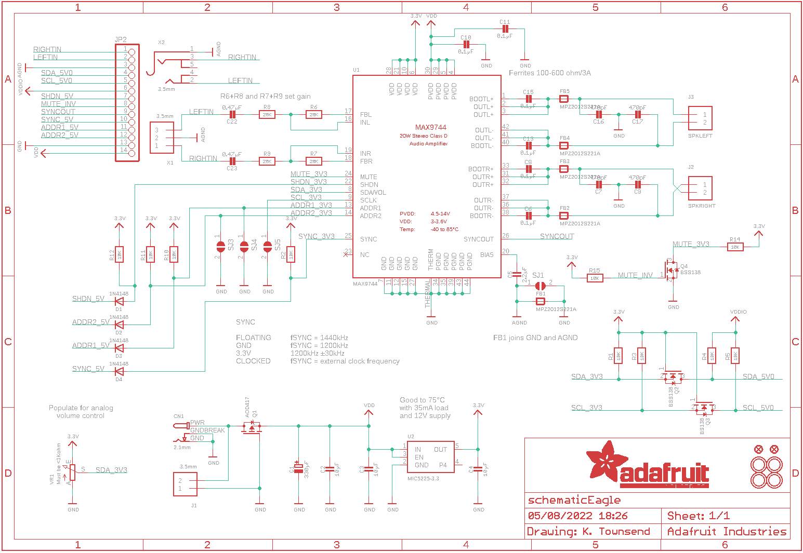
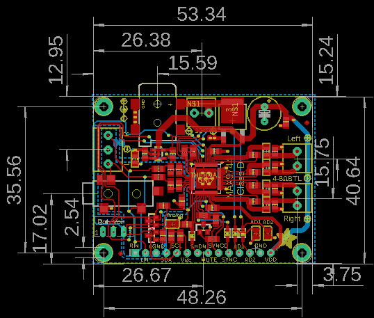
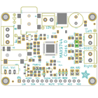
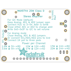
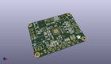
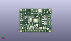
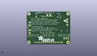
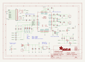
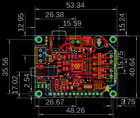

Contents
========

* [PRA1752 > Adafruit MAX9744 Amplifier PCB](#pra1752--adafruit-max9744-amplifier-pcb)
	* [Schematic](#schematic)
	* [PCB](#pcb)
	* [Interactive BOM](#interactive-bom)
	* [OOMP Parts](#oomp-parts)
	* [Images](#images)
	* [Tags](#tags)
  
![][im]
# PRA1752 > Adafruit MAX9744 Amplifier PCB

- ID: PROJ-ADAF-1752-STAN-01
- Hex ID: PRA1752
- Name: Adafruit
- Description: Adafruit
- Long Link: [http://oom.lt/PROJ-ADAF-1752-STAN-01](http://oom.lt/PROJ-ADAF-1752-STAN-01)
- Short Link: [http://oom.lt/PRA1752](http://oom.lt/PRA1752)

## Schematic
  

## PCB
  

## Interactive BOM

- Interactive BOM page: [ibom.html](https://htmlpreview.github.io/?https://github.com/oomlout/oomlout_OOMP_projects/blob/main/PROJ-ADAF-1752-STAN-01/kicad/bom/ibom.html)

## OOMP Parts
  

|OOMP ID|Name|Identifier|
| :---: | :---: | :---: |
|CAPX-UNMATCHED-X-UNMATCHED-01||C1|
|CAPC-0805-X-UNMATCHED-01||C2, C3, C4, C5, C6, C8, C10, C11, C13, C15, C22, C23|
|CAPC-0805-X-PF470-01||C7, C9, C16, C17|
|UNMATCHED-UNMATCHED-X-UNMATCHED-01||CN1, U1, VR1, X2|
|[DIOD-S323-X-K4148-01](https://github.com/oomlout/oomlout_OOMP_parts/tree/main/DIOD-S323-X-K4148-01/)|[SMD (SOD-323) Diode](https://github.com/oomlout/oomlout_OOMP_parts/tree/main/DIOD-S323-X-K4148-01/)|[D1, D2, D3, D4](https://github.com/oomlout/oomlout_OOMP_parts/tree/main/DIOD-S323-X-K4148-01/)|
|FERB-0805-X-UNMATCHED-01||FB1, FB2, FB3, FB4, FB5|
|[TERS-35D-L-PI02-01](https://github.com/oomlout/oomlout_OOMP_parts/tree/main/TERS-35D-L-PI02-01/)|[3.5 mm 2 Pin Blue Screw Terminal](https://github.com/oomlout/oomlout_OOMP_parts/tree/main/TERS-35D-L-PI02-01/)|[J1, J2, J3](https://github.com/oomlout/oomlout_OOMP_parts/tree/main/TERS-35D-L-PI02-01/)|
|[HEAD-I01-X-PI14-01](https://github.com/oomlout/oomlout_OOMP_parts/tree/main/HEAD-I01-X-PI14-01/)|[2.54 mm 14 Pin Header](https://github.com/oomlout/oomlout_OOMP_parts/tree/main/HEAD-I01-X-PI14-01/)|[JP2](https://github.com/oomlout/oomlout_OOMP_parts/tree/main/HEAD-I01-X-PI14-01/)|
|MOSP-UNMATCHED-X-UNMATCHED-01||Q1|
|[MOSN-SO23-X-KBSS138-01](https://github.com/oomlout/oomlout_OOMP_parts/tree/main/MOSN-SO23-X-KBSS138-01/)|[SMD (SOT-23) BSS138 N-Ch. MOSFET](https://github.com/oomlout/oomlout_OOMP_parts/tree/main/MOSN-SO23-X-KBSS138-01/)|[Q2, Q4](https://github.com/oomlout/oomlout_OOMP_parts/tree/main/MOSN-SO23-X-KBSS138-01/)|
|MOSN-SO23-X-UNMATCHED-01||Q3|
|[RESE-0805-X-O103-01](https://github.com/oomlout/oomlout_OOMP_parts/tree/main/RESE-0805-X-O103-01/)|[SMD (0805) 10k Ohm Resistor](https://github.com/oomlout/oomlout_OOMP_parts/tree/main/RESE-0805-X-O103-01/)|[R1, R2, R3, R4, R5, R10, R11, R12, R14, R15](https://github.com/oomlout/oomlout_OOMP_parts/tree/main/RESE-0805-X-O103-01/)|
|[RESE-0805-X-O203-01](https://github.com/oomlout/oomlout_OOMP_parts/tree/main/RESE-0805-X-O203-01/)|[SMD (0805) 20k Ohm Resistor](https://github.com/oomlout/oomlout_OOMP_parts/tree/main/RESE-0805-X-O203-01/)|[R6, R7, R8, R9](https://github.com/oomlout/oomlout_OOMP_parts/tree/main/RESE-0805-X-O203-01/)|
|[VREG-SO235-X-KMIC5225-V33D](https://github.com/oomlout/oomlout_OOMP_parts/tree/main/VREG-SO235-X-KMIC5225-V33D/)|[SMD (SOT-23-5) MIC5225 Voltage Regulator 3.3v](https://github.com/oomlout/oomlout_OOMP_parts/tree/main/VREG-SO235-X-KMIC5225-V33D/)|[U2](https://github.com/oomlout/oomlout_OOMP_parts/tree/main/VREG-SO235-X-KMIC5225-V33D/)|
|[TERS-35D-L-PI03-01](https://github.com/oomlout/oomlout_OOMP_parts/tree/main/TERS-35D-L-PI03-01/)|[3.5 mm 3 Pin Blue Screw Terminal](https://github.com/oomlout/oomlout_OOMP_parts/tree/main/TERS-35D-L-PI03-01/)|[X1](https://github.com/oomlout/oomlout_OOMP_parts/tree/main/TERS-35D-L-PI03-01/)|

## Images
  
  

|bominteractivefront|bominteractiveback|kicadPcb3d|kicadPcb3dFront|kicadPcb3dBack|kicadSchem|eagleImage|eagleSchemImage|pcbdraw|
| :---: | :---: | :---: | :---: | :---: | :---: | :---: | :---: | :---: |
||||||||||

## Tags

- hexID: PRA1752
- oompType: PROJ
- oompSize: ADAF
- oompColor: 1752
- oompDesc: STAN
- oompIndex: 01
- oompName: Adafruit MAX9744 Amplifier PCB
- sources: All source files from https://github.com/adafruit/Adafruit-MAX9744-Amplifier-PCB (source licence details in srcLicense.md)
- linkBuyPage: http://www.adafruit.com/products/1752
- oompID: PROJ-ADAF-1752-STAN-01
- oompParts: C1,CAPX-UNMATCHED-X-UNMATCHED-01
- oompParts: C2,CAPC-0805-X-UNMATCHED-01
- oompParts: C3,CAPC-0805-X-UNMATCHED-01
- oompParts: C4,CAPC-0805-X-UNMATCHED-01
- oompParts: C5,CAPC-0805-X-UNMATCHED-01
- oompParts: C6,CAPC-0805-X-UNMATCHED-01
- oompParts: C7,CAPC-0805-X-PF470-01
- oompParts: C8,CAPC-0805-X-UNMATCHED-01
- oompParts: C9,CAPC-0805-X-PF470-01
- oompParts: C10,CAPC-0805-X-UNMATCHED-01
- oompParts: C11,CAPC-0805-X-UNMATCHED-01
- oompParts: C13,CAPC-0805-X-UNMATCHED-01
- oompParts: C15,CAPC-0805-X-UNMATCHED-01
- oompParts: C16,CAPC-0805-X-PF470-01
- oompParts: C17,CAPC-0805-X-PF470-01
- oompParts: C22,CAPC-0805-X-UNMATCHED-01
- oompParts: C23,CAPC-0805-X-UNMATCHED-01
- oompParts: CN1,UNMATCHED-UNMATCHED-X-UNMATCHED-01
- oompParts: D1,DIOD-S323-X-K4148-01
- oompParts: D2,DIOD-S323-X-K4148-01
- oompParts: D3,DIOD-S323-X-K4148-01
- oompParts: D4,DIOD-S323-X-K4148-01
- oompParts: FB1,FERB-0805-X-UNMATCHED-01
- oompParts: FB2,FERB-0805-X-UNMATCHED-01
- oompParts: FB3,FERB-0805-X-UNMATCHED-01
- oompParts: FB4,FERB-0805-X-UNMATCHED-01
- oompParts: FB5,FERB-0805-X-UNMATCHED-01
- oompParts: J1,TERS-35D-L-PI02-01
- oompParts: J2,TERS-35D-L-PI02-01
- oompParts: J3,TERS-35D-L-PI02-01
- oompParts: JP2,HEAD-I01-X-PI14-01
- oompParts: Q1,MOSP-UNMATCHED-X-UNMATCHED-01
- oompParts: Q2,MOSN-SO23-X-KBSS138-01
- oompParts: Q3,MOSN-SO23-X-UNMATCHED-01
- oompParts: Q4,MOSN-SO23-X-KBSS138-01
- oompParts: R1,RESE-0805-X-O103-01
- oompParts: R2,RESE-0805-X-O103-01
- oompParts: R3,RESE-0805-X-O103-01
- oompParts: R4,RESE-0805-X-O103-01
- oompParts: R5,RESE-0805-X-O103-01
- oompParts: R6,RESE-0805-X-O203-01
- oompParts: R7,RESE-0805-X-O203-01
- oompParts: R8,RESE-0805-X-O203-01
- oompParts: R9,RESE-0805-X-O203-01
- oompParts: R10,RESE-0805-X-O103-01
- oompParts: R11,RESE-0805-X-O103-01
- oompParts: R12,RESE-0805-X-O103-01
- oompParts: R14,RESE-0805-X-O103-01
- oompParts: R15,RESE-0805-X-O103-01
- oompParts: U1,UNMATCHED-UNMATCHED-X-UNMATCHED-01
- oompParts: U2,VREG-SO235-X-KMIC5225-V33D
- oompParts: VR1,UNMATCHED-UNMATCHED-X-UNMATCHED-01
- oompParts: X1,TERS-35D-L-PI03-01
- oompParts: X2,UNMATCHED-UNMATCHED-X-UNMATCHED-01
- rawParts: C1,330µF,CAP_ELECTROLYTICPTH_3.5MMGRID_8MMDIA,CELEC_3.5MM_8MM,Electrolytic Capacitors,,
- rawParts: C2,10µF,CAP_CERAMIC0805-NOOUTLINE,0805-NO,Ceramic Capacitors,,
- rawParts: C3,10µF,CAP_CERAMIC0805-NOOUTLINE,0805-NO,Ceramic Capacitors,,
- rawParts: C4,10µF,CAP_CERAMIC0805-NOOUTLINE,0805-NO,Ceramic Capacitors,,
- rawParts: C5,2.2µF,CAP_CERAMIC0805-NOOUTLINE,0805-NO,Ceramic Capacitors,,
- rawParts: C6,0.1µF,CAP_CERAMIC0805-NOOUTLINE,0805-NO,Ceramic Capacitors,,
- rawParts: C7,470pF,CAP_CERAMIC0805-NOOUTLINE,0805-NO,Ceramic Capacitors,,
- rawParts: C8,0.1µF,CAP_CERAMIC0805-NOOUTLINE,0805-NO,Ceramic Capacitors,,
- rawParts: C9,470pF,CAP_CERAMIC0805-NOOUTLINE,0805-NO,Ceramic Capacitors,,
- rawParts: C10,0.1µF,CAP_CERAMIC0805-NOOUTLINE,0805-NO,Ceramic Capacitors,,
- rawParts: C11,0.1µF,CAP_CERAMIC0805-NOOUTLINE,0805-NO,Ceramic Capacitors,,
- rawParts: C13,0.1µF,CAP_CERAMIC0805-NOOUTLINE,0805-NO,Ceramic Capacitors,,
- rawParts: C15,0.1µF,CAP_CERAMIC0805-NOOUTLINE,0805-NO,Ceramic Capacitors,,
- rawParts: C16,470pF,CAP_CERAMIC0805-NOOUTLINE,0805-NO,Ceramic Capacitors,,
- rawParts: C17,470pF,CAP_CERAMIC0805-NOOUTLINE,0805-NO,Ceramic Capacitors,,
- rawParts: C22,0.47µF,CAP_CERAMIC0805-NOOUTLINE,0805-NO,Ceramic Capacitors,,
- rawParts: C23,0.47µF,CAP_CERAMIC0805-NOOUTLINE,0805-NO,Ceramic Capacitors,,
- rawParts: CN1,2.1mm,DCBARRELSMT_CORRECT,DCJACK_2MM_SMT,DC Barrel Jack,,
- rawParts: D1,1N4148,DIODESOD-323,SOD-323,Diode,,
- rawParts: D2,1N4148,DIODESOD-323,SOD-323,Diode,,
- rawParts: D3,1N4148,DIODESOD-323,SOD-323,Diode,,
- rawParts: D4,1N4148,DIODESOD-323,SOD-323,Diode,,
- rawParts: FB1,MPZ2012S221A,FERRITE_0805,_0805,Ferrite Bead,,
- rawParts: FB2,MPZ2012S221A,FERRITE_0805,_0805,Ferrite Bead,,
- rawParts: FB3,MPZ2012S221A,FERRITE_0805,_0805,Ferrite Bead,,
- rawParts: FB4,MPZ2012S221A,FERRITE_0805,_0805,Ferrite Bead,,
- rawParts: FB5,MPZ2012S221A,FERRITE_0805,_0805,Ferrite Bead,,
- rawParts: FID1,FIDUCIAL,FIDUCIAL,FIDUCIAL_1MM,Fiducial Alignment Points,EXCLUDE,
- rawParts: FID2,FIDUCIAL,FIDUCIAL,FIDUCIAL_1MM,Fiducial Alignment Points,EXCLUDE,
- rawParts: J1,3.5mm,TERMBLOCK_1X2,TERMBLOCK_1X2-3.5MM,3.5mm Terminal block,,
- rawParts: J2,SPKRIGHT,TERMBLOCK_1X2,TERMBLOCK_1X2-3.5MM,3.5mm Terminal block,,
- rawParts: J3,SPKLEFT,TERMBLOCK_1X2,TERMBLOCK_1X2-3.5MM,3.5mm Terminal block,,
- rawParts: JP2,,HEADER-1X14,1X14_ROUND70,,,
- rawParts: Q1,AOD417,MOSFET-PTO252,TO252,P-Channel Mosfet,,
- rawParts: Q2,BSS138,MOSFET-NWIDE,SOT23-WIDE,N-Channel Mosfet,,
- rawParts: Q3,BS138,MOSFET-NWIDE,SOT23-WIDE,N-Channel Mosfet,,
- rawParts: Q4,BSS138,MOSFET-NWIDE,SOT23-WIDE,N-Channel Mosfet,,
- rawParts: R1,10K,RESISTOR0805_NOOUTLINE,0805-NO,Resistors,,
- rawParts: R2,10K,RESISTOR_0805MP,_0805MP,Resistors,,
- rawParts: R3,10K,RESISTOR0805_NOOUTLINE,0805-NO,Resistors,,
- rawParts: R4,10K,RESISTOR0805_NOOUTLINE,0805-NO,Resistors,,
- rawParts: R5,10K,RESISTOR0805_NOOUTLINE,0805-NO,Resistors,,
- rawParts: R6,20K,RESISTOR0805_NOOUTLINE,0805-NO,Resistors,,
- rawParts: R7,20K,RESISTOR0805_NOOUTLINE,0805-NO,Resistors,,
- rawParts: R8,20K,RESISTOR0805_NOOUTLINE,0805-NO,Resistors,,
- rawParts: R9,20K,RESISTOR0805_NOOUTLINE,0805-NO,Resistors,,
- rawParts: R10,10K,RESISTOR_0805MP,_0805MP,Resistors,,
- rawParts: R11,10K,RESISTOR_0805MP,_0805MP,Resistors,,
- rawParts: R12,10K,RESISTOR0805_NOOUTLINE,0805-NO,Resistors,,
- rawParts: R14,10K,RESISTOR_0805MP,_0805MP,Resistors,,
- rawParts: R15,10K,RESISTOR_0805MP,_0805MP,Resistors,,
- rawParts: SJ1,,SOLDERJUMPER,SOLDERJUMPER_ARROW_NOPASTE,SMD Solder JUMPER,EXCLUDE,
- rawParts: SJ3,,SOLDERJUMPER,SOLDERJUMPER_ARROW_NOPASTE,SMD Solder JUMPER,EXCLUDE,
- rawParts: SJ4,,SOLDERJUMPER,SOLDERJUMPER_ARROW_NOPASTE,SMD Solder JUMPER,EXCLUDE,
- rawParts: SJ5,,SOLDERJUMPER,SOLDERJUMPER_ARROW_NOPASTE,SMD Solder JUMPER,EXCLUDE,
- rawParts: U$29,MOUNTINGHOLE2.5_THICK,MOUNTINGHOLE2.5_THICK,MOUNTINGHOLE_2.5_PLATED_THICK,Mounting Hole,EXCLUDE,
- rawParts: U$38,MOUNTINGHOLE2.5_THICK,MOUNTINGHOLE2.5_THICK,MOUNTINGHOLE_2.5_PLATED_THICK,Mounting Hole,EXCLUDE,
- rawParts: U$39,MOUNTINGHOLE2.5_THICK,MOUNTINGHOLE2.5_THICK,MOUNTINGHOLE_2.5_PLATED_THICK,Mounting Hole,EXCLUDE,
- rawParts: U$40,MOUNTINGHOLE2.5_THICK,MOUNTINGHOLE2.5_THICK,MOUNTINGHOLE_2.5_PLATED_THICK,Mounting Hole,EXCLUDE,
- rawParts: U1,MAX9744,AUDIOAMP_MAX9744,TQFN44_7MM,MAX9744 - 20W Class D Stereo Speaker Amplifier with I2C Volume Control,,
- rawParts: U2,MIC5225-3.3,VREG_SOT23-5,SOT23-5,SOT23-5 Fixed Voltage Regulators,,
- rawParts: VR1,Must be <1Kohm,TRIMPOT100MIL,TRIMPOT_100MILPTH,3-Pin SMT Trimpots,,
- rawParts: X1,3.5mm,TERMBLOCK_1X3,TERMBLOCK_1X3-3.5MM,3.5mm Terminal block,,
- rawParts: X2,3.5mm,AUDIO_3.5MMJACK,4UCONN_19269,3.5MM Audio Jack,,

[im]: kicadPcb3d_450.png
