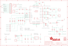

Contents
========

* [PRA1752 > Adafruit](#pra1752--adafruit)
	* [Schematic](#schematic)
	* [Interactive BOM](#interactive-bom)
	* [OOMP Parts](#oomp-parts)
	* [Images](#images)
	* [Tags](#tags)
  
![][im]
# PRA1752 > Adafruit

- ID: PROJ-ADAF-1752-STAN-01
- Hex ID: PRA1752
- Name: Adafruit
- Description: Adafruit
- Long Link: [http://oom.lt/PROJ-ADAF-1752-STAN-01](http://oom.lt/PROJ-ADAF-1752-STAN-01)
- Short Link: [http://oom.lt/PRA1752](http://oom.lt/PRA1752)

## Schematic
  

## Interactive BOM

- Interactive BOM page: [ibom.html](https://htmlpreview.github.io/?https://github.com/oomlout/oomlout_OOMP_projects/blob/main/PROJ-ADAF-1752-STAN-01/kicad/bom/ibom.html)

## OOMP Parts
  

|OOMP Parts|
| :---: |
|C1,UNMATCHED-UNMATCHED-UNMATCHED-UNMATCHED-UNMATCHED,C1,330µF,CAP_ELECTROLYTICPTH_3.5MMGRID_8MMDIA,CELEC_3.5MM_8MM,Electrolytic Capacitors,,|
|C2,UNMATCHED-UNMATCHED-UNMATCHED-UNMATCHED-UNMATCHED,C2,10µF,CAP_CERAMIC0805-NOOUTLINE,0805-NO,Ceramic Capacitors,,|
|C3,UNMATCHED-UNMATCHED-UNMATCHED-UNMATCHED-UNMATCHED,C3,10µF,CAP_CERAMIC0805-NOOUTLINE,0805-NO,Ceramic Capacitors,,|
|C4,UNMATCHED-UNMATCHED-UNMATCHED-UNMATCHED-UNMATCHED,C4,10µF,CAP_CERAMIC0805-NOOUTLINE,0805-NO,Ceramic Capacitors,,|
|C5,UNMATCHED-UNMATCHED-UNMATCHED-UNMATCHED-UNMATCHED,C5,2.2µF,CAP_CERAMIC0805-NOOUTLINE,0805-NO,Ceramic Capacitors,,|
|C6,UNMATCHED-UNMATCHED-UNMATCHED-UNMATCHED-UNMATCHED,C6,0.1µF,CAP_CERAMIC0805-NOOUTLINE,0805-NO,Ceramic Capacitors,,|
|C7,UNMATCHED-UNMATCHED-UNMATCHED-UNMATCHED-UNMATCHED,C7,470pF,CAP_CERAMIC0805-NOOUTLINE,0805-NO,Ceramic Capacitors,,|
|C8,UNMATCHED-UNMATCHED-UNMATCHED-UNMATCHED-UNMATCHED,C8,0.1µF,CAP_CERAMIC0805-NOOUTLINE,0805-NO,Ceramic Capacitors,,|
|C9,UNMATCHED-UNMATCHED-UNMATCHED-UNMATCHED-UNMATCHED,C9,470pF,CAP_CERAMIC0805-NOOUTLINE,0805-NO,Ceramic Capacitors,,|
|C10,UNMATCHED-UNMATCHED-UNMATCHED-UNMATCHED-UNMATCHED,C10,0.1µF,CAP_CERAMIC0805-NOOUTLINE,0805-NO,Ceramic Capacitors,,|
|C11,UNMATCHED-UNMATCHED-UNMATCHED-UNMATCHED-UNMATCHED,C11,0.1µF,CAP_CERAMIC0805-NOOUTLINE,0805-NO,Ceramic Capacitors,,|
|C13,UNMATCHED-UNMATCHED-UNMATCHED-UNMATCHED-UNMATCHED,C13,0.1µF,CAP_CERAMIC0805-NOOUTLINE,0805-NO,Ceramic Capacitors,,|
|C15,UNMATCHED-UNMATCHED-UNMATCHED-UNMATCHED-UNMATCHED,C15,0.1µF,CAP_CERAMIC0805-NOOUTLINE,0805-NO,Ceramic Capacitors,,|
|C16,UNMATCHED-UNMATCHED-UNMATCHED-UNMATCHED-UNMATCHED,C16,470pF,CAP_CERAMIC0805-NOOUTLINE,0805-NO,Ceramic Capacitors,,|
|C17,UNMATCHED-UNMATCHED-UNMATCHED-UNMATCHED-UNMATCHED,C17,470pF,CAP_CERAMIC0805-NOOUTLINE,0805-NO,Ceramic Capacitors,,|
|C22,UNMATCHED-UNMATCHED-UNMATCHED-UNMATCHED-UNMATCHED,C22,0.47µF,CAP_CERAMIC0805-NOOUTLINE,0805-NO,Ceramic Capacitors,,|
|C23,UNMATCHED-UNMATCHED-UNMATCHED-UNMATCHED-UNMATCHED,C23,0.47µF,CAP_CERAMIC0805-NOOUTLINE,0805-NO,Ceramic Capacitors,,|
|CN1,UNMATCHED-UNMATCHED-UNMATCHED-UNMATCHED-UNMATCHED,CN1,2.1mm,DCBARRELSMT_CORRECT,DCJACK_2MM_SMT,DC Barrel Jack,,|
|D1,UNMATCHED-UNMATCHED-UNMATCHED-UNMATCHED-UNMATCHED,D1,1N4148,DIODESOD-323,SOD-323,Diode,,|
|D2,UNMATCHED-UNMATCHED-UNMATCHED-UNMATCHED-UNMATCHED,D2,1N4148,DIODESOD-323,SOD-323,Diode,,|
|D3,UNMATCHED-UNMATCHED-UNMATCHED-UNMATCHED-UNMATCHED,D3,1N4148,DIODESOD-323,SOD-323,Diode,,|
|D4,UNMATCHED-UNMATCHED-UNMATCHED-UNMATCHED-UNMATCHED,D4,1N4148,DIODESOD-323,SOD-323,Diode,,|
|FB1,UNMATCHED-UNMATCHED-UNMATCHED-UNMATCHED-UNMATCHED,FB1,MPZ2012S221A,FERRITE_0805,_0805,Ferrite Bead,,|
|FB2,UNMATCHED-UNMATCHED-UNMATCHED-UNMATCHED-UNMATCHED,FB2,MPZ2012S221A,FERRITE_0805,_0805,Ferrite Bead,,|
|FB3,UNMATCHED-UNMATCHED-UNMATCHED-UNMATCHED-UNMATCHED,FB3,MPZ2012S221A,FERRITE_0805,_0805,Ferrite Bead,,|
|FB4,UNMATCHED-UNMATCHED-UNMATCHED-UNMATCHED-UNMATCHED,FB4,MPZ2012S221A,FERRITE_0805,_0805,Ferrite Bead,,|
|FB5,UNMATCHED-UNMATCHED-UNMATCHED-UNMATCHED-UNMATCHED,FB5,MPZ2012S221A,FERRITE_0805,_0805,Ferrite Bead,,|
|J1,UNMATCHED-UNMATCHED-UNMATCHED-UNMATCHED-UNMATCHED,FID1,FIDUCIAL,FIDUCIAL,FIDUCIAL_1MM,Fiducial Alignment Points,EXCLUDE,|
|J2,UNMATCHED-UNMATCHED-UNMATCHED-UNMATCHED-UNMATCHED,FID2,FIDUCIAL,FIDUCIAL,FIDUCIAL_1MM,Fiducial Alignment Points,EXCLUDE,|
|J3,UNMATCHED-UNMATCHED-UNMATCHED-UNMATCHED-UNMATCHED,J1,3.5mm,TERMBLOCK_1X2,TERMBLOCK_1X2-3.5MM,3.5mm Terminal block,,|
|JP2,UNMATCHED-UNMATCHED-UNMATCHED-UNMATCHED-UNMATCHED,J2,SPKRIGHT,TERMBLOCK_1X2,TERMBLOCK_1X2-3.5MM,3.5mm Terminal block,,|
|Q1,UNMATCHED-UNMATCHED-UNMATCHED-UNMATCHED-UNMATCHED,J3,SPKLEFT,TERMBLOCK_1X2,TERMBLOCK_1X2-3.5MM,3.5mm Terminal block,,|
|Q2,UNMATCHED-UNMATCHED-UNMATCHED-UNMATCHED-UNMATCHED,JP2,,HEADER-1X14,1X14_ROUND70,,,|
|Q3,UNMATCHED-UNMATCHED-UNMATCHED-UNMATCHED-UNMATCHED,Q1,AOD417,MOSFET-PTO252,TO252,P-Channel Mosfet,,|
|Q4,UNMATCHED-UNMATCHED-UNMATCHED-UNMATCHED-UNMATCHED,Q2,BSS138,MOSFET-NWIDE,SOT23-WIDE,N-Channel Mosfet,,|
|R1,UNMATCHED-UNMATCHED-UNMATCHED-UNMATCHED-UNMATCHED,Q3,BS138,MOSFET-NWIDE,SOT23-WIDE,N-Channel Mosfet,,|
|R2,UNMATCHED-UNMATCHED-UNMATCHED-UNMATCHED-UNMATCHED,Q4,BSS138,MOSFET-NWIDE,SOT23-WIDE,N-Channel Mosfet,,|
|R3,UNMATCHED-UNMATCHED-UNMATCHED-UNMATCHED-UNMATCHED,R1,10K,RESISTOR0805_NOOUTLINE,0805-NO,Resistors,,|
|R4,UNMATCHED-UNMATCHED-UNMATCHED-UNMATCHED-UNMATCHED,R2,10K,RESISTOR_0805MP,_0805MP,Resistors,,|
|R5,UNMATCHED-UNMATCHED-UNMATCHED-UNMATCHED-UNMATCHED,R3,10K,RESISTOR0805_NOOUTLINE,0805-NO,Resistors,,|
|R6,UNMATCHED-UNMATCHED-UNMATCHED-UNMATCHED-UNMATCHED,R4,10K,RESISTOR0805_NOOUTLINE,0805-NO,Resistors,,|
|R7,UNMATCHED-UNMATCHED-UNMATCHED-UNMATCHED-UNMATCHED,R5,10K,RESISTOR0805_NOOUTLINE,0805-NO,Resistors,,|
|R8,UNMATCHED-UNMATCHED-UNMATCHED-UNMATCHED-UNMATCHED,R6,20K,RESISTOR0805_NOOUTLINE,0805-NO,Resistors,,|
|R9,UNMATCHED-UNMATCHED-UNMATCHED-UNMATCHED-UNMATCHED,R7,20K,RESISTOR0805_NOOUTLINE,0805-NO,Resistors,,|
|R10,UNMATCHED-UNMATCHED-UNMATCHED-UNMATCHED-UNMATCHED,R8,20K,RESISTOR0805_NOOUTLINE,0805-NO,Resistors,,|
|R11,UNMATCHED-UNMATCHED-UNMATCHED-UNMATCHED-UNMATCHED,R9,20K,RESISTOR0805_NOOUTLINE,0805-NO,Resistors,,|
|R12,UNMATCHED-UNMATCHED-UNMATCHED-UNMATCHED-UNMATCHED,R10,10K,RESISTOR_0805MP,_0805MP,Resistors,,|
|R14,UNMATCHED-UNMATCHED-UNMATCHED-UNMATCHED-UNMATCHED,R11,10K,RESISTOR_0805MP,_0805MP,Resistors,,|
|R15,UNMATCHED-UNMATCHED-UNMATCHED-UNMATCHED-UNMATCHED,R12,10K,RESISTOR0805_NOOUTLINE,0805-NO,Resistors,,|
|U1,UNMATCHED-UNMATCHED-UNMATCHED-UNMATCHED-UNMATCHED,R14,10K,RESISTOR_0805MP,_0805MP,Resistors,,|
|U2,UNMATCHED-UNMATCHED-UNMATCHED-UNMATCHED-UNMATCHED,R15,10K,RESISTOR_0805MP,_0805MP,Resistors,,|
|VR1,UNMATCHED-UNMATCHED-UNMATCHED-UNMATCHED-UNMATCHED,SJ1,,SOLDERJUMPER,SOLDERJUMPER_ARROW_NOPASTE,SMD Solder JUMPER,EXCLUDE,|
|X1,UNMATCHED-UNMATCHED-UNMATCHED-UNMATCHED-UNMATCHED,SJ3,,SOLDERJUMPER,SOLDERJUMPER_ARROW_NOPASTE,SMD Solder JUMPER,EXCLUDE,|
|X2,UNMATCHED-UNMATCHED-UNMATCHED-UNMATCHED-UNMATCHED,SJ4,,SOLDERJUMPER,SOLDERJUMPER_ARROW_NOPASTE,SMD Solder JUMPER,EXCLUDE,|

## Images
  
  

|kicadPcb3d|kicadPcb3dFront|kicadPcb3dBack|eagleImage|eagleSchemImage|
| :---: | :---: | :---: | :---: | :---: |
||||||

## Tags

- hexID: PRA1752
- oompType: PROJ
- oompSize: ADAF
- oompColor: 1752
- oompDesc: STAN
- oompIndex: 01
- oompName: Adafruit MAX9744 Amplifier PCB
- sources: All source files from https://github.com/adafruit/Adafruit-MAX9744-Amplifier-PCB (source licence details in srcLicense.md)
- linkBuyPage: http://www.adafruit.com/products/1752
- oompID: PROJ-ADAF-1752-STAN-01
- oompParts: C1,UNMATCHED-UNMATCHED-UNMATCHED-UNMATCHED-UNMATCHED
- oompParts: C2,UNMATCHED-UNMATCHED-UNMATCHED-UNMATCHED-UNMATCHED
- oompParts: C3,UNMATCHED-UNMATCHED-UNMATCHED-UNMATCHED-UNMATCHED
- oompParts: C4,UNMATCHED-UNMATCHED-UNMATCHED-UNMATCHED-UNMATCHED
- oompParts: C5,UNMATCHED-UNMATCHED-UNMATCHED-UNMATCHED-UNMATCHED
- oompParts: C6,UNMATCHED-UNMATCHED-UNMATCHED-UNMATCHED-UNMATCHED
- oompParts: C7,UNMATCHED-UNMATCHED-UNMATCHED-UNMATCHED-UNMATCHED
- oompParts: C8,UNMATCHED-UNMATCHED-UNMATCHED-UNMATCHED-UNMATCHED
- oompParts: C9,UNMATCHED-UNMATCHED-UNMATCHED-UNMATCHED-UNMATCHED
- oompParts: C10,UNMATCHED-UNMATCHED-UNMATCHED-UNMATCHED-UNMATCHED
- oompParts: C11,UNMATCHED-UNMATCHED-UNMATCHED-UNMATCHED-UNMATCHED
- oompParts: C13,UNMATCHED-UNMATCHED-UNMATCHED-UNMATCHED-UNMATCHED
- oompParts: C15,UNMATCHED-UNMATCHED-UNMATCHED-UNMATCHED-UNMATCHED
- oompParts: C16,UNMATCHED-UNMATCHED-UNMATCHED-UNMATCHED-UNMATCHED
- oompParts: C17,UNMATCHED-UNMATCHED-UNMATCHED-UNMATCHED-UNMATCHED
- oompParts: C22,UNMATCHED-UNMATCHED-UNMATCHED-UNMATCHED-UNMATCHED
- oompParts: C23,UNMATCHED-UNMATCHED-UNMATCHED-UNMATCHED-UNMATCHED
- oompParts: CN1,UNMATCHED-UNMATCHED-UNMATCHED-UNMATCHED-UNMATCHED
- oompParts: D1,UNMATCHED-UNMATCHED-UNMATCHED-UNMATCHED-UNMATCHED
- oompParts: D2,UNMATCHED-UNMATCHED-UNMATCHED-UNMATCHED-UNMATCHED
- oompParts: D3,UNMATCHED-UNMATCHED-UNMATCHED-UNMATCHED-UNMATCHED
- oompParts: D4,UNMATCHED-UNMATCHED-UNMATCHED-UNMATCHED-UNMATCHED
- oompParts: FB1,UNMATCHED-UNMATCHED-UNMATCHED-UNMATCHED-UNMATCHED
- oompParts: FB2,UNMATCHED-UNMATCHED-UNMATCHED-UNMATCHED-UNMATCHED
- oompParts: FB3,UNMATCHED-UNMATCHED-UNMATCHED-UNMATCHED-UNMATCHED
- oompParts: FB4,UNMATCHED-UNMATCHED-UNMATCHED-UNMATCHED-UNMATCHED
- oompParts: FB5,UNMATCHED-UNMATCHED-UNMATCHED-UNMATCHED-UNMATCHED
- oompParts: J1,UNMATCHED-UNMATCHED-UNMATCHED-UNMATCHED-UNMATCHED
- oompParts: J2,UNMATCHED-UNMATCHED-UNMATCHED-UNMATCHED-UNMATCHED
- oompParts: J3,UNMATCHED-UNMATCHED-UNMATCHED-UNMATCHED-UNMATCHED
- oompParts: JP2,UNMATCHED-UNMATCHED-UNMATCHED-UNMATCHED-UNMATCHED
- oompParts: Q1,UNMATCHED-UNMATCHED-UNMATCHED-UNMATCHED-UNMATCHED
- oompParts: Q2,UNMATCHED-UNMATCHED-UNMATCHED-UNMATCHED-UNMATCHED
- oompParts: Q3,UNMATCHED-UNMATCHED-UNMATCHED-UNMATCHED-UNMATCHED
- oompParts: Q4,UNMATCHED-UNMATCHED-UNMATCHED-UNMATCHED-UNMATCHED
- oompParts: R1,UNMATCHED-UNMATCHED-UNMATCHED-UNMATCHED-UNMATCHED
- oompParts: R2,UNMATCHED-UNMATCHED-UNMATCHED-UNMATCHED-UNMATCHED
- oompParts: R3,UNMATCHED-UNMATCHED-UNMATCHED-UNMATCHED-UNMATCHED
- oompParts: R4,UNMATCHED-UNMATCHED-UNMATCHED-UNMATCHED-UNMATCHED
- oompParts: R5,UNMATCHED-UNMATCHED-UNMATCHED-UNMATCHED-UNMATCHED
- oompParts: R6,UNMATCHED-UNMATCHED-UNMATCHED-UNMATCHED-UNMATCHED
- oompParts: R7,UNMATCHED-UNMATCHED-UNMATCHED-UNMATCHED-UNMATCHED
- oompParts: R8,UNMATCHED-UNMATCHED-UNMATCHED-UNMATCHED-UNMATCHED
- oompParts: R9,UNMATCHED-UNMATCHED-UNMATCHED-UNMATCHED-UNMATCHED
- oompParts: R10,UNMATCHED-UNMATCHED-UNMATCHED-UNMATCHED-UNMATCHED
- oompParts: R11,UNMATCHED-UNMATCHED-UNMATCHED-UNMATCHED-UNMATCHED
- oompParts: R12,UNMATCHED-UNMATCHED-UNMATCHED-UNMATCHED-UNMATCHED
- oompParts: R14,UNMATCHED-UNMATCHED-UNMATCHED-UNMATCHED-UNMATCHED
- oompParts: R15,UNMATCHED-UNMATCHED-UNMATCHED-UNMATCHED-UNMATCHED
- oompParts: U1,UNMATCHED-UNMATCHED-UNMATCHED-UNMATCHED-UNMATCHED
- oompParts: U2,UNMATCHED-UNMATCHED-UNMATCHED-UNMATCHED-UNMATCHED
- oompParts: VR1,UNMATCHED-UNMATCHED-UNMATCHED-UNMATCHED-UNMATCHED
- oompParts: X1,UNMATCHED-UNMATCHED-UNMATCHED-UNMATCHED-UNMATCHED
- oompParts: X2,UNMATCHED-UNMATCHED-UNMATCHED-UNMATCHED-UNMATCHED
- rawParts: C1,330µF,CAP_ELECTROLYTICPTH_3.5MMGRID_8MMDIA,CELEC_3.5MM_8MM,Electrolytic Capacitors,,
- rawParts: C2,10µF,CAP_CERAMIC0805-NOOUTLINE,0805-NO,Ceramic Capacitors,,
- rawParts: C3,10µF,CAP_CERAMIC0805-NOOUTLINE,0805-NO,Ceramic Capacitors,,
- rawParts: C4,10µF,CAP_CERAMIC0805-NOOUTLINE,0805-NO,Ceramic Capacitors,,
- rawParts: C5,2.2µF,CAP_CERAMIC0805-NOOUTLINE,0805-NO,Ceramic Capacitors,,
- rawParts: C6,0.1µF,CAP_CERAMIC0805-NOOUTLINE,0805-NO,Ceramic Capacitors,,
- rawParts: C7,470pF,CAP_CERAMIC0805-NOOUTLINE,0805-NO,Ceramic Capacitors,,
- rawParts: C8,0.1µF,CAP_CERAMIC0805-NOOUTLINE,0805-NO,Ceramic Capacitors,,
- rawParts: C9,470pF,CAP_CERAMIC0805-NOOUTLINE,0805-NO,Ceramic Capacitors,,
- rawParts: C10,0.1µF,CAP_CERAMIC0805-NOOUTLINE,0805-NO,Ceramic Capacitors,,
- rawParts: C11,0.1µF,CAP_CERAMIC0805-NOOUTLINE,0805-NO,Ceramic Capacitors,,
- rawParts: C13,0.1µF,CAP_CERAMIC0805-NOOUTLINE,0805-NO,Ceramic Capacitors,,
- rawParts: C15,0.1µF,CAP_CERAMIC0805-NOOUTLINE,0805-NO,Ceramic Capacitors,,
- rawParts: C16,470pF,CAP_CERAMIC0805-NOOUTLINE,0805-NO,Ceramic Capacitors,,
- rawParts: C17,470pF,CAP_CERAMIC0805-NOOUTLINE,0805-NO,Ceramic Capacitors,,
- rawParts: C22,0.47µF,CAP_CERAMIC0805-NOOUTLINE,0805-NO,Ceramic Capacitors,,
- rawParts: C23,0.47µF,CAP_CERAMIC0805-NOOUTLINE,0805-NO,Ceramic Capacitors,,
- rawParts: CN1,2.1mm,DCBARRELSMT_CORRECT,DCJACK_2MM_SMT,DC Barrel Jack,,
- rawParts: D1,1N4148,DIODESOD-323,SOD-323,Diode,,
- rawParts: D2,1N4148,DIODESOD-323,SOD-323,Diode,,
- rawParts: D3,1N4148,DIODESOD-323,SOD-323,Diode,,
- rawParts: D4,1N4148,DIODESOD-323,SOD-323,Diode,,
- rawParts: FB1,MPZ2012S221A,FERRITE_0805,_0805,Ferrite Bead,,
- rawParts: FB2,MPZ2012S221A,FERRITE_0805,_0805,Ferrite Bead,,
- rawParts: FB3,MPZ2012S221A,FERRITE_0805,_0805,Ferrite Bead,,
- rawParts: FB4,MPZ2012S221A,FERRITE_0805,_0805,Ferrite Bead,,
- rawParts: FB5,MPZ2012S221A,FERRITE_0805,_0805,Ferrite Bead,,
- rawParts: FID1,FIDUCIAL,FIDUCIAL,FIDUCIAL_1MM,Fiducial Alignment Points,EXCLUDE,
- rawParts: FID2,FIDUCIAL,FIDUCIAL,FIDUCIAL_1MM,Fiducial Alignment Points,EXCLUDE,
- rawParts: J1,3.5mm,TERMBLOCK_1X2,TERMBLOCK_1X2-3.5MM,3.5mm Terminal block,,
- rawParts: J2,SPKRIGHT,TERMBLOCK_1X2,TERMBLOCK_1X2-3.5MM,3.5mm Terminal block,,
- rawParts: J3,SPKLEFT,TERMBLOCK_1X2,TERMBLOCK_1X2-3.5MM,3.5mm Terminal block,,
- rawParts: JP2,,HEADER-1X14,1X14_ROUND70,,,
- rawParts: Q1,AOD417,MOSFET-PTO252,TO252,P-Channel Mosfet,,
- rawParts: Q2,BSS138,MOSFET-NWIDE,SOT23-WIDE,N-Channel Mosfet,,
- rawParts: Q3,BS138,MOSFET-NWIDE,SOT23-WIDE,N-Channel Mosfet,,
- rawParts: Q4,BSS138,MOSFET-NWIDE,SOT23-WIDE,N-Channel Mosfet,,
- rawParts: R1,10K,RESISTOR0805_NOOUTLINE,0805-NO,Resistors,,
- rawParts: R2,10K,RESISTOR_0805MP,_0805MP,Resistors,,
- rawParts: R3,10K,RESISTOR0805_NOOUTLINE,0805-NO,Resistors,,
- rawParts: R4,10K,RESISTOR0805_NOOUTLINE,0805-NO,Resistors,,
- rawParts: R5,10K,RESISTOR0805_NOOUTLINE,0805-NO,Resistors,,
- rawParts: R6,20K,RESISTOR0805_NOOUTLINE,0805-NO,Resistors,,
- rawParts: R7,20K,RESISTOR0805_NOOUTLINE,0805-NO,Resistors,,
- rawParts: R8,20K,RESISTOR0805_NOOUTLINE,0805-NO,Resistors,,
- rawParts: R9,20K,RESISTOR0805_NOOUTLINE,0805-NO,Resistors,,
- rawParts: R10,10K,RESISTOR_0805MP,_0805MP,Resistors,,
- rawParts: R11,10K,RESISTOR_0805MP,_0805MP,Resistors,,
- rawParts: R12,10K,RESISTOR0805_NOOUTLINE,0805-NO,Resistors,,
- rawParts: R14,10K,RESISTOR_0805MP,_0805MP,Resistors,,
- rawParts: R15,10K,RESISTOR_0805MP,_0805MP,Resistors,,
- rawParts: SJ1,,SOLDERJUMPER,SOLDERJUMPER_ARROW_NOPASTE,SMD Solder JUMPER,EXCLUDE,
- rawParts: SJ3,,SOLDERJUMPER,SOLDERJUMPER_ARROW_NOPASTE,SMD Solder JUMPER,EXCLUDE,
- rawParts: SJ4,,SOLDERJUMPER,SOLDERJUMPER_ARROW_NOPASTE,SMD Solder JUMPER,EXCLUDE,
- rawParts: SJ5,,SOLDERJUMPER,SOLDERJUMPER_ARROW_NOPASTE,SMD Solder JUMPER,EXCLUDE,
- rawParts: U$29,MOUNTINGHOLE2.5_THICK,MOUNTINGHOLE2.5_THICK,MOUNTINGHOLE_2.5_PLATED_THICK,Mounting Hole,EXCLUDE,
- rawParts: U$38,MOUNTINGHOLE2.5_THICK,MOUNTINGHOLE2.5_THICK,MOUNTINGHOLE_2.5_PLATED_THICK,Mounting Hole,EXCLUDE,
- rawParts: U$39,MOUNTINGHOLE2.5_THICK,MOUNTINGHOLE2.5_THICK,MOUNTINGHOLE_2.5_PLATED_THICK,Mounting Hole,EXCLUDE,
- rawParts: U$40,MOUNTINGHOLE2.5_THICK,MOUNTINGHOLE2.5_THICK,MOUNTINGHOLE_2.5_PLATED_THICK,Mounting Hole,EXCLUDE,
- rawParts: U1,MAX9744,AUDIOAMP_MAX9744,TQFN44_7MM,MAX9744 - 20W Class D Stereo Speaker Amplifier with I2C Volume Control,,
- rawParts: U2,MIC5225-3.3,VREG_SOT23-5,SOT23-5,SOT23-5 Fixed Voltage Regulators,,
- rawParts: VR1,Must be <1Kohm,TRIMPOT100MIL,TRIMPOT_100MILPTH,3-Pin SMT Trimpots,,
- rawParts: X1,3.5mm,TERMBLOCK_1X3,TERMBLOCK_1X3-3.5MM,3.5mm Terminal block,,
- rawParts: X2,3.5mm,AUDIO_3.5MMJACK,4UCONN_19269,3.5MM Audio Jack,,

[im]: kicadPcb3d_450.png
