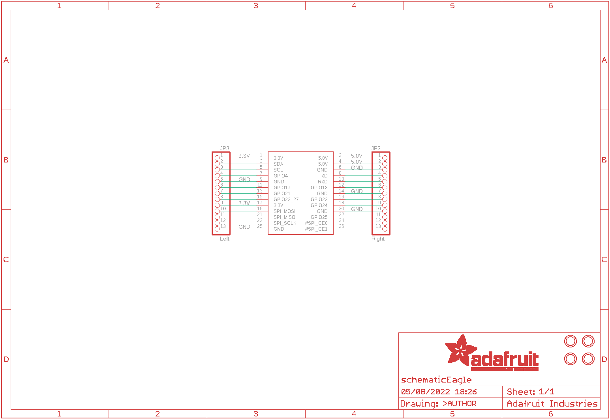
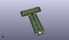
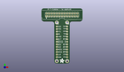
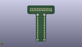
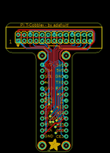

Contents
========

* [PRA1754 > Adafruit](#pra1754--adafruit)
	* [Schematic](#schematic)
	* [Interactive BOM](#interactive-bom)
	* [OOMP Parts](#oomp-parts)
	* [Images](#images)
	* [Tags](#tags)
  
![][im]
# PRA1754 > Adafruit

- ID: PROJ-ADAF-1754-STAN-01
- Hex ID: PRA1754
- Name: Adafruit
- Description: Adafruit
- Long Link: [http://oom.lt/PROJ-ADAF-1754-STAN-01](http://oom.lt/PROJ-ADAF-1754-STAN-01)
- Short Link: [http://oom.lt/PRA1754](http://oom.lt/PRA1754)

## Schematic
  

## Interactive BOM

- Interactive BOM page: [ibom.html](https://htmlpreview.github.io/?https://github.com/oomlout/oomlout_OOMP_projects/blob/main/PROJ-ADAF-1754-STAN-01/kicad/bom/ibom.html)

## OOMP Parts
  

|OOMP Parts|
| :---: |
|JP1,UNMATCHED-UNMATCHED-X-UNMATCHED-01,JP1,PI,RASBERRYPI_IDC,RASBERRYPI_IDC,Rasberry PI IDC Header,,|
|JP2,HEAD-I01-X-PI13-01,JP2,Right,HEADER-1X13,1X13_ROUND_70,,,|
|JP3,HEAD-I01-X-PI13-01,JP3,Left,HEADER-1X13,1X13_ROUND_70,,,|
|U$2,UNMATCHED-UNMATCHED-X-UNMATCHED-01,U$2,MOUNTINGHOLE2.5,MOUNTINGHOLE2.5,MOUNTINGHOLE_2.5_PLATED,Mounting Hole,,|
|U$3,UNMATCHED-UNMATCHED-X-UNMATCHED-01,U$3,MOUNTINGHOLE2.5,MOUNTINGHOLE2.5,MOUNTINGHOLE_2.5_PLATED,Mounting Hole,,|
|U$4,UNMATCHED-UNMATCHED-X-UNMATCHED-01,U$4,MOUNTINGHOLE2.5,MOUNTINGHOLE2.5,MOUNTINGHOLE_2.5_PLATED,Mounting Hole,,|
|U$5,UNMATCHED-UNMATCHED-X-UNMATCHED-01,U$5,MOUNTINGHOLE2.5,MOUNTINGHOLE2.5,MOUNTINGHOLE_2.5_PLATED,Mounting Hole,,|

## Images
  
  

|kicadPcb3d|kicadPcb3dFront|kicadPcb3dBack|eagleImage|eagleSchemImage|
| :---: | :---: | :---: | :---: | :---: |
||||||

## Tags

- hexID: PRA1754
- oompType: PROJ
- oompSize: ADAF
- oompColor: 1754
- oompDesc: STAN
- oompIndex: 01
- oompName: Adafruit Pi Cobber PCBs
- sources: All source files from https://github.com/adafruit/Adafruit-Pi-Cobber-PCBs (source licence details in srcLicense.md)
- linkBuyPage: http://www.adafruit.com/products/1754
- oompID: PROJ-ADAF-1754-STAN-01
- oompParts: JP1,UNMATCHED-UNMATCHED-X-UNMATCHED-01
- oompParts: JP2,HEAD-I01-X-PI13-01
- oompParts: JP3,HEAD-I01-X-PI13-01
- oompParts: U$2,UNMATCHED-UNMATCHED-X-UNMATCHED-01
- oompParts: U$3,UNMATCHED-UNMATCHED-X-UNMATCHED-01
- oompParts: U$4,UNMATCHED-UNMATCHED-X-UNMATCHED-01
- oompParts: U$5,UNMATCHED-UNMATCHED-X-UNMATCHED-01
- rawParts: JP1,PI,RASBERRYPI_IDC,RASBERRYPI_IDC,Rasberry PI IDC Header,,
- rawParts: JP2,Right,HEADER-1X13,1X13_ROUND_70,,,
- rawParts: JP3,Left,HEADER-1X13,1X13_ROUND_70,,,
- rawParts: U$2,MOUNTINGHOLE2.5,MOUNTINGHOLE2.5,MOUNTINGHOLE_2.5_PLATED,Mounting Hole,,
- rawParts: U$3,MOUNTINGHOLE2.5,MOUNTINGHOLE2.5,MOUNTINGHOLE_2.5_PLATED,Mounting Hole,,
- rawParts: U$4,MOUNTINGHOLE2.5,MOUNTINGHOLE2.5,MOUNTINGHOLE_2.5_PLATED,Mounting Hole,,
- rawParts: U$5,MOUNTINGHOLE2.5,MOUNTINGHOLE2.5,MOUNTINGHOLE_2.5_PLATED,Mounting Hole,,

[im]: kicadPcb3d_450.png
