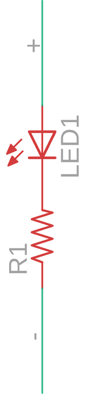

Contents
========

* [PRA1755 > Adafruit](#pra1755--adafruit)
	* [Images](#images)
	* [Tags](#tags)
  
![][im]
# PRA1755 > Adafruit

- ID: PROJ-ADAF-1755-STAN-01
- Hex ID: PRA1755
- Name: Adafruit
- Description: Adafruit

## Images
  
  

|kicadPcb3d|kicadPcb3dFront|kicadPcb3dBack|eagleImage|eagleSchemImage|
| :---: | :---: | :---: | :---: | :---: |
||||||

## Tags

- hexID: PRA1755
- oompType: PROJ
- oompSize: ADAF
- oompColor: 1755
- oompDesc: STAN
- oompIndex: 01
- oompName: Adafruit LED Sequin PCB
- sources: All source files from https://github.com/adafruit/Adafruit-LED-Sequin-PCB (source licence details in srcLicense.md)
- linkBuyPage: http://www.adafruit.com/products/1755
- oompID: PROJ-ADAF-1755-STAN-01
- oompParts: LED1,UNMATCHED-UNMATCHED-UNMATCHED-UNMATCHED-UNMATCHED
- oompParts: R1,UNMATCHED-UNMATCHED-UNMATCHED-UNMATCHED-UNMATCHED
- rawParts: LED1,,LEDSMT1206,1206,LED,,
- rawParts: R1,,R-US_R0603,R0603,RESISTOR, American symbol,,

[im]: kicadPcb3d_450.png
