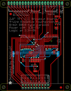

Contents
========

* [PROJ-ADAF-1770-STAN-01>2.8 TFT Breakout PCB](#proj-adaf-1770-stan-0128-tft-breakout-pcb)
	* [Images](#images)
	* [OOMP Parts](#oomp-parts)
	* [Tags](#tags)
  
![][im]
# PROJ-ADAF-1770-STAN-01>2.8 TFT Breakout PCB

- ID: PROJ-ADAF-1770-STAN-01
- Hex ID: PRA1770
- Name: 2.8 TFT Breakout PCB
- Description: 

## Images
  
  

|eagleImage|kicadPcb3dFront|kicadPcb3dBack|kicadPcb3d|
| :---: | :---: | :---: | :---: |
|||||

## OOMP Parts
  

|OOMP Parts|
| :---: |
|UNMATCHED-UNMATCHED-X-UNMATCHED-01, 1X20BREAKOUT, 0.0, 38.099999999999994, 180,1X20BREAKOUT, 1X20, pinhead, (0, 1.5), R180|
|UNMATCHED-UNMATCHED-X-UNMATCHED-01, 2X10BREAKOUT, 0.0, -36.83, 180,2X10BREAKOUT, 2X10, pinhead, (0, -1.45), R180|
|CAPE-0805-X-UF22D-01, C1, 16.764, -5.842, 270,C1, 2.2uF+, C0805K, adafruit, (0.66, -0.23), R270|
|CAPE-0805-X-NF100-01, C2, -11.176, -13.208, 270,C2, 0.1uF, C0805K, adafruit, (-0.44, -0.52), R270|
|CAPE-0805-X-NF100-01, C3, 18.796, 16.002, 180,C3, 0.1uF, C0805K, adafruit, (0.74, 0.63), R180|
|CAPE-0805-X-NF100-01, C4, -4.3180000000000005, -6.095999999999999, 180,C4, 0.1uF, C0805K, adafruit, (-0.17, -0.24), R180|
|CAPE-0805-X-UF22D-01, C5, 18.796, 26.162, 180,C5, 2.2uF+, C0805K, adafruit, (0.74, 1.03), R180|
|UNMATCHED-UNMATCHED-X-UNMATCHED-01, CN1, 0.0, -34.29, M0,CN1, ILI9325_28TFT, ILI9325_28INCH_TS, adafruit, (0, -1.35), MR0|
|UNMATCHED-UNMATCHED-X-UNMATCHED-01, IC1, 19.049999999999997, 20.32, 180,IC1, LP298XS, SOT23-5L, adafruit, (0.75, 0.8), R180|
|UNMATCHED-UNMATCHED-X-UNMATCHED-01, IC2, -7.112, 3.8099999999999996, 180,IC2, 74ACT245DW, SO20W, 74xx-eu, (-0.28, 0.15), R180|
|UNMATCHED-UNMATCHED-X-UNMATCHED-01, IC3, 14.224, 4.064, 180,IC3, 74ACT245DW, SO20W, 74xx-eu, (0.56, 0.16), R180|
|UNMATCHED-UNMATCHED-X-UNMATCHED-01, Q1, -0.508, -17.779999999999998, 0,Q1, 2222, SOT23-BEC, transistor-neu-to92, (-0.02, -0.7), R0|
|RESE-0805-X-UNMATCHED-01, R1, 2.54, -13.462, 90,R1, 47, R0805, rcl, (0.1, -0.53), R90|
|RESE-0805-X-UNMATCHED-01, R2, 0.508, -13.462, 90,R2, 47, R0805, rcl, (0.02, -0.53), R90|
|RESE-0805-X-UNMATCHED-01, R3, -1.5239999999999998, -13.462, 90,R3, 47, R0805, rcl, (-0.06, -0.53), R90|
|RESE-0805-X-UNMATCHED-01, R4, -3.556, -13.462, 90,R4, 47, R0805, rcl, (-0.14, -0.53), R90|
|RESE-0805-X-UNMATCHED-01, R5, -0.254, -23.114, 180,R5, 1K, R0805, rcl, (-0.01, -0.91), R180|

## Tags

- hexID: PRA1770
- oompType: PROJ
- oompSize: ADAF
- oompColor: 1770
- oompDesc: STAN
- oompIndex: 01
- oompName: 2.8 TFT Breakout PCB
- sources: All source files from https://github.com/adafruit/2.8-TFT-Breakout-PCB (source licence details in srcLicense.md)
- linkBuyPage: http://www.adafruit.com/products/1770
- oompPart: UNMATCHED-UNMATCHED-X-UNMATCHED-01, 1X20BREAKOUT, 0.0, 38.099999999999994, 180
- oompPart: UNMATCHED-UNMATCHED-X-UNMATCHED-01, 2X10BREAKOUT, 0.0, -36.83, 180
- oompPart: CAPE-0805-X-UF22D-01, C1, 16.764, -5.842, 270
- oompPart: CAPE-0805-X-NF100-01, C2, -11.176, -13.208, 270
- oompPart: CAPE-0805-X-NF100-01, C3, 18.796, 16.002, 180
- oompPart: CAPE-0805-X-NF100-01, C4, -4.3180000000000005, -6.095999999999999, 180
- oompPart: CAPE-0805-X-UF22D-01, C5, 18.796, 26.162, 180
- oompPart: UNMATCHED-UNMATCHED-X-UNMATCHED-01, CN1, 0.0, -34.29, M0
- oompPart: UNMATCHED-UNMATCHED-X-UNMATCHED-01, IC1, 19.049999999999997, 20.32, 180
- oompPart: UNMATCHED-UNMATCHED-X-UNMATCHED-01, IC2, -7.112, 3.8099999999999996, 180
- oompPart: UNMATCHED-UNMATCHED-X-UNMATCHED-01, IC3, 14.224, 4.064, 180
- oompPart: UNMATCHED-UNMATCHED-X-UNMATCHED-01, Q1, -0.508, -17.779999999999998, 0
- oompPart: RESE-0805-X-UNMATCHED-01, R1, 2.54, -13.462, 90
- oompPart: RESE-0805-X-UNMATCHED-01, R2, 0.508, -13.462, 90
- oompPart: RESE-0805-X-UNMATCHED-01, R3, -1.5239999999999998, -13.462, 90
- oompPart: RESE-0805-X-UNMATCHED-01, R4, -3.556, -13.462, 90
- oompPart: RESE-0805-X-UNMATCHED-01, R5, -0.254, -23.114, 180
- oompPart: SKIP-UNMATCHED-X-UNMATCHED-01, U$9, 22.86, -37.846, 0
- oompPart: SKIP-UNMATCHED-X-UNMATCHED-01, U$11, -22.352, 28.448, 0
- rawPart: 1X20BREAKOUT, 1X20, pinhead, (0, 1.5), R180
- rawPart: 2X10BREAKOUT, 2X10, pinhead, (0, -1.45), R180
- rawPart: C1, 2.2uF+, C0805K, adafruit, (0.66, -0.23), R270
- rawPart: C2, 0.1uF, C0805K, adafruit, (-0.44, -0.52), R270
- rawPart: C3, 0.1uF, C0805K, adafruit, (0.74, 0.63), R180
- rawPart: C4, 0.1uF, C0805K, adafruit, (-0.17, -0.24), R180
- rawPart: C5, 2.2uF+, C0805K, adafruit, (0.74, 1.03), R180
- rawPart: CN1, ILI9325_28TFT, ILI9325_28INCH_TS, adafruit, (0, -1.35), MR0
- rawPart: IC1, LP298XS, SOT23-5L, adafruit, (0.75, 0.8), R180
- rawPart: IC2, 74ACT245DW, SO20W, 74xx-eu, (-0.28, 0.15), R180
- rawPart: IC3, 74ACT245DW, SO20W, 74xx-eu, (0.56, 0.16), R180
- rawPart: Q1, 2222, SOT23-BEC, transistor-neu-to92, (-0.02, -0.7), R0
- rawPart: R1, 47, R0805, rcl, (0.1, -0.53), R90
- rawPart: R2, 47, R0805, rcl, (0.02, -0.53), R90
- rawPart: R3, 47, R0805, rcl, (-0.06, -0.53), R90
- rawPart: R4, 47, R0805, rcl, (-0.14, -0.53), R90
- rawPart: R5, 1K, R0805, rcl, (-0.01, -0.91), R180
- rawPart: U$9, FIDUCIAL, FIDUCIAL_1MM, adafruit, (0.9, -1.49), R0
- rawPart: U$11, FIDUCIAL, FIDUCIAL_1MM, adafruit, (-0.88, 1.12), R0

[im]: kicadPcb3d_450.png
