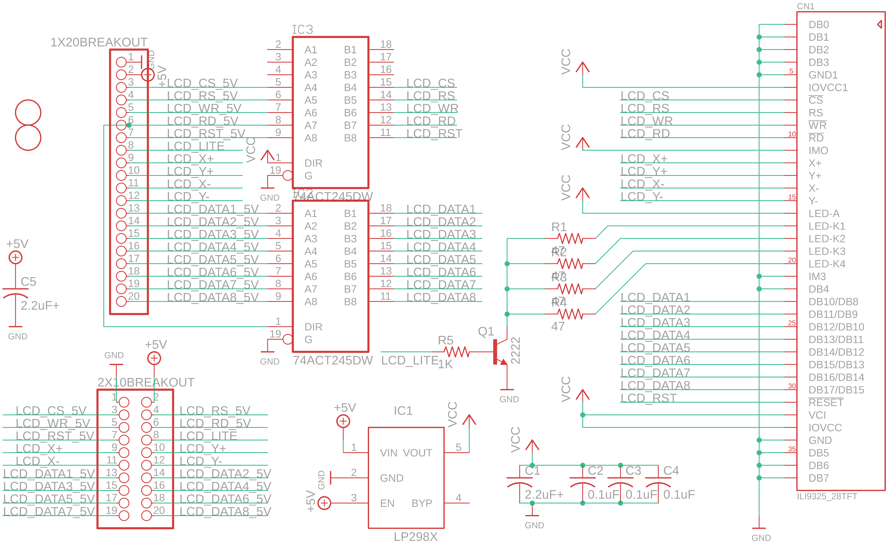
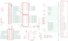

Contents
========

* [PRA1770 > Adafruit](#pra1770--adafruit)
	* [Schematic](#schematic)
	* [OOMP Parts](#oomp-parts)
	* [Images](#images)
	* [Tags](#tags)
  
![][im]
# PRA1770 > Adafruit

- ID: PROJ-ADAF-1770-STAN-01
- Hex ID: PRA1770
- Name: Adafruit
- Description: Adafruit
- Long Link: [http://oom.lt/PROJ-ADAF-1770-STAN-01](http://oom.lt/PROJ-ADAF-1770-STAN-01)
- Short Link: [http://oom.lt/PRA1770](http://oom.lt/PRA1770)

## Schematic
  

## OOMP Parts
  

|OOMP Parts|
| :---: |
|1X20BREAKOUT,UNMATCHED-UNMATCHED-X-UNMATCHED-01,1X20BREAKOUT,,PINHD-1X20,1X20,PIN HEADER,,|
|2X10BREAKOUT,UNMATCHED-UNMATCHED-X-UNMATCHED-01,2X10BREAKOUT,,PINHD-2X10,2X10,PIN HEADER,,|
|C1,CAPC-0805-X-UNMATCHED-01,C1,2.2uF+,C-USC0805K,C0805K,CAPACITOR, American symbol,,|
|C2,CAPC-0805-X-NF100-V50,C2,0.1uF,C-USC0805K,C0805K,CAPACITOR, American symbol,,|
|C3,CAPC-0805-X-NF100-V50,C3,0.1uF,C-USC0805K,C0805K,CAPACITOR, American symbol,,|
|C4,CAPC-0805-X-NF100-V50,C4,0.1uF,C-USC0805K,C0805K,CAPACITOR, American symbol,,|
|C5,CAPC-0805-X-UNMATCHED-01,C5,2.2uF+,C-USC0805K,C0805K,CAPACITOR, American symbol,,|
|CN1,UNMATCHED-UNMATCHED-X-UNMATCHED-01,CN1,ILI9325_28TFT,ILI9325_LCD1.0MM,ILI9325_28INCH_TS,2.8 ILI9325-based TFT LCD w/Integrated Touch Screen,,|
|IC1,VREG-SO235-X-KLP298XS-V33D,IC1,LP298XS,LP298XS,SOT23-5L,,,|
|IC2,UNMATCHED-UNMATCHED-X-UNMATCHED-01,IC2,74ACT245DW,74ACT245DW,SO20W,Octal BUS TRANSCEIVER, 3-state,,|
|IC3,UNMATCHED-UNMATCHED-X-UNMATCHED-01,IC3,74ACT245DW,74ACT245DW,SO20W,Octal BUS TRANSCEIVER, 3-state,,|
|Q1,UNMATCHED-SO23-X-UNMATCHED-01,Q1,2222,MMBT2222ALT1-NPN-SOT23-BEC,SOT23-BEC,NPN Transistror,,|
|R1,RESE-0805-X-O41-01,R1,47,R-US_R0805,R0805,RESISTOR, American symbol,,|
|R2,RESE-0805-X-O41-01,R2,47,R-US_R0805,R0805,RESISTOR, American symbol,,|
|R3,RESE-0805-X-O41-01,R3,47,R-US_R0805,R0805,RESISTOR, American symbol,,|
|R4,RESE-0805-X-O41-01,R4,47,R-US_R0805,R0805,RESISTOR, American symbol,,|
|R5,RESE-0805-X-O102-01,R5,1K,R-US_R0805,R0805,RESISTOR, American symbol,,|

## Images
  
  

|kicadPcb3d|kicadPcb3dFront|kicadPcb3dBack|eagleImage|eagleSchemImage|
| :---: | :---: | :---: | :---: | :---: |
||||||

## Tags

- hexID: PRA1770
- oompType: PROJ
- oompSize: ADAF
- oompColor: 1770
- oompDesc: STAN
- oompIndex: 01
- oompName: 2.8 TFT Breakout PCB
- sources: All source files from https://github.com/adafruit/2.8-TFT-Breakout-PCB (source licence details in srcLicense.md)
- linkBuyPage: http://www.adafruit.com/products/1770
- oompID: PROJ-ADAF-1770-STAN-01
- oompParts: 1X20BREAKOUT,UNMATCHED-UNMATCHED-X-UNMATCHED-01
- oompParts: 2X10BREAKOUT,UNMATCHED-UNMATCHED-X-UNMATCHED-01
- oompParts: C1,CAPC-0805-X-UNMATCHED-01
- oompParts: C2,CAPC-0805-X-NF100-V50
- oompParts: C3,CAPC-0805-X-NF100-V50
- oompParts: C4,CAPC-0805-X-NF100-V50
- oompParts: C5,CAPC-0805-X-UNMATCHED-01
- oompParts: CN1,UNMATCHED-UNMATCHED-X-UNMATCHED-01
- oompParts: IC1,VREG-SO235-X-KLP298XS-V33D
- oompParts: IC2,UNMATCHED-UNMATCHED-X-UNMATCHED-01
- oompParts: IC3,UNMATCHED-UNMATCHED-X-UNMATCHED-01
- oompParts: Q1,UNMATCHED-SO23-X-UNMATCHED-01
- oompParts: R1,RESE-0805-X-O41-01
- oompParts: R2,RESE-0805-X-O41-01
- oompParts: R3,RESE-0805-X-O41-01
- oompParts: R4,RESE-0805-X-O41-01
- oompParts: R5,RESE-0805-X-O102-01
- rawParts: 1X20BREAKOUT,,PINHD-1X20,1X20,PIN HEADER,,
- rawParts: 2X10BREAKOUT,,PINHD-2X10,2X10,PIN HEADER,,
- rawParts: C1,2.2uF+,C-USC0805K,C0805K,CAPACITOR, American symbol,,
- rawParts: C2,0.1uF,C-USC0805K,C0805K,CAPACITOR, American symbol,,
- rawParts: C3,0.1uF,C-USC0805K,C0805K,CAPACITOR, American symbol,,
- rawParts: C4,0.1uF,C-USC0805K,C0805K,CAPACITOR, American symbol,,
- rawParts: C5,2.2uF+,C-USC0805K,C0805K,CAPACITOR, American symbol,,
- rawParts: CN1,ILI9325_28TFT,ILI9325_LCD1.0MM,ILI9325_28INCH_TS,2.8 ILI9325-based TFT LCD w/Integrated Touch Screen,,
- rawParts: IC1,LP298XS,LP298XS,SOT23-5L,,,
- rawParts: IC2,74ACT245DW,74ACT245DW,SO20W,Octal BUS TRANSCEIVER, 3-state,,
- rawParts: IC3,74ACT245DW,74ACT245DW,SO20W,Octal BUS TRANSCEIVER, 3-state,,
- rawParts: Q1,2222,MMBT2222ALT1-NPN-SOT23-BEC,SOT23-BEC,NPN Transistror,,
- rawParts: R1,47,R-US_R0805,R0805,RESISTOR, American symbol,,
- rawParts: R2,47,R-US_R0805,R0805,RESISTOR, American symbol,,
- rawParts: R3,47,R-US_R0805,R0805,RESISTOR, American symbol,,
- rawParts: R4,47,R-US_R0805,R0805,RESISTOR, American symbol,,
- rawParts: R5,1K,R-US_R0805,R0805,RESISTOR, American symbol,,
- rawParts: U$9,FIDUCIAL,FIDUCIAL,FIDUCIAL_1MM,For use by pick and place machines to calibrate the vision/machine, 1mm,,
- rawParts: U$11,FIDUCIAL,FIDUCIAL,FIDUCIAL_1MM,For use by pick and place machines to calibrate the vision/machine, 1mm,,

[im]: kicadPcb3d_450.png
