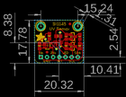
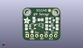
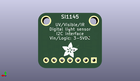
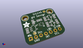

Contents
========

* [PROJ-ADAF-1777-STAN-01>Adafruit Si1145 Light Sensor PCB](#proj-adaf-1777-stan-01adafruit-si1145-light-sensor-pcb)
	* [Images](#images)
	* [Interactive BOM](#interactive-bom)
	* [OOMP Parts](#oomp-parts)
	* [Tags](#tags)
  
![][im]
# PROJ-ADAF-1777-STAN-01>Adafruit Si1145 Light Sensor PCB

- ID: PROJ-ADAF-1777-STAN-01
- Hex ID: PRA1777
- Name: Adafruit Si1145 Light Sensor PCB
- Description: 

## Images
  
  

|eagleImage|kicadPcb3dFront|kicadPcb3dBack|kicadPcb3d|
| :---: | :---: | :---: | :---: |
|||||

## Interactive BOM

- Interactive BOM page: [ibom.html](kicad/bom/ibom.html)

## OOMP Parts
  

|OOMP Parts|
| :---: |
|CAPE-0805-X-UNMATCHED-01, C1, 6.095999999999999, 11.176, 90,C1, 10uF, 0805-NO, microbuilder, (0.24, 0.44), R90|
|CAPE-0805-X-UNMATCHED-01, C2, 2.032, 7.112, 90,C2, 10uF, 0805-NO, microbuilder, (0.08, 0.28), R90|
|UNMATCHED-UNMATCHED-X-UNMATCHED-01, JP1, 10.16, 2.54, 0,JP1, 1X07_ROUND_70, microbuilder, (0.4, 0.1), R0|
|UNMATCHED-UNMATCHED-X-UNMATCHED-01, Q1, 15.748, 10.921999999999999, 270,Q1, BSS138, SOT23-WIDE, microbuilder, (0.62, 0.43), R270|
|UNMATCHED-UNMATCHED-X-UNMATCHED-01, Q2, 15.748, 6.858, 270,Q2, BSS138, SOT23-WIDE, microbuilder, (0.62, 0.27), R270|
|<table><tr><td></td><td> R1</td><td>[RESE-0805-X-O103-01 SMD (0805) 10k Ohm Resistor](https://github.com/oomlout/oomlout_OOMP_parts/tree/main/RESE-0805-X-O103-01/)</td><td>[R85103](https://github.com/oomlout/oomlout_OOMP_parts/tree/main/RESE-0805-X-O103-01/)</td></tr></table>|
|<table><tr><td></td><td> R2</td><td>[RESE-0805-X-O103-01 SMD (0805) 10k Ohm Resistor](https://github.com/oomlout/oomlout_OOMP_parts/tree/main/RESE-0805-X-O103-01/)</td><td>[R85103](https://github.com/oomlout/oomlout_OOMP_parts/tree/main/RESE-0805-X-O103-01/)</td></tr></table>|
|<table><tr><td></td><td> R3</td><td>[RESE-0805-X-O103-01 SMD (0805) 10k Ohm Resistor](https://github.com/oomlout/oomlout_OOMP_parts/tree/main/RESE-0805-X-O103-01/)</td><td>[R85103](https://github.com/oomlout/oomlout_OOMP_parts/tree/main/RESE-0805-X-O103-01/)</td></tr></table>|
|<table><tr><td></td><td> R4</td><td>[RESE-0805-X-O103-01 SMD (0805) 10k Ohm Resistor](https://github.com/oomlout/oomlout_OOMP_parts/tree/main/RESE-0805-X-O103-01/)</td><td>[R85103](https://github.com/oomlout/oomlout_OOMP_parts/tree/main/RESE-0805-X-O103-01/)</td></tr></table>|
|<table><tr><td></td><td> R5</td><td>[RESE-0805-X-O103-01 SMD (0805) 10k Ohm Resistor](https://github.com/oomlout/oomlout_OOMP_parts/tree/main/RESE-0805-X-O103-01/)</td><td>[R85103](https://github.com/oomlout/oomlout_OOMP_parts/tree/main/RESE-0805-X-O103-01/)</td></tr></table>|
|UNMATCHED-UNMATCHED-X-UNMATCHED-01, U1, 9.906, 8.382, 180,U1, SI1145, SI114X, microbuilder, (0.39, 0.33), R180|
|UNMATCHED-UNMATCHED-X-UNMATCHED-01, U2, 5.334, 7.365999999999999, 270,U2, MIC5225-3.3, SOT23-5, microbuilder, (0.21, 0.29), R270|

## Tags

- hexID: PRA1777
- oompType: PROJ
- oompSize: ADAF
- oompColor: 1777
- oompDesc: STAN
- oompIndex: 01
- oompName: Adafruit Si1145 Light Sensor PCB
- sources: All source files from https://github.com/adafruit/Adafruit-Si1145-Light-Sensor-PCB (source licence details in srcLicense.md)
- linkBuyPage: http://www.adafruit.com/products/1777
- oompPart: CAPE-0805-X-UNMATCHED-01, C1, 6.095999999999999, 11.176, 90
- oompPart: CAPE-0805-X-UNMATCHED-01, C2, 2.032, 7.112, 90
- oompPart: SKIP-UNMATCHED-X-UNMATCHED-01, FID1, 14.477999999999998, 16.256, 0
- oompPart: SKIP-UNMATCHED-X-UNMATCHED-01, FID2, 5.08, 4.571999999999999, 0
- oompPart: UNMATCHED-UNMATCHED-X-UNMATCHED-01, JP1, 10.16, 2.54, 0
- oompPart: UNMATCHED-UNMATCHED-X-UNMATCHED-01, Q1, 15.748, 10.921999999999999, 270
- oompPart: UNMATCHED-UNMATCHED-X-UNMATCHED-01, Q2, 15.748, 6.858, 270
- oompPart: RESE-0805-X-O103-01, R1, 12.953999999999999, 10.921999999999999, 90
- oompPart: RESE-0805-X-O103-01, R2, 18.541999999999998, 10.921999999999999, 270
- oompPart: RESE-0805-X-O103-01, R3, 18.541999999999998, 7.112, 270
- oompPart: RESE-0805-X-O103-01, R4, 12.953999999999999, 7.112, 270
- oompPart: RESE-0805-X-O103-01, R5, 9.652, 11.176, 180
- oompPart: SKIP-UNMATCHED-X-UNMATCHED-01, U$5, 2.54, 15.239999999999998, 0
- oompPart: SKIP-UNMATCHED-X-UNMATCHED-01, U$6, 17.779999999999998, 15.239999999999998, 0
- oompPart: UNMATCHED-UNMATCHED-X-UNMATCHED-01, U1, 9.906, 8.382, 180
- oompPart: UNMATCHED-UNMATCHED-X-UNMATCHED-01, U2, 5.334, 7.365999999999999, 270
- rawPart: C1, 10uF, 0805-NO, microbuilder, (0.24, 0.44), R90
- rawPart: C2, 10uF, 0805-NO, microbuilder, (0.08, 0.28), R90
- rawPart: FID1, FIDUCIAL, FIDUCIAL_1MM, microbuilder, (0.57, 0.64), R0
- rawPart: FID2, FIDUCIAL, FIDUCIAL_1MM, microbuilder, (0.2, 0.18), R0
- rawPart: JP1, 1X07_ROUND_70, microbuilder, (0.4, 0.1), R0
- rawPart: Q1, BSS138, SOT23-WIDE, microbuilder, (0.62, 0.43), R270
- rawPart: Q2, BSS138, SOT23-WIDE, microbuilder, (0.62, 0.27), R270
- rawPart: R1, 10K, 0805-NO, microbuilder, (0.51, 0.43), R90
- rawPart: R2, 10K, 0805-NO, microbuilder, (0.73, 0.43), R270
- rawPart: R3, 10K, 0805-NO, microbuilder, (0.73, 0.28), R270
- rawPart: R4, 10K, 0805-NO, microbuilder, (0.51, 0.28), R270
- rawPart: R5, 10K, 0805-NO, microbuilder, (0.38, 0.44), R180
- rawPart: U$5, MOUNTINGHOLE2.5, MOUNTINGHOLE_2.5_PLATED, microbuilder, (0.1, 0.6), R0
- rawPart: U$6, MOUNTINGHOLE2.5, MOUNTINGHOLE_2.5_PLATED, microbuilder, (0.7, 0.6), R0
- rawPart: U1, SI1145, SI114X, microbuilder, (0.39, 0.33), R180
- rawPart: U2, MIC5225-3.3, SOT23-5, microbuilder, (0.21, 0.29), R270

[im]: kicadPcb3d_450.png
