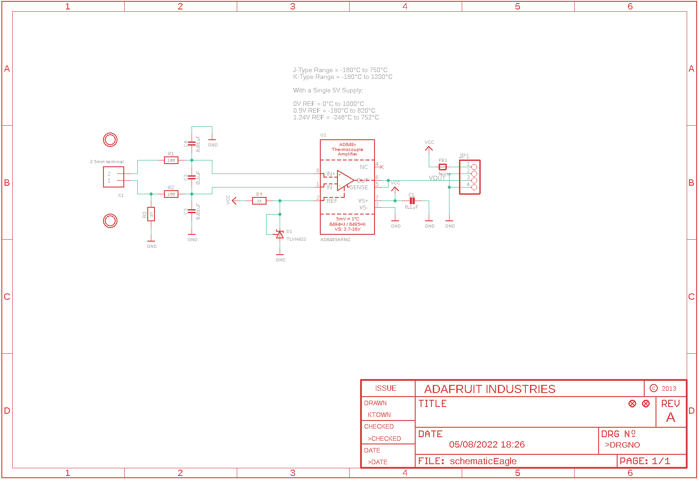
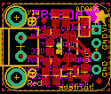
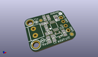
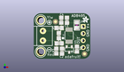
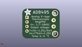
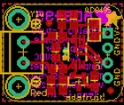

Contents
========

* [PRA1778 > Adafruit AD8495 Breakout PCB](#pra1778--adafruit-ad8495-breakout-pcb)
	* [Schematic](#schematic)
	* [PCB](#pcb)
	* [Interactive BOM](#interactive-bom)
	* [OOMP Parts](#oomp-parts)
	* [Images](#images)
	* [Tags](#tags)
  
![][im]
# PRA1778 > Adafruit AD8495 Breakout PCB

- ID: PROJ-ADAF-1778-STAN-01
- Hex ID: PRA1778
- Name: Adafruit
- Description: Adafruit
- Long Link: [http://oom.lt/PROJ-ADAF-1778-STAN-01](http://oom.lt/PROJ-ADAF-1778-STAN-01)
- Short Link: [http://oom.lt/PRA1778](http://oom.lt/PRA1778)

## Schematic
  

## PCB
  

## Interactive BOM

- Interactive BOM page: [ibom.html](https://htmlpreview.github.io/?https://github.com/oomlout/oomlout_OOMP_projects/blob/main/PROJ-ADAF-1778-STAN-01/kicad/bom/ibom.html)

## OOMP Parts
  

|OOMP Parts|
| :---: |
|C1 C1,CAPC-0805-X-UF1D-01|
|C2 C2,CAPC-0805-X-UNMATCHED-01|
|C3 C3,CAPC-0805-X-UF1D-01|
|C4 C4,CAPC-0805-X-UNMATCHED-01|
|D1 D1,DIOD-SO23-X-UNMATCHED-01|
|FB1 FB1,FERB-0805-X-UNMATCHED-01|
|[JP1 HEAD-I01-X-PI04-01 2.54 mm 4 Pin Header](https://github.com/oomlout/oomlout_OOMP_parts/tree/main/HEAD-I01-X-PI04-01/)|
|[R1 RESE-0805-X-O101-01 SMD (0805) 100 Ohm Resistor](https://github.com/oomlout/oomlout_OOMP_parts/tree/main/RESE-0805-X-O101-01/)|
|[R2 RESE-0805-X-O101-01 SMD (0805) 100 Ohm Resistor](https://github.com/oomlout/oomlout_OOMP_parts/tree/main/RESE-0805-X-O101-01/)|
|R3 R3,RESE-0805-X-O105-01|
|[R4 RESE-0805-X-O102-01 SMD (0805) 1k Ohm Resistor](https://github.com/oomlout/oomlout_OOMP_parts/tree/main/RESE-0805-X-O102-01/)|
|U1 U1,UNMATCHED-UNMATCHED-X-UNMATCHED-01|
|X1 X1,UNMATCHED-UNMATCHED-X-UNMATCHED-01|

## Images
  
  

|kicadPcb3d|kicadPcb3dFront|kicadPcb3dBack|eagleImage|eagleSchemImage|
| :---: | :---: | :---: | :---: | :---: |
||||||

## Tags

- hexID: PRA1778
- oompType: PROJ
- oompSize: ADAF
- oompColor: 1778
- oompDesc: STAN
- oompIndex: 01
- oompName: Adafruit AD8495 Breakout PCB
- sources: All source files from https://github.com/adafruit/Adafruit-AD8495-Breakout-PCB (source licence details in srcLicense.md)
- linkBuyPage: http://www.adafruit.com/products/1778
- oompID: PROJ-ADAF-1778-STAN-01
- oompParts: C1,CAPC-0805-X-UF1D-01
- oompParts: C2,CAPC-0805-X-UNMATCHED-01
- oompParts: C3,CAPC-0805-X-UF1D-01
- oompParts: C4,CAPC-0805-X-UNMATCHED-01
- oompParts: D1,DIOD-SO23-X-UNMATCHED-01
- oompParts: FB1,FERB-0805-X-UNMATCHED-01
- oompParts: JP1,HEAD-I01-X-PI04-01
- oompParts: R1,RESE-0805-X-O101-01
- oompParts: R2,RESE-0805-X-O101-01
- oompParts: R3,RESE-0805-X-O105-01
- oompParts: R4,RESE-0805-X-O102-01
- oompParts: U1,UNMATCHED-UNMATCHED-X-UNMATCHED-01
- oompParts: X1,UNMATCHED-UNMATCHED-X-UNMATCHED-01
- rawParts: C1,0.1µF,CAP_CERAMIC0805-NOOUTLINE,0805-NO,Ceramic Capacitors,,
- rawParts: C2,0.01uF,CAP_CERAMIC0805-NOOUTLINE,0805-NO,Ceramic Capacitors,,
- rawParts: C3,0.1uF,CAP_CERAMIC0805-NOOUTLINE,0805-NO,Ceramic Capacitors,,
- rawParts: C4,0.01uF,CAP_CERAMIC0805-NOOUTLINE,0805-NO,Ceramic Capacitors,,
- rawParts: D1,TLVH431,SHUNT-VREF,SOT23-R,Shunt Voltage Reference,,
- rawParts: FB1,ferrite,FERRITE0805,0805,Ferrite Bead,,
- rawParts: FID1,FIDUCIAL,FIDUCIAL,FIDUCIAL_1MM,Fiducial Alignment Points,EXCLUDE,
- rawParts: FID2,FIDUCIAL,FIDUCIAL,FIDUCIAL_1MM,Fiducial Alignment Points,EXCLUDE,
- rawParts: JP1,,HEADER-1X4ROUND,1X04_ROUND,PIN HEADER,,
- rawParts: R1,100,RESISTOR0805_NOOUTLINE,0805-NO,Resistors,,
- rawParts: R2,100,RESISTOR0805_NOOUTLINE,0805-NO,Resistors,,
- rawParts: R3,1M,RESISTOR0805_NOOUTLINE,0805-NO,Resistors,,
- rawParts: R4,1K,RESISTOR0805_NOOUTLINE,0805-NO,Resistors,,
- rawParts: U$11,MOUNTINGHOLE2.5,MOUNTINGHOLE2.5,MOUNTINGHOLE_2.5_PLATED,Mounting Hole,EXCLUDE,
- rawParts: U$12,MOUNTINGHOLE2.5,MOUNTINGHOLE2.5,MOUNTINGHOLE_2.5_PLATED,Mounting Hole,EXCLUDE,
- rawParts: U1,AD8495ARMZ ,AD849X,MSOP8_0.65MM,AD8494/8495 - Precision Thermocouple Amplifier with Cold Junction Compensation,,
- rawParts: X1,3.5mm terminal,TERMBLOCK_1X2,TERMBLOCK_1X2-3.5MM,3.5mm Terminal block,,

[im]: kicadPcb3d_450.png
