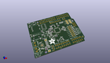
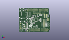
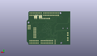
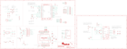

Contents
========

* [PRA1788 > Adafruit](#pra1788--adafruit)
	* [Schematic](#schematic)
	* [Interactive BOM](#interactive-bom)
	* [OOMP Parts](#oomp-parts)
	* [Images](#images)
	* [Tags](#tags)
  
![][im]
# PRA1788 > Adafruit

- ID: PROJ-ADAF-1788-STAN-01
- Hex ID: PRA1788
- Name: Adafruit
- Description: Adafruit
- Long Link: [http://oom.lt/PROJ-ADAF-1788-STAN-01](http://oom.lt/PROJ-ADAF-1788-STAN-01)
- Long Link: [http://oom.lt/PRA1788](http://oom.lt/PRA1788)

## Schematic
  
![][schem]
## Interactive BOM

- Interactive BOM page: [ibom.html](https://htmlpreview.github.io/?https://github.com/oomlout/oomlout_OOMP_projects/blob/main/PROJ-ADAF-1788-STAN-01/kicad/bom/ibom.html)

## OOMP Parts
  

|OOMP Parts|
| :---: |
|C1,UNMATCHED-UNMATCHED-UNMATCHED-UNMATCHED-UNMATCHED,C1,220uF,CPOL-USC,PANASONIC_C,POLARIZED CAPACITOR, American symbol,,|
|C2,UNMATCHED-UNMATCHED-UNMATCHED-UNMATCHED-UNMATCHED,C2,220uF,CPOL-USC,PANASONIC_C,POLARIZED CAPACITOR, American symbol,,|
|C3,UNMATCHED-UNMATCHED-UNMATCHED-UNMATCHED-UNMATCHED,C3,10µF,CAP_CERAMIC0805-NOOUTLINE,0805-NO,Ceramic Capacitors,,|
|C4,UNMATCHED-UNMATCHED-UNMATCHED-UNMATCHED-UNMATCHED,C4,15pF,CAP_CERAMIC0805-NOOUTLINE,0805-NO,Ceramic Capacitors,,|
|C5,UNMATCHED-UNMATCHED-UNMATCHED-UNMATCHED-UNMATCHED,C5,15pF,CAP_CERAMIC0805-NOOUTLINE,0805-NO,Ceramic Capacitors,,|
|C6,UNMATCHED-UNMATCHED-UNMATCHED-UNMATCHED-UNMATCHED,C6,10µF,CAP_CERAMIC0805-NOOUTLINE,0805-NO,Ceramic Capacitors,,|
|C7,UNMATCHED-UNMATCHED-UNMATCHED-UNMATCHED-UNMATCHED,C7,10µF,CAP_CERAMIC0805-NOOUTLINE,0805-NO,Ceramic Capacitors,,|
|C8,UNMATCHED-UNMATCHED-UNMATCHED-UNMATCHED-UNMATCHED,C8,0.1µF,CAP_CERAMIC_0805MP,_0805MP,Ceramic Capacitors,,|
|C9,UNMATCHED-UNMATCHED-UNMATCHED-UNMATCHED-UNMATCHED,C9,0.1µF,CAP_CERAMIC0805-NOOUTLINE,0805-NO,Ceramic Capacitors,,|
|C10,UNMATCHED-UNMATCHED-UNMATCHED-UNMATCHED-UNMATCHED,C10,0.1µF,CAP_CERAMIC0805-NOOUTLINE,0805-NO,Ceramic Capacitors,,|
|C11,UNMATCHED-UNMATCHED-UNMATCHED-UNMATCHED-UNMATCHED,C11,0.1µF,CAP_CERAMIC0805-NOOUTLINE,0805-NO,Ceramic Capacitors,,|
|C12,UNMATCHED-UNMATCHED-UNMATCHED-UNMATCHED-UNMATCHED,C12,1µF,CAP_CERAMIC0805-NOOUTLINE,0805-NO,Ceramic Capacitors,,|
|C13,UNMATCHED-UNMATCHED-UNMATCHED-UNMATCHED-UNMATCHED,C13,1µF,CAP_CERAMIC0805-NOOUTLINE,0805-NO,Ceramic Capacitors,,|
|C14,UNMATCHED-UNMATCHED-UNMATCHED-UNMATCHED-UNMATCHED,C14,1µF,CAP_CERAMIC0805-NOOUTLINE,0805-NO,Ceramic Capacitors,,|
|C15,UNMATCHED-UNMATCHED-UNMATCHED-UNMATCHED-UNMATCHED,C15,1µF,CAP_CERAMIC0805-NOOUTLINE,0805-NO,Ceramic Capacitors,,|
|C16,UNMATCHED-UNMATCHED-UNMATCHED-UNMATCHED-UNMATCHED,C16,10µF,CAP_CERAMIC0805-NOOUTLINE,0805-NO,Ceramic Capacitors,,|
|C17,UNMATCHED-UNMATCHED-UNMATCHED-UNMATCHED-UNMATCHED,C17,1µF,CAP_CERAMIC0805-NOOUTLINE,0805-NO,Ceramic Capacitors,,|
|C18,UNMATCHED-UNMATCHED-UNMATCHED-UNMATCHED-UNMATCHED,C18,0.047uF,CAP_CERAMIC0805-NOOUTLINE,0805-NO,Ceramic Capacitors,,|
|C19,UNMATCHED-UNMATCHED-UNMATCHED-UNMATCHED-UNMATCHED,C19,10µF,CAP_CERAMIC_0805MP,_0805MP,Ceramic Capacitors,,|
|C20,UNMATCHED-UNMATCHED-UNMATCHED-UNMATCHED-UNMATCHED,C20,10µF,CAP_CERAMIC0805-NOOUTLINE,0805-NO,Ceramic Capacitors,,|
|C21,UNMATCHED-UNMATCHED-UNMATCHED-UNMATCHED-UNMATCHED,C21,0.01uF,CAP_CERAMIC0805-NOOUTLINE,0805-NO,Ceramic Capacitors,,|
|C22,UNMATCHED-UNMATCHED-UNMATCHED-UNMATCHED-UNMATCHED,C22,0.01uF,CAP_CERAMIC_0805MP,_0805MP,Ceramic Capacitors,,|
|C23,UNMATCHED-UNMATCHED-UNMATCHED-UNMATCHED-UNMATCHED,C23,0.1uF,CAP_CERAMIC0805-NOOUTLINE,0805-NO,Ceramic Capacitors,,|
|C24,UNMATCHED-UNMATCHED-UNMATCHED-UNMATCHED-UNMATCHED,C24,0.1uF,CAP_CERAMIC0805_10MGAP,0805_10MGAP,Ceramic Capacitors,,|
|C25,UNMATCHED-UNMATCHED-UNMATCHED-UNMATCHED-UNMATCHED,C25,0.1uF,CAP_CERAMIC0805-NOOUTLINE,0805-NO,Ceramic Capacitors,,|
|C26,UNMATCHED-UNMATCHED-UNMATCHED-UNMATCHED-UNMATCHED,C26,0.1µF,CAP_CERAMIC_0805MP,_0805MP,Ceramic Capacitors,,|
|C27,UNMATCHED-UNMATCHED-UNMATCHED-UNMATCHED-UNMATCHED,C27,0.01uF,CAP_CERAMIC0805-NOOUTLINE,0805-NO,Ceramic Capacitors,,|
|C28,UNMATCHED-UNMATCHED-UNMATCHED-UNMATCHED-UNMATCHED,C28,0.01uF,CAP_CERAMIC0805-NOOUTLINE,0805-NO,Ceramic Capacitors,,|
|CN1,UNMATCHED-UNMATCHED-UNMATCHED-UNMATCHED-UNMATCHED,CN1,2908-05WB-M6,MICROSD,MICROSD,MicroSD/Transflash Card Holder with SPI pinout,,|
|D1,UNMATCHED-UNMATCHED-UNMATCHED-UNMATCHED-UNMATCHED,D1,1N4148,DIODESOD-323,SOD-323,Diode,,|
|D2,UNMATCHED-UNMATCHED-UNMATCHED-UNMATCHED-UNMATCHED,D2,1N4148,DIODESOD-323,SOD-323,Diode,,|
|FB1,UNMATCHED-UNMATCHED-UNMATCHED-UNMATCHED-UNMATCHED,FB1,FERITTE,FERRITE_0805MP,_0805MP,Ferrite Bead,,|
|FB2,UNMATCHED-UNMATCHED-UNMATCHED-UNMATCHED-UNMATCHED,FB2,FERITTE,FERRITE_0805MP,_0805MP,Ferrite Bead,,|
|FB3,UNMATCHED-UNMATCHED-UNMATCHED-UNMATCHED-UNMATCHED,FB3,ferrite,FERRITE_0805MP,_0805MP,Ferrite Bead,,|
|FB4,UNMATCHED-UNMATCHED-UNMATCHED-UNMATCHED-UNMATCHED,FB4,ferrite,FERRITE_0805MP,_0805MP,Ferrite Bead,,|
|JP1,UNMATCHED-UNMATCHED-UNMATCHED-UNMATCHED-UNMATCHED,FID1,FIDUCIAL,FIDUCIAL,FIDUCIAL_1MM,Fiducial Alignment Points,EXCLUDE,|
|JP2,UNMATCHED-UNMATCHED-UNMATCHED-UNMATCHED-UNMATCHED,FID2,FIDUCIAL,FIDUCIAL,FIDUCIAL_1MM,Fiducial Alignment Points,EXCLUDE,|
|JP3,UNMATCHED-UNMATCHED-UNMATCHED-UNMATCHED-UNMATCHED,FID3,FIDUCIAL,FIDUCIAL,FIDUCIAL_1MM,Fiducial Alignment Points,EXCLUDE,|
|JP4,UNMATCHED-UNMATCHED-UNMATCHED-UNMATCHED-UNMATCHED,JP1,,PINHD-1X8CLEANBIG,1X08-CLEANBIG,PIN HEADER,,|
|JP6,UNMATCHED-UNMATCHED-UNMATCHED-UNMATCHED-UNMATCHED,JP2,,PINHD-1X3CB,1X03-CLEANBIG,PIN HEADER,,|
|JP7,UNMATCHED-UNMATCHED-UNMATCHED-UNMATCHED-UNMATCHED,JP3,,HEADER-1X2ROUND,1X02_ROUND,PIN HEADER,,|
|JP8,UNMATCHED-UNMATCHED-UNMATCHED-UNMATCHED-UNMATCHED,JP4,,PINHD-1X8CLEANBIG,1X08-CLEANBIG,PIN HEADER,,|
|LEFTSPK,UNMATCHED-UNMATCHED-UNMATCHED-UNMATCHED-UNMATCHED,JP6,,HEADER-1X1070MIL,1X10_ROUND70,PIN HEADER,,|
|MP3GPIO,UNMATCHED-UNMATCHED-UNMATCHED-UNMATCHED-UNMATCHED,JP7,,HEADER-1X770MIL,1X07_ROUND_70,PIN HEADER,,|
|R1,UNMATCHED-UNMATCHED-UNMATCHED-UNMATCHED-UNMATCHED,JP8,,PINHD-1X6CB,1X06-CLEANBIG,PIN HEADER,,|
|R2,UNMATCHED-UNMATCHED-UNMATCHED-UNMATCHED-UNMATCHED,LEFTSPK,3.5mm Term,TERMBLOCK_1X2,TERMBLOCK_1X2-3.5MM,3.5mm Terminal block,,|
|R3,UNMATCHED-UNMATCHED-UNMATCHED-UNMATCHED-UNMATCHED,MP3GPIO,,HEADER-2X7_ROUND_70MIL,2X07_ROUND_70MIL,PIN HEADER,,|
|R4,UNMATCHED-UNMATCHED-UNMATCHED-UNMATCHED-UNMATCHED,R1,1M,RESISTOR0805_NOOUTLINE,0805-NO,Resistors,,|
|R5,UNMATCHED-UNMATCHED-UNMATCHED-UNMATCHED-UNMATCHED,R2,100K,RESISTOR0805_NOOUTLINE,0805-NO,Resistors,,|
|R6,UNMATCHED-UNMATCHED-UNMATCHED-UNMATCHED-UNMATCHED,R3,22,RESISTOR0805_NOOUTLINE,0805-NO,Resistors,,|
|R7,UNMATCHED-UNMATCHED-UNMATCHED-UNMATCHED-UNMATCHED,R4,22,RESISTOR_0805MP,_0805MP,Resistors,,|
|R8,UNMATCHED-UNMATCHED-UNMATCHED-UNMATCHED-UNMATCHED,R5,10,RESISTOR0805_NOOUTLINE,0805-NO,Resistors,,|
|R9,UNMATCHED-UNMATCHED-UNMATCHED-UNMATCHED-UNMATCHED,R6,100,RESISTOR_0805MP,_0805MP,Resistors,,|
|R10,UNMATCHED-UNMATCHED-UNMATCHED-UNMATCHED-UNMATCHED,R7,100,RESISTOR0805_NOOUTLINE,0805-NO,Resistors,,|
|R12,UNMATCHED-UNMATCHED-UNMATCHED-UNMATCHED-UNMATCHED,R8,100K,RESISTOR0805_NOOUTLINE,0805-NO,Resistors,,|
|R13,UNMATCHED-UNMATCHED-UNMATCHED-UNMATCHED-UNMATCHED,R9,10K,RESISTOR_0805MP,_0805MP,Resistors,,|
|R14,UNMATCHED-UNMATCHED-UNMATCHED-UNMATCHED-UNMATCHED,R10,10K,RESISTOR_0805MP,_0805MP,Resistors,,|
|R15,UNMATCHED-UNMATCHED-UNMATCHED-UNMATCHED-UNMATCHED,R12,100K,RESISTOR_0805MP,_0805MP,Resistors,,|
|R16,UNMATCHED-UNMATCHED-UNMATCHED-UNMATCHED-UNMATCHED,R13,100K,RESISTOR0805_NOOUTLINE,0805-NO,Resistors,,|
|R17,UNMATCHED-UNMATCHED-UNMATCHED-UNMATCHED-UNMATCHED,R14,100K,RESISTOR0805_NOOUTLINE,0805-NO,Resistors,,|
|R18,UNMATCHED-UNMATCHED-UNMATCHED-UNMATCHED-UNMATCHED,R15,100K,RESISTOR0805_NOOUTLINE,0805-NO,Resistors,,|
|R19,UNMATCHED-UNMATCHED-UNMATCHED-UNMATCHED-UNMATCHED,R16,100K,RESISTOR0805_NOOUTLINE,0805-NO,Resistors,,|
|R20,UNMATCHED-UNMATCHED-UNMATCHED-UNMATCHED-UNMATCHED,R17,100K,RESISTOR0805_NOOUTLINE,0805-NO,Resistors,,|
|R21,UNMATCHED-UNMATCHED-UNMATCHED-UNMATCHED-UNMATCHED,R18,100K,RESISTOR0805_NOOUTLINE,0805-NO,Resistors,,|
|RIGHTSPK,UNMATCHED-UNMATCHED-UNMATCHED-UNMATCHED-UNMATCHED,R19,10K,RESISTOR0805_NOOUTLINE,0805-NO,Resistors,,|
|SJ2,UNMATCHED-UNMATCHED-UNMATCHED-UNMATCHED-UNMATCHED,R20,10K,RESISTOR0805_NOOUTLINE,0805-NO,Resistors,,|
|SJ3,UNMATCHED-UNMATCHED-UNMATCHED-UNMATCHED-UNMATCHED,R21,10K,RESISTOR0805_NOOUTLINE,0805-NO,Resistors,,|
|SJ4,UNMATCHED-UNMATCHED-UNMATCHED-UNMATCHED-UNMATCHED,RIGHTSPK,3.5mm Term,TERMBLOCK_1X2,TERMBLOCK_1X2-3.5MM,3.5mm Terminal block,,|
|SJ5,UNMATCHED-UNMATCHED-UNMATCHED-UNMATCHED-UNMATCHED,SJ1,+6dB,SOLDERJUMPER,SOLDERJUMPER_ARROW_NOPASTE,SMD Solder JUMPER,EXCLUDE,|
|SJ6,UNMATCHED-UNMATCHED-UNMATCHED-UNMATCHED-UNMATCHED,SJ2,ICSP_MISO,SOLDERJUMPERREFLOW_NOPASTE,SOLDERJUMPER_REFLOW_NOPASTE,SMD Solder JUMPER,,|
|SJ7,UNMATCHED-UNMATCHED-UNMATCHED-UNMATCHED-UNMATCHED,SJ3,ISCP_SCLK,SOLDERJUMPERREFLOW_NOPASTE,SOLDERJUMPER_REFLOW_NOPASTE,SMD Solder JUMPER,,|
|SJ8,UNMATCHED-UNMATCHED-UNMATCHED-UNMATCHED-UNMATCHED,SJ4,ICSP_MOSI,SOLDERJUMPERREFLOW_NOPASTE,SOLDERJUMPER_REFLOW_NOPASTE,SMD Solder JUMPER,,|
|SJ9,UNMATCHED-UNMATCHED-UNMATCHED-UNMATCHED-UNMATCHED,SJ5,D12_MISO,SOLDERJUMPERCLOSED,SOLDERJUMPER_CLOSEDWIRE,SMD Solder JUMPER,,|
|SJ10,UNMATCHED-UNMATCHED-UNMATCHED-UNMATCHED-UNMATCHED,SJ6,D13_SCLK,SOLDERJUMPERCLOSED,SOLDERJUMPER_CLOSEDWIRE,SMD Solder JUMPER,,|
|SJ11,UNMATCHED-UNMATCHED-UNMATCHED-UNMATCHED-UNMATCHED,SJ7,D11_MOSI,SOLDERJUMPERCLOSED,SOLDERJUMPER_CLOSEDWIRE,SMD Solder JUMPER,,|
|SW2,UNMATCHED-UNMATCHED-UNMATCHED-UNMATCHED-UNMATCHED,SJ8,,SOLDERJUMPERCLOSED,SOLDERJUMPER_CLOSEDWIRE,SMD Solder JUMPER,,|
|U$41,UNMATCHED-UNMATCHED-UNMATCHED-UNMATCHED-UNMATCHED,SJ9,,SOLDERJUMPERCLOSED,SOLDERJUMPER_CLOSEDWIRE,SMD Solder JUMPER,,|
|U1,UNMATCHED-UNMATCHED-UNMATCHED-UNMATCHED-UNMATCHED,SJ10,,SOLDERJUMPERCLOSED,SOLDERJUMPER_CLOSEDWIRE,SMD Solder JUMPER,,|
|U2,UNMATCHED-UNMATCHED-UNMATCHED-UNMATCHED-UNMATCHED,SJ11,,SOLDERJUMPERCLOSED,SOLDERJUMPER_CLOSEDWIRE,SMD Solder JUMPER,,|
|U4,UNMATCHED-UNMATCHED-UNMATCHED-UNMATCHED-UNMATCHED,SJ12,+12dB,SOLDERJUMPER,SOLDERJUMPER_ARROW_NOPASTE,SMD Solder JUMPER,EXCLUDE,|
|U5,UNMATCHED-UNMATCHED-UNMATCHED-UNMATCHED-UNMATCHED,SW2,SPST_TACT-EVQQ2,SPST_TACT-EVQQ2,EVQ-Q2,SMT 6mm switch, EVQQ2 series,,|
|X1,UNMATCHED-UNMATCHED-UNMATCHED-UNMATCHED-UNMATCHED,U$41,ARDUINO_R3_ICSP,ARDUINO_R3_ICSP,ARDUINOR3_ICSP,,,|
|Y1,UNMATCHED-UNMATCHED-UNMATCHED-UNMATCHED-UNMATCHED,U1,VS1053B,VS1053B,LQFP48,VS1053b Audio Codec - Ogg Vorbis/MP3/AAC/WMA/FLAC/MIDI,,|

## Images
  
  

|kicadPcb3d|kicadPcb3dFront|kicadPcb3dBack|eagleImage|eagleSchemImage|
| :---: | :---: | :---: | :---: | :---: |
||||||

## Tags

- hexID: PRA1788
- oompType: PROJ
- oompSize: ADAF
- oompColor: 1788
- oompDesc: STAN
- oompIndex: 01
- oompName: Adafruit Music Maker MP3 Shield PCB
- sources: All source files from https://github.com/adafruit/Adafruit-Music-Maker-MP3-Shield-PCB (source licence details in srcLicense.md)
- linkBuyPage: http://www.adafruit.com/products/1788
- oompID: PROJ-ADAF-1788-STAN-01
- oompParts: C1,UNMATCHED-UNMATCHED-UNMATCHED-UNMATCHED-UNMATCHED
- oompParts: C2,UNMATCHED-UNMATCHED-UNMATCHED-UNMATCHED-UNMATCHED
- oompParts: C3,UNMATCHED-UNMATCHED-UNMATCHED-UNMATCHED-UNMATCHED
- oompParts: C4,UNMATCHED-UNMATCHED-UNMATCHED-UNMATCHED-UNMATCHED
- oompParts: C5,UNMATCHED-UNMATCHED-UNMATCHED-UNMATCHED-UNMATCHED
- oompParts: C6,UNMATCHED-UNMATCHED-UNMATCHED-UNMATCHED-UNMATCHED
- oompParts: C7,UNMATCHED-UNMATCHED-UNMATCHED-UNMATCHED-UNMATCHED
- oompParts: C8,UNMATCHED-UNMATCHED-UNMATCHED-UNMATCHED-UNMATCHED
- oompParts: C9,UNMATCHED-UNMATCHED-UNMATCHED-UNMATCHED-UNMATCHED
- oompParts: C10,UNMATCHED-UNMATCHED-UNMATCHED-UNMATCHED-UNMATCHED
- oompParts: C11,UNMATCHED-UNMATCHED-UNMATCHED-UNMATCHED-UNMATCHED
- oompParts: C12,UNMATCHED-UNMATCHED-UNMATCHED-UNMATCHED-UNMATCHED
- oompParts: C13,UNMATCHED-UNMATCHED-UNMATCHED-UNMATCHED-UNMATCHED
- oompParts: C14,UNMATCHED-UNMATCHED-UNMATCHED-UNMATCHED-UNMATCHED
- oompParts: C15,UNMATCHED-UNMATCHED-UNMATCHED-UNMATCHED-UNMATCHED
- oompParts: C16,UNMATCHED-UNMATCHED-UNMATCHED-UNMATCHED-UNMATCHED
- oompParts: C17,UNMATCHED-UNMATCHED-UNMATCHED-UNMATCHED-UNMATCHED
- oompParts: C18,UNMATCHED-UNMATCHED-UNMATCHED-UNMATCHED-UNMATCHED
- oompParts: C19,UNMATCHED-UNMATCHED-UNMATCHED-UNMATCHED-UNMATCHED
- oompParts: C20,UNMATCHED-UNMATCHED-UNMATCHED-UNMATCHED-UNMATCHED
- oompParts: C21,UNMATCHED-UNMATCHED-UNMATCHED-UNMATCHED-UNMATCHED
- oompParts: C22,UNMATCHED-UNMATCHED-UNMATCHED-UNMATCHED-UNMATCHED
- oompParts: C23,UNMATCHED-UNMATCHED-UNMATCHED-UNMATCHED-UNMATCHED
- oompParts: C24,UNMATCHED-UNMATCHED-UNMATCHED-UNMATCHED-UNMATCHED
- oompParts: C25,UNMATCHED-UNMATCHED-UNMATCHED-UNMATCHED-UNMATCHED
- oompParts: C26,UNMATCHED-UNMATCHED-UNMATCHED-UNMATCHED-UNMATCHED
- oompParts: C27,UNMATCHED-UNMATCHED-UNMATCHED-UNMATCHED-UNMATCHED
- oompParts: C28,UNMATCHED-UNMATCHED-UNMATCHED-UNMATCHED-UNMATCHED
- oompParts: CN1,UNMATCHED-UNMATCHED-UNMATCHED-UNMATCHED-UNMATCHED
- oompParts: D1,UNMATCHED-UNMATCHED-UNMATCHED-UNMATCHED-UNMATCHED
- oompParts: D2,UNMATCHED-UNMATCHED-UNMATCHED-UNMATCHED-UNMATCHED
- oompParts: FB1,UNMATCHED-UNMATCHED-UNMATCHED-UNMATCHED-UNMATCHED
- oompParts: FB2,UNMATCHED-UNMATCHED-UNMATCHED-UNMATCHED-UNMATCHED
- oompParts: FB3,UNMATCHED-UNMATCHED-UNMATCHED-UNMATCHED-UNMATCHED
- oompParts: FB4,UNMATCHED-UNMATCHED-UNMATCHED-UNMATCHED-UNMATCHED
- oompParts: JP1,UNMATCHED-UNMATCHED-UNMATCHED-UNMATCHED-UNMATCHED
- oompParts: JP2,UNMATCHED-UNMATCHED-UNMATCHED-UNMATCHED-UNMATCHED
- oompParts: JP3,UNMATCHED-UNMATCHED-UNMATCHED-UNMATCHED-UNMATCHED
- oompParts: JP4,UNMATCHED-UNMATCHED-UNMATCHED-UNMATCHED-UNMATCHED
- oompParts: JP6,UNMATCHED-UNMATCHED-UNMATCHED-UNMATCHED-UNMATCHED
- oompParts: JP7,UNMATCHED-UNMATCHED-UNMATCHED-UNMATCHED-UNMATCHED
- oompParts: JP8,UNMATCHED-UNMATCHED-UNMATCHED-UNMATCHED-UNMATCHED
- oompParts: LEFTSPK,UNMATCHED-UNMATCHED-UNMATCHED-UNMATCHED-UNMATCHED
- oompParts: MP3GPIO,UNMATCHED-UNMATCHED-UNMATCHED-UNMATCHED-UNMATCHED
- oompParts: R1,UNMATCHED-UNMATCHED-UNMATCHED-UNMATCHED-UNMATCHED
- oompParts: R2,UNMATCHED-UNMATCHED-UNMATCHED-UNMATCHED-UNMATCHED
- oompParts: R3,UNMATCHED-UNMATCHED-UNMATCHED-UNMATCHED-UNMATCHED
- oompParts: R4,UNMATCHED-UNMATCHED-UNMATCHED-UNMATCHED-UNMATCHED
- oompParts: R5,UNMATCHED-UNMATCHED-UNMATCHED-UNMATCHED-UNMATCHED
- oompParts: R6,UNMATCHED-UNMATCHED-UNMATCHED-UNMATCHED-UNMATCHED
- oompParts: R7,UNMATCHED-UNMATCHED-UNMATCHED-UNMATCHED-UNMATCHED
- oompParts: R8,UNMATCHED-UNMATCHED-UNMATCHED-UNMATCHED-UNMATCHED
- oompParts: R9,UNMATCHED-UNMATCHED-UNMATCHED-UNMATCHED-UNMATCHED
- oompParts: R10,UNMATCHED-UNMATCHED-UNMATCHED-UNMATCHED-UNMATCHED
- oompParts: R12,UNMATCHED-UNMATCHED-UNMATCHED-UNMATCHED-UNMATCHED
- oompParts: R13,UNMATCHED-UNMATCHED-UNMATCHED-UNMATCHED-UNMATCHED
- oompParts: R14,UNMATCHED-UNMATCHED-UNMATCHED-UNMATCHED-UNMATCHED
- oompParts: R15,UNMATCHED-UNMATCHED-UNMATCHED-UNMATCHED-UNMATCHED
- oompParts: R16,UNMATCHED-UNMATCHED-UNMATCHED-UNMATCHED-UNMATCHED
- oompParts: R17,UNMATCHED-UNMATCHED-UNMATCHED-UNMATCHED-UNMATCHED
- oompParts: R18,UNMATCHED-UNMATCHED-UNMATCHED-UNMATCHED-UNMATCHED
- oompParts: R19,UNMATCHED-UNMATCHED-UNMATCHED-UNMATCHED-UNMATCHED
- oompParts: R20,UNMATCHED-UNMATCHED-UNMATCHED-UNMATCHED-UNMATCHED
- oompParts: R21,UNMATCHED-UNMATCHED-UNMATCHED-UNMATCHED-UNMATCHED
- oompParts: RIGHTSPK,UNMATCHED-UNMATCHED-UNMATCHED-UNMATCHED-UNMATCHED
- oompParts: SJ2,UNMATCHED-UNMATCHED-UNMATCHED-UNMATCHED-UNMATCHED
- oompParts: SJ3,UNMATCHED-UNMATCHED-UNMATCHED-UNMATCHED-UNMATCHED
- oompParts: SJ4,UNMATCHED-UNMATCHED-UNMATCHED-UNMATCHED-UNMATCHED
- oompParts: SJ5,UNMATCHED-UNMATCHED-UNMATCHED-UNMATCHED-UNMATCHED
- oompParts: SJ6,UNMATCHED-UNMATCHED-UNMATCHED-UNMATCHED-UNMATCHED
- oompParts: SJ7,UNMATCHED-UNMATCHED-UNMATCHED-UNMATCHED-UNMATCHED
- oompParts: SJ8,UNMATCHED-UNMATCHED-UNMATCHED-UNMATCHED-UNMATCHED
- oompParts: SJ9,UNMATCHED-UNMATCHED-UNMATCHED-UNMATCHED-UNMATCHED
- oompParts: SJ10,UNMATCHED-UNMATCHED-UNMATCHED-UNMATCHED-UNMATCHED
- oompParts: SJ11,UNMATCHED-UNMATCHED-UNMATCHED-UNMATCHED-UNMATCHED
- oompParts: SW2,UNMATCHED-UNMATCHED-UNMATCHED-UNMATCHED-UNMATCHED
- oompParts: U$41,UNMATCHED-UNMATCHED-UNMATCHED-UNMATCHED-UNMATCHED
- oompParts: U1,UNMATCHED-UNMATCHED-UNMATCHED-UNMATCHED-UNMATCHED
- oompParts: U2,UNMATCHED-UNMATCHED-UNMATCHED-UNMATCHED-UNMATCHED
- oompParts: U4,UNMATCHED-UNMATCHED-UNMATCHED-UNMATCHED-UNMATCHED
- oompParts: U5,UNMATCHED-UNMATCHED-UNMATCHED-UNMATCHED-UNMATCHED
- oompParts: X1,UNMATCHED-UNMATCHED-UNMATCHED-UNMATCHED-UNMATCHED
- oompParts: Y1,UNMATCHED-UNMATCHED-UNMATCHED-UNMATCHED-UNMATCHED
- rawParts: C1,220uF,CPOL-USC,PANASONIC_C,POLARIZED CAPACITOR, American symbol,,
- rawParts: C2,220uF,CPOL-USC,PANASONIC_C,POLARIZED CAPACITOR, American symbol,,
- rawParts: C3,10µF,CAP_CERAMIC0805-NOOUTLINE,0805-NO,Ceramic Capacitors,,
- rawParts: C4,15pF,CAP_CERAMIC0805-NOOUTLINE,0805-NO,Ceramic Capacitors,,
- rawParts: C5,15pF,CAP_CERAMIC0805-NOOUTLINE,0805-NO,Ceramic Capacitors,,
- rawParts: C6,10µF,CAP_CERAMIC0805-NOOUTLINE,0805-NO,Ceramic Capacitors,,
- rawParts: C7,10µF,CAP_CERAMIC0805-NOOUTLINE,0805-NO,Ceramic Capacitors,,
- rawParts: C8,0.1µF,CAP_CERAMIC_0805MP,_0805MP,Ceramic Capacitors,,
- rawParts: C9,0.1µF,CAP_CERAMIC0805-NOOUTLINE,0805-NO,Ceramic Capacitors,,
- rawParts: C10,0.1µF,CAP_CERAMIC0805-NOOUTLINE,0805-NO,Ceramic Capacitors,,
- rawParts: C11,0.1µF,CAP_CERAMIC0805-NOOUTLINE,0805-NO,Ceramic Capacitors,,
- rawParts: C12,1µF,CAP_CERAMIC0805-NOOUTLINE,0805-NO,Ceramic Capacitors,,
- rawParts: C13,1µF,CAP_CERAMIC0805-NOOUTLINE,0805-NO,Ceramic Capacitors,,
- rawParts: C14,1µF,CAP_CERAMIC0805-NOOUTLINE,0805-NO,Ceramic Capacitors,,
- rawParts: C15,1µF,CAP_CERAMIC0805-NOOUTLINE,0805-NO,Ceramic Capacitors,,
- rawParts: C16,10µF,CAP_CERAMIC0805-NOOUTLINE,0805-NO,Ceramic Capacitors,,
- rawParts: C17,1µF,CAP_CERAMIC0805-NOOUTLINE,0805-NO,Ceramic Capacitors,,
- rawParts: C18,0.047uF,CAP_CERAMIC0805-NOOUTLINE,0805-NO,Ceramic Capacitors,,
- rawParts: C19,10µF,CAP_CERAMIC_0805MP,_0805MP,Ceramic Capacitors,,
- rawParts: C20,10µF,CAP_CERAMIC0805-NOOUTLINE,0805-NO,Ceramic Capacitors,,
- rawParts: C21,0.01uF,CAP_CERAMIC0805-NOOUTLINE,0805-NO,Ceramic Capacitors,,
- rawParts: C22,0.01uF,CAP_CERAMIC_0805MP,_0805MP,Ceramic Capacitors,,
- rawParts: C23,0.1uF,CAP_CERAMIC0805-NOOUTLINE,0805-NO,Ceramic Capacitors,,
- rawParts: C24,0.1uF,CAP_CERAMIC0805_10MGAP,0805_10MGAP,Ceramic Capacitors,,
- rawParts: C25,0.1uF,CAP_CERAMIC0805-NOOUTLINE,0805-NO,Ceramic Capacitors,,
- rawParts: C26,0.1µF,CAP_CERAMIC_0805MP,_0805MP,Ceramic Capacitors,,
- rawParts: C27,0.01uF,CAP_CERAMIC0805-NOOUTLINE,0805-NO,Ceramic Capacitors,,
- rawParts: C28,0.01uF,CAP_CERAMIC0805-NOOUTLINE,0805-NO,Ceramic Capacitors,,
- rawParts: CN1,2908-05WB-M6,MICROSD,MICROSD,MicroSD/Transflash Card Holder with SPI pinout,,
- rawParts: D1,1N4148,DIODESOD-323,SOD-323,Diode,,
- rawParts: D2,1N4148,DIODESOD-323,SOD-323,Diode,,
- rawParts: FB1,FERITTE,FERRITE_0805MP,_0805MP,Ferrite Bead,,
- rawParts: FB2,FERITTE,FERRITE_0805MP,_0805MP,Ferrite Bead,,
- rawParts: FB3,ferrite,FERRITE_0805MP,_0805MP,Ferrite Bead,,
- rawParts: FB4,ferrite,FERRITE_0805MP,_0805MP,Ferrite Bead,,
- rawParts: FID1,FIDUCIAL,FIDUCIAL,FIDUCIAL_1MM,Fiducial Alignment Points,EXCLUDE,
- rawParts: FID2,FIDUCIAL,FIDUCIAL,FIDUCIAL_1MM,Fiducial Alignment Points,EXCLUDE,
- rawParts: FID3,FIDUCIAL,FIDUCIAL,FIDUCIAL_1MM,Fiducial Alignment Points,EXCLUDE,
- rawParts: JP1,,PINHD-1X8CLEANBIG,1X08-CLEANBIG,PIN HEADER,,
- rawParts: JP2,,PINHD-1X3CB,1X03-CLEANBIG,PIN HEADER,,
- rawParts: JP3,,HEADER-1X2ROUND,1X02_ROUND,PIN HEADER,,
- rawParts: JP4,,PINHD-1X8CLEANBIG,1X08-CLEANBIG,PIN HEADER,,
- rawParts: JP6,,HEADER-1X1070MIL,1X10_ROUND70,PIN HEADER,,
- rawParts: JP7,,HEADER-1X770MIL,1X07_ROUND_70,PIN HEADER,,
- rawParts: JP8,,PINHD-1X6CB,1X06-CLEANBIG,PIN HEADER,,
- rawParts: LEFTSPK,3.5mm Term,TERMBLOCK_1X2,TERMBLOCK_1X2-3.5MM,3.5mm Terminal block,,
- rawParts: MP3GPIO,,HEADER-2X7_ROUND_70MIL,2X07_ROUND_70MIL,PIN HEADER,,
- rawParts: R1,1M,RESISTOR0805_NOOUTLINE,0805-NO,Resistors,,
- rawParts: R2,100K,RESISTOR0805_NOOUTLINE,0805-NO,Resistors,,
- rawParts: R3,22,RESISTOR0805_NOOUTLINE,0805-NO,Resistors,,
- rawParts: R4,22,RESISTOR_0805MP,_0805MP,Resistors,,
- rawParts: R5,10,RESISTOR0805_NOOUTLINE,0805-NO,Resistors,,
- rawParts: R6,100,RESISTOR_0805MP,_0805MP,Resistors,,
- rawParts: R7,100,RESISTOR0805_NOOUTLINE,0805-NO,Resistors,,
- rawParts: R8,100K,RESISTOR0805_NOOUTLINE,0805-NO,Resistors,,
- rawParts: R9,10K,RESISTOR_0805MP,_0805MP,Resistors,,
- rawParts: R10,10K,RESISTOR_0805MP,_0805MP,Resistors,,
- rawParts: R12,100K,RESISTOR_0805MP,_0805MP,Resistors,,
- rawParts: R13,100K,RESISTOR0805_NOOUTLINE,0805-NO,Resistors,,
- rawParts: R14,100K,RESISTOR0805_NOOUTLINE,0805-NO,Resistors,,
- rawParts: R15,100K,RESISTOR0805_NOOUTLINE,0805-NO,Resistors,,
- rawParts: R16,100K,RESISTOR0805_NOOUTLINE,0805-NO,Resistors,,
- rawParts: R17,100K,RESISTOR0805_NOOUTLINE,0805-NO,Resistors,,
- rawParts: R18,100K,RESISTOR0805_NOOUTLINE,0805-NO,Resistors,,
- rawParts: R19,10K,RESISTOR0805_NOOUTLINE,0805-NO,Resistors,,
- rawParts: R20,10K,RESISTOR0805_NOOUTLINE,0805-NO,Resistors,,
- rawParts: R21,10K,RESISTOR0805_NOOUTLINE,0805-NO,Resistors,,
- rawParts: RIGHTSPK,3.5mm Term,TERMBLOCK_1X2,TERMBLOCK_1X2-3.5MM,3.5mm Terminal block,,
- rawParts: SJ1,+6dB,SOLDERJUMPER,SOLDERJUMPER_ARROW_NOPASTE,SMD Solder JUMPER,EXCLUDE,
- rawParts: SJ2,ICSP_MISO,SOLDERJUMPERREFLOW_NOPASTE,SOLDERJUMPER_REFLOW_NOPASTE,SMD Solder JUMPER,,
- rawParts: SJ3,ISCP_SCLK,SOLDERJUMPERREFLOW_NOPASTE,SOLDERJUMPER_REFLOW_NOPASTE,SMD Solder JUMPER,,
- rawParts: SJ4,ICSP_MOSI,SOLDERJUMPERREFLOW_NOPASTE,SOLDERJUMPER_REFLOW_NOPASTE,SMD Solder JUMPER,,
- rawParts: SJ5,D12_MISO,SOLDERJUMPERCLOSED,SOLDERJUMPER_CLOSEDWIRE,SMD Solder JUMPER,,
- rawParts: SJ6,D13_SCLK,SOLDERJUMPERCLOSED,SOLDERJUMPER_CLOSEDWIRE,SMD Solder JUMPER,,
- rawParts: SJ7,D11_MOSI,SOLDERJUMPERCLOSED,SOLDERJUMPER_CLOSEDWIRE,SMD Solder JUMPER,,
- rawParts: SJ8,,SOLDERJUMPERCLOSED,SOLDERJUMPER_CLOSEDWIRE,SMD Solder JUMPER,,
- rawParts: SJ9,,SOLDERJUMPERCLOSED,SOLDERJUMPER_CLOSEDWIRE,SMD Solder JUMPER,,
- rawParts: SJ10,,SOLDERJUMPERCLOSED,SOLDERJUMPER_CLOSEDWIRE,SMD Solder JUMPER,,
- rawParts: SJ11,,SOLDERJUMPERCLOSED,SOLDERJUMPER_CLOSEDWIRE,SMD Solder JUMPER,,
- rawParts: SJ12,+12dB,SOLDERJUMPER,SOLDERJUMPER_ARROW_NOPASTE,SMD Solder JUMPER,EXCLUDE,
- rawParts: SW2,SPST_TACT-EVQQ2,SPST_TACT-EVQQ2,EVQ-Q2,SMT 6mm switch, EVQQ2 series,,
- rawParts: U$41,ARDUINO_R3_ICSP,ARDUINO_R3_ICSP,ARDUINOR3_ICSP,,,
- rawParts: U1,VS1053B,VS1053B,LQFP48,VS1053b Audio Codec - Ogg Vorbis/MP3/AAC/WMA/FLAC/MIDI,,
- rawParts: U2,AP7312-1833W6-7,VREG_SOT23-6_DUALAP7312,SOT23-6,Dual Output SOT23-6 Linear Regulators,,
- rawParts: U4,TS2012,AUDIOAMP_TPA2012D2,WQFN20,TPA2012D2 2.1W/CH Stereo Class-D Audio Amp,,
- rawParts: U5,74HC4050D,74HC4050D,SOIC16,6-channel level shifter,,
- rawParts: X1,19621,AUDIO_3.5MMJACK,4UCONN_19269,3.5MM Audio Jack,,
- rawParts: Y1,ABM8G-12.288MHZ-4Y-T3,CRYSTAL3.2X2.5,CRYSTAL_3.2X2.5,Crystals,,

[im]: kicadPcb3d_450.png
[schem]: eagleSchemImage.png
