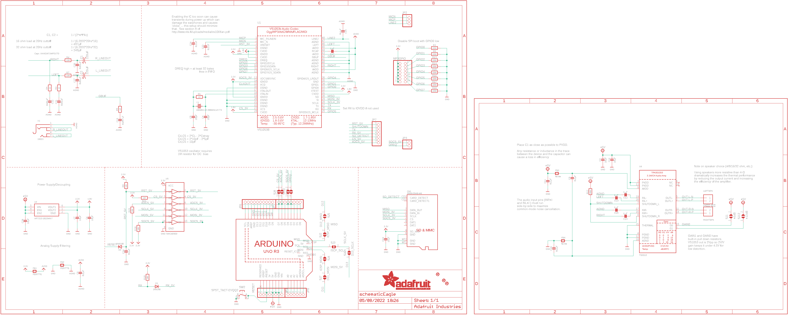
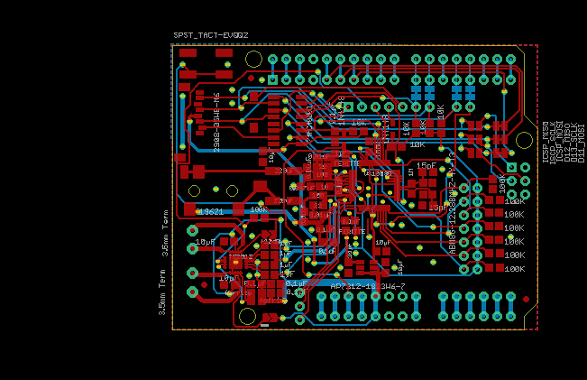
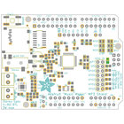
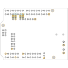
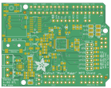

Contents
========

* [PRA1788 > Adafruit Music Maker MP3 Shield PCB](#pra1788--adafruit-music-maker-mp3-shield-pcb)
	* [Schematic](#schematic)
	* [PCB](#pcb)
	* [Interactive BOM](#interactive-bom)
	* [OOMP Parts](#oomp-parts)
	* [Images](#images)
	* [Tags](#tags)
  
![][im]
# PRA1788 > Adafruit Music Maker MP3 Shield PCB

- ID: PROJ-ADAF-1788-STAN-01
- Hex ID: PRA1788
- Name: Adafruit
- Description: Adafruit
- Long Link: [http://oom.lt/PROJ-ADAF-1788-STAN-01](http://oom.lt/PROJ-ADAF-1788-STAN-01)
- Short Link: [http://oom.lt/PRA1788](http://oom.lt/PRA1788)

## Schematic
  

## PCB
  

## Interactive BOM

- Interactive BOM page: [ibom.html](https://htmlpreview.github.io/?https://github.com/oomlout/oomlout_OOMP_projects/blob/main/PROJ-ADAF-1788-STAN-01/kicad/bom/ibom.html)

## OOMP Parts
  

|OOMP Parts|
| :---: |
|CAPE-PANC-X-UF220-01 C1, C2|
|[CAPC-0805-X-UF10-V10  SMD (0805) 10 uF Capacitor (Ceramic) 10v  C3, C6, C7, C16, C19, C20](https://github.com/oomlout/oomlout_OOMP_parts/tree/main/CAPC-0805-X-UF10-V10/)|
|CAPC-0805-X-PF15-01 C4, C5|
|[CAPC-0805-X-NF100-V50  SMD (0805) 100 nF Capacitor (Ceramic) 50v  C8, C9, C10, C11, C23, C25, C26](https://github.com/oomlout/oomlout_OOMP_parts/tree/main/CAPC-0805-X-NF100-V50/)|
|[CAPC-0805-X-UF1-V25  SMD (0805) 1 uF Capacitor (Ceramic) 25v  C12, C13, C14, C15, C17](https://github.com/oomlout/oomlout_OOMP_parts/tree/main/CAPC-0805-X-UF1-V25/)|
|CAPC-0805-X-UF47-01 C18|
|CAPC-0805-X-UNMATCHED-01 C21, C22, C27, C28|
|CAPC-UNMATCHED-X-NF100-01 C24|
|UNMATCHED-UNMATCHED-X-UNMATCHED-01 CN1, U$41, U1, U4, U5, X1, Y1|
|[DIOD-S323-X-K4148-01  SMD (SOD-323) Diode  D1, D2](https://github.com/oomlout/oomlout_OOMP_parts/tree/main/DIOD-S323-X-K4148-01/)|
|FERB-0805-X-UNMATCHED-01 FB1, FB2, FB3, FB4|
|[HEAD-I01-X-PI08-01  2.54 mm 8 Pin Header  JP1, JP4](https://github.com/oomlout/oomlout_OOMP_parts/tree/main/HEAD-I01-X-PI08-01/)|
|[HEAD-I01-X-PI03-01  2.54 mm 3 Pin Header  JP2](https://github.com/oomlout/oomlout_OOMP_parts/tree/main/HEAD-I01-X-PI03-01/)|
|[HEAD-I01-X-PI02-01  2.54 mm 2 Pin Header  JP3](https://github.com/oomlout/oomlout_OOMP_parts/tree/main/HEAD-I01-X-PI02-01/)|
|[HEAD-I01-X-PI10-01  2.54 mm 10 Pin Header  JP6](https://github.com/oomlout/oomlout_OOMP_parts/tree/main/HEAD-I01-X-PI10-01/)|
|[HEAD-I01-X-PI07-01  2.54 mm 7 Pin Header  JP7](https://github.com/oomlout/oomlout_OOMP_parts/tree/main/HEAD-I01-X-PI07-01/)|
|[HEAD-I01-X-PI06-01  2.54 mm 6 Pin Header  JP8](https://github.com/oomlout/oomlout_OOMP_parts/tree/main/HEAD-I01-X-PI06-01/)|
|[TERS-35D-L-PI02-01  3.5 mm 2 Pin Blue Screw Terminal  LEFTSPK, RIGHTSPK](https://github.com/oomlout/oomlout_OOMP_parts/tree/main/TERS-35D-L-PI02-01/)|
|HEAD-I01-X-PI2X07-01 MP3GPIO|
|RESE-0805-X-O105-01 R1|
|RESE-0805-X-O1003-01 R2, R8, R12, R13, R14, R15, R16, R17, R18|
|[RESE-0805-X-O220-01  SMD (0805) 22 Ohm Resistor  R3, R4](https://github.com/oomlout/oomlout_OOMP_parts/tree/main/RESE-0805-X-O220-01/)|
|RESE-0805-X-O100-01 R5|
|[RESE-0805-X-O101-01  SMD (0805) 100 Ohm Resistor  R6, R7](https://github.com/oomlout/oomlout_OOMP_parts/tree/main/RESE-0805-X-O101-01/)|
|[RESE-0805-X-O103-01  SMD (0805) 10k Ohm Resistor  R9, R10, R19, R20, R21](https://github.com/oomlout/oomlout_OOMP_parts/tree/main/RESE-0805-X-O103-01/)|
|[BUTA-6060-X-STAN-01  SMD (6060) Pushbutton (Tactile)  SW2](https://github.com/oomlout/oomlout_OOMP_parts/tree/main/BUTA-6060-X-STAN-01/)|
|UNMATCHED-SO23-X-UNMATCHED-01 U2|

## Images
  
  

|bominteractivefront|bominteractiveback|kicadPcb3d|kicadPcb3dFront|kicadPcb3dBack|eagleImage|eagleSchemImage|pcbdraw|pcbdrawback|
| :---: | :---: | :---: | :---: | :---: | :---: | :---: | :---: | :---: |
||||||||||

## Tags

- hexID: PRA1788
- oompType: PROJ
- oompSize: ADAF
- oompColor: 1788
- oompDesc: STAN
- oompIndex: 01
- oompName: Adafruit Music Maker MP3 Shield PCB
- sources: All source files from https://github.com/adafruit/Adafruit-Music-Maker-MP3-Shield-PCB (source licence details in srcLicense.md)
- linkBuyPage: http://www.adafruit.com/products/1788
- oompID: PROJ-ADAF-1788-STAN-01
- oompParts: C1,CAPE-PANC-X-UF220-01
- oompParts: C2,CAPE-PANC-X-UF220-01
- oompParts: C3,CAPC-0805-X-UF10-V10
- oompParts: C4,CAPC-0805-X-PF15-01
- oompParts: C5,CAPC-0805-X-PF15-01
- oompParts: C6,CAPC-0805-X-UF10-V10
- oompParts: C7,CAPC-0805-X-UF10-V10
- oompParts: C8,CAPC-0805-X-NF100-V50
- oompParts: C9,CAPC-0805-X-NF100-V50
- oompParts: C10,CAPC-0805-X-NF100-V50
- oompParts: C11,CAPC-0805-X-NF100-V50
- oompParts: C12,CAPC-0805-X-UF1-V25
- oompParts: C13,CAPC-0805-X-UF1-V25
- oompParts: C14,CAPC-0805-X-UF1-V25
- oompParts: C15,CAPC-0805-X-UF1-V25
- oompParts: C16,CAPC-0805-X-UF10-V10
- oompParts: C17,CAPC-0805-X-UF1-V25
- oompParts: C18,CAPC-0805-X-UF47-01
- oompParts: C19,CAPC-0805-X-UF10-V10
- oompParts: C20,CAPC-0805-X-UF10-V10
- oompParts: C21,CAPC-0805-X-UNMATCHED-01
- oompParts: C22,CAPC-0805-X-UNMATCHED-01
- oompParts: C23,CAPC-0805-X-NF100-V50
- oompParts: C24,CAPC-UNMATCHED-X-NF100-01
- oompParts: C25,CAPC-0805-X-NF100-V50
- oompParts: C26,CAPC-0805-X-NF100-V50
- oompParts: C27,CAPC-0805-X-UNMATCHED-01
- oompParts: C28,CAPC-0805-X-UNMATCHED-01
- oompParts: CN1,UNMATCHED-UNMATCHED-X-UNMATCHED-01
- oompParts: D1,DIOD-S323-X-K4148-01
- oompParts: D2,DIOD-S323-X-K4148-01
- oompParts: FB1,FERB-0805-X-UNMATCHED-01
- oompParts: FB2,FERB-0805-X-UNMATCHED-01
- oompParts: FB3,FERB-0805-X-UNMATCHED-01
- oompParts: FB4,FERB-0805-X-UNMATCHED-01
- oompParts: JP1,HEAD-I01-X-PI08-01
- oompParts: JP2,HEAD-I01-X-PI03-01
- oompParts: JP3,HEAD-I01-X-PI02-01
- oompParts: JP4,HEAD-I01-X-PI08-01
- oompParts: JP6,HEAD-I01-X-PI10-01
- oompParts: JP7,HEAD-I01-X-PI07-01
- oompParts: JP8,HEAD-I01-X-PI06-01
- oompParts: LEFTSPK,TERS-35D-L-PI02-01
- oompParts: MP3GPIO,HEAD-I01-X-PI2X07-01
- oompParts: R1,RESE-0805-X-O105-01
- oompParts: R2,RESE-0805-X-O1003-01
- oompParts: R3,RESE-0805-X-O220-01
- oompParts: R4,RESE-0805-X-O220-01
- oompParts: R5,RESE-0805-X-O100-01
- oompParts: R6,RESE-0805-X-O101-01
- oompParts: R7,RESE-0805-X-O101-01
- oompParts: R8,RESE-0805-X-O1003-01
- oompParts: R9,RESE-0805-X-O103-01
- oompParts: R10,RESE-0805-X-O103-01
- oompParts: R12,RESE-0805-X-O1003-01
- oompParts: R13,RESE-0805-X-O1003-01
- oompParts: R14,RESE-0805-X-O1003-01
- oompParts: R15,RESE-0805-X-O1003-01
- oompParts: R16,RESE-0805-X-O1003-01
- oompParts: R17,RESE-0805-X-O1003-01
- oompParts: R18,RESE-0805-X-O1003-01
- oompParts: R19,RESE-0805-X-O103-01
- oompParts: R20,RESE-0805-X-O103-01
- oompParts: R21,RESE-0805-X-O103-01
- oompParts: RIGHTSPK,TERS-35D-L-PI02-01
- oompParts: SW2,BUTA-6060-X-STAN-01
- oompParts: U$41,UNMATCHED-UNMATCHED-X-UNMATCHED-01
- oompParts: U1,UNMATCHED-UNMATCHED-X-UNMATCHED-01
- oompParts: U2,UNMATCHED-SO23-X-UNMATCHED-01
- oompParts: U4,UNMATCHED-UNMATCHED-X-UNMATCHED-01
- oompParts: U5,UNMATCHED-UNMATCHED-X-UNMATCHED-01
- oompParts: X1,UNMATCHED-UNMATCHED-X-UNMATCHED-01
- oompParts: Y1,UNMATCHED-UNMATCHED-X-UNMATCHED-01
- rawParts: C1,220uF,CPOL-USC,PANASONIC_C,POLARIZED CAPACITOR, American symbol,,
- rawParts: C2,220uF,CPOL-USC,PANASONIC_C,POLARIZED CAPACITOR, American symbol,,
- rawParts: C3,10µF,CAP_CERAMIC0805-NOOUTLINE,0805-NO,Ceramic Capacitors,,
- rawParts: C4,15pF,CAP_CERAMIC0805-NOOUTLINE,0805-NO,Ceramic Capacitors,,
- rawParts: C5,15pF,CAP_CERAMIC0805-NOOUTLINE,0805-NO,Ceramic Capacitors,,
- rawParts: C6,10µF,CAP_CERAMIC0805-NOOUTLINE,0805-NO,Ceramic Capacitors,,
- rawParts: C7,10µF,CAP_CERAMIC0805-NOOUTLINE,0805-NO,Ceramic Capacitors,,
- rawParts: C8,0.1µF,CAP_CERAMIC_0805MP,_0805MP,Ceramic Capacitors,,
- rawParts: C9,0.1µF,CAP_CERAMIC0805-NOOUTLINE,0805-NO,Ceramic Capacitors,,
- rawParts: C10,0.1µF,CAP_CERAMIC0805-NOOUTLINE,0805-NO,Ceramic Capacitors,,
- rawParts: C11,0.1µF,CAP_CERAMIC0805-NOOUTLINE,0805-NO,Ceramic Capacitors,,
- rawParts: C12,1µF,CAP_CERAMIC0805-NOOUTLINE,0805-NO,Ceramic Capacitors,,
- rawParts: C13,1µF,CAP_CERAMIC0805-NOOUTLINE,0805-NO,Ceramic Capacitors,,
- rawParts: C14,1µF,CAP_CERAMIC0805-NOOUTLINE,0805-NO,Ceramic Capacitors,,
- rawParts: C15,1µF,CAP_CERAMIC0805-NOOUTLINE,0805-NO,Ceramic Capacitors,,
- rawParts: C16,10µF,CAP_CERAMIC0805-NOOUTLINE,0805-NO,Ceramic Capacitors,,
- rawParts: C17,1µF,CAP_CERAMIC0805-NOOUTLINE,0805-NO,Ceramic Capacitors,,
- rawParts: C18,0.047uF,CAP_CERAMIC0805-NOOUTLINE,0805-NO,Ceramic Capacitors,,
- rawParts: C19,10µF,CAP_CERAMIC_0805MP,_0805MP,Ceramic Capacitors,,
- rawParts: C20,10µF,CAP_CERAMIC0805-NOOUTLINE,0805-NO,Ceramic Capacitors,,
- rawParts: C21,0.01uF,CAP_CERAMIC0805-NOOUTLINE,0805-NO,Ceramic Capacitors,,
- rawParts: C22,0.01uF,CAP_CERAMIC_0805MP,_0805MP,Ceramic Capacitors,,
- rawParts: C23,0.1uF,CAP_CERAMIC0805-NOOUTLINE,0805-NO,Ceramic Capacitors,,
- rawParts: C24,0.1uF,CAP_CERAMIC0805_10MGAP,0805_10MGAP,Ceramic Capacitors,,
- rawParts: C25,0.1uF,CAP_CERAMIC0805-NOOUTLINE,0805-NO,Ceramic Capacitors,,
- rawParts: C26,0.1µF,CAP_CERAMIC_0805MP,_0805MP,Ceramic Capacitors,,
- rawParts: C27,0.01uF,CAP_CERAMIC0805-NOOUTLINE,0805-NO,Ceramic Capacitors,,
- rawParts: C28,0.01uF,CAP_CERAMIC0805-NOOUTLINE,0805-NO,Ceramic Capacitors,,
- rawParts: CN1,2908-05WB-M6,MICROSD,MICROSD,MicroSD/Transflash Card Holder with SPI pinout,,
- rawParts: D1,1N4148,DIODESOD-323,SOD-323,Diode,,
- rawParts: D2,1N4148,DIODESOD-323,SOD-323,Diode,,
- rawParts: FB1,FERITTE,FERRITE_0805MP,_0805MP,Ferrite Bead,,
- rawParts: FB2,FERITTE,FERRITE_0805MP,_0805MP,Ferrite Bead,,
- rawParts: FB3,ferrite,FERRITE_0805MP,_0805MP,Ferrite Bead,,
- rawParts: FB4,ferrite,FERRITE_0805MP,_0805MP,Ferrite Bead,,
- rawParts: FID1,FIDUCIAL,FIDUCIAL,FIDUCIAL_1MM,Fiducial Alignment Points,EXCLUDE,
- rawParts: FID2,FIDUCIAL,FIDUCIAL,FIDUCIAL_1MM,Fiducial Alignment Points,EXCLUDE,
- rawParts: FID3,FIDUCIAL,FIDUCIAL,FIDUCIAL_1MM,Fiducial Alignment Points,EXCLUDE,
- rawParts: JP1,,PINHD-1X8CLEANBIG,1X08-CLEANBIG,PIN HEADER,,
- rawParts: JP2,,PINHD-1X3CB,1X03-CLEANBIG,PIN HEADER,,
- rawParts: JP3,,HEADER-1X2ROUND,1X02_ROUND,PIN HEADER,,
- rawParts: JP4,,PINHD-1X8CLEANBIG,1X08-CLEANBIG,PIN HEADER,,
- rawParts: JP6,,HEADER-1X1070MIL,1X10_ROUND70,PIN HEADER,,
- rawParts: JP7,,HEADER-1X770MIL,1X07_ROUND_70,PIN HEADER,,
- rawParts: JP8,,PINHD-1X6CB,1X06-CLEANBIG,PIN HEADER,,
- rawParts: LEFTSPK,3.5mm Term,TERMBLOCK_1X2,TERMBLOCK_1X2-3.5MM,3.5mm Terminal block,,
- rawParts: MP3GPIO,,HEADER-2X7_ROUND_70MIL,2X07_ROUND_70MIL,PIN HEADER,,
- rawParts: R1,1M,RESISTOR0805_NOOUTLINE,0805-NO,Resistors,,
- rawParts: R2,100K,RESISTOR0805_NOOUTLINE,0805-NO,Resistors,,
- rawParts: R3,22,RESISTOR0805_NOOUTLINE,0805-NO,Resistors,,
- rawParts: R4,22,RESISTOR_0805MP,_0805MP,Resistors,,
- rawParts: R5,10,RESISTOR0805_NOOUTLINE,0805-NO,Resistors,,
- rawParts: R6,100,RESISTOR_0805MP,_0805MP,Resistors,,
- rawParts: R7,100,RESISTOR0805_NOOUTLINE,0805-NO,Resistors,,
- rawParts: R8,100K,RESISTOR0805_NOOUTLINE,0805-NO,Resistors,,
- rawParts: R9,10K,RESISTOR_0805MP,_0805MP,Resistors,,
- rawParts: R10,10K,RESISTOR_0805MP,_0805MP,Resistors,,
- rawParts: R12,100K,RESISTOR_0805MP,_0805MP,Resistors,,
- rawParts: R13,100K,RESISTOR0805_NOOUTLINE,0805-NO,Resistors,,
- rawParts: R14,100K,RESISTOR0805_NOOUTLINE,0805-NO,Resistors,,
- rawParts: R15,100K,RESISTOR0805_NOOUTLINE,0805-NO,Resistors,,
- rawParts: R16,100K,RESISTOR0805_NOOUTLINE,0805-NO,Resistors,,
- rawParts: R17,100K,RESISTOR0805_NOOUTLINE,0805-NO,Resistors,,
- rawParts: R18,100K,RESISTOR0805_NOOUTLINE,0805-NO,Resistors,,
- rawParts: R19,10K,RESISTOR0805_NOOUTLINE,0805-NO,Resistors,,
- rawParts: R20,10K,RESISTOR0805_NOOUTLINE,0805-NO,Resistors,,
- rawParts: R21,10K,RESISTOR0805_NOOUTLINE,0805-NO,Resistors,,
- rawParts: RIGHTSPK,3.5mm Term,TERMBLOCK_1X2,TERMBLOCK_1X2-3.5MM,3.5mm Terminal block,,
- rawParts: SJ1,+6dB,SOLDERJUMPER,SOLDERJUMPER_ARROW_NOPASTE,SMD Solder JUMPER,EXCLUDE,
- rawParts: SJ2,ICSP_MISO,SOLDERJUMPERREFLOW_NOPASTE,SOLDERJUMPER_REFLOW_NOPASTE,SMD Solder JUMPER,,
- rawParts: SJ3,ISCP_SCLK,SOLDERJUMPERREFLOW_NOPASTE,SOLDERJUMPER_REFLOW_NOPASTE,SMD Solder JUMPER,,
- rawParts: SJ4,ICSP_MOSI,SOLDERJUMPERREFLOW_NOPASTE,SOLDERJUMPER_REFLOW_NOPASTE,SMD Solder JUMPER,,
- rawParts: SJ5,D12_MISO,SOLDERJUMPERCLOSED,SOLDERJUMPER_CLOSEDWIRE,SMD Solder JUMPER,,
- rawParts: SJ6,D13_SCLK,SOLDERJUMPERCLOSED,SOLDERJUMPER_CLOSEDWIRE,SMD Solder JUMPER,,
- rawParts: SJ7,D11_MOSI,SOLDERJUMPERCLOSED,SOLDERJUMPER_CLOSEDWIRE,SMD Solder JUMPER,,
- rawParts: SJ8,,SOLDERJUMPERCLOSED,SOLDERJUMPER_CLOSEDWIRE,SMD Solder JUMPER,,
- rawParts: SJ9,,SOLDERJUMPERCLOSED,SOLDERJUMPER_CLOSEDWIRE,SMD Solder JUMPER,,
- rawParts: SJ10,,SOLDERJUMPERCLOSED,SOLDERJUMPER_CLOSEDWIRE,SMD Solder JUMPER,,
- rawParts: SJ11,,SOLDERJUMPERCLOSED,SOLDERJUMPER_CLOSEDWIRE,SMD Solder JUMPER,,
- rawParts: SJ12,+12dB,SOLDERJUMPER,SOLDERJUMPER_ARROW_NOPASTE,SMD Solder JUMPER,EXCLUDE,
- rawParts: SW2,SPST_TACT-EVQQ2,SPST_TACT-EVQQ2,EVQ-Q2,SMT 6mm switch, EVQQ2 series,,
- rawParts: U$41,ARDUINO_R3_ICSP,ARDUINO_R3_ICSP,ARDUINOR3_ICSP,,,
- rawParts: U1,VS1053B,VS1053B,LQFP48,VS1053b Audio Codec - Ogg Vorbis/MP3/AAC/WMA/FLAC/MIDI,,
- rawParts: U2,AP7312-1833W6-7,VREG_SOT23-6_DUALAP7312,SOT23-6,Dual Output SOT23-6 Linear Regulators,,
- rawParts: U4,TS2012,AUDIOAMP_TPA2012D2,WQFN20,TPA2012D2 2.1W/CH Stereo Class-D Audio Amp,,
- rawParts: U5,74HC4050D,74HC4050D,SOIC16,6-channel level shifter,,
- rawParts: X1,19621,AUDIO_3.5MMJACK,4UCONN_19269,3.5MM Audio Jack,,
- rawParts: Y1,ABM8G-12.288MHZ-4Y-T3,CRYSTAL3.2X2.5,CRYSTAL_3.2X2.5,Crystals,,

[im]: kicadPcb3d_450.png
