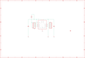

Contents
========

* [PRA1875 > Adafruit TXB0104 Level Shifter Breakout PCB](#pra1875--adafruit-txb0104-level-shifter-breakout-pcb)
	* [Schematic](#schematic)
	* [PCB](#pcb)
	* [Interactive BOM](#interactive-bom)
	* [OOMP Parts](#oomp-parts)
	* [Images](#images)
	* [Tags](#tags)
  
![][im]
# PRA1875 > Adafruit TXB0104 Level Shifter Breakout PCB

- ID: PROJ-ADAF-1875-STAN-01
- Hex ID: PRA1875
- Name: Adafruit
- Description: Adafruit
- Long Link: [http://oom.lt/PROJ-ADAF-1875-STAN-01](http://oom.lt/PROJ-ADAF-1875-STAN-01)
- Short Link: [http://oom.lt/PRA1875](http://oom.lt/PRA1875)

## Schematic
  

## PCB
  

## Interactive BOM

- Interactive BOM page: [ibom.html](https://htmlpreview.github.io/?https://github.com/oomlout/oomlout_OOMP_projects/blob/main/PROJ-ADAF-1875-STAN-01/kicad/bom/ibom.html)

## OOMP Parts
  

|OOMP ID|Name|Identifier|
| :---: | :---: | :---: |
|[CAPC-0805-X-NF100-V50](https://github.com/oomlout/oomlout_OOMP_parts/tree/main/CAPC-0805-X-NF100-V50/)|[SMD (0805) 100 nF Capacitor (Ceramic) 50v](https://github.com/oomlout/oomlout_OOMP_parts/tree/main/CAPC-0805-X-NF100-V50/)|[C1, C2](https://github.com/oomlout/oomlout_OOMP_parts/tree/main/CAPC-0805-X-NF100-V50/)|
|[HEAD-I01-X-PI06-01](https://github.com/oomlout/oomlout_OOMP_parts/tree/main/HEAD-I01-X-PI06-01/)|[2.54 mm 6 Pin Header](https://github.com/oomlout/oomlout_OOMP_parts/tree/main/HEAD-I01-X-PI06-01/)|[JP3, JP4](https://github.com/oomlout/oomlout_OOMP_parts/tree/main/HEAD-I01-X-PI06-01/)|
|[RESE-0805-X-O103-01](https://github.com/oomlout/oomlout_OOMP_parts/tree/main/RESE-0805-X-O103-01/)|[SMD (0805) 10k Ohm Resistor](https://github.com/oomlout/oomlout_OOMP_parts/tree/main/RESE-0805-X-O103-01/)|[R1](https://github.com/oomlout/oomlout_OOMP_parts/tree/main/RESE-0805-X-O103-01/)|
|UNMATCHED-UNMATCHED-X-UNMATCHED-01||U2|

## Images
  
  

|bominteractivefront|bominteractiveback|kicadPcb3d|kicadPcb3dFront|kicadPcb3dBack|eagleImage|eagleSchemImage|pcbdraw|pcbdrawback|
| :---: | :---: | :---: | :---: | :---: | :---: | :---: | :---: | :---: |
||||||||||

## Tags

- hexID: PRA1875
- oompType: PROJ
- oompSize: ADAF
- oompColor: 1875
- oompDesc: STAN
- oompIndex: 01
- oompName: Adafruit TXB0104 Level Shifter Breakout PCB
- sources: All source files from https://github.com/adafruit/Adafruit-TXB0104-Level-Shifter-Breakout-PCB (source licence details in srcLicense.md)
- linkBuyPage: http://www.adafruit.com/products/1875
- oompID: PROJ-ADAF-1875-STAN-01
- oompParts: C1,CAPC-0805-X-NF100-V50
- oompParts: C2,CAPC-0805-X-NF100-V50
- oompParts: JP3,HEAD-I01-X-PI06-01
- oompParts: JP4,HEAD-I01-X-PI06-01
- oompParts: R1,RESE-0805-X-O103-01
- oompParts: U2,UNMATCHED-UNMATCHED-X-UNMATCHED-01
- rawParts: C1,0.1uF,CAP_CERAMIC0805-NOOUTLINE,0805-NO,Ceramic Capacitors,,
- rawParts: C2,0.1uF,CAP_CERAMIC0805-NOOUTLINE,0805-NO,Ceramic Capacitors,,
- rawParts: JP3,,PINHD-1X6CB,1X06-CLEANBIG,PIN HEADER,,
- rawParts: JP4,,PINHD-1X6CB,1X06-CLEANBIG,PIN HEADER,,
- rawParts: R1,10K,RESISTOR0805_NOOUTLINE,0805-NO,Resistors,,
- rawParts: U$5,FIDUCIAL_1MM,FIDUCIAL_1MM,FIDUCIAL_1MM,Fiducial Alignment Points,EXCLUDE,
- rawParts: U2,,TXB0104PWR,TSSOP14,4-Bit Bi-Directional Level Shifter,,

[im]: kicadPcb3d_450.png
