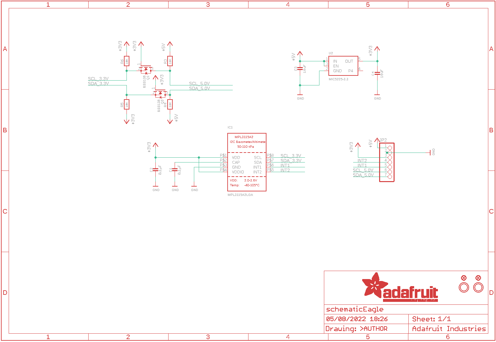
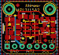

Contents
========

* [PRA1893 > Adafruit MPL3115A2 PCB](#pra1893--adafruit-mpl3115a2-pcb)
	* [Schematic](#schematic)
	* [PCB](#pcb)
	* [Interactive BOM](#interactive-bom)
	* [OOMP Parts](#oomp-parts)
	* [Images](#images)
	* [Tags](#tags)
  
![][im]
# PRA1893 > Adafruit MPL3115A2 PCB

- ID: PROJ-ADAF-1893-STAN-01
- Hex ID: PRA1893
- Name: Adafruit
- Description: Adafruit
- Long Link: [http://oom.lt/PROJ-ADAF-1893-STAN-01](http://oom.lt/PROJ-ADAF-1893-STAN-01)
- Short Link: [http://oom.lt/PRA1893](http://oom.lt/PRA1893)

## Schematic
  

## PCB
  

## Interactive BOM

- Interactive BOM page: [ibom.html](https://htmlpreview.github.io/?https://github.com/oomlout/oomlout_OOMP_projects/blob/main/PROJ-ADAF-1893-STAN-01/kicad/bom/ibom.html)

## OOMP Parts
  

|OOMP Parts|
| :---: |
|CAPC-0805-X-UF1D-01 C1, C2|
|[CAPC-0805-X-UF10-V10  SMD (0805) 10 uF Capacitor (Ceramic) 10v  C3, C4](https://github.com/oomlout/oomlout_OOMP_parts/tree/main/CAPC-0805-X-UF10-V10/)|
|UNMATCHED-UNMATCHED-X-UNMATCHED-01 IC1|
|[HEAD-I01-X-PI07-01  2.54 mm 7 Pin Header  JP2](https://github.com/oomlout/oomlout_OOMP_parts/tree/main/HEAD-I01-X-PI07-01/)|
|[MOSN-SO23-X-KBSS138-01  SMD (SOT-23) BSS138 N-Ch. MOSFET  Q1, Q2](https://github.com/oomlout/oomlout_OOMP_parts/tree/main/MOSN-SO23-X-KBSS138-01/)|
|[RESE-0805-X-O103-01  SMD (0805) 10k Ohm Resistor  R3, R4, R5, R6](https://github.com/oomlout/oomlout_OOMP_parts/tree/main/RESE-0805-X-O103-01/)|
|[VREG-SO235-X-KMIC5225-V33D  SMD (SOT-23-5) MIC5225 Voltage Regulator 3.3v  U2](https://github.com/oomlout/oomlout_OOMP_parts/tree/main/VREG-SO235-X-KMIC5225-V33D/)|

## Images
  
  

|kicadPcb3d|kicadPcb3dFront|kicadPcb3dBack|eagleImage|eagleSchemImage|
| :---: | :---: | :---: | :---: | :---: |
||||||

## Tags

- hexID: PRA1893
- oompType: PROJ
- oompSize: ADAF
- oompColor: 1893
- oompDesc: STAN
- oompIndex: 01
- oompName: Adafruit MPL3115A2 PCB
- sources: All source files from https://github.com/adafruit/Adafruit-MPL3115A2-PCB (source licence details in srcLicense.md)
- linkBuyPage: http://www.adafruit.com/products/1893
- oompID: PROJ-ADAF-1893-STAN-01
- oompParts: C1,CAPC-0805-X-UF1D-01
- oompParts: C2,CAPC-0805-X-UF1D-01
- oompParts: C3,CAPC-0805-X-UF10-V10
- oompParts: C4,CAPC-0805-X-UF10-V10
- oompParts: IC1,UNMATCHED-UNMATCHED-X-UNMATCHED-01
- oompParts: JP2,HEAD-I01-X-PI07-01
- oompParts: Q1,MOSN-SO23-X-KBSS138-01
- oompParts: Q2,MOSN-SO23-X-KBSS138-01
- oompParts: R3,RESE-0805-X-O103-01
- oompParts: R4,RESE-0805-X-O103-01
- oompParts: R5,RESE-0805-X-O103-01
- oompParts: R6,RESE-0805-X-O103-01
- oompParts: U2,VREG-SO235-X-KMIC5225-V33D
- rawParts: C1,0.1µF,CAP_CERAMIC0805-NOOUTLINE,0805-NO,Ceramic Capacitors,,
- rawParts: C2,0.1µF,CAP_CERAMIC0805-NOOUTLINE,0805-NO,Ceramic Capacitors,,
- rawParts: C3,10uF,CAP_CERAMIC0805-NOOUTLINE,0805-NO,Ceramic Capacitors,,
- rawParts: C4,10uF,CAP_CERAMIC0805-NOOUTLINE,0805-NO,Ceramic Capacitors,,
- rawParts: FID1,FIDUCIAL,FIDUCIAL,FIDUCIAL_1MM,Fiducial Alignment Points,EXCLUDE,
- rawParts: FID2,FIDUCIAL,FIDUCIAL,FIDUCIAL_1MM,Fiducial Alignment Points,EXCLUDE,
- rawParts: IC1,MPL3115A2LGA,MPL3115A2LGA,LGA8,,,
- rawParts: JP2,,HEADER-1X770MIL,1X07_ROUND_70,PIN HEADER,,
- rawParts: Q1,BSS138,MOSFET-NWIDE,SOT23-WIDE,N-Channel Mosfet,,
- rawParts: Q2,BSS138,MOSFET-NWIDE,SOT23-WIDE,N-Channel Mosfet,,
- rawParts: R3,10K,RESISTOR0805_NOOUTLINE,0805-NO,Resistors,,
- rawParts: R4,10K,RESISTOR0805_NOOUTLINE,0805-NO,Resistors,,
- rawParts: R5,10K,RESISTOR0805_NOOUTLINE,0805-NO,Resistors,,
- rawParts: R6,10K,RESISTOR0805_NOOUTLINE,0805-NO,Resistors,,
- rawParts: U$8,MOUNTINGHOLE2.5,MOUNTINGHOLE2.5,MOUNTINGHOLE_2.5_PLATED,Mounting Hole,EXCLUDE,
- rawParts: U$9,MOUNTINGHOLE2.5,MOUNTINGHOLE2.5,MOUNTINGHOLE_2.5_PLATED,Mounting Hole,EXCLUDE,
- rawParts: U2,MIC5225-3.3,VREG_SOT23-5,SOT23-5,SOT23-5 Fixed Voltage Regulators,,

[im]: kicadPcb3d_450.png
