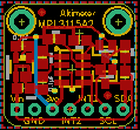
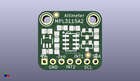
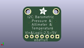
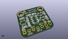

Contents
========

* [PROJ-ADAF-1893-STAN-01>Adafruit MPL3115A2 PCB](#proj-adaf-1893-stan-01adafruit-mpl3115a2-pcb)
	* [Images](#images)
	* [Interactive BOM](#interactive-bom)
	* [OOMP Parts](#oomp-parts)
	* [Tags](#tags)
  
![][im]
# PROJ-ADAF-1893-STAN-01>Adafruit MPL3115A2 PCB

- ID: PROJ-ADAF-1893-STAN-01
- Hex ID: PRA1893
- Name: Adafruit MPL3115A2 PCB
- Description: 

## Images
  
  

|eagleImage|kicadPcb3dFront|kicadPcb3dBack|kicadPcb3d|
| :---: | :---: | :---: | :---: |
|||||

## Interactive BOM

- Interactive BOM page: [ibom.html](kicad/bom/ibom.html)

## OOMP Parts
  

|OOMP Parts|
| :---: |
|<table><tr><td></td><td> C1</td><td>[CAPC-0805-X-NF100-V50 SMD (0805) 100 nF Capacitor (Ceramic) 50v](https://github.com/oomlout/oomlout_OOMP_parts/tree/main/CAPC-0805-X-NF100-V50/)</td><td>[C85N100](https://github.com/oomlout/oomlout_OOMP_parts/tree/main/CAPC-0805-X-NF100-V50/)</td></tr></table>|
|<table><tr><td></td><td> C2</td><td>[CAPC-0805-X-NF100-V50 SMD (0805) 100 nF Capacitor (Ceramic) 50v](https://github.com/oomlout/oomlout_OOMP_parts/tree/main/CAPC-0805-X-NF100-V50/)</td><td>[C85N100](https://github.com/oomlout/oomlout_OOMP_parts/tree/main/CAPC-0805-X-NF100-V50/)</td></tr></table>|
|CAPC-0805-X-UNMATCHED-01, C3, 2.794, 5.588, 0,C3, 10uF, 0805-NO, microbuilder, (0.11, 0.22), R0|
|CAPC-0805-X-UNMATCHED-01, C4, 5.588, 10.033, 270,C4, 10uF, 0805-NO, microbuilder, (0.22, 0.395), R270|
|UNMATCHED-UNMATCHED-X-UNMATCHED-01, IC1, 9.779, 8.382, 0,IC1, MPL3115A2LGA, LGA8, microbuilder, (0.385, 0.33), R0|
|<table><tr><td></td><td> JP2</td><td>[HEAD-I01-X-PI07-01 2.54 mm 7 Pin Header](https://github.com/oomlout/oomlout_OOMP_parts/tree/main/HEAD-I01-X-PI07-01/)</td><td>[H07](https://github.com/oomlout/oomlout_OOMP_parts/tree/main/HEAD-I01-X-PI07-01/)</td></tr></table>|
|UNMATCHED-UNMATCHED-X-UNMATCHED-01, Q1, 14.604999999999999, 10.921999999999999, 180,Q1, BSS138, SOT23-WIDE, microbuilder, (0.575, 0.43), R180|
|UNMATCHED-UNMATCHED-X-UNMATCHED-01, Q2, 14.604999999999999, 7.238999999999999, 180,Q2, BSS138, SOT23-WIDE, microbuilder, (0.575, 0.285), R180|
|<table><tr><td></td><td> R3</td><td>[RESE-0805-X-O103-01 SMD (0805) 10k Ohm Resistor](https://github.com/oomlout/oomlout_OOMP_parts/tree/main/RESE-0805-X-O103-01/)</td><td>[R85103](https://github.com/oomlout/oomlout_OOMP_parts/tree/main/RESE-0805-X-O103-01/)</td></tr></table>|
|<table><tr><td></td><td> R4</td><td>[RESE-0805-X-O103-01 SMD (0805) 10k Ohm Resistor](https://github.com/oomlout/oomlout_OOMP_parts/tree/main/RESE-0805-X-O103-01/)</td><td>[R85103](https://github.com/oomlout/oomlout_OOMP_parts/tree/main/RESE-0805-X-O103-01/)</td></tr></table>|
|<table><tr><td></td><td> R5</td><td>[RESE-0805-X-O103-01 SMD (0805) 10k Ohm Resistor](https://github.com/oomlout/oomlout_OOMP_parts/tree/main/RESE-0805-X-O103-01/)</td><td>[R85103](https://github.com/oomlout/oomlout_OOMP_parts/tree/main/RESE-0805-X-O103-01/)</td></tr></table>|
|<table><tr><td></td><td> R6</td><td>[RESE-0805-X-O103-01 SMD (0805) 10k Ohm Resistor](https://github.com/oomlout/oomlout_OOMP_parts/tree/main/RESE-0805-X-O103-01/)</td><td>[R85103](https://github.com/oomlout/oomlout_OOMP_parts/tree/main/RESE-0805-X-O103-01/)</td></tr></table>|
|UNMATCHED-UNMATCHED-X-UNMATCHED-01, U2, 2.667, 8.636000000000001, 0,U2, MIC5225-3.3, SOT23-5, microbuilder, (0.105, 0.34), R0|

## Tags

- hexID: PRA1893
- oompType: PROJ
- oompSize: ADAF
- oompColor: 1893
- oompDesc: STAN
- oompIndex: 01
- oompName: Adafruit MPL3115A2 PCB
- sources: All source files from https://github.com/adafruit/Adafruit-MPL3115A2-PCB (source licence details in srcLicense.md)
- linkBuyPage: http://www.adafruit.com/products/1893
- oompPart: CAPC-0805-X-NF100-V50, C1, 5.62299993, 6.395999907999999, 270
- oompPart: CAPC-0805-X-NF100-V50, C2, 2.667, 11.676000016, 0
- oompPart: CAPC-0805-X-UNMATCHED-01, C3, 2.794, 5.588, 0
- oompPart: CAPC-0805-X-UNMATCHED-01, C4, 5.588, 10.033, 270
- oompPart: SKIP-UNMATCHED-X-UNMATCHED-01, FID1, 14.925000122, 4.49999989, 0
- oompPart: SKIP-UNMATCHED-X-UNMATCHED-01, FID2, 5.434000054, 16.610000054, 0
- oompPart: UNMATCHED-UNMATCHED-X-UNMATCHED-01, IC1, 9.779, 8.382, 0
- oompPart: HEAD-I01-X-PI07-01, JP2, 9.524999999999999, 2.54, 0
- oompPart: UNMATCHED-UNMATCHED-X-UNMATCHED-01, Q1, 14.604999999999999, 10.921999999999999, 180
- oompPart: UNMATCHED-UNMATCHED-X-UNMATCHED-01, Q2, 14.604999999999999, 7.238999999999999, 180
- oompPart: RESE-0805-X-O103-01, R3, 17.399, 10.921999999999999, 270
- oompPart: RESE-0805-X-O103-01, R4, 17.399, 7.112, 270
- oompPart: RESE-0805-X-O103-01, R5, 7.238999999999999, 12.7, 0
- oompPart: RESE-0805-X-O103-01, R6, 10.921999999999999, 12.572999999999999, 180
- oompPart: SKIP-UNMATCHED-X-UNMATCHED-01, U$8, 2.54, 15.239999999999998, 0
- oompPart: SKIP-UNMATCHED-X-UNMATCHED-01, U$9, 16.509999999999998, 15.239999999999998, 0
- oompPart: UNMATCHED-UNMATCHED-X-UNMATCHED-01, U2, 2.667, 8.636000000000001, 0
- rawPart: C1, 0.1uF, 0805-NO, microbuilder, (0.22137795, 0.25181102), R270
- rawPart: C2, 0.1uF, 0805-NO, microbuilder, (0.105, 0.45968504), R0
- rawPart: C3, 10uF, 0805-NO, microbuilder, (0.11, 0.22), R0
- rawPart: C4, 10uF, 0805-NO, microbuilder, (0.22, 0.395), R270
- rawPart: FID1, FIDUCIAL, FIDUCIAL_1MM, microbuilder, (0.58759843, 0.17716535), R0
- rawPart: FID2, FIDUCIAL, FIDUCIAL_1MM, microbuilder, (0.21393701, 0.65393701), R0
- rawPart: IC1, MPL3115A2LGA, LGA8, microbuilder, (0.385, 0.33), R0
- rawPart: JP2, 1X07_ROUND_70, microbuilder, (0.375, 0.1), R0
- rawPart: Q1, BSS138, SOT23-WIDE, microbuilder, (0.575, 0.43), R180
- rawPart: Q2, BSS138, SOT23-WIDE, microbuilder, (0.575, 0.285), R180
- rawPart: R3, 10K, 0805-NO, microbuilder, (0.685, 0.43), R270
- rawPart: R4, 10K, 0805-NO, microbuilder, (0.685, 0.28), R270
- rawPart: R5, 10K, 0805-NO, microbuilder, (0.285, 0.5), R0
- rawPart: R6, 10K, 0805-NO, microbuilder, (0.43, 0.495), R180
- rawPart: U$8, MOUNTINGHOLE2.5, MOUNTINGHOLE_2.5_PLATED, microbuilder, (0.1, 0.6), R0
- rawPart: U$9, MOUNTINGHOLE2.5, MOUNTINGHOLE_2.5_PLATED, microbuilder, (0.65, 0.6), R0
- rawPart: U2, MIC5225-3.3, SOT23-5, microbuilder, (0.105, 0.34), R0
- oompID: PROJ-ADAF-1893-STAN-01

[im]: kicadPcb3d_450.png
