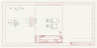
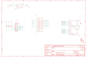

Contents
========

* [PRA1895 > Adafruit FRAM Breakout PCB](#pra1895--adafruit-fram-breakout-pcb)
	* [Schematic](#schematic)
	* [OOMP Parts](#oomp-parts)
	* [Images](#images)
	* [Tags](#tags)

# PRA1895 > Adafruit FRAM Breakout PCB

- ID: PROJ-ADAF-1895-STAN-01
- Hex ID: PRA1895
- Name: Adafruit 1895
- Description: Adafruit 1895
- Long Link: [http://oom.lt/PROJ-ADAF-1895-STAN-01](http://oom.lt/PROJ-ADAF-1895-STAN-01)
- Short Link: [http://oom.lt/PRA1895](http://oom.lt/PRA1895)

## Schematic
  

## OOMP Parts
  

|OOMP ID|Name|Identifier|
| :---: | :---: | :---: |
|[CAPC-0603-X-NF100-V50](https://github.com/oomlout/oomlout_OOMP_parts/tree/main/CAPC-0603-X-NF100-V50/)|[SMD (0603) 100 nF Capacitor (Ceramic) 50v](https://github.com/oomlout/oomlout_OOMP_parts/tree/main/CAPC-0603-X-NF100-V50/)|[C1](https://github.com/oomlout/oomlout_OOMP_parts/tree/main/CAPC-0603-X-NF100-V50/)|
|[CAPC-0805-X-UF10-V10](https://github.com/oomlout/oomlout_OOMP_parts/tree/main/CAPC-0805-X-UF10-V10/)|[SMD (0805) 10 uF Capacitor (Ceramic) 10v](https://github.com/oomlout/oomlout_OOMP_parts/tree/main/CAPC-0805-X-UF10-V10/)|[C3, C4](https://github.com/oomlout/oomlout_OOMP_parts/tree/main/CAPC-0805-X-UF10-V10/)|
|[HEAD-I01-X-PI09-01](https://github.com/oomlout/oomlout_OOMP_parts/tree/main/HEAD-I01-X-PI09-01/)|[2.54 mm 9 Pin Header](https://github.com/oomlout/oomlout_OOMP_parts/tree/main/HEAD-I01-X-PI09-01/)|[JP1](https://github.com/oomlout/oomlout_OOMP_parts/tree/main/HEAD-I01-X-PI09-01/)|
|[RESA-06038-X-O103X4-01](https://github.com/oomlout/oomlout_OOMP_parts/tree/main/RESA-06038-X-O103X4-01/)|[SMD (0603-8) 10k Ohm (x4) Resistor Array](https://github.com/oomlout/oomlout_OOMP_parts/tree/main/RESA-06038-X-O103X4-01/)|[R1](https://github.com/oomlout/oomlout_OOMP_parts/tree/main/RESA-06038-X-O103X4-01/)|
|UNMATCHED-UNMATCHED-X-UNMATCHED-01||U1, U2, U3|
|[VREG-SO235-X-KAP2112K-V33D](https://github.com/oomlout/oomlout_OOMP_parts/tree/main/VREG-SO235-X-KAP2112K-V33D/)|[SMD (SOT-23-5) AP2112K Voltage Regulator 3.3v](https://github.com/oomlout/oomlout_OOMP_parts/tree/main/VREG-SO235-X-KAP2112K-V33D/)|[U4](https://github.com/oomlout/oomlout_OOMP_parts/tree/main/VREG-SO235-X-KAP2112K-V33D/)|

## Images
  
  

|kicadSchem|eagleSchemImage|
| :---: | :---: |
|||

## Tags

- hexID: PRA1895
- oompType: PROJ
- oompSize: ADAF
- oompColor: 1895
- oompDesc: STAN
- oompIndex: 01
- oompName: Adafruit FRAM Breakout PCB
- sources: All source files from https://github.com/adafruit/Adafruit-FRAM-Breakout-PCB (source licence details in srcLicense.md)
- linkBuyPage: http://www.adafruit.com/products/1895
- oompID: PROJ-ADAF-1895-STAN-01
- oompParts: C1,CAPC-0603-X-NF100-V50
- oompParts: C3,CAPC-0805-X-UF10-V10
- oompParts: C4,CAPC-0805-X-UF10-V10
- oompParts: JP1,HEAD-I01-X-PI09-01
- oompParts: R1,RESA-06038-X-O103X4-01
- oompParts: U1,UNMATCHED-UNMATCHED-X-UNMATCHED-01
- oompParts: U2,UNMATCHED-UNMATCHED-X-UNMATCHED-01
- oompParts: U3,UNMATCHED-UNMATCHED-X-UNMATCHED-01
- oompParts: U4,VREG-SO235-X-KAP2112K-V33D
- rawParts: C1,0.1uF,CAP_CERAMIC0603_NO,0603-NO,Ceramic Capacitors,,
- rawParts: C3,10uF,CAP_CERAMIC0805-NOOUTLINE,0805-NO,Ceramic Capacitors,,
- rawParts: C4,10uF,CAP_CERAMIC0805-NOOUTLINE,0805-NO,Ceramic Capacitors,,
- rawParts: FID2,FIDUCIAL_1MM,FIDUCIAL_1MM,FIDUCIAL_1MM,Fiducial Alignment Points,EXCLUDE,
- rawParts: FID3,FIDUCIAL_1MM,FIDUCIAL_1MM,FIDUCIAL_1MM,Fiducial Alignment Points,EXCLUDE,
- rawParts: JP1,,HEADER-1X970MIL,1X09_ROUND_70,PIN HEADER,,
- rawParts: R1,10K,RESISTOR_4PACK,RESPACK_4X0603,Resistor Packs (4 resistors),,
- rawParts: U$16,MOUNTINGHOLE2.5,MOUNTINGHOLE2.5,MOUNTINGHOLE_2.5_PLATED,Mounting Hole,EXCLUDE,
- rawParts: U$17,MOUNTINGHOLE2.5,MOUNTINGHOLE2.5,MOUNTINGHOLE_2.5_PLATED,Mounting Hole,EXCLUDE,
- rawParts: U1,Generic SPI Flash,SPIFLASH_8PIN208MIL,SOIC8_208MIL,SOIC8 SPI Flash,,
- rawParts: U2,Generic SPI Flash,SPIFLASH_8PINUX,USON8,SOIC8 SPI Flash,,
- rawParts: U3,74HC4050D,74HC4050DTSSOP,TSSOP16,6-channel level shifter,,
- rawParts: U4,AP2112K-3.3,VREG_SOT23-5,SOT23-5,SOT23-5 Fixed Voltage Regulators,,
