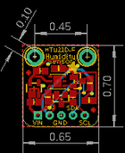
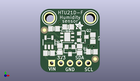
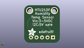
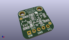

Contents
========

* [PROJ-ADAF-1899-STAN-01>Adafruit HTU21D Breakout PCB](#proj-adaf-1899-stan-01adafruit-htu21d-breakout-pcb)
	* [Images](#images)
	* [Interactive BOM](#interactive-bom)
	* [OOMP Parts](#oomp-parts)
	* [Tags](#tags)
  
![][im]
# PROJ-ADAF-1899-STAN-01>Adafruit HTU21D Breakout PCB

- ID: PROJ-ADAF-1899-STAN-01
- Hex ID: PRA1899
- Name: Adafruit HTU21D Breakout PCB
- Description: 

## Images
  
  

|eagleImage|kicadPcb3dFront|kicadPcb3dBack|kicadPcb3d|
| :---: | :---: | :---: | :---: |
|||||

## Interactive BOM

- Interactive BOM page: [ibom.html](kicad/bom/ibom.html)

## OOMP Parts
  

|OOMP Parts|
| :---: |
|<table><tr><td></td><td> C1</td><td>[CAPC-0805-X-NF100-V50 SMD (0805) 100 nF Capacitor (Ceramic) 50v](https://github.com/oomlout/oomlout_OOMP_parts/tree/main/CAPC-0805-X-NF100-V50/)</td><td>[C85N100](https://github.com/oomlout/oomlout_OOMP_parts/tree/main/CAPC-0805-X-NF100-V50/)</td></tr></table>|
|CAPC-0805-X-UNMATCHED-01, C2, 2.413, 5.334, 0,C2, 10uF, 0805-NO, microbuilder, (0.095, 0.21), R0|
|CAPC-0805-X-UNMATCHED-01, C3, 3.8099999999999996, 12.191999999999998, 0,C3, 10uF, 0805-NO, microbuilder, (0.15, 0.48), R0|
|<table><tr><td></td><td> JP1</td><td>[HEAD-I01-X-PI05-01 2.54 mm 5 Pin Header](https://github.com/oomlout/oomlout_OOMP_parts/tree/main/HEAD-I01-X-PI05-01/)</td><td>[H05](https://github.com/oomlout/oomlout_OOMP_parts/tree/main/HEAD-I01-X-PI05-01/)</td></tr></table>|
|UNMATCHED-UNMATCHED-X-UNMATCHED-01, Q1, 8.254999999999999, 6.095999999999999, 180,Q1, BSS138, SOT23-WIDE, microbuilder, (0.325, 0.24), R180|
|UNMATCHED-UNMATCHED-X-UNMATCHED-01, Q2, 11.811, 9.906, 270,Q2, BSS138, SOT23-WIDE, microbuilder, (0.465, 0.39), R270|
|<table><tr><td></td><td> R1</td><td>[RESE-0805-X-O103-01 SMD (0805) 10k Ohm Resistor](https://github.com/oomlout/oomlout_OOMP_parts/tree/main/RESE-0805-X-O103-01/)</td><td>[R85103](https://github.com/oomlout/oomlout_OOMP_parts/tree/main/RESE-0805-X-O103-01/)</td></tr></table>|
|<table><tr><td></td><td> R2</td><td>[RESE-0805-X-O103-01 SMD (0805) 10k Ohm Resistor](https://github.com/oomlout/oomlout_OOMP_parts/tree/main/RESE-0805-X-O103-01/)</td><td>[R85103](https://github.com/oomlout/oomlout_OOMP_parts/tree/main/RESE-0805-X-O103-01/)</td></tr></table>|
|<table><tr><td></td><td> R3</td><td>[RESE-0805-X-O103-01 SMD (0805) 10k Ohm Resistor](https://github.com/oomlout/oomlout_OOMP_parts/tree/main/RESE-0805-X-O103-01/)</td><td>[R85103](https://github.com/oomlout/oomlout_OOMP_parts/tree/main/RESE-0805-X-O103-01/)</td></tr></table>|
|<table><tr><td></td><td> R4</td><td>[RESE-0805-X-O103-01 SMD (0805) 10k Ohm Resistor](https://github.com/oomlout/oomlout_OOMP_parts/tree/main/RESE-0805-X-O103-01/)</td><td>[R85103](https://github.com/oomlout/oomlout_OOMP_parts/tree/main/RESE-0805-X-O103-01/)</td></tr></table>|
|UNMATCHED-UNMATCHED-X-UNMATCHED-01, U1, 7.492999999999999, 9.906, 0,U1, HTU21DF, HTU21DF, microbuilder, (0.295, 0.39), R0|
|UNMATCHED-UNMATCHED-X-UNMATCHED-01, U2, 2.413, 8.382, 0,U2, MIC5225-3.3, SOT23-5, microbuilder, (0.095, 0.33), R0|

## Tags

- hexID: PRA1899
- oompType: PROJ
- oompSize: ADAF
- oompColor: 1899
- oompDesc: STAN
- oompIndex: 01
- oompName: Adafruit HTU21D Breakout PCB
- sources: All source files from https://github.com/adafruit/Adafruit-HTU21D-Breakout-PCB (source licence details in srcLicense.md)
- linkBuyPage: http://www.adafruit.com/products/1899
- oompID: PROJ-ADAF-1899-STAN-01
- oompPart: CAPC-0805-X-NF100-V50, C1, 7.746999999999999, 12.7, 180
- oompPart: CAPC-0805-X-UNMATCHED-01, C2, 2.413, 5.334, 0
- oompPart: CAPC-0805-X-UNMATCHED-01, C3, 3.8099999999999996, 12.191999999999998, 0
- oompPart: SKIP-UNMATCHED-X-UNMATCHED-01, FID1, 1.1429999999999998, 11.811, 0
- oompPart: SKIP-UNMATCHED-X-UNMATCHED-01, FID2, 15.239999999999998, 3.6829999999999994, 0
- oompPart: HEAD-I01-X-PI05-01, JP1, 8.254999999999999, 2.54, 0
- oompPart: UNMATCHED-UNMATCHED-X-UNMATCHED-01, Q1, 8.254999999999999, 6.095999999999999, 180
- oompPart: UNMATCHED-UNMATCHED-X-UNMATCHED-01, Q2, 11.811, 9.906, 270
- oompPart: RESE-0805-X-O103-01, R1, 10.921999999999999, 6.35, 90
- oompPart: RESE-0805-X-O103-01, R2, 14.604999999999999, 9.524999999999999, 90
- oompPart: RESE-0805-X-O103-01, R3, 5.460999999999999, 6.476999999999999, 270
- oompPart: RESE-0805-X-O103-01, R4, 14.350999999999997, 5.715, 0
- oompPart: SKIP-UNMATCHED-X-UNMATCHED-01, U$3, 2.54, 15.239999999999998, 0
- oompPart: SKIP-UNMATCHED-X-UNMATCHED-01, U$4, 13.97, 15.239999999999998, 0
- oompPart: UNMATCHED-UNMATCHED-X-UNMATCHED-01, U1, 7.492999999999999, 9.906, 0
- oompPart: UNMATCHED-UNMATCHED-X-UNMATCHED-01, U2, 2.413, 8.382, 0
- rawPart: C1, 0.1uF, 0805-NO, microbuilder, (0.305, 0.5), R180
- rawPart: C2, 10uF, 0805-NO, microbuilder, (0.095, 0.21), R0
- rawPart: C3, 10uF, 0805-NO, microbuilder, (0.15, 0.48), R0
- rawPart: FID1, FIDUCIAL, FIDUCIAL_1MM, microbuilder, (0.045, 0.465), R0
- rawPart: FID2, FIDUCIAL, FIDUCIAL_1MM, microbuilder, (0.6, 0.145), R0
- rawPart: JP1, 1X05_ROUND_70, microbuilder, (0.325, 0.1), R0
- rawPart: Q1, BSS138, SOT23-WIDE, microbuilder, (0.325, 0.24), R180
- rawPart: Q2, BSS138, SOT23-WIDE, microbuilder, (0.465, 0.39), R270
- rawPart: R1, 10K, 0805-NO, microbuilder, (0.43, 0.25), R90
- rawPart: R2, 10K, 0805-NO, microbuilder, (0.575, 0.375), R90
- rawPart: R3, 10K, 0805-NO, microbuilder, (0.215, 0.255), R270
- rawPart: R4, 10K, 0805-NO, microbuilder, (0.565, 0.225), R0
- rawPart: U$3, MOUNTINGHOLE2.5, MOUNTINGHOLE_2.5_PLATED, microbuilder, (0.1, 0.6), R0
- rawPart: U$4, MOUNTINGHOLE2.5, MOUNTINGHOLE_2.5_PLATED, microbuilder, (0.55, 0.6), R0
- rawPart: U1, HTU21DF, HTU21DF, microbuilder, (0.295, 0.39), R0
- rawPart: U2, MIC5225-3.3, SOT23-5, microbuilder, (0.095, 0.33), R0

[im]: kicadPcb3d_450.png
