Contents
========

* [PRA1903 > Adafruit PowerBoost 500 Basic PCB](#pra1903--adafruit-powerboost-500-basic-pcb)
	* [Schematic](#schematic)
	* [PCB](#pcb)
	* [Interactive BOM](#interactive-bom)
	* [OOMP Parts](#oomp-parts)
	* [Images](#images)
	* [Tags](#tags)
  
![][im]
# PRA1903 > Adafruit PowerBoost 500 Basic PCB

- ID: PROJ-ADAF-1903-STAN-01
- Hex ID: PRA1903
- Name: Adafruit
- Description: Adafruit
- Long Link: [http://oom.lt/PROJ-ADAF-1903-STAN-01](http://oom.lt/PROJ-ADAF-1903-STAN-01)
- Short Link: [http://oom.lt/PRA1903](http://oom.lt/PRA1903)

## Schematic
  

## PCB
  
[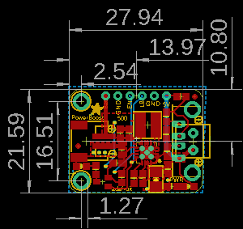](eagleImage.png)
## Interactive BOM

- Interactive BOM page: [ibom.html](https://htmlpreview.github.io/?https://github.com/oomlout/oomlout_OOMP_projects/blob/main/PROJ-ADAF-1903-STAN-01/kicad/bom/ibom.html)

## OOMP Parts
  

|OOMP ID|Name|Identifier|
| :---: | :---: | :---: |
|UNMATCHED-UNMATCHED-X-UNMATCHED-01||B1, CN1, L1, Q1, U1|
|[CAPC-0805-X-UF10-V10](https://github.com/oomlout/oomlout_OOMP_parts/tree/main/CAPC-0805-X-UF10-V10/)|[SMD (0805) 10 uF Capacitor (Ceramic) 10v](https://github.com/oomlout/oomlout_OOMP_parts/tree/main/CAPC-0805-X-UF10-V10/)|[C1](https://github.com/oomlout/oomlout_OOMP_parts/tree/main/CAPC-0805-X-UF10-V10/)|
|[CAPC-0805-X-UF22D-V25](https://github.com/oomlout/oomlout_OOMP_parts/tree/main/CAPC-0805-X-UF22D-V25/)|[SMD (0805) 2.2 uF Capacitor (Ceramic) 25v](https://github.com/oomlout/oomlout_OOMP_parts/tree/main/CAPC-0805-X-UF22D-V25/)|[C2](https://github.com/oomlout/oomlout_OOMP_parts/tree/main/CAPC-0805-X-UF22D-V25/)|
|[CAPC-0805-X-NF100-V50](https://github.com/oomlout/oomlout_OOMP_parts/tree/main/CAPC-0805-X-NF100-V50/)|[SMD (0805) 100 nF Capacitor (Ceramic) 50v](https://github.com/oomlout/oomlout_OOMP_parts/tree/main/CAPC-0805-X-NF100-V50/)|[C4](https://github.com/oomlout/oomlout_OOMP_parts/tree/main/CAPC-0805-X-NF100-V50/)|
|CAPX-3528-X-UNMATCHED-01||C5|
|[HEAD-I01-X-PI06-01](https://github.com/oomlout/oomlout_OOMP_parts/tree/main/HEAD-I01-X-PI06-01/)|[2.54 mm 6 Pin Header](https://github.com/oomlout/oomlout_OOMP_parts/tree/main/HEAD-I01-X-PI06-01/)|[JP1](https://github.com/oomlout/oomlout_OOMP_parts/tree/main/HEAD-I01-X-PI06-01/)|
|[LEDS-0805-R-STAN-01](https://github.com/oomlout/oomlout_OOMP_parts/tree/main/LEDS-0805-R-STAN-01/)|[SMD (0805) Red LED](https://github.com/oomlout/oomlout_OOMP_parts/tree/main/LEDS-0805-R-STAN-01/)|[LBO](https://github.com/oomlout/oomlout_OOMP_parts/tree/main/LEDS-0805-R-STAN-01/)|
|[LEDS-0805-G-STAN-01](https://github.com/oomlout/oomlout_OOMP_parts/tree/main/LEDS-0805-G-STAN-01/)|[SMD (0805) Green LED](https://github.com/oomlout/oomlout_OOMP_parts/tree/main/LEDS-0805-G-STAN-01/)|[PWR](https://github.com/oomlout/oomlout_OOMP_parts/tree/main/LEDS-0805-G-STAN-01/)|
|RESE-0805-X-UNMATCHED-01||R1, R3, R9, R10, R11, R12|
|RESE-0805-X-O3403-01||R2, R13|
|RESE-0805-X-O2003-01||R4|
|[RESE-0805-X-O102-01](https://github.com/oomlout/oomlout_OOMP_parts/tree/main/RESE-0805-X-O102-01/)|[SMD (0805) 1k Ohm Resistor](https://github.com/oomlout/oomlout_OOMP_parts/tree/main/RESE-0805-X-O102-01/)|[R5, R20](https://github.com/oomlout/oomlout_OOMP_parts/tree/main/RESE-0805-X-O102-01/)|
|[TERS-35D-L-PI02-01](https://github.com/oomlout/oomlout_OOMP_parts/tree/main/TERS-35D-L-PI02-01/)|[3.5 mm 2 Pin Blue Screw Terminal](https://github.com/oomlout/oomlout_OOMP_parts/tree/main/TERS-35D-L-PI02-01/)|[X1](https://github.com/oomlout/oomlout_OOMP_parts/tree/main/TERS-35D-L-PI02-01/)|

## Images
  
  

|bominteractivefront|bominteractiveback|kicadPcb3d|kicadPcb3dFront|kicadPcb3dBack|kicadSchem|eagleImage|eagleSchemImage|pcbdraw|pcbdrawback|
| :---: | :---: | :---: | :---: | :---: | :---: | :---: | :---: | :---: | :---: |
|[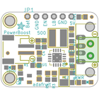](bomFront.png)|[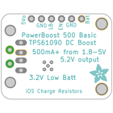](bomBack.png)|[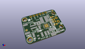](kicadPcb3d.png)|[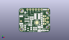](kicadPcb3dFront.png)|[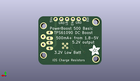](kicadPcb3dBack.png)|[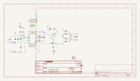](kicadSchem.png)|[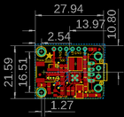](eagleImage.png)|[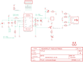](eagleSchemImage.png)|[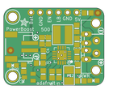](pcbdraw.png)|[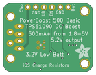](pcbdrawBack.png)|

## Tags

- hexID: PRA1903
- oompType: PROJ
- oompSize: ADAF
- oompColor: 1903
- oompDesc: STAN
- oompIndex: 01
- oompName: Adafruit PowerBoost 500 Basic PCB
- sources: All source files from https://github.com/adafruit/Adafruit-PowerBoost-500-Basic-PCB (source licence details in srcLicense.md)
- linkBuyPage: http://www.adafruit.com/products/1903
- oompID: PROJ-ADAF-1903-STAN-01
- oompParts: B1,UNMATCHED-UNMATCHED-X-UNMATCHED-01
- oompParts: C1,CAPC-0805-X-UF10-V10
- oompParts: C2,CAPC-0805-X-UF22D-V25
- oompParts: C4,CAPC-0805-X-NF100-V50
- oompParts: C5,CAPX-3528-X-UNMATCHED-01
- oompParts: CN1,UNMATCHED-UNMATCHED-X-UNMATCHED-01
- oompParts: JP1,HEAD-I01-X-PI06-01
- oompParts: L1,UNMATCHED-UNMATCHED-X-UNMATCHED-01
- oompParts: LBO,LEDS-0805-R-STAN-01
- oompParts: PWR,LEDS-0805-G-STAN-01
- oompParts: Q1,UNMATCHED-UNMATCHED-X-UNMATCHED-01
- oompParts: R1,RESE-0805-X-UNMATCHED-01
- oompParts: R2,RESE-0805-X-O3403-01
- oompParts: R3,RESE-0805-X-UNMATCHED-01
- oompParts: R4,RESE-0805-X-O2003-01
- oompParts: R5,RESE-0805-X-O102-01
- oompParts: R9,RESE-0805-X-UNMATCHED-01
- oompParts: R10,RESE-0805-X-UNMATCHED-01
- oompParts: R11,RESE-0805-X-UNMATCHED-01
- oompParts: R12,RESE-0805-X-UNMATCHED-01
- oompParts: R13,RESE-0805-X-O3403-01
- oompParts: R20,RESE-0805-X-O102-01
- oompParts: U1,UNMATCHED-UNMATCHED-X-UNMATCHED-01
- oompParts: X1,TERS-35D-L-PI02-01
- rawParts: B1,1.8-5V,BATTERY,JSTPH2,CR1220 SMT - Digikey: 3001K-ND,,
- rawParts: C1,10uF,CAP_CERAMIC0805-NOOUTLINE,0805-NO,Ceramic Capacitors,,
- rawParts: C2,2.2uF,CAP_CERAMIC0805-NOOUTLINE,0805-NO,Ceramic Capacitors,,
- rawParts: C4,0.1uF,CAP_CERAMIC0805-NOOUTLINE,0805-NO,Ceramic Capacitors,,
- rawParts: C5,100uF/6V,CAP_TANTALUMB/3528_REFLOW,EIA3528-21/B-R,Tantalum Capacitors,,
- rawParts: CN1,USBA_FEMALE,USB_TYPEAPTHFML,USB_HOST-PTH,USB - Type A Connectors,,
- rawParts: FID2,FIDUCIAL,FIDUCIAL,FIDUCIAL_1MM,Fiducial Alignment Points,EXCLUDE,
- rawParts: FID3,FIDUCIAL,FIDUCIAL,FIDUCIAL_1MM,Fiducial Alignment Points,EXCLUDE,
- rawParts: JP1,,PINHD-1X6CB,1X06-CLEANBIG,PIN HEADER,,
- rawParts: L1,VLC5045-6.8uH,INDUCTORTDK_VLC5045,INDUCTOR_5X5MM_TDK_VLC5045,Inductors,,
- rawParts: LBO,RED,LED0805_NOOUTLINE,CHIPLED_0805_NOOUTLINE,LED,,
- rawParts: PWR,GREEN,LED0805_NOOUTLINE,CHIPLED_0805_NOOUTLINE,LED,,
- rawParts: Q1,MMUN2133LT1G,MUN2114T1-PNP_DRIVER-SC59-BEC,SC59-BEC,PNP Bias Resistor Transistor,,
- rawParts: R1,1.87Mohm,RESISTOR0805_NOOUTLINE,0805-NO,Resistors,,
- rawParts: R2,340K,RESISTOR0805_NOOUTLINE,0805-NO,Resistors,,
- rawParts: R3,1.87Mohm,RESISTOR0805_NOOUTLINE,0805-NO,Resistors,,
- rawParts: R4,200K,RESISTOR0805_NOOUTLINE,0805-NO,Resistors,,
- rawParts: R5,1K,RESISTOR0805_NOOUTLINE,0805-NO,Resistors,,
- rawParts: R9,75K 1%,RESISTOR0805_NOOUTLINE,0805-NO,Resistors,,
- rawParts: R10,49.9K 1%,RESISTOR0805_NOOUTLINE,0805-NO,Resistors,,
- rawParts: R11,75K 1%,RESISTOR0805_NOOUTLINE,0805-NO,Resistors,,
- rawParts: R12,49.9K 1%,RESISTOR0805_NOOUTLINE,0805-NO,Resistors,,
- rawParts: R13,340K,RESISTOR0805_NOOUTLINE,0805-NO,Resistors,,
- rawParts: R20,1K,RESISTOR0805_NOOUTLINE,0805-NO,Resistors,,
- rawParts: U$10,MOUNTINGHOLE2.5,MOUNTINGHOLE2.5,MOUNTINGHOLE_2.5_PLATED,Mounting Hole,EXCLUDE,
- rawParts: U$12,MOUNTINGHOLE2.5,MOUNTINGHOLE2.5,MOUNTINGHOLE_2.5_PLATED,Mounting Hole,EXCLUDE,
- rawParts: U1,TPS61090RSAR,VREG_TPS6103X,PVQFN-16,TPS6103x 4A Boost - 1.8-5.5V Input, Adjustable Output to 5.5V,,
- rawParts: X1,,TERMBLOCK_1X2,TERMBLOCK_1X2-3.5MM,3.5mm Terminal block,,

[im]: kicadPcb3d_450.png
