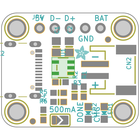
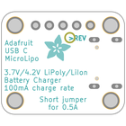
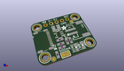
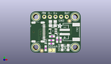
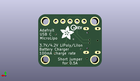
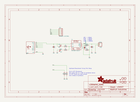
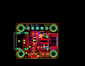
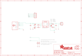
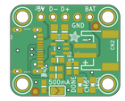
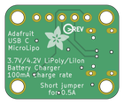

Contents
========

* [PRA1904 > Adafruit MicroLipo PCB](#pra1904--adafruit-microlipo-pcb)
	* [Schematic](#schematic)
	* [PCB](#pcb)
	* [Interactive BOM](#interactive-bom)
	* [OOMP Parts](#oomp-parts)
	* [Images](#images)
	* [Tags](#tags)
  
![][im]
# PRA1904 > Adafruit MicroLipo PCB

- ID: PROJ-ADAF-1904-STAN-01
- Hex ID: PRA1904
- Name: Adafruit
- Description: Adafruit
- Long Link: [http://oom.lt/PROJ-ADAF-1904-STAN-01](http://oom.lt/PROJ-ADAF-1904-STAN-01)
- Short Link: [http://oom.lt/PRA1904](http://oom.lt/PRA1904)

## Schematic
  

## PCB
  

## Interactive BOM

- Interactive BOM page: [ibom.html](https://htmlpreview.github.io/?https://github.com/oomlout/oomlout_OOMP_projects/blob/main/PROJ-ADAF-1904-STAN-01/kicad/bom/ibom.html)

## OOMP Parts
  

|OOMP ID|Name|Identifier|
| :---: | :---: | :---: |
|CAPC-UNMATCHED-X-UNMATCHED-01||C1, C2|
|UNMATCHED-UNMATCHED-X-UNMATCHED-01||CN2, X2|
|[HEAD-I01-X-PI05-01](https://github.com/oomlout/oomlout_OOMP_parts/tree/main/HEAD-I01-X-PI05-01/)|[2.54 mm 5 Pin Header](https://github.com/oomlout/oomlout_OOMP_parts/tree/main/HEAD-I01-X-PI05-01/)|[JP4](https://github.com/oomlout/oomlout_OOMP_parts/tree/main/HEAD-I01-X-PI05-01/)|
|[LEDS-0805-R-STAN-01](https://github.com/oomlout/oomlout_OOMP_parts/tree/main/LEDS-0805-R-STAN-01/)|[SMD (0805) Red LED](https://github.com/oomlout/oomlout_OOMP_parts/tree/main/LEDS-0805-R-STAN-01/)|[LED1](https://github.com/oomlout/oomlout_OOMP_parts/tree/main/LEDS-0805-R-STAN-01/)|
|[LEDS-0805-G-STAN-01](https://github.com/oomlout/oomlout_OOMP_parts/tree/main/LEDS-0805-G-STAN-01/)|[SMD (0805) Green LED](https://github.com/oomlout/oomlout_OOMP_parts/tree/main/LEDS-0805-G-STAN-01/)|[LED2](https://github.com/oomlout/oomlout_OOMP_parts/tree/main/LEDS-0805-G-STAN-01/)|
|[RESE-0603-X-O471-01](https://github.com/oomlout/oomlout_OOMP_parts/tree/main/RESE-0603-X-O471-01/)|[SMD (0603) 470 Ohm Resistor](https://github.com/oomlout/oomlout_OOMP_parts/tree/main/RESE-0603-X-O471-01/)|[R1, R2](https://github.com/oomlout/oomlout_OOMP_parts/tree/main/RESE-0603-X-O471-01/)|
|RESE-0603-X-UNMATCHED-01||R3|
|[RESE-0603-X-O222-01](https://github.com/oomlout/oomlout_OOMP_parts/tree/main/RESE-0603-X-O222-01/)|[SMD (0603) 2.2k Ohm Resistor](https://github.com/oomlout/oomlout_OOMP_parts/tree/main/RESE-0603-X-O222-01/)|[R4](https://github.com/oomlout/oomlout_OOMP_parts/tree/main/RESE-0603-X-O222-01/)|
|[RESE-0603-X-O472-01](https://github.com/oomlout/oomlout_OOMP_parts/tree/main/RESE-0603-X-O472-01/)|[SMD (0603) 4.7k Ohm Resistor](https://github.com/oomlout/oomlout_OOMP_parts/tree/main/RESE-0603-X-O472-01/)|[R5, R6](https://github.com/oomlout/oomlout_OOMP_parts/tree/main/RESE-0603-X-O472-01/)|
|UNMATCHED-SO235-X-UNMATCHED-01||U1|

## Images
  
  

|bominteractivefront|bominteractiveback|kicadPcb3d|kicadPcb3dFront|kicadPcb3dBack|kicadSchem|eagleImage|eagleSchemImage|pcbdraw|pcbdrawback|
| :---: | :---: | :---: | :---: | :---: | :---: | :---: | :---: | :---: | :---: |
|||||||||||

## Tags

- hexID: PRA1904
- oompType: PROJ
- oompSize: ADAF
- oompColor: 1904
- oompDesc: STAN
- oompIndex: 01
- oompName: Adafruit MicroLipo PCB
- sources: All source files from https://github.com/adafruit/Adafruit-MicroLipo-PCB (source licence details in srcLicense.md)
- linkBuyPage: http://www.adafruit.com/products/1904
- oompID: PROJ-ADAF-1904-STAN-01
- oompParts: C1,CAPC-UNMATCHED-X-UNMATCHED-01
- oompParts: C2,CAPC-UNMATCHED-X-UNMATCHED-01
- oompParts: CN2,UNMATCHED-UNMATCHED-X-UNMATCHED-01
- oompParts: JP4,HEAD-I01-X-PI05-01
- oompParts: LED1,LEDS-0805-R-STAN-01
- oompParts: LED2,LEDS-0805-G-STAN-01
- oompParts: R1,RESE-0603-X-O471-01
- oompParts: R2,RESE-0603-X-O471-01
- oompParts: R3,RESE-0603-X-UNMATCHED-01
- oompParts: R4,RESE-0603-X-O222-01
- oompParts: R5,RESE-0603-X-O472-01
- oompParts: R6,RESE-0603-X-O472-01
- oompParts: U1,UNMATCHED-SO235-X-UNMATCHED-01
- oompParts: X2,UNMATCHED-UNMATCHED-X-UNMATCHED-01
- rawParts: C1,10µF,CAP_CERAMIC0805-NOOUTLINE,0805-NO@1,Ceramic Capacitors,,
- rawParts: C2,10µF,CAP_CERAMIC0805-NOOUTLINE,0805-NO@1,Ceramic Capacitors,,
- rawParts: CN2,JSTPH,JST_2PIN,JSTPH2,JST 2-Pin Right-Angle Connector,,
- rawParts: FID1,FIDUCIAL,FIDUCIAL,FIDUCIAL_1MM,Fiducial Alignment Points,EXCLUDE,
- rawParts: FID2,FIDUCIAL,FIDUCIAL,FIDUCIAL_1MM,Fiducial Alignment Points,EXCLUDE,
- rawParts: JP4,,HEADER-1X570MIL,1X05_ROUND_70,PIN HEADER,,
- rawParts: LED1,RED,LED0805_NOOUTLINE,CHIPLED_0805_NOOUTLINE,LED,,
- rawParts: LED2,GREEN,LED0805_NOOUTLINE,CHIPLED_0805_NOOUTLINE,LED,,
- rawParts: R1,470,RESISTOR_0603_NOOUT,0603-NO,Resistors,,
- rawParts: R2,470,RESISTOR_0603_NOOUT,0603-NO,Resistors,,
- rawParts: R3,10K,RESISTOR_0603_NOOUT,0603-NO,Resistors,,
- rawParts: R4,2.2K,RESISTOR_0603_NOOUT,0603-NO,Resistors,,
- rawParts: R5,5.1K,RESISTOR_0603_NOOUT,0603-NO,Resistors,,
- rawParts: R6,5.1K,RESISTOR_0603_NOOUT,0603-NO,Resistors,,
- rawParts: SJ1,,SOLDERJUMPER,SOLDERJUMPER_ARROW_NOPASTE,SMD Solder JUMPER,EXCLUDE,
- rawParts: U$9,MOUNTINGHOLE2.5,MOUNTINGHOLE2.5,MOUNTINGHOLE_2.5_PLATED,Mounting Hole,EXCLUDE,
- rawParts: U$10,MOUNTINGHOLE2.5,MOUNTINGHOLE2.5,MOUNTINGHOLE_2.5_PLATED,Mounting Hole,EXCLUDE,
- rawParts: U$11,MOUNTINGHOLE2.5,MOUNTINGHOLE2.5,MOUNTINGHOLE_2.5_PLATED,Mounting Hole,EXCLUDE,
- rawParts: U$12,MOUNTINGHOLE2.5,MOUNTINGHOLE2.5,MOUNTINGHOLE_2.5_PLATED,Mounting Hole,EXCLUDE,
- rawParts: U1,MCP73831T-2ACI/OT,MCP73831/2,SOT23-5,MCP73831/2 LIPO Charger,,
- rawParts: X2,,USB_C,USB_C_CUSB31-CFM2AX-01-X,USB Type-C USB 2.0 Connector,,

[im]: kicadPcb3d_450.png
