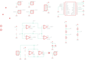

Contents
========

* [PRA1916 > Adafruit](#pra1916--adafruit)
	* [Images](#images)
	* [Tags](#tags)
  
![][im]
# PRA1916 > Adafruit

- ID: PROJ-ADAF-1916-STAN-01
- Hex ID: PRA1916
- Name: Adafruit
- Description: Adafruit

## Images
  
  

|kicadPcb3d|kicadPcb3dFront|kicadPcb3dBack|eagleImage|eagleSchemImage|
| :---: | :---: | :---: | :---: | :---: |
||||||

## Tags

- hexID: PRA1916
- oompType: PROJ
- oompSize: ADAF
- oompColor: 1916
- oompDesc: STAN
- oompIndex: 01
- oompName: Adafruit Cupcade Adapter PCB
- sources: All source files from https://github.com/adafruit/Adafruit-Cupcade-Adapter-PCB (source licence details in srcLicense.md)
- linkBuyPage: http://www.adafruit.com/products/1916
- oompID: PROJ-ADAF-1916-STAN-01
- oompParts: AUDIO,UNMATCHED-UNMATCHED-UNMATCHED-UNMATCHED-UNMATCHED
- oompParts: BUTTON_A,UNMATCHED-UNMATCHED-UNMATCHED-UNMATCHED-UNMATCHED
- oompParts: BUTTON_B,UNMATCHED-UNMATCHED-UNMATCHED-UNMATCHED-UNMATCHED
- oompParts: BUTTON_CREDIT,UNMATCHED-UNMATCHED-UNMATCHED-UNMATCHED-UNMATCHED
- oompParts: BUTTON_START,UNMATCHED-UNMATCHED-UNMATCHED-UNMATCHED-UNMATCHED
- oompParts: C1,UNMATCHED-UNMATCHED-UNMATCHED-UNMATCHED-UNMATCHED
- oompParts: C2,UNMATCHED-UNMATCHED-UNMATCHED-UNMATCHED-UNMATCHED
- oompParts: C3,UNMATCHED-UNMATCHED-UNMATCHED-UNMATCHED-UNMATCHED
- oompParts: IC1,UNMATCHED-UNMATCHED-UNMATCHED-UNMATCHED-UNMATCHED
- oompParts: IC2,UNMATCHED-UNMATCHED-UNMATCHED-UNMATCHED-UNMATCHED
- oompParts: JOYSTICK,UNMATCHED-UNMATCHED-UNMATCHED-UNMATCHED-UNMATCHED
- oompParts: JP1,UNMATCHED-UNMATCHED-UNMATCHED-UNMATCHED-UNMATCHED
- oompParts: R1,UNMATCHED-UNMATCHED-UNMATCHED-UNMATCHED-UNMATCHED
- oompParts: R2,UNMATCHED-UNMATCHED-UNMATCHED-UNMATCHED-UNMATCHED
- oompParts: R3,UNMATCHED-UNMATCHED-UNMATCHED-UNMATCHED-UNMATCHED
- oompParts: R4,UNMATCHED-UNMATCHED-UNMATCHED-UNMATCHED-UNMATCHED
- oompParts: R5,UNMATCHED-UNMATCHED-UNMATCHED-UNMATCHED-UNMATCHED
- oompParts: SPEAKER,UNMATCHED-UNMATCHED-UNMATCHED-UNMATCHED-UNMATCHED
- rawParts: AUDIO,,HEADER-1X3,1X03_OVAL,PIN HEADER,,
- rawParts: BUTTON_A,,HEADER-1X2,1X02_OVAL,PIN HEADER,,
- rawParts: BUTTON_B,,HEADER-1X2,1X02_OVAL,PIN HEADER,,
- rawParts: BUTTON_CREDIT,,HEADER-1X2,1X02_OVAL,PIN HEADER,,
- rawParts: BUTTON_START,,HEADER-1X2,1X02_OVAL,PIN HEADER,,
- rawParts: C1,100uF,CAP_ELECTROLYTICPANASONIC_C,PANASONIC_C,Electrolytic Capacitors,,
- rawParts: C2,10uF,CAP_CERAMIC0805-NOOUTLINE,0805-NO,Ceramic Capacitors,,
- rawParts: C3,0.1uF,CAP_CERAMIC0805-NOOUTLINE,0805-NO,Ceramic Capacitors,,
- rawParts: FID1,FIDUCIAL,FIDUCIAL,FIDUCIAL_1MM,Fiducial Alignment Points,EXCLUDE,
- rawParts: FID2,FIDUCIAL,FIDUCIAL,FIDUCIAL_1MM,Fiducial Alignment Points,EXCLUDE,
- rawParts: FID3,FIDUCIAL,FIDUCIAL,FIDUCIAL_1MM,Fiducial Alignment Points,EXCLUDE,
- rawParts: IC1,LM339D,LM339D,SO14,Low Power Low Offset Voltage Quad Comparators,,
- rawParts: IC2,TS922,TL072D,SO08,OP AMP,,
- rawParts: JOYSTICK,,HEADER-1X5,1X05_OVAL,PIN HEADER,,
- rawParts: JP1,,RASBERRYPI_IDC,RASBERRYPI_IDC,Rasberry PI IDC Header,,
- rawParts: R1,10K,RESISTOR0805_NOOUTLINE,0805-NO,Resistors,,
- rawParts: R2,10K,RESISTOR0805_NOOUTLINE,0805-NO,Resistors,,
- rawParts: R3,10K,RESISTOR0805_NOOUTLINE,0805-NO,Resistors,,
- rawParts: R4,10K,RESISTOR0805_NOOUTLINE,0805-NO,Resistors,,
- rawParts: R5,10K,RESISTOR0805_NOOUTLINE,0805-NO,Resistors,,
- rawParts: SPEAKER,8Ohm,HEADER-1X2,1X02_OVAL,PIN HEADER,,
- rawParts: U$2,MOUNTINGHOLE2.5,MOUNTINGHOLE2.5,MOUNTINGHOLE_2.5_PLATED,Mounting Hole,EXCLUDE,
- rawParts: U$3,MOUNTINGHOLE2.5,MOUNTINGHOLE2.5,MOUNTINGHOLE_2.5_PLATED,Mounting Hole,EXCLUDE,

[im]: kicadPcb3d_450.png
