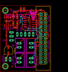
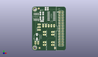
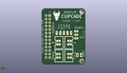
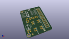

Contents
========

* [PROJ-ADAF-1916-STAN-01>Adafruit Cupcade Adapter PCB](#proj-adaf-1916-stan-01adafruit-cupcade-adapter-pcb)
	* [Images](#images)
	* [Interactive BOM](#interactive-bom)
	* [OOMP Parts](#oomp-parts)
	* [Tags](#tags)
  
![][im]
# PROJ-ADAF-1916-STAN-01>Adafruit Cupcade Adapter PCB

- ID: PROJ-ADAF-1916-STAN-01
- Hex ID: PRA1916
- Name: Adafruit Cupcade Adapter PCB
- Description: 

## Images
  
  

|eagleImage|kicadPcb3dFront|kicadPcb3dBack|kicadPcb3d|
| :---: | :---: | :---: | :---: |
|||||

## Interactive BOM

- Interactive BOM page: [ibom.html](kicad/bom/ibom.html)

## OOMP Parts
  

|OOMP Parts|
| :---: |
|UNMATCHED-UNMATCHED-X-UNMATCHED-01, AUDIO, 6.476999999999999, 21.59, 90,AUDIO, 1X03_OVAL, microbuilder, (0.255, 0.85), R90|
|UNMATCHED-UNMATCHED-X-UNMATCHED-01, BUTTON_A, 11.43, 15.875, 270,BUTTON_A, 1X02_OVAL, microbuilder, (0.45, 0.625), R270|
|UNMATCHED-UNMATCHED-X-UNMATCHED-01, BUTTON_B, 19.049999999999997, 15.875, 270,BUTTON_B, 1X02_OVAL, microbuilder, (0.75, 0.625), R270|
|UNMATCHED-UNMATCHED-X-UNMATCHED-01, BUTTON_CREDIT, 11.43, 6.35, 270,BUTTON_CREDIT, 1X02_OVAL, microbuilder, (0.45, 0.25), R270|
|UNMATCHED-UNMATCHED-X-UNMATCHED-01, BUTTON_START, 19.049999999999997, 6.35, 270,BUTTON_START, 1X02_OVAL, microbuilder, (0.75, 0.25), R270|
|CAPE-UNMATCHED-X-UNMATCHED-01, C1, 4.444999999999999, 12.7, 90,C1, 100uF, PANASONIC_C, microbuilder, (0.175, 0.5), R90|
|CAPC-0805-X-UNMATCHED-01, C2, 14.477999999999998, 38.608, 90,C2, 10uF, 0805-NO, microbuilder, (0.57, 1.52), R90|
|<table><tr><td></td><td> C3</td><td>[CAPC-0805-X-NF100-V50 SMD (0805) 100 nF Capacitor (Ceramic) 50v](https://github.com/oomlout/oomlout_OOMP_parts/tree/main/CAPC-0805-X-NF100-V50/)</td><td>[C85N100](https://github.com/oomlout/oomlout_OOMP_parts/tree/main/CAPC-0805-X-NF100-V50/)</td></tr></table>|
|UNMATCHED-UNMATCHED-X-UNMATCHED-01, IC1, 17.779999999999998, 31.75, 90,IC1, LM339D, SO14, linear, (0.7, 1.25), R90|
|UNMATCHED-UNMATCHED-X-UNMATCHED-01, IC2, 3.8099999999999996, 31.115000000000002, 0,IC2, TS922, SO08, linear, (0.15, 1.225), R0|
|UNMATCHED-UNMATCHED-X-UNMATCHED-01, JOYSTICK, 15.239999999999998, 22.86, 0,JOYSTICK, 1X05_OVAL, microbuilder, (0.6, 0.9), R0|
|UNMATCHED-UNMATCHED-X-UNMATCHED-01, JP1, 26.669999999999998, 20.32, 0,JP1, RASBERRYPI_IDC, microbuilder, (1.05, 0.8), R0|
|<table><tr><td></td><td> R1</td><td>[RESE-0805-X-O103-01 SMD (0805) 10k Ohm Resistor](https://github.com/oomlout/oomlout_OOMP_parts/tree/main/RESE-0805-X-O103-01/)</td><td>[R85103](https://github.com/oomlout/oomlout_OOMP_parts/tree/main/RESE-0805-X-O103-01/)</td></tr></table>|
|<table><tr><td></td><td> R2</td><td>[RESE-0805-X-O103-01 SMD (0805) 10k Ohm Resistor](https://github.com/oomlout/oomlout_OOMP_parts/tree/main/RESE-0805-X-O103-01/)</td><td>[R85103](https://github.com/oomlout/oomlout_OOMP_parts/tree/main/RESE-0805-X-O103-01/)</td></tr></table>|
|<table><tr><td></td><td> R3</td><td>[RESE-0805-X-O103-01 SMD (0805) 10k Ohm Resistor](https://github.com/oomlout/oomlout_OOMP_parts/tree/main/RESE-0805-X-O103-01/)</td><td>[R85103](https://github.com/oomlout/oomlout_OOMP_parts/tree/main/RESE-0805-X-O103-01/)</td></tr></table>|
|<table><tr><td></td><td> R4</td><td>[RESE-0805-X-O103-01 SMD (0805) 10k Ohm Resistor](https://github.com/oomlout/oomlout_OOMP_parts/tree/main/RESE-0805-X-O103-01/)</td><td>[R85103](https://github.com/oomlout/oomlout_OOMP_parts/tree/main/RESE-0805-X-O103-01/)</td></tr></table>|
|<table><tr><td></td><td> R5</td><td>[RESE-0805-X-O103-01 SMD (0805) 10k Ohm Resistor](https://github.com/oomlout/oomlout_OOMP_parts/tree/main/RESE-0805-X-O103-01/)</td><td>[R85103](https://github.com/oomlout/oomlout_OOMP_parts/tree/main/RESE-0805-X-O103-01/)</td></tr></table>|
|UNMATCHED-UNMATCHED-X-UNMATCHED-01, SPEAKER, 4.3180000000000005, 6.985, 0,SPEAKER, 8Ohm, 1X02_OVAL, microbuilder, (0.17, 0.275), R0|

## Tags

- hexID: PRA1916
- oompType: PROJ
- oompSize: ADAF
- oompColor: 1916
- oompDesc: STAN
- oompIndex: 01
- oompName: Adafruit Cupcade Adapter PCB
- sources: All source files from https://github.com/adafruit/Adafruit-Cupcade-Adapter-PCB (source licence details in srcLicense.md)
- linkBuyPage: http://www.adafruit.com/products/1916
- oompID: PROJ-ADAF-1916-STAN-01
- oompPart: UNMATCHED-UNMATCHED-X-UNMATCHED-01, AUDIO, 6.476999999999999, 21.59, 90
- oompPart: UNMATCHED-UNMATCHED-X-UNMATCHED-01, BUTTON_A, 11.43, 15.875, 270
- oompPart: UNMATCHED-UNMATCHED-X-UNMATCHED-01, BUTTON_B, 19.049999999999997, 15.875, 270
- oompPart: UNMATCHED-UNMATCHED-X-UNMATCHED-01, BUTTON_CREDIT, 11.43, 6.35, 270
- oompPart: UNMATCHED-UNMATCHED-X-UNMATCHED-01, BUTTON_START, 19.049999999999997, 6.35, 270
- oompPart: CAPE-UNMATCHED-X-UNMATCHED-01, C1, 4.444999999999999, 12.7, 90
- oompPart: CAPC-0805-X-UNMATCHED-01, C2, 14.477999999999998, 38.608, 90
- oompPart: CAPC-0805-X-NF100-V50, C3, 12.446, 38.608, 90
- oompPart: SKIP-UNMATCHED-X-UNMATCHED-01, FID1, 6.858, 2.2859999999999996, 0
- oompPart: SKIP-UNMATCHED-X-UNMATCHED-01, FID2, 21.081999999999997, 2.2859999999999996, 0
- oompPart: SKIP-UNMATCHED-X-UNMATCHED-01, FID3, 6.095999999999999, 38.862, 0
- oompPart: UNMATCHED-UNMATCHED-X-UNMATCHED-01, IC1, 17.779999999999998, 31.75, 90
- oompPart: UNMATCHED-UNMATCHED-X-UNMATCHED-01, IC2, 3.8099999999999996, 31.115000000000002, 0
- oompPart: UNMATCHED-UNMATCHED-X-UNMATCHED-01, JOYSTICK, 15.239999999999998, 22.86, 0
- oompPart: UNMATCHED-UNMATCHED-X-UNMATCHED-01, JP1, 26.669999999999998, 20.32, 0
- oompPart: RESE-0805-X-O103-01, R1, 10.16, 34.29, 270
- oompPart: RESE-0805-X-O103-01, R2, 10.16, 29.845, 270
- oompPart: RESE-0805-X-O103-01, R3, 9.143999999999998, 27.178, 180
- oompPart: RESE-0805-X-O103-01, R4, 7.619999999999999, 34.29, 90
- oompPart: RESE-0805-X-O103-01, R5, 7.619999999999999, 29.845, 90
- oompPart: UNMATCHED-UNMATCHED-X-UNMATCHED-01, SPEAKER, 4.3180000000000005, 6.985, 0
- oompPart: SKIP-UNMATCHED-X-UNMATCHED-01, U$2, 2.54, 2.54, 0
- oompPart: SKIP-UNMATCHED-X-UNMATCHED-01, U$3, 2.54, 38.099999999999994, 0
- rawPart: AUDIO, 1X03_OVAL, microbuilder, (0.255, 0.85), R90
- rawPart: BUTTON_A, 1X02_OVAL, microbuilder, (0.45, 0.625), R270
- rawPart: BUTTON_B, 1X02_OVAL, microbuilder, (0.75, 0.625), R270
- rawPart: BUTTON_CREDIT, 1X02_OVAL, microbuilder, (0.45, 0.25), R270
- rawPart: BUTTON_START, 1X02_OVAL, microbuilder, (0.75, 0.25), R270
- rawPart: C1, 100uF, PANASONIC_C, microbuilder, (0.175, 0.5), R90
- rawPart: C2, 10uF, 0805-NO, microbuilder, (0.57, 1.52), R90
- rawPart: C3, 0.1uF, 0805-NO, microbuilder, (0.49, 1.52), R90
- rawPart: FID1, FIDUCIAL, FIDUCIAL_1MM, microbuilder, (0.27, 0.09), R0
- rawPart: FID2, FIDUCIAL, FIDUCIAL_1MM, microbuilder, (0.83, 0.09), R0
- rawPart: FID3, FIDUCIAL, FIDUCIAL_1MM, microbuilder, (0.24, 1.53), R0
- rawPart: IC1, LM339D, SO14, linear, (0.7, 1.25), R90
- rawPart: IC2, TS922, SO08, linear, (0.15, 1.225), R0
- rawPart: JOYSTICK, 1X05_OVAL, microbuilder, (0.6, 0.9), R0
- rawPart: JP1, RASBERRYPI_IDC, microbuilder, (1.05, 0.8), R0
- rawPart: R1, 10K, 0805-NO, microbuilder, (0.4, 1.35), R270
- rawPart: R2, 10K, 0805-NO, microbuilder, (0.4, 1.175), R270
- rawPart: R3, 10K, 0805-NO, microbuilder, (0.36, 1.07), R180
- rawPart: R4, 10K, 0805-NO, microbuilder, (0.3, 1.35), R90
- rawPart: R5, 10K, 0805-NO, microbuilder, (0.3, 1.175), R90
- rawPart: SPEAKER, 8Ohm, 1X02_OVAL, microbuilder, (0.17, 0.275), R0
- rawPart: U$2, MOUNTINGHOLE2.5, MOUNTINGHOLE_2.5_PLATED, microbuilder, (0.1, 0.1), R0
- rawPart: U$3, MOUNTINGHOLE2.5, MOUNTINGHOLE_2.5_PLATED, microbuilder, (0.1, 1.5), R0

[im]: kicadPcb3d_450.png
