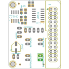
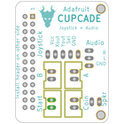
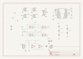
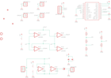
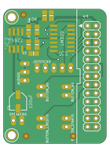
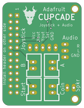

Contents
========

* [PRA1916 > Adafruit Cupcade Adapter PCB](#pra1916--adafruit-cupcade-adapter-pcb)
	* [Schematic](#schematic)
	* [PCB](#pcb)
	* [Interactive BOM](#interactive-bom)
	* [OOMP Parts](#oomp-parts)
	* [Images](#images)
	* [Tags](#tags)
  
![][im]
# PRA1916 > Adafruit Cupcade Adapter PCB

- ID: PROJ-ADAF-1916-STAN-01
- Hex ID: PRA1916
- Name: Adafruit
- Description: Adafruit
- Long Link: [http://oom.lt/PROJ-ADAF-1916-STAN-01](http://oom.lt/PROJ-ADAF-1916-STAN-01)
- Short Link: [http://oom.lt/PRA1916](http://oom.lt/PRA1916)

## Schematic
  

## PCB
  

## Interactive BOM

- Interactive BOM page: [ibom.html](https://htmlpreview.github.io/?https://github.com/oomlout/oomlout_OOMP_projects/blob/main/PROJ-ADAF-1916-STAN-01/kicad/bom/ibom.html)

## OOMP Parts
  

|OOMP ID|Name|Identifier|
| :---: | :---: | :---: |
|[HEAD-I01-X-PI03-01](https://github.com/oomlout/oomlout_OOMP_parts/tree/main/HEAD-I01-X-PI03-01/)|[2.54 mm 3 Pin Header](https://github.com/oomlout/oomlout_OOMP_parts/tree/main/HEAD-I01-X-PI03-01/)|[AUDIO](https://github.com/oomlout/oomlout_OOMP_parts/tree/main/HEAD-I01-X-PI03-01/)|
|[HEAD-I01-X-PI02-01](https://github.com/oomlout/oomlout_OOMP_parts/tree/main/HEAD-I01-X-PI02-01/)|[2.54 mm 2 Pin Header](https://github.com/oomlout/oomlout_OOMP_parts/tree/main/HEAD-I01-X-PI02-01/)|[BUTTON_A, BUTTON_B, BUTTON_CREDIT, BUTTON_START, SPEAKER](https://github.com/oomlout/oomlout_OOMP_parts/tree/main/HEAD-I01-X-PI02-01/)|
|CAPE-PANC-X-UF100-01||C1|
|[CAPC-0805-X-UF10-V10](https://github.com/oomlout/oomlout_OOMP_parts/tree/main/CAPC-0805-X-UF10-V10/)|[SMD (0805) 10 uF Capacitor (Ceramic) 10v](https://github.com/oomlout/oomlout_OOMP_parts/tree/main/CAPC-0805-X-UF10-V10/)|[C2](https://github.com/oomlout/oomlout_OOMP_parts/tree/main/CAPC-0805-X-UF10-V10/)|
|[CAPC-0805-X-NF100-V50](https://github.com/oomlout/oomlout_OOMP_parts/tree/main/CAPC-0805-X-NF100-V50/)|[SMD (0805) 100 nF Capacitor (Ceramic) 50v](https://github.com/oomlout/oomlout_OOMP_parts/tree/main/CAPC-0805-X-NF100-V50/)|[C3](https://github.com/oomlout/oomlout_OOMP_parts/tree/main/CAPC-0805-X-NF100-V50/)|
|UNMATCHED-UNMATCHED-X-UNMATCHED-01||IC1, IC2|
|[HEAD-I01-X-PI05-01](https://github.com/oomlout/oomlout_OOMP_parts/tree/main/HEAD-I01-X-PI05-01/)|[2.54 mm 5 Pin Header](https://github.com/oomlout/oomlout_OOMP_parts/tree/main/HEAD-I01-X-PI05-01/)|[JOYSTICK](https://github.com/oomlout/oomlout_OOMP_parts/tree/main/HEAD-I01-X-PI05-01/)|
|HEAD-I01-X-UNMATCHED-01||JP1|
|[RESE-0805-X-O103-01](https://github.com/oomlout/oomlout_OOMP_parts/tree/main/RESE-0805-X-O103-01/)|[SMD (0805) 10k Ohm Resistor](https://github.com/oomlout/oomlout_OOMP_parts/tree/main/RESE-0805-X-O103-01/)|[R1, R2, R3, R4, R5](https://github.com/oomlout/oomlout_OOMP_parts/tree/main/RESE-0805-X-O103-01/)|

## Images
  
  

|bominteractivefront|bominteractiveback|kicadPcb3d|kicadPcb3dFront|kicadPcb3dBack|kicadSchem|eagleImage|eagleSchemImage|pcbdraw|pcbdrawback|
| :---: | :---: | :---: | :---: | :---: | :---: | :---: | :---: | :---: | :---: |
|||||||||||

## Tags

- hexID: PRA1916
- oompType: PROJ
- oompSize: ADAF
- oompColor: 1916
- oompDesc: STAN
- oompIndex: 01
- oompName: Adafruit Cupcade Adapter PCB
- sources: All source files from https://github.com/adafruit/Adafruit-Cupcade-Adapter-PCB (source licence details in srcLicense.md)
- linkBuyPage: http://www.adafruit.com/products/1916
- oompID: PROJ-ADAF-1916-STAN-01
- oompParts: AUDIO,HEAD-I01-X-PI03-01
- oompParts: BUTTON_A,HEAD-I01-X-PI02-01
- oompParts: BUTTON_B,HEAD-I01-X-PI02-01
- oompParts: BUTTON_CREDIT,HEAD-I01-X-PI02-01
- oompParts: BUTTON_START,HEAD-I01-X-PI02-01
- oompParts: C1,CAPE-PANC-X-UF100-01
- oompParts: C2,CAPC-0805-X-UF10-V10
- oompParts: C3,CAPC-0805-X-NF100-V50
- oompParts: IC1,UNMATCHED-UNMATCHED-X-UNMATCHED-01
- oompParts: IC2,UNMATCHED-UNMATCHED-X-UNMATCHED-01
- oompParts: JOYSTICK,HEAD-I01-X-PI05-01
- oompParts: JP1,HEAD-I01-X-UNMATCHED-01
- oompParts: R1,RESE-0805-X-O103-01
- oompParts: R2,RESE-0805-X-O103-01
- oompParts: R3,RESE-0805-X-O103-01
- oompParts: R4,RESE-0805-X-O103-01
- oompParts: R5,RESE-0805-X-O103-01
- oompParts: SPEAKER,HEAD-I01-X-PI02-01
- rawParts: AUDIO,,HEADER-1X3,1X03_OVAL,PIN HEADER,,
- rawParts: BUTTON_A,,HEADER-1X2,1X02_OVAL,PIN HEADER,,
- rawParts: BUTTON_B,,HEADER-1X2,1X02_OVAL,PIN HEADER,,
- rawParts: BUTTON_CREDIT,,HEADER-1X2,1X02_OVAL,PIN HEADER,,
- rawParts: BUTTON_START,,HEADER-1X2,1X02_OVAL,PIN HEADER,,
- rawParts: C1,100uF,CAP_ELECTROLYTICPANASONIC_C,PANASONIC_C,Electrolytic Capacitors,,
- rawParts: C2,10uF,CAP_CERAMIC0805-NOOUTLINE,0805-NO,Ceramic Capacitors,,
- rawParts: C3,0.1uF,CAP_CERAMIC0805-NOOUTLINE,0805-NO,Ceramic Capacitors,,
- rawParts: FID1,FIDUCIAL,FIDUCIAL,FIDUCIAL_1MM,Fiducial Alignment Points,EXCLUDE,
- rawParts: FID2,FIDUCIAL,FIDUCIAL,FIDUCIAL_1MM,Fiducial Alignment Points,EXCLUDE,
- rawParts: FID3,FIDUCIAL,FIDUCIAL,FIDUCIAL_1MM,Fiducial Alignment Points,EXCLUDE,
- rawParts: IC1,LM339D,LM339D,SO14,Low Power Low Offset Voltage Quad Comparators,,
- rawParts: IC2,TS922,TL072D,SO08,OP AMP,,
- rawParts: JOYSTICK,,HEADER-1X5,1X05_OVAL,PIN HEADER,,
- rawParts: JP1,,RASBERRYPI_IDC,RASBERRYPI_IDC,Rasberry PI IDC Header,,
- rawParts: R1,10K,RESISTOR0805_NOOUTLINE,0805-NO,Resistors,,
- rawParts: R2,10K,RESISTOR0805_NOOUTLINE,0805-NO,Resistors,,
- rawParts: R3,10K,RESISTOR0805_NOOUTLINE,0805-NO,Resistors,,
- rawParts: R4,10K,RESISTOR0805_NOOUTLINE,0805-NO,Resistors,,
- rawParts: R5,10K,RESISTOR0805_NOOUTLINE,0805-NO,Resistors,,
- rawParts: SPEAKER,8Ohm,HEADER-1X2,1X02_OVAL,PIN HEADER,,
- rawParts: U$2,MOUNTINGHOLE2.5,MOUNTINGHOLE2.5,MOUNTINGHOLE_2.5_PLATED,Mounting Hole,EXCLUDE,
- rawParts: U$3,MOUNTINGHOLE2.5,MOUNTINGHOLE2.5,MOUNTINGHOLE_2.5_PLATED,Mounting Hole,EXCLUDE,

[im]: kicadPcb3d_450.png
