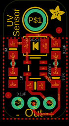
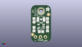
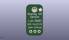
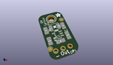

Contents
========

* [PROJ-ADAF-1918-STAN-01>Adafruit GUVA Analog UV Sensor Breakout PCB](#proj-adaf-1918-stan-01adafruit-guva-analog-uv-sensor-breakout-pcb)
	* [Images](#images)
	* [Interactive BOM](#interactive-bom)
	* [OOMP Parts](#oomp-parts)
	* [Tags](#tags)
  
![][im]
# PROJ-ADAF-1918-STAN-01>Adafruit GUVA Analog UV Sensor Breakout PCB

- ID: PROJ-ADAF-1918-STAN-01
- Hex ID: PRA1918
- Name: Adafruit GUVA Analog UV Sensor Breakout PCB
- Description: 

## Images
  
  

|eagleImage|kicadPcb3dFront|kicadPcb3dBack|kicadPcb3d|
| :---: | :---: | :---: | :---: |
|||||

## Interactive BOM

- Interactive BOM page: [ibom.html](kicad/bom/ibom.html)

## OOMP Parts
  

|OOMP Parts|
| :---: |
|<table><tr><td></td><td> C1</td><td>[CAPC-0805-X-NF100-V50 SMD (0805) 100 nF Capacitor (Ceramic) 50v](https://github.com/oomlout/oomlout_OOMP_parts/tree/main/CAPC-0805-X-NF100-V50/)</td><td>[C85N100](https://github.com/oomlout/oomlout_OOMP_parts/tree/main/CAPC-0805-X-NF100-V50/)</td></tr></table>|
|<table><tr><td></td><td> C2</td><td>[CAPC-0805-X-NF100-V50 SMD (0805) 100 nF Capacitor (Ceramic) 50v](https://github.com/oomlout/oomlout_OOMP_parts/tree/main/CAPC-0805-X-NF100-V50/)</td><td>[C85N100](https://github.com/oomlout/oomlout_OOMP_parts/tree/main/CAPC-0805-X-NF100-V50/)</td></tr></table>|
|<table><tr><td></td><td> JP2</td><td>[HEAD-I01-X-PI03-01 2.54 mm 3 Pin Header](https://github.com/oomlout/oomlout_OOMP_parts/tree/main/HEAD-I01-X-PI03-01/)</td><td>[H03](https://github.com/oomlout/oomlout_OOMP_parts/tree/main/HEAD-I01-X-PI03-01/)</td></tr></table>|
|RESE-0805-X-UNMATCHED-01, R1, 1.5239999999999998, 11.176, 270,R1, 1M, 0805-NO, microbuilder, (0.06, 0.44), R270|
|RESE-0805-X-UNMATCHED-01, R2, 8.382, 6.604, 90,R2, 3.3K, 0805-NO, microbuilder, (0.33, 0.26), R90|
|RESE-0805-X-UNMATCHED-01, R3, 1.5239999999999998, 6.604, 90,R3, 1K, 0805-NO, microbuilder, (0.06, 0.26), R90|
|UNMATCHED-UNMATCHED-X-UNMATCHED-01, U1, 5.08, 8.128, 90,U1, MCP6001, SOT23-5, microbuilder, (0.2, 0.32), R90|
|UNMATCHED-UNMATCHED-X-UNMATCHED-01, U2, 5.08, 11.684, 90,U2, GUVA-S12SD, GUVA-S12SD, microbuilder, (0.2, 0.46), R90|

## Tags

- hexID: PRA1918
- oompType: PROJ
- oompSize: ADAF
- oompColor: 1918
- oompDesc: STAN
- oompIndex: 01
- oompName: Adafruit GUVA Analog UV Sensor Breakout PCB
- sources: All source files from https://github.com/adafruit/Adafruit-GUVA-Analog-UV-Sensor-Breakout-PCB (source licence details in srcLicense.md)
- linkBuyPage: http://www.adafruit.com/products/1918
- oompPart: CAPC-0805-X-NF100-V50, C1, 5.08, 5.334, 0
- oompPart: CAPC-0805-X-NF100-V50, C2, 8.382, 11.176, 90
- oompPart: SKIP-UNMATCHED-X-UNMATCHED-01, FID1, 0.7619999999999999, 3.8099999999999996, 90
- oompPart: SKIP-UNMATCHED-X-UNMATCHED-01, FID2, 8.889999999999999, 14.224, 90
- oompPart: HEAD-I01-X-PI03-01, JP2, 4.826, 2.54, 180
- oompPart: RESE-0805-X-UNMATCHED-01, R1, 1.5239999999999998, 11.176, 270
- oompPart: RESE-0805-X-UNMATCHED-01, R2, 8.382, 6.604, 90
- oompPart: RESE-0805-X-UNMATCHED-01, R3, 1.5239999999999998, 6.604, 90
- oompPart: SKIP-UNMATCHED-X-UNMATCHED-01, U$6, 5.08, 15.875, 0
- oompPart: UNMATCHED-UNMATCHED-X-UNMATCHED-01, U1, 5.08, 8.128, 90
- oompPart: UNMATCHED-UNMATCHED-X-UNMATCHED-01, U2, 5.08, 11.684, 90
- rawPart: C1, 0.1uF, 0805-NO, microbuilder, (0.2, 0.21), R0
- rawPart: C2, 0.1uF, 0805-NO, microbuilder, (0.33, 0.44), R90
- rawPart: FID1, FIDUCIAL, FIDUCIAL_1MM, microbuilder, (0.03, 0.15), R90
- rawPart: FID2, FIDUCIAL, FIDUCIAL_1MM, microbuilder, (0.35, 0.56), R90
- rawPart: JP2, 1X03-CLEANBIG, adafruit, (0.19, 0.1), R180
- rawPart: R1, 1M, 0805-NO, microbuilder, (0.06, 0.44), R270
- rawPart: R2, 3.3K, 0805-NO, microbuilder, (0.33, 0.26), R90
- rawPart: R3, 1K, 0805-NO, microbuilder, (0.06, 0.26), R90
- rawPart: U$6, MOUNTINGHOLE2.5, MOUNTINGHOLE_2.5_PLATED, microbuilder, (0.2, 0.625), R0
- rawPart: U1, MCP6001, SOT23-5, microbuilder, (0.2, 0.32), R90
- rawPart: U2, GUVA-S12SD, GUVA-S12SD, microbuilder, (0.2, 0.46), R90
- oompID: PROJ-ADAF-1918-STAN-01

[im]: kicadPcb3d_450.png
