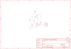

Contents
========

* [PRA1918 > Adafruit](#pra1918--adafruit)
	* [Schematic](#schematic)
	* [Interactive BOM](#interactive-bom)
	* [OOMP Parts](#oomp-parts)
	* [Images](#images)
	* [Tags](#tags)
  
![][im]
# PRA1918 > Adafruit

- ID: PROJ-ADAF-1918-STAN-01
- Hex ID: PRA1918
- Name: Adafruit
- Description: Adafruit
- Long Link: [http://oom.lt/PROJ-ADAF-1918-STAN-01](http://oom.lt/PROJ-ADAF-1918-STAN-01)
- Short Link: [http://oom.lt/PRA1918](http://oom.lt/PRA1918)

## Schematic
  

## Interactive BOM

- Interactive BOM page: [ibom.html](https://htmlpreview.github.io/?https://github.com/oomlout/oomlout_OOMP_projects/blob/main/PROJ-ADAF-1918-STAN-01/kicad/bom/ibom.html)

## OOMP Parts
  

|OOMP Parts|
| :---: |
|C1,CAPC-0805-X-NF100-V50,C1,0.1uF,CAP_CERAMIC0805-NOOUTLINE,0805-NO,Ceramic Capacitors,,|
|C2,CAPC-0805-X-NF100-V50,C2,0.1uF,CAP_CERAMIC0805-NOOUTLINE,0805-NO,Ceramic Capacitors,,|
|JP2,HEAD-I01-X-PI03-01,FID1,FIDUCIAL,FIDUCIAL,FIDUCIAL_1MM,Fiducial Alignment Points,EXCLUDE,|
|R1,RESE-0805-X-O105-01,FID2,FIDUCIAL,FIDUCIAL,FIDUCIAL_1MM,Fiducial Alignment Points,EXCLUDE,|
|R2,RESE-0805-X-UNMATCHED-01,JP2,,PINHD-1X3CB,1X03-CLEANBIG,PIN HEADER,,|
|R3,RESE-0805-X-O102-01,R1,1M,RESISTOR0805_NOOUTLINE,0805-NO,Resistors,,|
|U1,UNMATCHED-SO235-X-UNMATCHED-01,R2,3.3K,RESISTOR0805_NOOUTLINE,0805-NO,Resistors,,|
|U2,UNMATCHED-UNMATCHED-X-UNMATCHED-01,R3,1K,RESISTOR0805_NOOUTLINE,0805-NO,Resistors,,|

## Images
  
  

|kicadPcb3d|kicadPcb3dFront|kicadPcb3dBack|eagleImage|eagleSchemImage|
| :---: | :---: | :---: | :---: | :---: |
||||||

## Tags

- hexID: PRA1918
- oompType: PROJ
- oompSize: ADAF
- oompColor: 1918
- oompDesc: STAN
- oompIndex: 01
- oompName: Adafruit GUVA Analog UV Sensor Breakout PCB
- sources: All source files from https://github.com/adafruit/Adafruit-GUVA-Analog-UV-Sensor-Breakout-PCB (source licence details in srcLicense.md)
- linkBuyPage: http://www.adafruit.com/products/1918
- oompID: PROJ-ADAF-1918-STAN-01
- oompParts: C1,CAPC-0805-X-NF100-V50
- oompParts: C2,CAPC-0805-X-NF100-V50
- oompParts: JP2,HEAD-I01-X-PI03-01
- oompParts: R1,RESE-0805-X-O105-01
- oompParts: R2,RESE-0805-X-UNMATCHED-01
- oompParts: R3,RESE-0805-X-O102-01
- oompParts: U1,UNMATCHED-SO235-X-UNMATCHED-01
- oompParts: U2,UNMATCHED-UNMATCHED-X-UNMATCHED-01
- rawParts: C1,0.1uF,CAP_CERAMIC0805-NOOUTLINE,0805-NO,Ceramic Capacitors,,
- rawParts: C2,0.1uF,CAP_CERAMIC0805-NOOUTLINE,0805-NO,Ceramic Capacitors,,
- rawParts: FID1,FIDUCIAL,FIDUCIAL,FIDUCIAL_1MM,Fiducial Alignment Points,EXCLUDE,
- rawParts: FID2,FIDUCIAL,FIDUCIAL,FIDUCIAL_1MM,Fiducial Alignment Points,EXCLUDE,
- rawParts: JP2,,PINHD-1X3CB,1X03-CLEANBIG,PIN HEADER,,
- rawParts: R1,1M,RESISTOR0805_NOOUTLINE,0805-NO,Resistors,,
- rawParts: R2,3.3K,RESISTOR0805_NOOUTLINE,0805-NO,Resistors,,
- rawParts: R3,1K,RESISTOR0805_NOOUTLINE,0805-NO,Resistors,,
- rawParts: U$6,MOUNTINGHOLE2.5,MOUNTINGHOLE2.5,MOUNTINGHOLE_2.5_PLATED,Mounting Hole,EXCLUDE,
- rawParts: U1,MCP6001,OPAMP_SINGLESOT235,SOT23-5,Single-Output Op-Amp,,
- rawParts: U2,GUVA-S12SD,UV_GUVA-S12SD,GUVA-S12SD,UV Sensor - GUVA-S12SD,,

[im]: kicadPcb3d_450.png
