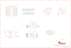

Contents
========

* [PRA1932 > Adafruit](#pra1932--adafruit)
	* [Schematic](#schematic)
	* [Interactive BOM](#interactive-bom)
	* [OOMP Parts](#oomp-parts)
	* [Images](#images)
	* [Tags](#tags)
  
![][im]
# PRA1932 > Adafruit

- ID: PROJ-ADAF-1932-STAN-01
- Hex ID: PRA1932
- Name: Adafruit
- Description: Adafruit
- Long Link: [http://oom.lt/PROJ-ADAF-1932-STAN-01](http://oom.lt/PROJ-ADAF-1932-STAN-01)
- Short Link: [http://oom.lt/PRA1932](http://oom.lt/PRA1932)

## Schematic
  

## Interactive BOM

- Interactive BOM page: [ibom.html](https://htmlpreview.github.io/?https://github.com/oomlout/oomlout_OOMP_projects/blob/main/PROJ-ADAF-1932-STAN-01/kicad/bom/ibom.html)

## OOMP Parts
  

|OOMP Parts|
| :---: |
|B1,UNMATCHED-UNMATCHED-UNMATCHED-UNMATCHED-UNMATCHED,B1,CR1220,BATTERYCR1220_SMT,CR1220,CR1220 SMT - Digikey: 3001K-ND,,|
|CONN1,UNMATCHED-UNMATCHED-UNMATCHED-UNMATCHED-UNMATCHED,CONN1,HEADER-1X25,HEADER-1X25,1X25_ROUND_70MIL,,,|
|D1,UNMATCHED-UNMATCHED-UNMATCHED-UNMATCHED-UNMATCHED,D1,MBR120,DIODESOD-123,SOD-123,Diode,,|
|D2,UNMATCHED-UNMATCHED-UNMATCHED-UNMATCHED-UNMATCHED,D2,green,LED0805_NOOUTLINE,CHIPLED_0805_NOOUTLINE,LED,,|
|IC3,UNMATCHED-UNMATCHED-UNMATCHED-UNMATCHED-UNMATCHED,FID1,FIDUCIAL,FIDUCIAL,FIDUCIAL_1MM,Fiducial Alignment Points,EXCLUDE,|
|JP2,UNMATCHED-UNMATCHED-UNMATCHED-UNMATCHED-UNMATCHED,FID2,FIDUCIAL,FIDUCIAL,FIDUCIAL_1MM,Fiducial Alignment Points,EXCLUDE,|
|JP3,UNMATCHED-UNMATCHED-UNMATCHED-UNMATCHED-UNMATCHED,FID3,FIDUCIAL,FIDUCIAL,FIDUCIAL_1MM,Fiducial Alignment Points,EXCLUDE,|
|JP4,UNMATCHED-UNMATCHED-UNMATCHED-UNMATCHED-UNMATCHED,IC3,MAX4866T,MAX486X/SOT,SOT23-6,,,|
|JP5,UNMATCHED-UNMATCHED-UNMATCHED-UNMATCHED-UNMATCHED,JP2,,PINHD-1X1,1X01,PIN HEADER,,|
|JP6,UNMATCHED-UNMATCHED-UNMATCHED-UNMATCHED-UNMATCHED,JP3,,PINHD-1X1,1X01,PIN HEADER,,|
|JP7,UNMATCHED-UNMATCHED-UNMATCHED-UNMATCHED-UNMATCHED,JP4,,PINHD-1X1,1X01,PIN HEADER,,|
|JP8,UNMATCHED-UNMATCHED-UNMATCHED-UNMATCHED-UNMATCHED,JP5,,PINHD-1X1,1X01,PIN HEADER,,|
|JP9,UNMATCHED-UNMATCHED-UNMATCHED-UNMATCHED-UNMATCHED,JP6,,PINHD-1X1,1X01,PIN HEADER,,|
|JP10,UNMATCHED-UNMATCHED-UNMATCHED-UNMATCHED-UNMATCHED,JP7,,PINHD-1X1,1X01,PIN HEADER,,|
|JP11,UNMATCHED-UNMATCHED-UNMATCHED-UNMATCHED-UNMATCHED,JP8,,PINHD-1X1,1X01,PIN HEADER,,|
|JP12,UNMATCHED-UNMATCHED-UNMATCHED-UNMATCHED-UNMATCHED,JP9,,PINHD-1X1,1X01,PIN HEADER,,|
|JP13,UNMATCHED-UNMATCHED-UNMATCHED-UNMATCHED-UNMATCHED,JP10,,PINHD-1X1,1X01,PIN HEADER,,|
|JP14,UNMATCHED-UNMATCHED-UNMATCHED-UNMATCHED-UNMATCHED,JP11,,PINHD-1X1,1X01,PIN HEADER,,|
|JP15,UNMATCHED-UNMATCHED-UNMATCHED-UNMATCHED-UNMATCHED,JP12,,PINHD-1X1,1X01,PIN HEADER,,|
|MATRIX_PWR,UNMATCHED-UNMATCHED-UNMATCHED-UNMATCHED-UNMATCHED,JP13,,PINHD-1X1,1X01,PIN HEADER,,|
|Q1,UNMATCHED-UNMATCHED-UNMATCHED-UNMATCHED-UNMATCHED,JP14,,PINHD-1X1,1X01,PIN HEADER,,|
|Q2,UNMATCHED-UNMATCHED-UNMATCHED-UNMATCHED-UNMATCHED,JP15,,HEADER-2X8_SHROUDED,2X08_SHROUDED,,,|
|R1,UNMATCHED-UNMATCHED-UNMATCHED-UNMATCHED-UNMATCHED,MATRIX_PWR,PINHEAD,PINHEAD,TERMBLOCK508,,,|
|R2,UNMATCHED-UNMATCHED-UNMATCHED-UNMATCHED-UNMATCHED,Q1,AOD514,MOSFET-N_TO252,TO252,N-Channel Mosfet,,|
|R3,UNMATCHED-UNMATCHED-UNMATCHED-UNMATCHED-UNMATCHED,Q2,AOD417,IRFR5305,D-PAK_TO252AA,HEXFET Power MOSFET,,|
|R4,UNMATCHED-UNMATCHED-UNMATCHED-UNMATCHED-UNMATCHED,R1,3.9K,RESISTOR0805_NOOUTLINE,0805-NO,Resistors,,|
|R13,UNMATCHED-UNMATCHED-UNMATCHED-UNMATCHED-UNMATCHED,R2,3.9K,RESISTOR0805_NOOUTLINE,0805-NO,Resistors,,|
|RPI1,UNMATCHED-UNMATCHED-UNMATCHED-UNMATCHED-UNMATCHED,R3,3.9K,RESISTOR0805_NOOUTLINE,0805-NO,Resistors,,|
|SJ1,UNMATCHED-UNMATCHED-UNMATCHED-UNMATCHED-UNMATCHED,R4,1K,RESISTOR0805_NOOUTLINE,0805-NO,Resistors,,|
|U1,UNMATCHED-UNMATCHED-UNMATCHED-UNMATCHED-UNMATCHED,R13,1K,RESISTOR0805_NOOUTLINE,0805-NO,Resistors,,|
|U2,UNMATCHED-UNMATCHED-UNMATCHED-UNMATCHED-UNMATCHED,RPI1,RASPBERRYPI_BPLUS_HATSLOTS,RASPBERRYPI_BPLUS_HATSLOTS,PI_HAT_SLOTS,,,|
|U3,UNMATCHED-UNMATCHED-UNMATCHED-UNMATCHED-UNMATCHED,SJ1,WP,SOLDERJUMPER_CLOSED,SOLDERJUMPER_CLOSEDWIRE,Solder Jumper - Closed,,|
|U4,UNMATCHED-UNMATCHED-UNMATCHED-UNMATCHED-UNMATCHED,U1,CAT24C32,EEPROM_I2C_SOIC8_GENERIC,SOIC8_150MIL,Note: The same pinout is used for many I2C EEPROMs in SOIC8(150mil) from a variety of manufacturers and in various sizes.,,|
|U5,UNMATCHED-UNMATCHED-UNMATCHED-UNMATCHED-UNMATCHED,U2,2.1MMJACKSMT,2.1MMJACKSMT,DCJACK_2MM_SMT,2.1mm x 5.5mm THM DC jack with internal switch. Digikey part #PJ-102A, 4UCON part #05537,,|
|Y1,UNMATCHED-UNMATCHED-UNMATCHED-UNMATCHED-UNMATCHED,U3,74AHCT245,74LCX245,TSSOP20,74LCX245MTC - 5.0V Tolerant Bi-Directional Buffer,,|

## Images
  
  

|kicadPcb3d|kicadPcb3dFront|kicadPcb3dBack|eagleImage|eagleSchemImage|
| :---: | :---: | :---: | :---: | :---: |
||||||

## Tags

- hexID: PRA1932
- oompType: PROJ
- oompSize: ADAF
- oompColor: 1932
- oompDesc: STAN
- oompIndex: 01
- oompName: Adafruit RGB Matrix HAT PCB
- sources: All source files from https://github.com/adafruit/Adafruit-RGB-Matrix-HAT-PCB (source licence details in srcLicense.md)
- linkBuyPage: http://www.adafruit.com/products/1932
- oompID: PROJ-ADAF-1932-STAN-01
- oompParts: B1,UNMATCHED-UNMATCHED-UNMATCHED-UNMATCHED-UNMATCHED
- oompParts: CONN1,UNMATCHED-UNMATCHED-UNMATCHED-UNMATCHED-UNMATCHED
- oompParts: D1,UNMATCHED-UNMATCHED-UNMATCHED-UNMATCHED-UNMATCHED
- oompParts: D2,UNMATCHED-UNMATCHED-UNMATCHED-UNMATCHED-UNMATCHED
- oompParts: IC3,UNMATCHED-UNMATCHED-UNMATCHED-UNMATCHED-UNMATCHED
- oompParts: JP2,UNMATCHED-UNMATCHED-UNMATCHED-UNMATCHED-UNMATCHED
- oompParts: JP3,UNMATCHED-UNMATCHED-UNMATCHED-UNMATCHED-UNMATCHED
- oompParts: JP4,UNMATCHED-UNMATCHED-UNMATCHED-UNMATCHED-UNMATCHED
- oompParts: JP5,UNMATCHED-UNMATCHED-UNMATCHED-UNMATCHED-UNMATCHED
- oompParts: JP6,UNMATCHED-UNMATCHED-UNMATCHED-UNMATCHED-UNMATCHED
- oompParts: JP7,UNMATCHED-UNMATCHED-UNMATCHED-UNMATCHED-UNMATCHED
- oompParts: JP8,UNMATCHED-UNMATCHED-UNMATCHED-UNMATCHED-UNMATCHED
- oompParts: JP9,UNMATCHED-UNMATCHED-UNMATCHED-UNMATCHED-UNMATCHED
- oompParts: JP10,UNMATCHED-UNMATCHED-UNMATCHED-UNMATCHED-UNMATCHED
- oompParts: JP11,UNMATCHED-UNMATCHED-UNMATCHED-UNMATCHED-UNMATCHED
- oompParts: JP12,UNMATCHED-UNMATCHED-UNMATCHED-UNMATCHED-UNMATCHED
- oompParts: JP13,UNMATCHED-UNMATCHED-UNMATCHED-UNMATCHED-UNMATCHED
- oompParts: JP14,UNMATCHED-UNMATCHED-UNMATCHED-UNMATCHED-UNMATCHED
- oompParts: JP15,UNMATCHED-UNMATCHED-UNMATCHED-UNMATCHED-UNMATCHED
- oompParts: MATRIX_PWR,UNMATCHED-UNMATCHED-UNMATCHED-UNMATCHED-UNMATCHED
- oompParts: Q1,UNMATCHED-UNMATCHED-UNMATCHED-UNMATCHED-UNMATCHED
- oompParts: Q2,UNMATCHED-UNMATCHED-UNMATCHED-UNMATCHED-UNMATCHED
- oompParts: R1,UNMATCHED-UNMATCHED-UNMATCHED-UNMATCHED-UNMATCHED
- oompParts: R2,UNMATCHED-UNMATCHED-UNMATCHED-UNMATCHED-UNMATCHED
- oompParts: R3,UNMATCHED-UNMATCHED-UNMATCHED-UNMATCHED-UNMATCHED
- oompParts: R4,UNMATCHED-UNMATCHED-UNMATCHED-UNMATCHED-UNMATCHED
- oompParts: R13,UNMATCHED-UNMATCHED-UNMATCHED-UNMATCHED-UNMATCHED
- oompParts: RPI1,UNMATCHED-UNMATCHED-UNMATCHED-UNMATCHED-UNMATCHED
- oompParts: SJ1,UNMATCHED-UNMATCHED-UNMATCHED-UNMATCHED-UNMATCHED
- oompParts: U1,UNMATCHED-UNMATCHED-UNMATCHED-UNMATCHED-UNMATCHED
- oompParts: U2,UNMATCHED-UNMATCHED-UNMATCHED-UNMATCHED-UNMATCHED
- oompParts: U3,UNMATCHED-UNMATCHED-UNMATCHED-UNMATCHED-UNMATCHED
- oompParts: U4,UNMATCHED-UNMATCHED-UNMATCHED-UNMATCHED-UNMATCHED
- oompParts: U5,UNMATCHED-UNMATCHED-UNMATCHED-UNMATCHED-UNMATCHED
- oompParts: Y1,UNMATCHED-UNMATCHED-UNMATCHED-UNMATCHED-UNMATCHED
- rawParts: B1,CR1220,BATTERYCR1220_SMT,CR1220,CR1220 SMT - Digikey: 3001K-ND,,
- rawParts: CONN1,HEADER-1X25,HEADER-1X25,1X25_ROUND_70MIL,,,
- rawParts: D1,MBR120,DIODESOD-123,SOD-123,Diode,,
- rawParts: D2,green,LED0805_NOOUTLINE,CHIPLED_0805_NOOUTLINE,LED,,
- rawParts: FID1,FIDUCIAL,FIDUCIAL,FIDUCIAL_1MM,Fiducial Alignment Points,EXCLUDE,
- rawParts: FID2,FIDUCIAL,FIDUCIAL,FIDUCIAL_1MM,Fiducial Alignment Points,EXCLUDE,
- rawParts: FID3,FIDUCIAL,FIDUCIAL,FIDUCIAL_1MM,Fiducial Alignment Points,EXCLUDE,
- rawParts: IC3,MAX4866T,MAX486X/SOT,SOT23-6,,,
- rawParts: JP2,,PINHD-1X1,1X01,PIN HEADER,,
- rawParts: JP3,,PINHD-1X1,1X01,PIN HEADER,,
- rawParts: JP4,,PINHD-1X1,1X01,PIN HEADER,,
- rawParts: JP5,,PINHD-1X1,1X01,PIN HEADER,,
- rawParts: JP6,,PINHD-1X1,1X01,PIN HEADER,,
- rawParts: JP7,,PINHD-1X1,1X01,PIN HEADER,,
- rawParts: JP8,,PINHD-1X1,1X01,PIN HEADER,,
- rawParts: JP9,,PINHD-1X1,1X01,PIN HEADER,,
- rawParts: JP10,,PINHD-1X1,1X01,PIN HEADER,,
- rawParts: JP11,,PINHD-1X1,1X01,PIN HEADER,,
- rawParts: JP12,,PINHD-1X1,1X01,PIN HEADER,,
- rawParts: JP13,,PINHD-1X1,1X01,PIN HEADER,,
- rawParts: JP14,,PINHD-1X1,1X01,PIN HEADER,,
- rawParts: JP15,,HEADER-2X8_SHROUDED,2X08_SHROUDED,,,
- rawParts: MATRIX_PWR,PINHEAD,PINHEAD,TERMBLOCK508,,,
- rawParts: Q1,AOD514,MOSFET-N_TO252,TO252,N-Channel Mosfet,,
- rawParts: Q2,AOD417,IRFR5305,D-PAK_TO252AA,HEXFET Power MOSFET,,
- rawParts: R1,3.9K,RESISTOR0805_NOOUTLINE,0805-NO,Resistors,,
- rawParts: R2,3.9K,RESISTOR0805_NOOUTLINE,0805-NO,Resistors,,
- rawParts: R3,3.9K,RESISTOR0805_NOOUTLINE,0805-NO,Resistors,,
- rawParts: R4,1K,RESISTOR0805_NOOUTLINE,0805-NO,Resistors,,
- rawParts: R13,1K,RESISTOR0805_NOOUTLINE,0805-NO,Resistors,,
- rawParts: RPI1,RASPBERRYPI_BPLUS_HATSLOTS,RASPBERRYPI_BPLUS_HATSLOTS,PI_HAT_SLOTS,,,
- rawParts: SJ1,WP,SOLDERJUMPER_CLOSED,SOLDERJUMPER_CLOSEDWIRE,Solder Jumper - Closed,,
- rawParts: U1,CAT24C32,EEPROM_I2C_SOIC8_GENERIC,SOIC8_150MIL,Note: The same pinout is used for many I2C EEPROMs in SOIC8(150mil) from a variety of manufacturers and in various sizes.,,
- rawParts: U2,2.1MMJACKSMT,2.1MMJACKSMT,DCJACK_2MM_SMT,2.1mm x 5.5mm THM DC jack with internal switch. Digikey part #PJ-102A, 4UCON part #05537,,
- rawParts: U3,74AHCT245,74LCX245,TSSOP20,74LCX245MTC - 5.0V Tolerant Bi-Directional Buffer,,
- rawParts: U4,DS1307,RTC_DS1307,SOIC8_150MIL,DS1307 I2C RTC with 56-Bytes RAM,,
- rawParts: U5,74AHCT245,74LCX245,TSSOP20,74LCX245MTC - 5.0V Tolerant Bi-Directional Buffer,,
- rawParts: Y1,32.768kHz,CRYSTAL8.0X3.8,CRYSTAL_8X3.8,Crystals,,

[im]: kicadPcb3d_450.png
