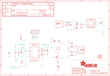

Contents
========

* [PRA1944 > Adafruit](#pra1944--adafruit)
	* [Images](#images)
	* [Tags](#tags)
  
![][im]
# PRA1944 > Adafruit

- ID: PROJ-ADAF-1944-STAN-01
- Hex ID: PRA1944
- Name: Adafruit
- Description: Adafruit

## Images
  
  

|kicadPcb3d|kicadPcb3dFront|kicadPcb3dBack|eagleImage|eagleSchemImage|
| :---: | :---: | :---: | :---: | :---: |
||||||

## Tags

- hexID: PRA1944
- oompType: PROJ
- oompSize: ADAF
- oompColor: 1944
- oompDesc: STAN
- oompIndex: 01
- oompName: Adafruit PowerBoost 500 Charger PCB
- sources: All source files from https://github.com/adafruit/Adafruit-PowerBoost-500-Charger-PCB (source licence details in srcLicense.md)
- linkBuyPage: http://www.adafruit.com/products/1944
- oompID: PROJ-ADAF-1944-STAN-01
- oompParts: B1,UNMATCHED-UNMATCHED-UNMATCHED-UNMATCHED-UNMATCHED
- oompParts: C1,UNMATCHED-UNMATCHED-UNMATCHED-UNMATCHED-UNMATCHED
- oompParts: C2,UNMATCHED-UNMATCHED-UNMATCHED-UNMATCHED-UNMATCHED
- oompParts: C4,UNMATCHED-UNMATCHED-UNMATCHED-UNMATCHED-UNMATCHED
- oompParts: C5,UNMATCHED-UNMATCHED-UNMATCHED-UNMATCHED-UNMATCHED
- oompParts: C6,UNMATCHED-UNMATCHED-UNMATCHED-UNMATCHED-UNMATCHED
- oompParts: CN1,UNMATCHED-UNMATCHED-UNMATCHED-UNMATCHED-UNMATCHED
- oompParts: JP1,UNMATCHED-UNMATCHED-UNMATCHED-UNMATCHED-UNMATCHED
- oompParts: JP2,UNMATCHED-UNMATCHED-UNMATCHED-UNMATCHED-UNMATCHED
- oompParts: L1,UNMATCHED-UNMATCHED-UNMATCHED-UNMATCHED-UNMATCHED
- oompParts: LBO,UNMATCHED-UNMATCHED-UNMATCHED-UNMATCHED-UNMATCHED
- oompParts: LED3,UNMATCHED-UNMATCHED-UNMATCHED-UNMATCHED-UNMATCHED
- oompParts: LED4,UNMATCHED-UNMATCHED-UNMATCHED-UNMATCHED-UNMATCHED
- oompParts: PWR,UNMATCHED-UNMATCHED-UNMATCHED-UNMATCHED-UNMATCHED
- oompParts: Q1,UNMATCHED-UNMATCHED-UNMATCHED-UNMATCHED-UNMATCHED
- oompParts: R1,UNMATCHED-UNMATCHED-UNMATCHED-UNMATCHED-UNMATCHED
- oompParts: R2,UNMATCHED-UNMATCHED-UNMATCHED-UNMATCHED-UNMATCHED
- oompParts: R3,UNMATCHED-UNMATCHED-UNMATCHED-UNMATCHED-UNMATCHED
- oompParts: R4,UNMATCHED-UNMATCHED-UNMATCHED-UNMATCHED-UNMATCHED
- oompParts: R5,UNMATCHED-UNMATCHED-UNMATCHED-UNMATCHED-UNMATCHED
- oompParts: R6,UNMATCHED-UNMATCHED-UNMATCHED-UNMATCHED-UNMATCHED
- oompParts: R7,UNMATCHED-UNMATCHED-UNMATCHED-UNMATCHED-UNMATCHED
- oompParts: R8,UNMATCHED-UNMATCHED-UNMATCHED-UNMATCHED-UNMATCHED
- oompParts: R9,UNMATCHED-UNMATCHED-UNMATCHED-UNMATCHED-UNMATCHED
- oompParts: R10,UNMATCHED-UNMATCHED-UNMATCHED-UNMATCHED-UNMATCHED
- oompParts: R11,UNMATCHED-UNMATCHED-UNMATCHED-UNMATCHED-UNMATCHED
- oompParts: R12,UNMATCHED-UNMATCHED-UNMATCHED-UNMATCHED-UNMATCHED
- oompParts: R13,UNMATCHED-UNMATCHED-UNMATCHED-UNMATCHED-UNMATCHED
- oompParts: R20,UNMATCHED-UNMATCHED-UNMATCHED-UNMATCHED-UNMATCHED
- oompParts: U1,UNMATCHED-UNMATCHED-UNMATCHED-UNMATCHED-UNMATCHED
- oompParts: U2,UNMATCHED-UNMATCHED-UNMATCHED-UNMATCHED-UNMATCHED
- oompParts: X1,UNMATCHED-UNMATCHED-UNMATCHED-UNMATCHED-UNMATCHED
- oompParts: X2,UNMATCHED-UNMATCHED-UNMATCHED-UNMATCHED-UNMATCHED
- rawParts: B1,1.8-5V,BATTERY,JSTPH2,CR1220 SMT - Digikey: 3001K-ND,,
- rawParts: C1,10uF,CAP_CERAMIC0805-NOOUTLINE,0805-NO,Ceramic Capacitors,,
- rawParts: C2,2.2uF,CAP_CERAMIC0805-NOOUTLINE,0805-NO,Ceramic Capacitors,,
- rawParts: C4,0.1uF,CAP_CERAMIC0805-NOOUTLINE,0805-NO,Ceramic Capacitors,,
- rawParts: C5,100uF/6V,CAP_TANTALUMB/3528_REFLOW,EIA3528-21/B-R,Tantalum Capacitors,,
- rawParts: C6,10µF,CAP_CERAMIC0805-NOOUTLINE,0805-NO,Ceramic Capacitors,,
- rawParts: CN1,USBA_FEMALE,USB_TYPEAPTHFML,USB_HOST-PTH,USB - Type A Connectors,,
- rawParts: FID2,FIDUCIAL,FIDUCIAL,FIDUCIAL_1MM,Fiducial Alignment Points,EXCLUDE,
- rawParts: FID3,FIDUCIAL,FIDUCIAL,FIDUCIAL_1MM,Fiducial Alignment Points,EXCLUDE,
- rawParts: JP1,,PINHD-1X6CB,1X06-CLEANBIG,PIN HEADER,,
- rawParts: JP2,,HEADER-1X2ROUND,1X02_ROUND,PIN HEADER,,
- rawParts: L1,VLC5045-6.8uH,INDUCTORTDK_VLC5045,INDUCTOR_5X5MM_TDK_VLC5045,Inductors,,
- rawParts: LBO,RED,LED0805_NOOUTLINE,CHIPLED_0805_NOOUTLINE,LED,,
- rawParts: LED3,ORANGE,LED0805_NOOUTLINE,CHIPLED_0805_NOOUTLINE,LED,,
- rawParts: LED4,GREEN,LED0805_NOOUTLINE,CHIPLED_0805_NOOUTLINE,LED,,
- rawParts: PWR,BLUE,LED0805_NOOUTLINE,CHIPLED_0805_NOOUTLINE,LED,,
- rawParts: Q1,MMUN2133LT1G,MUN2114T1-PNP_DRIVER-SC59-BEC,SC59-BEC,PNP Bias Resistor Transistor,,
- rawParts: R1,1.87Mohm,RESISTOR0805_NOOUTLINE,0805-NO,Resistors,,
- rawParts: R2,340K,RESISTOR0805_NOOUTLINE,0805-NO,Resistors,,
- rawParts: R3,1.87Mohm,RESISTOR0805_NOOUTLINE,0805-NO,Resistors,,
- rawParts: R4,200K,RESISTOR0805_NOOUTLINE,0805-NO,Resistors,,
- rawParts: R5,1K,RESISTOR0805_NOOUTLINE,0805-NO,Resistors,,
- rawParts: R6,470,RESISTOR0805_NOOUTLINE,0805-NO,Resistors,,
- rawParts: R7,1K,RESISTOR0805_NOOUTLINE,0805-NO,Resistors,,
- rawParts: R8,2k,RESISTOR0805_NOOUTLINE,0805-NO,Resistors,,
- rawParts: R9,75K 1%,RESISTOR0805_NOOUTLINE,0805-NO,Resistors,,
- rawParts: R10,49.9K 1%,RESISTOR0805_NOOUTLINE,0805-NO,Resistors,,
- rawParts: R11,75K 1%,RESISTOR0805_NOOUTLINE,0805-NO,Resistors,,
- rawParts: R12,49.9K 1%,RESISTOR0805_NOOUTLINE,0805-NO,Resistors,,
- rawParts: R13,340K,RESISTOR0805_NOOUTLINE,0805-NO,Resistors,,
- rawParts: R20,1K,RESISTOR0805_NOOUTLINE,0805-NO,Resistors,,
- rawParts: U$10,MOUNTINGHOLE2.5,MOUNTINGHOLE2.5,MOUNTINGHOLE_2.5_PLATED,Mounting Hole,EXCLUDE,
- rawParts: U$12,MOUNTINGHOLE2.5,MOUNTINGHOLE2.5,MOUNTINGHOLE_2.5_PLATED,Mounting Hole,EXCLUDE,
- rawParts: U1,TPS61090RSAR,VREG_TPS6103X,PVQFN-16,TPS6103x 4A Boost - 1.8-5.5V Input, Adjustable Output to 5.5V,,
- rawParts: U2,MCP73831T-2ACI/OT,MCP73831/2,SOT23-5,MCP73831/2 LIPO Charger,,
- rawParts: X1,,TERMBLOCK_1X2,TERMBLOCK_1X2-3.5MM,3.5mm Terminal block,,
- rawParts: X2,microUSB,USBMICRO_20329,4UCONN_20329,USB Connectors,,

[im]: kicadPcb3d_450.png
