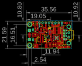
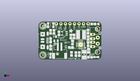
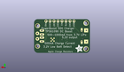
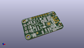

Contents
========

* [PROJ-ADAF-1944-STAN-01>Adafruit PowerBoost 500 Charger PCB](#proj-adaf-1944-stan-01adafruit-powerboost-500-charger-pcb)
	* [Images](#images)
	* [Interactive BOM](#interactive-bom)
	* [OOMP Parts](#oomp-parts)
	* [Tags](#tags)
  
![][im]
# PROJ-ADAF-1944-STAN-01>Adafruit PowerBoost 500 Charger PCB

- ID: PROJ-ADAF-1944-STAN-01
- Hex ID: PRA1944
- Name: Adafruit PowerBoost 500 Charger PCB
- Description: 

## Images
  
  

|eagleImage|kicadPcb3dFront|kicadPcb3dBack|kicadPcb3d|
| :---: | :---: | :---: | :---: |
|||||

## Interactive BOM

- Interactive BOM page: [ibom.html](kicad/bom/ibom.html)

## OOMP Parts
  

|OOMP Parts|
| :---: |
|UNMATCHED-UNMATCHED-X-UNMATCHED-01, B1, 11.937999999999999, 3.556, 180,B1, 1.8-5V, JSTPH2, microbuilder, (0.47, 0.14), R180|
|<table><tr><td></td><td> C1</td><td>[CAPC-0805-X-UF10-V25 SMD (0805) 10 uF Capacitor (Ceramic) 25v](https://github.com/oomlout/oomlout_OOMP_parts/tree/main/CAPC-0805-X-UF10-V25/)</td><td>[C85U010](https://github.com/oomlout/oomlout_OOMP_parts/tree/main/CAPC-0805-X-UF10-V25/)</td></tr></table>|
|CAPC-0805-X-UNMATCHED-01, C2, 28.194000000000003, 4.953, 270,C2, 2.2uF, 0805-NO, microbuilder, (1.11, 0.195), R270|
|<table><tr><td></td><td> C4</td><td>[CAPC-0805-X-NF100-V50 SMD (0805) 100 nF Capacitor (Ceramic) 50v](https://github.com/oomlout/oomlout_OOMP_parts/tree/main/CAPC-0805-X-NF100-V50/)</td><td>[C85N100](https://github.com/oomlout/oomlout_OOMP_parts/tree/main/CAPC-0805-X-NF100-V50/)</td></tr></table>|
|ERROR, C5 100uF/6V EIA3528-21/B-R, 0, 0, 0,C5, 100uF/6V, EIA3528-21/B-R, microbuilder, (1.015, 0.11), R90|
|<table><tr><td></td><td> C6</td><td>[CAPC-0805-X-UF10-V25 SMD (0805) 10 uF Capacitor (Ceramic) 25v](https://github.com/oomlout/oomlout_OOMP_parts/tree/main/CAPC-0805-X-UF10-V25/)</td><td>[C85U010](https://github.com/oomlout/oomlout_OOMP_parts/tree/main/CAPC-0805-X-UF10-V25/)</td></tr></table>|
|UNMATCHED-UNMATCHED-X-UNMATCHED-01, CN1, 37.083999999999996, 10.795, 90,CN1, USBA_FEMALE, USB_HOST-PTH, microbuilder, (1.46, 0.425), R90|
|UNMATCHED-UNMATCHED-X-UNMATCHED-01, JP1, 21.59, 20.32, 0,JP1, 1X06-CLEANBIG, adafruit, (0.85, 0.8), R0|
|UNMATCHED-UNMATCHED-X-UNMATCHED-01, JP2, 11.43, 20.32, 0,JP2, 1X02_ROUND, microbuilder, (0.45, 0.8), R0|
|UNMATCHED-UNMATCHED-X-UNMATCHED-01, L1, 24.020999963999998, 14.125999942, 0,L1, VLC5045-6.8uH, INDUCTOR_5X5MM_TDK_VLC5045, microbuilder, (0.94570866, 0.55614173), R0|
|UNMATCHED-UNMATCHED-X-UNMATCHED-01, LBO, 6.731, 2.1590000000000003, 180,LBO, RED, CHIPLED_0805_NOOUTLINE, microbuilder, (0.265, 0.085), R180|
|UNMATCHED-UNMATCHED-X-UNMATCHED-01, LED3, 8.382, 19.558, 180,LED3, ORANGE, CHIPLED_0805_NOOUTLINE, microbuilder, (0.33, 0.77), R180|
|UNMATCHED-UNMATCHED-X-UNMATCHED-01, LED4, 5.460999999999999, 19.558, 0,LED4, GREEN, CHIPLED_0805_NOOUTLINE, microbuilder, (0.215, 0.77), R0|
|UNMATCHED-UNMATCHED-X-UNMATCHED-01, PWR, 32.570999881999995, 1.365000064, 90,PWR, BLUE, CHIPLED_0805_NOOUTLINE, microbuilder, (1.28232283, 0.05374016), R90|
|UNMATCHED-UNMATCHED-X-UNMATCHED-01, Q1, 9.906, 11.811, 0,Q1, MMUN2133LT1G, SC59-BEC, transistor, (0.39, 0.465), R0|
|RESE-0805-X-UNMATCHED-01, R1, 18.287999999999997, 6.858, 180,R1, 1.87Mohm, 0805-NO, microbuilder, (0.72, 0.27), R180|
|RESE-0805-X-UNMATCHED-01, R2, 19.177, 9.652, 270,R2, 340K, 0805-NO, microbuilder, (0.755, 0.38), R270|
|RESE-0805-X-UNMATCHED-01, R3, 22.987, 3.0479999999999996, 270,R3, 1.87Mohm, 0805-NO, microbuilder, (0.905, 0.12), R270|
|RESE-0805-X-UNMATCHED-01, R4, 21.081999999999997, 3.0479999999999996, 270,R4, 200K, 0805-NO, microbuilder, (0.83, 0.12), R270|
|<table><tr><td></td><td> R5</td><td>[RESE-0805-X-O102-01 SMD (0805) 1k Ohm Resistor](https://github.com/oomlout/oomlout_OOMP_parts/tree/main/RESE-0805-X-O102-01/)</td><td>[R85102](https://github.com/oomlout/oomlout_OOMP_parts/tree/main/RESE-0805-X-O102-01/)</td></tr></table>|
|RESE-0805-X-UNMATCHED-01, R6, 8.762999999999998, 15.748, 270,R6, 470, 0805-NO, microbuilder, (0.345, 0.62), R270|
|<table><tr><td></td><td> R7</td><td>[RESE-0805-X-O102-01 SMD (0805) 1k Ohm Resistor](https://github.com/oomlout/oomlout_OOMP_parts/tree/main/RESE-0805-X-O102-01/)</td><td>[R85102](https://github.com/oomlout/oomlout_OOMP_parts/tree/main/RESE-0805-X-O102-01/)</td></tr></table>|
|RESE-0805-X-UNMATCHED-01, R8, 11.557, 14.858999999999998, 90,R8, 2k, 0805-NO, microbuilder, (0.455, 0.585), R90|
|ERROR, R9 75K 1%, 0, 0, 0,R9, 75K, 1%, 0805-NO, microbuilder, (1.1019685, 0.34003937), R270|
|ERROR, R10 49.9K 1%, 0, 0, 0,R10, 49.9K, 1%, 0805-NO, microbuilder, (1.10125984, 0.48240157), R90|
|ERROR, R11 75K 1%, 0, 0, 0,R11, 75K, 1%, 0805-NO, microbuilder, (1.22, 0.795), R180|
|ERROR, R12 49.9K 1%, 0, 0, 0,R12, 49.9K, 1%, 0805-NO, microbuilder, (1.1, 0.625), R270|
|RESE-0805-X-UNMATCHED-01, R13, 18.636000065999998, 3.174000002, 90,R13, 340K, 0805-NO, microbuilder, (0.73370079, 0.12496063), R90|
|<table><tr><td></td><td> R20</td><td>[RESE-0805-X-O102-01 SMD (0805) 1k Ohm Resistor](https://github.com/oomlout/oomlout_OOMP_parts/tree/main/RESE-0805-X-O102-01/)</td><td>[R85102](https://github.com/oomlout/oomlout_OOMP_parts/tree/main/RESE-0805-X-O102-01/)</td></tr></table>|
|UNMATCHED-UNMATCHED-X-UNMATCHED-01, U1, 23.762999972, 8.427999908, 180,U1, TPS61090RSAR, PVQFN-16, microbuilder, (0.93555118, 0.33181102), R180|
|UNMATCHED-UNMATCHED-X-UNMATCHED-01, U2, 14.604999999999999, 14.858999999999998, 90,U2, MCP73831T-2ACI/OT, SOT23-5, microbuilder, (0.575, 0.585), R90|
|UNMATCHED-UNMATCHED-X-UNMATCHED-01, X1, 33.400999999999996, 10.668, 90,X1, TERMBLOCK_1X2-3.5MM, microbuilder, (1.315, 0.42), R90|
|UNMATCHED-UNMATCHED-X-UNMATCHED-01, X2, 4.3180000000000005, 10.795, 270,X2, microUSB, 4UCONN_20329, microbuilder, (0.17, 0.425), R270|

## Tags

- hexID: PRA1944
- oompType: PROJ
- oompSize: ADAF
- oompColor: 1944
- oompDesc: STAN
- oompIndex: 01
- oompName: Adafruit PowerBoost 500 Charger PCB
- sources: All source files from https://github.com/adafruit/Adafruit-PowerBoost-500-Charger-PCB (source licence details in srcLicense.md)
- linkBuyPage: http://www.adafruit.com/products/1944
- oompPart: UNMATCHED-UNMATCHED-X-UNMATCHED-01, B1, 11.937999999999999, 3.556, 180
- oompPart: CAPC-0805-X-UF10-V25, C1, 18.287999999999997, 13.081, 270
- oompPart: CAPC-0805-X-UNMATCHED-01, C2, 28.194000000000003, 4.953, 270
- oompPart: CAPC-0805-X-NF100-V50, C4, 20.066, 13.081, 270
- oompPart: ERROR, C5 100uF/6V EIA3528-21/B-R, 0, 0, 0
- oompPart: CAPC-0805-X-UF10-V25, C6, 6.858, 10.921999999999999, 270
- oompPart: UNMATCHED-UNMATCHED-X-UNMATCHED-01, CN1, 37.083999999999996, 10.795, 90
- oompPart: SKIP-UNMATCHED-X-UNMATCHED-01, FID2, 10.690999953999999, 3.1510000479999998, 0
- oompPart: SKIP-UNMATCHED-X-UNMATCHED-01, FID3, 33.782, 20.193, 0
- oompPart: UNMATCHED-UNMATCHED-X-UNMATCHED-01, JP1, 21.59, 20.32, 0
- oompPart: UNMATCHED-UNMATCHED-X-UNMATCHED-01, JP2, 11.43, 20.32, 0
- oompPart: UNMATCHED-UNMATCHED-X-UNMATCHED-01, L1, 24.020999963999998, 14.125999942, 0
- oompPart: UNMATCHED-UNMATCHED-X-UNMATCHED-01, LBO, 6.731, 2.1590000000000003, 180
- oompPart: UNMATCHED-UNMATCHED-X-UNMATCHED-01, LED3, 8.382, 19.558, 180
- oompPart: UNMATCHED-UNMATCHED-X-UNMATCHED-01, LED4, 5.460999999999999, 19.558, 0
- oompPart: UNMATCHED-UNMATCHED-X-UNMATCHED-01, PWR, 32.570999881999995, 1.365000064, 90
- oompPart: UNMATCHED-UNMATCHED-X-UNMATCHED-01, Q1, 9.906, 11.811, 0
- oompPart: RESE-0805-X-UNMATCHED-01, R1, 18.287999999999997, 6.858, 180
- oompPart: RESE-0805-X-UNMATCHED-01, R2, 19.177, 9.652, 270
- oompPart: RESE-0805-X-UNMATCHED-01, R3, 22.987, 3.0479999999999996, 270
- oompPart: RESE-0805-X-UNMATCHED-01, R4, 21.081999999999997, 3.0479999999999996, 270
- oompPart: RESE-0805-X-O102-01, R5, 29.083, 1.27, 180
- oompPart: RESE-0805-X-UNMATCHED-01, R6, 8.762999999999998, 15.748, 270
- oompPart: RESE-0805-X-O102-01, R7, 6.858, 15.748, 270
- oompPart: RESE-0805-X-UNMATCHED-01, R8, 11.557, 14.858999999999998, 90
- oompPart: ERROR, R9 75K 1%, 0, 0, 0
- oompPart: ERROR, R10 49.9K 1%, 0, 0, 0
- oompPart: ERROR, R11 75K 1%, 0, 0, 0
- oompPart: ERROR, R12 49.9K 1%, 0, 0, 0
- oompPart: RESE-0805-X-UNMATCHED-01, R13, 18.636000065999998, 3.174000002, 90
- oompPart: RESE-0805-X-O102-01, R20, 6.858, 6.731, 90
- oompPart: SKIP-UNMATCHED-X-UNMATCHED-01, U$10, 2.54, 19.049999999999997, 0
- oompPart: SKIP-UNMATCHED-X-UNMATCHED-01, U$12, 2.54, 2.54, 0
- oompPart: UNMATCHED-UNMATCHED-X-UNMATCHED-01, U1, 23.762999972, 8.427999908, 180
- oompPart: UNMATCHED-UNMATCHED-X-UNMATCHED-01, U2, 14.604999999999999, 14.858999999999998, 90
- oompPart: UNMATCHED-UNMATCHED-X-UNMATCHED-01, X1, 33.400999999999996, 10.668, 90
- oompPart: UNMATCHED-UNMATCHED-X-UNMATCHED-01, X2, 4.3180000000000005, 10.795, 270
- rawPart: B1, 1.8-5V, JSTPH2, microbuilder, (0.47, 0.14), R180
- rawPart: C1, 10uF, 0805-NO, microbuilder, (0.72, 0.515), R270
- rawPart: C2, 2.2uF, 0805-NO, microbuilder, (1.11, 0.195), R270
- rawPart: C4, 0.1uF, 0805-NO, microbuilder, (0.79, 0.515), R270
- rawPart: C5, 100uF/6V, EIA3528-21/B-R, microbuilder, (1.015, 0.11), R90
- rawPart: C6, 10uF, 0805-NO, microbuilder, (0.27, 0.43), R270
- rawPart: CN1, USBA_FEMALE, USB_HOST-PTH, microbuilder, (1.46, 0.425), R90
- rawPart: FID2, FIDUCIAL, FIDUCIAL_1MM, microbuilder, (0.42090551, 0.12405512), R0
- rawPart: FID3, FIDUCIAL, FIDUCIAL_1MM, microbuilder, (1.33, 0.795), R0
- rawPart: JP1, 1X06-CLEANBIG, adafruit, (0.85, 0.8), R0
- rawPart: JP2, 1X02_ROUND, microbuilder, (0.45, 0.8), R0
- rawPart: L1, VLC5045-6.8uH, INDUCTOR_5X5MM_TDK_VLC5045, microbuilder, (0.94570866, 0.55614173), R0
- rawPart: LBO, RED, CHIPLED_0805_NOOUTLINE, microbuilder, (0.265, 0.085), R180
- rawPart: LED3, ORANGE, CHIPLED_0805_NOOUTLINE, microbuilder, (0.33, 0.77), R180
- rawPart: LED4, GREEN, CHIPLED_0805_NOOUTLINE, microbuilder, (0.215, 0.77), R0
- rawPart: PWR, BLUE, CHIPLED_0805_NOOUTLINE, microbuilder, (1.28232283, 0.05374016), R90
- rawPart: Q1, MMUN2133LT1G, SC59-BEC, transistor, (0.39, 0.465), R0
- rawPart: R1, 1.87Mohm, 0805-NO, microbuilder, (0.72, 0.27), R180
- rawPart: R2, 340K, 0805-NO, microbuilder, (0.755, 0.38), R270
- rawPart: R3, 1.87Mohm, 0805-NO, microbuilder, (0.905, 0.12), R270
- rawPart: R4, 200K, 0805-NO, microbuilder, (0.83, 0.12), R270
- rawPart: R5, 1K, 0805-NO, microbuilder, (1.145, 0.05), R180
- rawPart: R6, 470, 0805-NO, microbuilder, (0.345, 0.62), R270
- rawPart: R7, 1K, 0805-NO, microbuilder, (0.27, 0.62), R270
- rawPart: R8, 2k, 0805-NO, microbuilder, (0.455, 0.585), R90
- rawPart: R9, 75K, 1%, 0805-NO, microbuilder, (1.1019685, 0.34003937), R270
- rawPart: R10, 49.9K, 1%, 0805-NO, microbuilder, (1.10125984, 0.48240157), R90
- rawPart: R11, 75K, 1%, 0805-NO, microbuilder, (1.22, 0.795), R180
- rawPart: R12, 49.9K, 1%, 0805-NO, microbuilder, (1.1, 0.625), R270
- rawPart: R13, 340K, 0805-NO, microbuilder, (0.73370079, 0.12496063), R90
- rawPart: R20, 1K, 0805-NO, microbuilder, (0.27, 0.265), R90
- rawPart: U$10, MOUNTINGHOLE2.5, MOUNTINGHOLE_2.5_PLATED, microbuilder, (0.1, 0.75), R0
- rawPart: U$12, MOUNTINGHOLE2.5, MOUNTINGHOLE_2.5_PLATED, microbuilder, (0.1, 0.1), R0
- rawPart: U1, TPS61090RSAR, PVQFN-16, microbuilder, (0.93555118, 0.33181102), R180
- rawPart: U2, MCP73831T-2ACI/OT, SOT23-5, microbuilder, (0.575, 0.585), R90
- rawPart: X1, TERMBLOCK_1X2-3.5MM, microbuilder, (1.315, 0.42), R90
- rawPart: X2, microUSB, 4UCONN_20329, microbuilder, (0.17, 0.425), R270

[im]: kicadPcb3d_450.png
