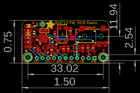
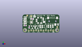
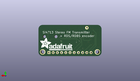
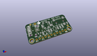

Contents
========

* [PROJ-ADAF-1958-STAN-01>Adafruit Si4713 PCB](#proj-adaf-1958-stan-01adafruit-si4713-pcb)
	* [Images](#images)
	* [Interactive BOM](#interactive-bom)
	* [OOMP Parts](#oomp-parts)
	* [Tags](#tags)
  
![][im]
# PROJ-ADAF-1958-STAN-01>Adafruit Si4713 PCB

- ID: PROJ-ADAF-1958-STAN-01
- Hex ID: PRA1958
- Name: Adafruit Si4713 PCB
- Description: 

## Images
  
  

|eagleImage|kicadPcb3dFront|kicadPcb3dBack|kicadPcb3d|
| :---: | :---: | :---: | :---: |
|||||

## Interactive BOM

- Interactive BOM page: [ibom.html](kicad/bom/ibom.html)

## OOMP Parts
  

|OOMP Parts|
| :---: |
|UNMATCHED-UNMATCHED-X-UNMATCHED-01, ANT, 8.889999999999999, 17.272000000000002, 180,ANT, 1X01, adafruit, (0.35, 0.68), R180|
|CAPE-0805-X-UNMATCHED-01, C1, 18.287999999999997, 6.35, 90,C1, 22nF, 0805-NO, microbuilder, (0.72, 0.25), R90|
|CAPC-0805-X-NF470-01, C2, 28.955999999999996, 6.604, 90,C2, 0.47uF, 0805-NO, microbuilder, (1.14, 0.26), R90|
|CAPC-0805-X-NF470-01, C3, 31.241999999999997, 6.604, 90,C3, 0.47uF, 0805-NO, microbuilder, (1.23, 0.26), R90|
|CAPC-0805-X-UNMATCHED-01, C4, 20.32, 6.35, 90,C4, 10uF, 0805-NO, microbuilder, (0.8, 0.25), R90|
|CAPC-0805-X-UNMATCHED-01, C5, 26.669999999999998, 6.604, 90,C5, 10uF, 0805-NO, microbuilder, (1.05, 0.26), R90|
|CAPE-0805-X-UNMATCHED-01, C6, 21.336, 14.224, 270,C6, 20pF, 0805-NO, microbuilder, (0.84, 0.56), R270|
|CAPE-0805-X-UNMATCHED-01, C7, 14.350999999999997, 12.827, 270,C7, 20pF, 0805-NO, microbuilder, (0.565, 0.505), R270|
|UNMATCHED-UNMATCHED-X-UNMATCHED-01, D1, 2.54, 12.827, 180,D1, 1n4148, SOD-323, microbuilder, (0.1, 0.505), R180|
|UNMATCHED-UNMATCHED-X-UNMATCHED-01, D2, 2.921, 16.383, 180,D2, 1n4148, SOD-323, microbuilder, (0.115, 0.645), R180|
|HEAD-I01-X-PI11-01, JP1, 19.049999999999997, 2.1590000000000003, 180,JP1, 1X11_ROUND, microbuilder, (0.75, 0.085), R180|
|UNMATCHED-0805-X-UNMATCHED-01, L1, 9.906, 14.350999999999997, 0,L1, 120nH, _0805, microbuilder, (0.39, 0.565), R0|
|UNMATCHED-UNMATCHED-X-UNMATCHED-01, Q1, 10.16, 5.715, 180,Q1, BSS138, SOT23, adafruit, (0.4, 0.225), R180|
|UNMATCHED-UNMATCHED-X-UNMATCHED-01, Q2, 15.748, 5.842, 180,Q2, BSS138, SOT23, adafruit, (0.62, 0.23), R180|
|<table><tr><td></td><td> R1</td><td>[RESE-0805-X-O103-01 SMD (0805) 10k Ohm Resistor](https://github.com/oomlout/oomlout_OOMP_parts/tree/main/RESE-0805-X-O103-01/)</td><td>[R85103](https://github.com/oomlout/oomlout_OOMP_parts/tree/main/RESE-0805-X-O103-01/)</td></tr></table>|
|<table><tr><td></td><td> R2</td><td>[RESE-0805-X-O103-01 SMD (0805) 10k Ohm Resistor](https://github.com/oomlout/oomlout_OOMP_parts/tree/main/RESE-0805-X-O103-01/)</td><td>[R85103](https://github.com/oomlout/oomlout_OOMP_parts/tree/main/RESE-0805-X-O103-01/)</td></tr></table>|
|<table><tr><td></td><td> R3</td><td>[RESE-0805-X-O103-01 SMD (0805) 10k Ohm Resistor](https://github.com/oomlout/oomlout_OOMP_parts/tree/main/RESE-0805-X-O103-01/)</td><td>[R85103](https://github.com/oomlout/oomlout_OOMP_parts/tree/main/RESE-0805-X-O103-01/)</td></tr></table>|
|<table><tr><td></td><td> R4</td><td>[RESE-0805-X-O103-01 SMD (0805) 10k Ohm Resistor](https://github.com/oomlout/oomlout_OOMP_parts/tree/main/RESE-0805-X-O103-01/)</td><td>[R85103](https://github.com/oomlout/oomlout_OOMP_parts/tree/main/RESE-0805-X-O103-01/)</td></tr></table>|
|<table><tr><td></td><td> R5</td><td>[RESE-0805-X-O103-01 SMD (0805) 10k Ohm Resistor](https://github.com/oomlout/oomlout_OOMP_parts/tree/main/RESE-0805-X-O103-01/)</td><td>[R85103](https://github.com/oomlout/oomlout_OOMP_parts/tree/main/RESE-0805-X-O103-01/)</td></tr></table>|
|<table><tr><td></td><td> R6</td><td>[RESE-0805-X-O103-01 SMD (0805) 10k Ohm Resistor](https://github.com/oomlout/oomlout_OOMP_parts/tree/main/RESE-0805-X-O103-01/)</td><td>[R85103](https://github.com/oomlout/oomlout_OOMP_parts/tree/main/RESE-0805-X-O103-01/)</td></tr></table>|
|UNMATCHED-UNMATCHED-X-UNMATCHED-01, U1, 9.143999999999998, 10.921999999999999, 270,U1, Si471x, SI471X, microbuilder, (0.36, 0.43), R270|
|UNMATCHED-UNMATCHED-X-UNMATCHED-01, U2, 23.622, 6.604, 90,U2, MIC5225-3.3, SOT23-5, microbuilder, (0.93, 0.26), R90|
|ERROR, X3 3.5mm stereo, 0, 0, 0,X3, 3.5mm, stereo, 4UCONN_19269, microbuilder, (1.5, 0.47), R180|
|UNMATCHED-UNMATCHED-X-UNMATCHED-01, Y2, 17.653, 12.827, 90,Y2, 32.768, CRYSTAL_8X3.8, microbuilder, (0.695, 0.505), R90|

## Tags

- hexID: PRA1958
- oompType: PROJ
- oompSize: ADAF
- oompColor: 1958
- oompDesc: STAN
- oompIndex: 01
- oompName: Adafruit Si4713 PCB
- sources: All source files from https://github.com/adafruit/Adafruit-Si4713-PCB (source licence details in srcLicense.md)
- linkBuyPage: http://www.adafruit.com/products/1958
- oompID: PROJ-ADAF-1958-STAN-01
- oompPart: UNMATCHED-UNMATCHED-X-UNMATCHED-01, ANT, 8.889999999999999, 17.272000000000002, 180
- oompPart: CAPE-0805-X-UNMATCHED-01, C1, 18.287999999999997, 6.35, 90
- oompPart: CAPC-0805-X-NF470-01, C2, 28.955999999999996, 6.604, 90
- oompPart: CAPC-0805-X-NF470-01, C3, 31.241999999999997, 6.604, 90
- oompPart: CAPC-0805-X-UNMATCHED-01, C4, 20.32, 6.35, 90
- oompPart: CAPC-0805-X-UNMATCHED-01, C5, 26.669999999999998, 6.604, 90
- oompPart: CAPE-0805-X-UNMATCHED-01, C6, 21.336, 14.224, 270
- oompPart: CAPE-0805-X-UNMATCHED-01, C7, 14.350999999999997, 12.827, 270
- oompPart: UNMATCHED-UNMATCHED-X-UNMATCHED-01, D1, 2.54, 12.827, 180
- oompPart: UNMATCHED-UNMATCHED-X-UNMATCHED-01, D2, 2.921, 16.383, 180
- oompPart: SKIP-UNMATCHED-X-UNMATCHED-01, FID1, 4.826, 17.906999999999996, 180
- oompPart: SKIP-UNMATCHED-X-UNMATCHED-01, FID2, 35.81399999999999, 5.842, 180
- oompPart: HEAD-I01-X-PI11-01, JP1, 19.049999999999997, 2.1590000000000003, 180
- oompPart: UNMATCHED-0805-X-UNMATCHED-01, L1, 9.906, 14.350999999999997, 0
- oompPart: UNMATCHED-UNMATCHED-X-UNMATCHED-01, Q1, 10.16, 5.715, 180
- oompPart: UNMATCHED-UNMATCHED-X-UNMATCHED-01, Q2, 15.748, 5.842, 180
- oompPart: RESE-0805-X-O103-01, R1, 2.667, 9.398, 180
- oompPart: RESE-0805-X-O103-01, R2, 6.985, 5.842, 90
- oompPart: RESE-0805-X-O103-01, R3, 12.953999999999999, 5.842, 90
- oompPart: RESE-0805-X-O103-01, R4, 2.667, 7.365999999999999, 0
- oompPart: RESE-0805-X-O103-01, R5, 2.667, 11.176, 0
- oompPart: RESE-0805-X-O103-01, R6, 2.667, 14.477999999999998, 180
- oompPart: SKIP-UNMATCHED-X-UNMATCHED-01, U$15, 35.559999999999995, 2.54, 180
- oompPart: SKIP-UNMATCHED-X-UNMATCHED-01, U$17, 2.54, 2.54, 180
- oompPart: UNMATCHED-UNMATCHED-X-UNMATCHED-01, U1, 9.143999999999998, 10.921999999999999, 270
- oompPart: UNMATCHED-UNMATCHED-X-UNMATCHED-01, U2, 23.622, 6.604, 90
- oompPart: ERROR, X3 3.5mm stereo, 0, 0, 0
- oompPart: UNMATCHED-UNMATCHED-X-UNMATCHED-01, Y2, 17.653, 12.827, 90
- rawPart: ANT, 1X01, adafruit, (0.35, 0.68), R180
- rawPart: C1, 22nF, 0805-NO, microbuilder, (0.72, 0.25), R90
- rawPart: C2, 0.47uF, 0805-NO, microbuilder, (1.14, 0.26), R90
- rawPart: C3, 0.47uF, 0805-NO, microbuilder, (1.23, 0.26), R90
- rawPart: C4, 10uF, 0805-NO, microbuilder, (0.8, 0.25), R90
- rawPart: C5, 10uF, 0805-NO, microbuilder, (1.05, 0.26), R90
- rawPart: C6, 20pF, 0805-NO, microbuilder, (0.84, 0.56), R270
- rawPart: C7, 20pF, 0805-NO, microbuilder, (0.565, 0.505), R270
- rawPart: D1, 1n4148, SOD-323, microbuilder, (0.1, 0.505), R180
- rawPart: D2, 1n4148, SOD-323, microbuilder, (0.115, 0.645), R180
- rawPart: FID1, FIDUCIAL, FIDUCIAL_1MM, microbuilder, (0.19, 0.705), R180
- rawPart: FID2, FIDUCIAL, FIDUCIAL_1MM, microbuilder, (1.41, 0.23), R180
- rawPart: JP1, 1X11_ROUND, microbuilder, (0.75, 0.085), R180
- rawPart: L1, 120nH, _0805, microbuilder, (0.39, 0.565), R0
- rawPart: Q1, BSS138, SOT23, adafruit, (0.4, 0.225), R180
- rawPart: Q2, BSS138, SOT23, adafruit, (0.62, 0.23), R180
- rawPart: R1, 10K, 0805-NO, microbuilder, (0.105, 0.37), R180
- rawPart: R2, 10K, _0805MP, microbuilder, (0.275, 0.23), R90
- rawPart: R3, 10K, 0805-NO, microbuilder, (0.51, 0.23), R90
- rawPart: R4, 10K, _0805MP, microbuilder, (0.105, 0.29), R0
- rawPart: R5, 10K, 0805-NO, microbuilder, (0.105, 0.44), R0
- rawPart: R6, 10K, 0805-NO, microbuilder, (0.105, 0.57), R180
- rawPart: U$15, MOUNTINGHOLE2.5, MOUNTINGHOLE_2.5_PLATED, microbuilder, (1.4, 0.1), R180
- rawPart: U$17, MOUNTINGHOLE2.5, MOUNTINGHOLE_2.5_PLATED, microbuilder, (0.1, 0.1), R180
- rawPart: U1, Si471x, SI471X, microbuilder, (0.36, 0.43), R270
- rawPart: U2, MIC5225-3.3, SOT23-5, microbuilder, (0.93, 0.26), R90
- rawPart: X3, 3.5mm, stereo, 4UCONN_19269, microbuilder, (1.5, 0.47), R180
- rawPart: Y2, 32.768, CRYSTAL_8X3.8, microbuilder, (0.695, 0.505), R90

[im]: kicadPcb3d_450.png
