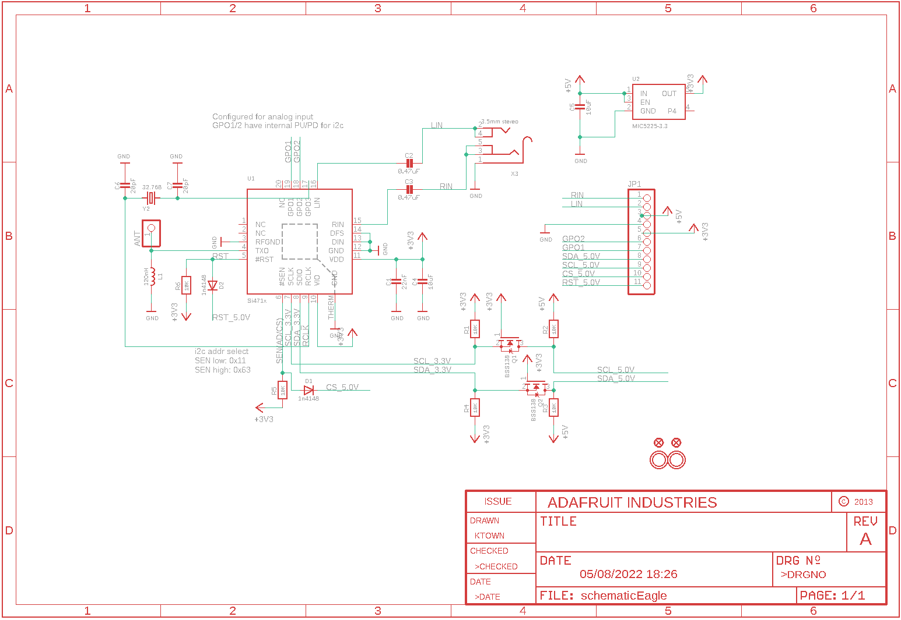
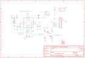

Contents
========

* [PRA1958 > Adafruit Si4713 PCB](#pra1958--adafruit-si4713-pcb)
	* [Schematic](#schematic)
	* [PCB](#pcb)
	* [Interactive BOM](#interactive-bom)
	* [OOMP Parts](#oomp-parts)
	* [Images](#images)
	* [Tags](#tags)
  
![][im]
# PRA1958 > Adafruit Si4713 PCB

- ID: PROJ-ADAF-1958-STAN-01
- Hex ID: PRA1958
- Name: Adafruit
- Description: Adafruit
- Long Link: [http://oom.lt/PROJ-ADAF-1958-STAN-01](http://oom.lt/PROJ-ADAF-1958-STAN-01)
- Short Link: [http://oom.lt/PRA1958](http://oom.lt/PRA1958)

## Schematic
  

## PCB
  

## Interactive BOM

- Interactive BOM page: [ibom.html](https://htmlpreview.github.io/?https://github.com/oomlout/oomlout_OOMP_projects/blob/main/PROJ-ADAF-1958-STAN-01/kicad/bom/ibom.html)

## OOMP Parts
  

|OOMP Parts|
| :---: |
|HEAD-I01-X-PI01-01 ANT|
|CAPC-0805-X-NF22-01 C1|
|CAPC-0805-X-UF47-01 C2, C3|
|[CAPC-0805-X-UF10-V10  SMD (0805) 10 uF Capacitor (Ceramic) 10v  C4, C5](https://github.com/oomlout/oomlout_OOMP_parts/tree/main/CAPC-0805-X-UF10-V10/)|
|CAPC-0805-X-PF20-01 C6, C7|
|[DIOD-S323-X-K4148-01  SMD (SOD-323) Diode  D1, D2](https://github.com/oomlout/oomlout_OOMP_parts/tree/main/DIOD-S323-X-K4148-01/)|
|HEAD-I01-X-PI11-01 JP1|
|UNMATCHED-0805-X-UNMATCHED-01 L1|
|[MOSN-SO23-X-KBSS138-01  SMD (SOT-23) BSS138 N-Ch. MOSFET  Q1, Q2](https://github.com/oomlout/oomlout_OOMP_parts/tree/main/MOSN-SO23-X-KBSS138-01/)|
|[RESE-0805-X-O103-01  SMD (0805) 10k Ohm Resistor  R1, R2, R3, R4, R5, R6](https://github.com/oomlout/oomlout_OOMP_parts/tree/main/RESE-0805-X-O103-01/)|
|UNMATCHED-UNMATCHED-X-UNMATCHED-01 U1, X3, Y2|
|[VREG-SO235-X-KMIC5225-V33D  SMD (SOT-23-5) MIC5225 Voltage Regulator 3.3v  U2](https://github.com/oomlout/oomlout_OOMP_parts/tree/main/VREG-SO235-X-KMIC5225-V33D/)|

## Images
  
  

|kicadPcb3d|kicadPcb3dFront|kicadPcb3dBack|eagleImage|eagleSchemImage|
| :---: | :---: | :---: | :---: | :---: |
||||||

## Tags

- hexID: PRA1958
- oompType: PROJ
- oompSize: ADAF
- oompColor: 1958
- oompDesc: STAN
- oompIndex: 01
- oompName: Adafruit Si4713 PCB
- sources: All source files from https://github.com/adafruit/Adafruit-Si4713-PCB (source licence details in srcLicense.md)
- linkBuyPage: http://www.adafruit.com/products/1958
- oompID: PROJ-ADAF-1958-STAN-01
- oompParts: ANT,HEAD-I01-X-PI01-01
- oompParts: C1,CAPC-0805-X-NF22-01
- oompParts: C2,CAPC-0805-X-UF47-01
- oompParts: C3,CAPC-0805-X-UF47-01
- oompParts: C4,CAPC-0805-X-UF10-V10
- oompParts: C5,CAPC-0805-X-UF10-V10
- oompParts: C6,CAPC-0805-X-PF20-01
- oompParts: C7,CAPC-0805-X-PF20-01
- oompParts: D1,DIOD-S323-X-K4148-01
- oompParts: D2,DIOD-S323-X-K4148-01
- oompParts: JP1,HEAD-I01-X-PI11-01
- oompParts: L1,UNMATCHED-0805-X-UNMATCHED-01
- oompParts: Q1,MOSN-SO23-X-KBSS138-01
- oompParts: Q2,MOSN-SO23-X-KBSS138-01
- oompParts: R1,RESE-0805-X-O103-01
- oompParts: R2,RESE-0805-X-O103-01
- oompParts: R3,RESE-0805-X-O103-01
- oompParts: R4,RESE-0805-X-O103-01
- oompParts: R5,RESE-0805-X-O103-01
- oompParts: R6,RESE-0805-X-O103-01
- oompParts: U1,UNMATCHED-UNMATCHED-X-UNMATCHED-01
- oompParts: U2,VREG-SO235-X-KMIC5225-V33D
- oompParts: X3,UNMATCHED-UNMATCHED-X-UNMATCHED-01
- oompParts: Y2,UNMATCHED-UNMATCHED-X-UNMATCHED-01
- rawParts: ANT,,PINHD-1X1,1X01,Pin header 1x1 for 0.1 spacing,,
- rawParts: C1,22nF,CAP_CERAMIC0805-NOOUTLINE,0805-NO,Ceramic Capacitors,,
- rawParts: C2,0.47uF,CAP_CERAMIC0805-NOOUTLINE,0805-NO,Ceramic Capacitors,,
- rawParts: C3,0.47uF,CAP_CERAMIC0805-NOOUTLINE,0805-NO,Ceramic Capacitors,,
- rawParts: C4,10uF,CAP_CERAMIC0805-NOOUTLINE,0805-NO,Ceramic Capacitors,,
- rawParts: C5,10uF,CAP_CERAMIC0805-NOOUTLINE,0805-NO,Ceramic Capacitors,,
- rawParts: C6,20pF,CAP_CERAMIC0805-NOOUTLINE,0805-NO,Ceramic Capacitors,,
- rawParts: C7,20pF,CAP_CERAMIC0805-NOOUTLINE,0805-NO,Ceramic Capacitors,,
- rawParts: D1,1n4148,DIODESOD-323,SOD-323,Diode,,
- rawParts: D2,1n4148,DIODESOD-323,SOD-323,Diode,,
- rawParts: FID1,FIDUCIAL,FIDUCIAL,FIDUCIAL_1MM,Fiducial Alignment Points,EXCLUDE,
- rawParts: FID2,FIDUCIAL,FIDUCIAL,FIDUCIAL_1MM,Fiducial Alignment Points,EXCLUDE,
- rawParts: JP1,,HEADER-1X11,1X11_ROUND,,,
- rawParts: L1,120nH,INDUCTOR_0805,_0805,Inductors,,
- rawParts: Q1,BSS138,MOSFET-NREFLOW,SOT23,N-Channel Mosfet,,
- rawParts: Q2,BSS138,MOSFET-NREFLOW,SOT23,N-Channel Mosfet,,
- rawParts: R1,10K,RESISTOR0805_NOOUTLINE,0805-NO,Resistors,,
- rawParts: R2,10K,RESISTOR_0805MP,_0805MP,Resistors,,
- rawParts: R3,10K,RESISTOR0805_NOOUTLINE,0805-NO,Resistors,,
- rawParts: R4,10K,RESISTOR_0805MP,_0805MP,Resistors,,
- rawParts: R5,10K,RESISTOR0805_NOOUTLINE,0805-NO,Resistors,,
- rawParts: R6,10K,RESISTOR0805_NOOUTLINE,0805-NO,Resistors,,
- rawParts: U$15,MOUNTINGHOLE2.5,MOUNTINGHOLE2.5,MOUNTINGHOLE_2.5_PLATED,Mounting Hole,EXCLUDE,
- rawParts: U$17,MOUNTINGHOLE2.5,MOUNTINGHOLE2.5,MOUNTINGHOLE_2.5_PLATED,Mounting Hole,EXCLUDE,
- rawParts: U1,Si471x,SI471X,SI471X,Si4712/13 FM Radio Transmitter and Receiver,,
- rawParts: U2,MIC5225-3.3,VREG_SOT23-5,SOT23-5,SOT23-5 Fixed Voltage Regulators,,
- rawParts: X3,3.5mm stereo,AUDIO_3.5MMJACK,4UCONN_19269,3.5MM Audio Jack,,
- rawParts: Y2,32.768,CRYSTAL8.0X3.8,CRYSTAL_8X3.8,Crystals,,

[im]: kicadPcb3d_450.png
