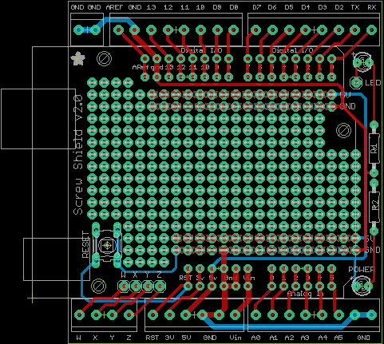

Contents
========

* [PRA196 > Adafruit Proto Screwshield PCB](#pra196--adafruit-proto-screwshield-pcb)
	* [Schematic](#schematic)
	* [PCB](#pcb)
	* [OOMP Parts](#oomp-parts)
	* [Images](#images)
	* [Tags](#tags)
  
![][im]
# PRA196 > Adafruit Proto Screwshield PCB

- ID: PROJ-ADAF-196-STAN-01
- Hex ID: PRA196
- Name: Adafruit
- Description: Adafruit
- Long Link: [http://oom.lt/PROJ-ADAF-196-STAN-01](http://oom.lt/PROJ-ADAF-196-STAN-01)
- Short Link: [http://oom.lt/PRA196](http://oom.lt/PRA196)

## Schematic
  

## PCB
  

## OOMP Parts
  

|OOMP ID|Name|Identifier|
| :---: | :---: | :---: |
|TERS-35D-L-UNMATCHED-01||CN1, JP1, JP5, JP6, JP7|
|[TERS-35D-L-PI02-01](https://github.com/oomlout/oomlout_OOMP_parts/tree/main/TERS-35D-L-PI02-01/)|[3.5 mm 2 Pin Blue Screw Terminal](https://github.com/oomlout/oomlout_OOMP_parts/tree/main/TERS-35D-L-PI02-01/)|[J1](https://github.com/oomlout/oomlout_OOMP_parts/tree/main/TERS-35D-L-PI02-01/)|
|[HEAD-I01-X-PI06-01](https://github.com/oomlout/oomlout_OOMP_parts/tree/main/HEAD-I01-X-PI06-01/)|[2.54 mm 6 Pin Header](https://github.com/oomlout/oomlout_OOMP_parts/tree/main/HEAD-I01-X-PI06-01/)|[JP2, JP8](https://github.com/oomlout/oomlout_OOMP_parts/tree/main/HEAD-I01-X-PI06-01/)|
|[HEAD-I01-X-PI08-01](https://github.com/oomlout/oomlout_OOMP_parts/tree/main/HEAD-I01-X-PI08-01/)|[2.54 mm 8 Pin Header](https://github.com/oomlout/oomlout_OOMP_parts/tree/main/HEAD-I01-X-PI08-01/)|[JP3, JP4](https://github.com/oomlout/oomlout_OOMP_parts/tree/main/HEAD-I01-X-PI08-01/)|
|HEAD-I01-X-PI01-01||JP9, W, X, Y, Z|
|LEDS-UNMATCHED-G-STAN-01||LED, POWER|
|RESE-UNMATCHED-X-UNMATCHED-01||R1, R2|
|UNMATCHED-UNMATCHED-X-UNMATCHED-01||RESET, U$1|

## Images
  
  

|kicadPcb3d|kicadPcb3dFront|kicadPcb3dBack|eagleImage|eagleSchemImage|
| :---: | :---: | :---: | :---: | :---: |
||||||

## Tags

- hexID: PRA196
- oompType: PROJ
- oompSize: ADAF
- oompColor: 196
- oompDesc: STAN
- oompIndex: 01
- oompName: Adafruit Proto Screwshield PCB
- sources: All source files from https://github.com/adafruit/Adafruit-Proto-Screwshield-PCB (source licence details in srcLicense.md)
- linkBuyPage: http://www.adafruit.com/products/196
- oompID: PROJ-ADAF-196-STAN-01
- oompParts: CN1,TERS-35D-L-UNMATCHED-01
- oompParts: J1,TERS-35D-L-PI02-01
- oompParts: JP1,TERS-35D-L-UNMATCHED-01
- oompParts: JP2,HEAD-I01-X-PI06-01
- oompParts: JP3,HEAD-I01-X-PI08-01
- oompParts: JP4,HEAD-I01-X-PI08-01
- oompParts: JP5,TERS-35D-L-UNMATCHED-01
- oompParts: JP6,TERS-35D-L-UNMATCHED-01
- oompParts: JP7,TERS-35D-L-UNMATCHED-01
- oompParts: JP8,HEAD-I01-X-PI06-01
- oompParts: JP9,HEAD-I01-X-PI01-01
- oompParts: LED,LEDS-UNMATCHED-G-STAN-01
- oompParts: POWER,LEDS-UNMATCHED-G-STAN-01
- oompParts: R1,RESE-UNMATCHED-X-UNMATCHED-01
- oompParts: R2,RESE-UNMATCHED-X-UNMATCHED-01
- oompParts: RESET,UNMATCHED-UNMATCHED-X-UNMATCHED-01
- oompParts: U$1,UNMATCHED-UNMATCHED-X-UNMATCHED-01
- oompParts: W,HEAD-I01-X-PI01-01
- oompParts: X,HEAD-I01-X-PI01-01
- oompParts: Y,HEAD-I01-X-PI01-01
- oompParts: Z,HEAD-I01-X-PI01-01
- rawParts: CN1,1X4-3.5MM,1X4-3.5MM,1X04-3.5MM,4-pin connector,,
- rawParts: J1,1X2-3.5MM,1X2-3.5MM,1X2-3.5MM,3.5mm Terminal block,,
- rawParts: JP1,,PINHD-1X6-3.5MM,1X06-3.5MM,PIN HEADER,,
- rawParts: JP2,,PINHD-1X6CB,1X06-CLEANBIG,PIN HEADER,,
- rawParts: JP3,,PINHD-1X8CLEANBIG,1X08-CLEANBIG,PIN HEADER,,
- rawParts: JP4,,PINHD-1X8CLEANBIG,1X08-CLEANBIG,PIN HEADER,,
- rawParts: JP5,,PINHD-1X8-3.5MM,1X08-3.5MM,PIN HEADER,,
- rawParts: JP6,,PINHD-1X8-3.5MM,1X08-3.5MM,PIN HEADER,,
- rawParts: JP7,,PINHD-1X8-3.5MM,1X08-3.5MM,PIN HEADER,,
- rawParts: JP8,,PINHD-1X6CB,1X06-CLEANBIG,PIN HEADER,,
- rawParts: JP9,,PINHD-1X1,1X01,Pin header 1x1 for 0.1 spacing,,
- rawParts: LED,,LED3MM,LED3MM,LED,,
- rawParts: POWER,,LED3MM,LED3MM,LED,,
- rawParts: R1,,R-US_0207/10,0207/10,RESISTOR, American symbol,,
- rawParts: R2,,R-US_0207/10,0207/10,RESISTOR, American symbol,,
- rawParts: RESET,,10-XX,B3F-10XX,OMRON SWITCH,,
- rawParts: U$1,ARDUINO-BPLACE,ARDUINO-BPLACE,ARDUINO-BPLACE,Arduino Diecimila/Duemilanove,,
- rawParts: W,,PINHD-1X1,1X01,Pin header 1x1 for 0.1 spacing,,
- rawParts: X,,PINHD-1X1,1X01,Pin header 1x1 for 0.1 spacing,,
- rawParts: Y,,PINHD-1X1,1X01,Pin header 1x1 for 0.1 spacing,,
- rawParts: Z,,PINHD-1X1,1X01,Pin header 1x1 for 0.1 spacing,,

[im]: kicadPcb3d_450.png
