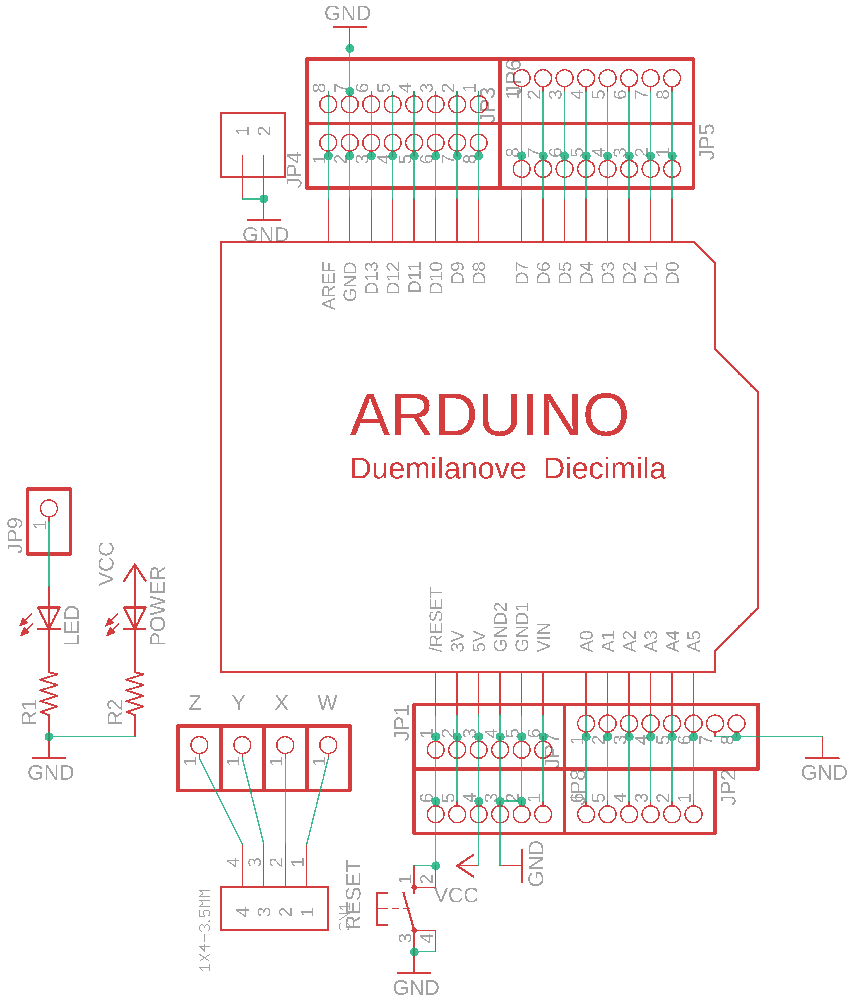
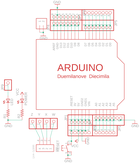

Contents
========

* [PRA196 > Adafruit](#pra196--adafruit)
	* [Schematic](#schematic)
	* [OOMP Parts](#oomp-parts)
	* [Images](#images)
	* [Tags](#tags)
  
![][im]
# PRA196 > Adafruit

- ID: PROJ-ADAF-196-STAN-01
- Hex ID: PRA196
- Name: Adafruit
- Description: Adafruit
- Long Link: [http://oom.lt/PROJ-ADAF-196-STAN-01](http://oom.lt/PROJ-ADAF-196-STAN-01)
- Short Link: [http://oom.lt/PRA196](http://oom.lt/PRA196)

## Schematic
  

## OOMP Parts
  

|OOMP Parts|
| :---: |
|CN1,UNMATCHED-UNMATCHED-UNMATCHED-UNMATCHED-UNMATCHED,CN1,1X4-3.5MM,1X4-3.5MM,1X04-3.5MM,4-pin connector,,|
|J1,UNMATCHED-UNMATCHED-UNMATCHED-UNMATCHED-UNMATCHED,J1,1X2-3.5MM,1X2-3.5MM,1X2-3.5MM,3.5mm Terminal block,,|
|JP1,UNMATCHED-UNMATCHED-UNMATCHED-UNMATCHED-UNMATCHED,JP1,,PINHD-1X6-3.5MM,1X06-3.5MM,PIN HEADER,,|
|JP2,UNMATCHED-UNMATCHED-UNMATCHED-UNMATCHED-UNMATCHED,JP2,,PINHD-1X6CB,1X06-CLEANBIG,PIN HEADER,,|
|JP3,UNMATCHED-UNMATCHED-UNMATCHED-UNMATCHED-UNMATCHED,JP3,,PINHD-1X8CLEANBIG,1X08-CLEANBIG,PIN HEADER,,|
|JP4,UNMATCHED-UNMATCHED-UNMATCHED-UNMATCHED-UNMATCHED,JP4,,PINHD-1X8CLEANBIG,1X08-CLEANBIG,PIN HEADER,,|
|JP5,UNMATCHED-UNMATCHED-UNMATCHED-UNMATCHED-UNMATCHED,JP5,,PINHD-1X8-3.5MM,1X08-3.5MM,PIN HEADER,,|
|JP6,UNMATCHED-UNMATCHED-UNMATCHED-UNMATCHED-UNMATCHED,JP6,,PINHD-1X8-3.5MM,1X08-3.5MM,PIN HEADER,,|
|JP7,UNMATCHED-UNMATCHED-UNMATCHED-UNMATCHED-UNMATCHED,JP7,,PINHD-1X8-3.5MM,1X08-3.5MM,PIN HEADER,,|
|JP8,UNMATCHED-UNMATCHED-UNMATCHED-UNMATCHED-UNMATCHED,JP8,,PINHD-1X6CB,1X06-CLEANBIG,PIN HEADER,,|
|JP9,UNMATCHED-UNMATCHED-UNMATCHED-UNMATCHED-UNMATCHED,JP9,,PINHD-1X1,1X01,Pin header 1x1 for 0.1 spacing,,|
|LED,UNMATCHED-UNMATCHED-UNMATCHED-UNMATCHED-UNMATCHED,LED,,LED3MM,LED3MM,LED,,|
|POWER,UNMATCHED-UNMATCHED-UNMATCHED-UNMATCHED-UNMATCHED,POWER,,LED3MM,LED3MM,LED,,|
|R1,UNMATCHED-UNMATCHED-UNMATCHED-UNMATCHED-UNMATCHED,R1,,R-US_0207/10,0207/10,RESISTOR, American symbol,,|
|R2,UNMATCHED-UNMATCHED-UNMATCHED-UNMATCHED-UNMATCHED,R2,,R-US_0207/10,0207/10,RESISTOR, American symbol,,|
|RESET,UNMATCHED-UNMATCHED-UNMATCHED-UNMATCHED-UNMATCHED,RESET,,10-XX,B3F-10XX,OMRON SWITCH,,|
|U$1,UNMATCHED-UNMATCHED-UNMATCHED-UNMATCHED-UNMATCHED,U$1,ARDUINO-BPLACE,ARDUINO-BPLACE,ARDUINO-BPLACE,Arduino Diecimila/Duemilanove,,|
|W,UNMATCHED-UNMATCHED-UNMATCHED-UNMATCHED-UNMATCHED,W,,PINHD-1X1,1X01,Pin header 1x1 for 0.1 spacing,,|
|X,UNMATCHED-UNMATCHED-UNMATCHED-UNMATCHED-UNMATCHED,X,,PINHD-1X1,1X01,Pin header 1x1 for 0.1 spacing,,|
|Y,UNMATCHED-UNMATCHED-UNMATCHED-UNMATCHED-UNMATCHED,Y,,PINHD-1X1,1X01,Pin header 1x1 for 0.1 spacing,,|
|Z,UNMATCHED-UNMATCHED-UNMATCHED-UNMATCHED-UNMATCHED,Z,,PINHD-1X1,1X01,Pin header 1x1 for 0.1 spacing,,|

## Images
  
  

|kicadPcb3d|kicadPcb3dFront|kicadPcb3dBack|eagleImage|eagleSchemImage|
| :---: | :---: | :---: | :---: | :---: |
||||||

## Tags

- hexID: PRA196
- oompType: PROJ
- oompSize: ADAF
- oompColor: 196
- oompDesc: STAN
- oompIndex: 01
- oompName: Adafruit Proto Screwshield PCB
- sources: All source files from https://github.com/adafruit/Adafruit-Proto-Screwshield-PCB (source licence details in srcLicense.md)
- linkBuyPage: http://www.adafruit.com/products/196
- oompID: PROJ-ADAF-196-STAN-01
- oompParts: CN1,UNMATCHED-UNMATCHED-UNMATCHED-UNMATCHED-UNMATCHED
- oompParts: J1,UNMATCHED-UNMATCHED-UNMATCHED-UNMATCHED-UNMATCHED
- oompParts: JP1,UNMATCHED-UNMATCHED-UNMATCHED-UNMATCHED-UNMATCHED
- oompParts: JP2,UNMATCHED-UNMATCHED-UNMATCHED-UNMATCHED-UNMATCHED
- oompParts: JP3,UNMATCHED-UNMATCHED-UNMATCHED-UNMATCHED-UNMATCHED
- oompParts: JP4,UNMATCHED-UNMATCHED-UNMATCHED-UNMATCHED-UNMATCHED
- oompParts: JP5,UNMATCHED-UNMATCHED-UNMATCHED-UNMATCHED-UNMATCHED
- oompParts: JP6,UNMATCHED-UNMATCHED-UNMATCHED-UNMATCHED-UNMATCHED
- oompParts: JP7,UNMATCHED-UNMATCHED-UNMATCHED-UNMATCHED-UNMATCHED
- oompParts: JP8,UNMATCHED-UNMATCHED-UNMATCHED-UNMATCHED-UNMATCHED
- oompParts: JP9,UNMATCHED-UNMATCHED-UNMATCHED-UNMATCHED-UNMATCHED
- oompParts: LED,UNMATCHED-UNMATCHED-UNMATCHED-UNMATCHED-UNMATCHED
- oompParts: POWER,UNMATCHED-UNMATCHED-UNMATCHED-UNMATCHED-UNMATCHED
- oompParts: R1,UNMATCHED-UNMATCHED-UNMATCHED-UNMATCHED-UNMATCHED
- oompParts: R2,UNMATCHED-UNMATCHED-UNMATCHED-UNMATCHED-UNMATCHED
- oompParts: RESET,UNMATCHED-UNMATCHED-UNMATCHED-UNMATCHED-UNMATCHED
- oompParts: U$1,UNMATCHED-UNMATCHED-UNMATCHED-UNMATCHED-UNMATCHED
- oompParts: W,UNMATCHED-UNMATCHED-UNMATCHED-UNMATCHED-UNMATCHED
- oompParts: X,UNMATCHED-UNMATCHED-UNMATCHED-UNMATCHED-UNMATCHED
- oompParts: Y,UNMATCHED-UNMATCHED-UNMATCHED-UNMATCHED-UNMATCHED
- oompParts: Z,UNMATCHED-UNMATCHED-UNMATCHED-UNMATCHED-UNMATCHED
- rawParts: CN1,1X4-3.5MM,1X4-3.5MM,1X04-3.5MM,4-pin connector,,
- rawParts: J1,1X2-3.5MM,1X2-3.5MM,1X2-3.5MM,3.5mm Terminal block,,
- rawParts: JP1,,PINHD-1X6-3.5MM,1X06-3.5MM,PIN HEADER,,
- rawParts: JP2,,PINHD-1X6CB,1X06-CLEANBIG,PIN HEADER,,
- rawParts: JP3,,PINHD-1X8CLEANBIG,1X08-CLEANBIG,PIN HEADER,,
- rawParts: JP4,,PINHD-1X8CLEANBIG,1X08-CLEANBIG,PIN HEADER,,
- rawParts: JP5,,PINHD-1X8-3.5MM,1X08-3.5MM,PIN HEADER,,
- rawParts: JP6,,PINHD-1X8-3.5MM,1X08-3.5MM,PIN HEADER,,
- rawParts: JP7,,PINHD-1X8-3.5MM,1X08-3.5MM,PIN HEADER,,
- rawParts: JP8,,PINHD-1X6CB,1X06-CLEANBIG,PIN HEADER,,
- rawParts: JP9,,PINHD-1X1,1X01,Pin header 1x1 for 0.1 spacing,,
- rawParts: LED,,LED3MM,LED3MM,LED,,
- rawParts: POWER,,LED3MM,LED3MM,LED,,
- rawParts: R1,,R-US_0207/10,0207/10,RESISTOR, American symbol,,
- rawParts: R2,,R-US_0207/10,0207/10,RESISTOR, American symbol,,
- rawParts: RESET,,10-XX,B3F-10XX,OMRON SWITCH,,
- rawParts: U$1,ARDUINO-BPLACE,ARDUINO-BPLACE,ARDUINO-BPLACE,Arduino Diecimila/Duemilanove,,
- rawParts: W,,PINHD-1X1,1X01,Pin header 1x1 for 0.1 spacing,,
- rawParts: X,,PINHD-1X1,1X01,Pin header 1x1 for 0.1 spacing,,
- rawParts: Y,,PINHD-1X1,1X01,Pin header 1x1 for 0.1 spacing,,
- rawParts: Z,,PINHD-1X1,1X01,Pin header 1x1 for 0.1 spacing,,

[im]: kicadPcb3d_450.png
