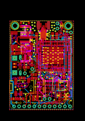
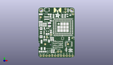
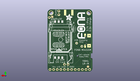
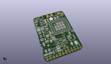

Contents
========

* [PROJ-ADAF-1963-STAN-01>Adafruit FONA 800 GSM Breakout PCB](#proj-adaf-1963-stan-01adafruit-fona-800-gsm-breakout-pcb)
	* [Images](#images)
	* [Interactive BOM](#interactive-bom)
	* [OOMP Parts](#oomp-parts)
	* [Tags](#tags)
  
![][im]
# PROJ-ADAF-1963-STAN-01>Adafruit FONA 800 GSM Breakout PCB

- ID: PROJ-ADAF-1963-STAN-01
- Hex ID: PRA1963
- Name: Adafruit FONA 800 GSM Breakout PCB
- Description: 

## Images
  
  

|eagleImage|kicadPcb3dFront|kicadPcb3dBack|kicadPcb3d|
| :---: | :---: | :---: | :---: |
|||||

## Interactive BOM

- Interactive BOM page: [ibom.html](kicad/bom/ibom.html)

## OOMP Parts
  

|OOMP Parts|
| :---: |
|UNMATCHED-UNMATCHED-X-UNMATCHED-01, ADC, 11.176, 20.32, 0,ADC, 1X01-CLEANBIG, adafruit, (0.44, 0.8), R0|
|<table><tr><td></td><td> C1</td><td>[CAPC-0805-X-UF10-V25 SMD (0805) 10 uF Capacitor (Ceramic) 25v](https://github.com/oomlout/oomlout_OOMP_parts/tree/main/CAPC-0805-X-UF10-V25/)</td><td>[C85U010](https://github.com/oomlout/oomlout_OOMP_parts/tree/main/CAPC-0805-X-UF10-V25/)</td></tr></table>|
|CAPE-0805-X-UNMATCHED-01, C2, 2.032, 5.206999999999999, 180,C2, 33pF, 0805-NO, microbuilder, (0.08, 0.205), R180|
|CAPC-0805-X-PF10-01, C3, 5.588, 5.206999999999999, 0,C3, 10pF, 0805-NO, microbuilder, (0.22, 0.205), R0|
|CAPE-0805-X-UNMATCHED-01, C4, 12.065, 15.620999999999999, 180,C4, 33pF, 0805-NO, microbuilder, (0.475, 0.615), R180|
|CAPC-0805-X-PF10-01, C5, 13.320000030000001, 36.941000032, 90,C5, 10pF, 0805-NO, microbuilder, (0.52440945, 1.45437008), R90|
|CAPE-0805-X-UNMATCHED-01, C6, 9.986000094, 38.306000096, 0,C6, 33pF, 0805-NO, microbuilder, (0.39314961, 1.50811024), R0|
|CAPE-UNMATCHED-X-UNMATCHED-01, C7, 9.779, 29.337, 270,C7, 100uF, C1210, rcl, (0.385, 1.155), R270|
|<table><tr><td></td><td> C9</td><td>[CAPC-0805-X-UF10-V25 SMD (0805) 10 uF Capacitor (Ceramic) 25v](https://github.com/oomlout/oomlout_OOMP_parts/tree/main/CAPC-0805-X-UF10-V25/)</td><td>[C85U010](https://github.com/oomlout/oomlout_OOMP_parts/tree/main/CAPC-0805-X-UF10-V25/)</td></tr></table>|
|CAPC-0805-X-PF10-01, C10, 11.937999999999999, 17.399, 180,C10, 10pF, 0805-NO, microbuilder, (0.47, 0.685), R180|
|<table><tr><td></td><td> C11</td><td>[CAPC-0805-X-UF10-V25 SMD (0805) 10 uF Capacitor (Ceramic) 25v](https://github.com/oomlout/oomlout_OOMP_parts/tree/main/CAPC-0805-X-UF10-V25/)</td><td>[C85U010](https://github.com/oomlout/oomlout_OOMP_parts/tree/main/CAPC-0805-X-UF10-V25/)</td></tr></table>|
|CAPE-UNMATCHED-X-UNMATCHED-01, C14, 19.558, 9.779, 0,C14, 33pF, RESPACK_4X0603, microbuilder, (0.77, 0.385), R0|
|CAPC-UNMATCHED-X-PF10-01, C15, 19.558, 13.334999999999999, 180,C15, 10pF, RESPACK_4X0603, microbuilder, (0.77, 0.525), R180|
|CAPE-UNMATCHED-X-UNMATCHED-01, C16, 14.858999999999998, 13.334999999999999, 0,C16, 33pF, RESPACK_4X0603, microbuilder, (0.585, 0.525), R0|
|CAPC-UNMATCHED-X-PF10-01, C17, 14.858999999999998, 9.524999999999999, 0,C17, 10pF, RESPACK_4X0603, microbuilder, (0.585, 0.375), R0|
|UNMATCHED-UNMATCHED-X-UNMATCHED-01, CHRG, 2.159999998, 28.077999977999998, 270,CHRG, ORANGE, CHIPLED_0805_NOOUTLINE, microbuilder, (0.08503937, 1.10543307), R270|
|UNMATCHED-UNMATCHED-X-UNMATCHED-01, CN2, 3.556, 35.05199999999999, 90,CN2, JSTPH, JSTPH2, microbuilder, (0.14, 1.38), R90|
|UNMATCHED-UNMATCHED-X-UNMATCHED-01, D1, 10.668, 34.544000000000004, 270,D1, MMSZ5231BT1G, SOD-123, microbuilder, (0.42, 1.36), R270|
|UNMATCHED-UNMATCHED-X-UNMATCHED-01, D2, 21.209, 17.018, 90,D2, SMF05C, SOT363, microbuilder, (0.835, 0.67), R90|
|UNMATCHED-UNMATCHED-X-UNMATCHED-01, D3, 25.907999999999998, 41.91, 270,D3, 1N4148, SOD-323, microbuilder, (1.02, 1.65), R270|
|UNMATCHED-UNMATCHED-X-UNMATCHED-01, D4, 28.194000000000003, 5.460999999999999, 0,D4, 1N4148, SOD-323, microbuilder, (1.11, 0.215), R0|
|UNMATCHED-UNMATCHED-X-UNMATCHED-01, D5, 24.511, 6.985, 90,D5, 1N4148, SOD-323, microbuilder, (0.965, 0.275), R90|
|UNMATCHED-UNMATCHED-X-UNMATCHED-01, D6, 28.194000000000003, 7.112, 0,D6, 1N4148, SOD-323, microbuilder, (1.11, 0.28), R0|
|UNMATCHED-UNMATCHED-X-UNMATCHED-01, DONE, 2.164999988, 29.926000092, 90,DONE, GREEN, CHIPLED_0805_NOOUTLINE, microbuilder, (0.08523622, 1.17818898), R90|
|UNMATCHED-UNMATCHED-X-UNMATCHED-01, IC1, 26.542999999999996, 11.937999999999999, 270,IC1, 74VHCT125PW, TSSOP14, 74xx-us, (1.045, 0.47), R270|
|UNMATCHED-UNMATCHED-X-UNMATCHED-01, JP1, 16.002, 1.5239999999999998, 180,JP1, 1X12-CB, adafruit2, (0.63, 0.06), R180|
|UNMATCHED-UNMATCHED-X-UNMATCHED-01, JP2, 18.541999999999998, 5.206999999999999, 0,JP2, MIC, 1X02_ROUND, microbuilder, (0.73, 0.205), R0|
|UNMATCHED-UNMATCHED-X-UNMATCHED-01, JP3, 23.749, 41.91, 90,JP3, BUZZ, 1X02_ROUND, microbuilder, (0.935, 1.65), R90|
|UNMATCHED-UNMATCHED-X-UNMATCHED-01, NETSTAT, 21.336, 36.957, 0,NETSTAT, BLUE, CHIPLED_0805_NOOUTLINE, microbuilder, (0.84, 1.455), R0|
|UNMATCHED-UNMATCHED-X-UNMATCHED-01, PWM, 30.479999999999997, 38.608, 0,PWM, 1X01-CLEANBIG, adafruit, (1.2, 1.52), R0|
|UNMATCHED-UNMATCHED-X-UNMATCHED-01, PWRSTAT, 12.7, 6.476999999999999, 270,PWRSTAT, GREEN, CHIPLED_0805_NOOUTLINE, microbuilder, (0.5, 0.255), R270|
|UNMATCHED-UNMATCHED-X-UNMATCHED-01, Q1, 26.669999999999998, 37.465, 270,Q1, DTC143ZUAT106, SC59-BEC, transistor, (1.05, 1.475), R270|
|RESE-0805-X-UNMATCHED-01, R1, 5.715, 28.194000000000003, 0,R1, 470, 0805-NO, microbuilder, (0.225, 1.11), R0|
|<table><tr><td></td><td> R2</td><td>[RESE-0805-X-O102-01 SMD (0805) 1k Ohm Resistor](https://github.com/oomlout/oomlout_OOMP_parts/tree/main/RESE-0805-X-O102-01/)</td><td>[R85102](https://github.com/oomlout/oomlout_OOMP_parts/tree/main/RESE-0805-X-O102-01/)</td></tr></table>|
|RESE-0805-X-UNMATCHED-01, R3, 11.049, 23.114, 90,R3, 2K, 0805-NO, microbuilder, (0.435, 0.91), R90|
|<table><tr><td></td><td> R4</td><td>[RESE-0805-X-O102-01 SMD (0805) 1k Ohm Resistor](https://github.com/oomlout/oomlout_OOMP_parts/tree/main/RESE-0805-X-O102-01/)</td><td>[R85102](https://github.com/oomlout/oomlout_OOMP_parts/tree/main/RESE-0805-X-O102-01/)</td></tr></table>|
|<table><tr><td></td><td> R5</td><td>[RESE-0805-X-O102-01 SMD (0805) 1k Ohm Resistor](https://github.com/oomlout/oomlout_OOMP_parts/tree/main/RESE-0805-X-O102-01/)</td><td>[R85102](https://github.com/oomlout/oomlout_OOMP_parts/tree/main/RESE-0805-X-O102-01/)</td></tr></table>|
|UNMATCHED-UNMATCHED-X-UNMATCHED-01, SW1, 7.492999999999999, 42.418, 0,SW1, KMR2, BTN_KMR2_4.6X2.8, microbuilder, (0.295, 1.67), R0|
|UNMATCHED-UNMATCHED-X-UNMATCHED-01, TP1, 29.590999999999998, 17.272000000000002, 0,TP1, TPTP11R, TP11R, testpad, (1.165, 0.68), R0|
|UNMATCHED-UNMATCHED-X-UNMATCHED-01, U1, 21.59, 26.955999935999998, 0,U1, SIM800H/L, SIM800L, microbuilder, (0.85, 1.06125984), R0|
|UNMATCHED-UNMATCHED-X-UNMATCHED-01, U2, 8.128, 24.637999999999998, 180,U2, MCP73831T-2ACI/OT, SOT23-5, microbuilder, (0.32, 0.97), R180|
|UNMATCHED-UNMATCHED-X-UNMATCHED-01, VBUS, 7.492999999999999, 18.034, 0,VBUS, 1X01-CLEANBIG, adafruit, (0.295, 0.71), R0|
|UNMATCHED-UNMATCHED-X-UNMATCHED-01, X1, 16.764, 44.196, 270,X1, SMA_EDGELAUNCH_UFL, microbuilder, (0.66, 1.74), R270|
|UNMATCHED-UNMATCHED-X-UNMATCHED-01, X2, 4.3180000000000005, 22.098, 270,X2, MicroB, 4UCONN_20329, microbuilder, (0.17, 0.87), R270|
|UNMATCHED-UNMATCHED-X-UNMATCHED-01, X4, 0.0, 11.176, 0,X4, 4UCONN_18510, microbuilder, (0, 0.44), R0|
|UNMATCHED-UNMATCHED-X-UNMATCHED-01, X6, 22.479, 22.86, M270,X6, SIM_LOCKAMPHENOL, C707_10M006_512_2, microbuilder, (0.885, 0.9), MR270|

## Tags

- hexID: PRA1963
- oompType: PROJ
- oompSize: ADAF
- oompColor: 1963
- oompDesc: STAN
- oompIndex: 01
- oompName: Adafruit FONA 800 GSM Breakout PCB
- sources: All source files from https://github.com/adafruit/Adafruit-FONA-800-GSM-Breakout-PCB (source licence details in srcLicense.md)
- linkBuyPage: http://www.adafruit.com/products/1963
- oompPart: UNMATCHED-UNMATCHED-X-UNMATCHED-01, ADC, 11.176, 20.32, 0
- oompPart: CAPC-0805-X-UF10-V25, C1, 8.128, 21.081999999999997, 0
- oompPart: CAPE-0805-X-UNMATCHED-01, C2, 2.032, 5.206999999999999, 180
- oompPart: CAPC-0805-X-PF10-01, C3, 5.588, 5.206999999999999, 0
- oompPart: CAPE-0805-X-UNMATCHED-01, C4, 12.065, 15.620999999999999, 180
- oompPart: CAPC-0805-X-PF10-01, C5, 13.320000030000001, 36.941000032, 90
- oompPart: CAPE-0805-X-UNMATCHED-01, C6, 9.986000094, 38.306000096, 0
- oompPart: CAPE-UNMATCHED-X-UNMATCHED-01, C7, 9.779, 29.337, 270
- oompPart: CAPC-0805-X-UF10-V25, C9, 26.924, 16.764, 270
- oompPart: CAPC-0805-X-PF10-01, C10, 11.937999999999999, 17.399, 180
- oompPart: CAPC-0805-X-UF10-V25, C11, 5.968999999999999, 15.748, 0
- oompPart: CAPE-UNMATCHED-X-UNMATCHED-01, C14, 19.558, 9.779, 0
- oompPart: CAPC-UNMATCHED-X-PF10-01, C15, 19.558, 13.334999999999999, 180
- oompPart: CAPE-UNMATCHED-X-UNMATCHED-01, C16, 14.858999999999998, 13.334999999999999, 0
- oompPart: CAPC-UNMATCHED-X-PF10-01, C17, 14.858999999999998, 9.524999999999999, 0
- oompPart: UNMATCHED-UNMATCHED-X-UNMATCHED-01, CHRG, 2.159999998, 28.077999977999998, 270
- oompPart: UNMATCHED-UNMATCHED-X-UNMATCHED-01, CN2, 3.556, 35.05199999999999, 90
- oompPart: UNMATCHED-UNMATCHED-X-UNMATCHED-01, D1, 10.668, 34.544000000000004, 270
- oompPart: UNMATCHED-UNMATCHED-X-UNMATCHED-01, D2, 21.209, 17.018, 90
- oompPart: UNMATCHED-UNMATCHED-X-UNMATCHED-01, D3, 25.907999999999998, 41.91, 270
- oompPart: UNMATCHED-UNMATCHED-X-UNMATCHED-01, D4, 28.194000000000003, 5.460999999999999, 0
- oompPart: UNMATCHED-UNMATCHED-X-UNMATCHED-01, D5, 24.511, 6.985, 90
- oompPart: UNMATCHED-UNMATCHED-X-UNMATCHED-01, D6, 28.194000000000003, 7.112, 0
- oompPart: UNMATCHED-UNMATCHED-X-UNMATCHED-01, DONE, 2.164999988, 29.926000092, 90
- oompPart: SKIP-UNMATCHED-X-UNMATCHED-01, FID1, 5.968999999999999, 11.811, 0
- oompPart: SKIP-UNMATCHED-X-UNMATCHED-01, FID2, 2.032, 35.81399999999999, 0
- oompPart: SKIP-UNMATCHED-X-UNMATCHED-01, FID3, 25.907999999999998, 11.937999999999999, 0
- oompPart: SKIP-UNMATCHED-X-UNMATCHED-01, FID4, 28.448, 39.116, M0
- oompPart: SKIP-UNMATCHED-X-UNMATCHED-01, FID5, 3.175, 3.556, M0
- oompPart: UNMATCHED-UNMATCHED-X-UNMATCHED-01, IC1, 26.542999999999996, 11.937999999999999, 270
- oompPart: UNMATCHED-UNMATCHED-X-UNMATCHED-01, JP1, 16.002, 1.5239999999999998, 180
- oompPart: UNMATCHED-UNMATCHED-X-UNMATCHED-01, JP2, 18.541999999999998, 5.206999999999999, 0
- oompPart: UNMATCHED-UNMATCHED-X-UNMATCHED-01, JP3, 23.749, 41.91, 90
- oompPart: UNMATCHED-UNMATCHED-X-UNMATCHED-01, NETSTAT, 21.336, 36.957, 0
- oompPart: UNMATCHED-UNMATCHED-X-UNMATCHED-01, PWM, 30.479999999999997, 38.608, 0
- oompPart: UNMATCHED-UNMATCHED-X-UNMATCHED-01, PWRSTAT, 12.7, 6.476999999999999, 270
- oompPart: UNMATCHED-UNMATCHED-X-UNMATCHED-01, Q1, 26.669999999999998, 37.465, 270
- oompPart: RESE-0805-X-UNMATCHED-01, R1, 5.715, 28.194000000000003, 0
- oompPart: RESE-0805-X-O102-01, R2, 5.730999968, 29.971999999999998, 0
- oompPart: RESE-0805-X-UNMATCHED-01, R3, 11.049, 23.114, 90
- oompPart: RESE-0805-X-O102-01, R4, 12.572999999999999, 4.826, 0
- oompPart: RESE-0805-X-O102-01, R5, 23.368, 36.957, 90
- oompPart: UNMATCHED-UNMATCHED-X-UNMATCHED-01, SW1, 7.492999999999999, 42.418, 0
- oompPart: UNMATCHED-UNMATCHED-X-UNMATCHED-01, TP1, 29.590999999999998, 17.272000000000002, 0
- oompPart: SKIP-UNMATCHED-X-UNMATCHED-01, U$33, 29.209999999999997, 41.91, 90
- oompPart: SKIP-UNMATCHED-X-UNMATCHED-01, U$34, 2.54, 41.91, 90
- oompPart: UNMATCHED-UNMATCHED-X-UNMATCHED-01, U1, 21.59, 26.955999935999998, 0
- oompPart: UNMATCHED-UNMATCHED-X-UNMATCHED-01, U2, 8.128, 24.637999999999998, 180
- oompPart: UNMATCHED-UNMATCHED-X-UNMATCHED-01, VBUS, 7.492999999999999, 18.034, 0
- oompPart: UNMATCHED-UNMATCHED-X-UNMATCHED-01, X1, 16.764, 44.196, 270
- oompPart: UNMATCHED-UNMATCHED-X-UNMATCHED-01, X2, 4.3180000000000005, 22.098, 270
- oompPart: UNMATCHED-UNMATCHED-X-UNMATCHED-01, X4, 0.0, 11.176, 0
- oompPart: UNMATCHED-UNMATCHED-X-UNMATCHED-01, X6, 22.479, 22.86, M270
- rawPart: ADC, 1X01-CLEANBIG, adafruit, (0.44, 0.8), R0
- rawPart: C1, 10uF, 0805-NO, microbuilder, (0.32, 0.83), R0
- rawPart: C2, 33pF, 0805-NO, microbuilder, (0.08, 0.205), R180
- rawPart: C3, 10pF, 0805-NO, microbuilder, (0.22, 0.205), R0
- rawPart: C4, 33pF, 0805-NO, microbuilder, (0.475, 0.615), R180
- rawPart: C5, 10pF, 0805-NO, microbuilder, (0.52440945, 1.45437008), R90
- rawPart: C6, 33pF, 0805-NO, microbuilder, (0.39314961, 1.50811024), R0
- rawPart: C7, 100uF, C1210, rcl, (0.385, 1.155), R270
- rawPart: C9, 10uF, 0805-NO, microbuilder, (1.06, 0.66), R270
- rawPart: C10, 10pF, 0805-NO, microbuilder, (0.47, 0.685), R180
- rawPart: C11, 10uF, 0805-NO, microbuilder, (0.235, 0.62), R0
- rawPart: C14, 33pF, RESPACK_4X0603, microbuilder, (0.77, 0.385), R0
- rawPart: C15, 10pF, RESPACK_4X0603, microbuilder, (0.77, 0.525), R180
- rawPart: C16, 33pF, RESPACK_4X0603, microbuilder, (0.585, 0.525), R0
- rawPart: C17, 10pF, RESPACK_4X0603, microbuilder, (0.585, 0.375), R0
- rawPart: CHRG, ORANGE, CHIPLED_0805_NOOUTLINE, microbuilder, (0.08503937, 1.10543307), R270
- rawPart: CN2, JSTPH, JSTPH2, microbuilder, (0.14, 1.38), R90
- rawPart: D1, MMSZ5231BT1G, SOD-123, microbuilder, (0.42, 1.36), R270
- rawPart: D2, SMF05C, SOT363, microbuilder, (0.835, 0.67), R90
- rawPart: D3, 1N4148, SOD-323, microbuilder, (1.02, 1.65), R270
- rawPart: D4, 1N4148, SOD-323, microbuilder, (1.11, 0.215), R0
- rawPart: D5, 1N4148, SOD-323, microbuilder, (0.965, 0.275), R90
- rawPart: D6, 1N4148, SOD-323, microbuilder, (1.11, 0.28), R0
- rawPart: DONE, GREEN, CHIPLED_0805_NOOUTLINE, microbuilder, (0.08523622, 1.17818898), R90
- rawPart: FID1, FIDUCIAL, FIDUCIAL_1MM, microbuilder, (0.235, 0.465), R0
- rawPart: FID2, FIDUCIAL, FIDUCIAL_1MM, microbuilder, (0.08, 1.41), R0
- rawPart: FID3, FIDUCIAL, FIDUCIAL_1MM, microbuilder, (1.02, 0.47), R0
- rawPart: FID4, FIDUCIAL, FIDUCIAL_1MM, microbuilder, (1.12, 1.54), MR0
- rawPart: FID5, FIDUCIAL, FIDUCIAL_1MM, microbuilder, (0.125, 0.14), MR0
- rawPart: IC1, 74VHCT125PW, TSSOP14, 74xx-us, (1.045, 0.47), R270
- rawPart: JP1, 1X12-CB, adafruit2, (0.63, 0.06), R180
- rawPart: JP2, MIC, 1X02_ROUND, microbuilder, (0.73, 0.205), R0
- rawPart: JP3, BUZZ, 1X02_ROUND, microbuilder, (0.935, 1.65), R90
- rawPart: NETSTAT, BLUE, CHIPLED_0805_NOOUTLINE, microbuilder, (0.84, 1.455), R0
- rawPart: PWM, 1X01-CLEANBIG, adafruit, (1.2, 1.52), R0
- rawPart: PWRSTAT, GREEN, CHIPLED_0805_NOOUTLINE, microbuilder, (0.5, 0.255), R270
- rawPart: Q1, DTC143ZUAT106, SC59-BEC, transistor, (1.05, 1.475), R270
- rawPart: R1, 470, 0805-NO, microbuilder, (0.225, 1.11), R0
- rawPart: R2, 1K, 0805-NO, microbuilder, (0.22562992, 1.18), R0
- rawPart: R3, 2K, 0805-NO, microbuilder, (0.435, 0.91), R90
- rawPart: R4, 1K, 0805-NO, microbuilder, (0.495, 0.19), R0
- rawPart: R5, 1K, 0805-NO, microbuilder, (0.92, 1.455), R90
- rawPart: SW1, KMR2, BTN_KMR2_4.6X2.8, microbuilder, (0.295, 1.67), R0
- rawPart: TP1, TPTP11R, TP11R, testpad, (1.165, 0.68), R0
- rawPart: U$33, MOUNTINGHOLE2.5, MOUNTINGHOLE_2.5_PLATED, microbuilder, (1.15, 1.65), R90
- rawPart: U$34, MOUNTINGHOLE2.5, MOUNTINGHOLE_2.5_PLATED, microbuilder, (0.1, 1.65), R90
- rawPart: U1, SIM800H/L, SIM800L, microbuilder, (0.85, 1.06125984), R0
- rawPart: U2, MCP73831T-2ACI/OT, SOT23-5, microbuilder, (0.32, 0.97), R180
- rawPart: VBUS, 1X01-CLEANBIG, adafruit, (0.295, 0.71), R0
- rawPart: X1, SMA_EDGELAUNCH_UFL, microbuilder, (0.66, 1.74), R270
- rawPart: X2, MicroB, 4UCONN_20329, microbuilder, (0.17, 0.87), R270
- rawPart: X4, 4UCONN_18510, microbuilder, (0, 0.44), R0
- rawPart: X6, SIM_LOCKAMPHENOL, C707_10M006_512_2, microbuilder, (0.885, 0.9), MR270

[im]: kicadPcb3d_450.png
