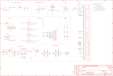

Contents
========

* [PRA1963 > Adafruit](#pra1963--adafruit)
	* [Schematic](#schematic)
	* [Interactive BOM](#interactive-bom)
	* [OOMP Parts](#oomp-parts)
	* [Images](#images)
	* [Tags](#tags)
  
![][im]
# PRA1963 > Adafruit

- ID: PROJ-ADAF-1963-STAN-01
- Hex ID: PRA1963
- Name: Adafruit
- Description: Adafruit
- Long Link: [http://oom.lt/PROJ-ADAF-1963-STAN-01](http://oom.lt/PROJ-ADAF-1963-STAN-01)
- Short Link: [http://oom.lt/PRA1963](http://oom.lt/PRA1963)

## Schematic
  

## Interactive BOM

- Interactive BOM page: [ibom.html](https://htmlpreview.github.io/?https://github.com/oomlout/oomlout_OOMP_projects/blob/main/PROJ-ADAF-1963-STAN-01/kicad/bom/ibom.html)

## OOMP Parts
  

|OOMP Parts|
| :---: |
|ADC,UNMATCHED-UNMATCHED-UNMATCHED-UNMATCHED-UNMATCHED,ADC,,PINHD-1X1CB,1X01-CLEANBIG,Pin header 1x1 for 0.1 spacing,,,,,,,|
|C1,UNMATCHED-UNMATCHED-UNMATCHED-UNMATCHED-UNMATCHED,C1,10µF,CAP_CERAMIC0805-NOOUTLINE,0805-NO,Ceramic Capacitors,,,,,,,|
|C2,UNMATCHED-UNMATCHED-UNMATCHED-UNMATCHED-UNMATCHED,C2,33pF,CAP_CERAMIC0805-NOOUTLINE,0805-NO,Ceramic Capacitors,,,,,,,|
|C3,UNMATCHED-UNMATCHED-UNMATCHED-UNMATCHED-UNMATCHED,C3,10pF,CAP_CERAMIC0805-NOOUTLINE,0805-NO,Ceramic Capacitors,,,,,,,|
|C4,UNMATCHED-UNMATCHED-UNMATCHED-UNMATCHED-UNMATCHED,C4,33pF,CAP_CERAMIC0805-NOOUTLINE,0805-NO,Ceramic Capacitors,,,,,,,|
|C5,UNMATCHED-UNMATCHED-UNMATCHED-UNMATCHED-UNMATCHED,C5,10pF,CAP_CERAMIC0805-NOOUTLINE,0805-NO,Ceramic Capacitors,,,,,,,|
|C6,UNMATCHED-UNMATCHED-UNMATCHED-UNMATCHED-UNMATCHED,C6,33pF,CAP_CERAMIC0805-NOOUTLINE,0805-NO,Ceramic Capacitors,,,,,,,|
|C7,UNMATCHED-UNMATCHED-UNMATCHED-UNMATCHED-UNMATCHED,C7,100uF,C-USC1210,C1210,CAPACITOR, American symbol,,,,,,,|
|C9,UNMATCHED-UNMATCHED-UNMATCHED-UNMATCHED-UNMATCHED,C9,10uF,CAP_CERAMIC0805-NOOUTLINE,0805-NO,Ceramic Capacitors,,,,,,,|
|C10,UNMATCHED-UNMATCHED-UNMATCHED-UNMATCHED-UNMATCHED,C10,10pF,CAP_CERAMIC0805-NOOUTLINE,0805-NO,Ceramic Capacitors,,,,,,,|
|C11,UNMATCHED-UNMATCHED-UNMATCHED-UNMATCHED-UNMATCHED,C11,10uF,CAP_CERAMIC0805-NOOUTLINE,0805-NO,Ceramic Capacitors,,,,,,,|
|C14,UNMATCHED-UNMATCHED-UNMATCHED-UNMATCHED-UNMATCHED,C14,33pF,CAP_4PACK1206,RESPACK_4X0603,,,,,,,,|
|C15,UNMATCHED-UNMATCHED-UNMATCHED-UNMATCHED-UNMATCHED,C15,10pF,CAP_4PACK1206,RESPACK_4X0603,,,,,,,,|
|C16,UNMATCHED-UNMATCHED-UNMATCHED-UNMATCHED-UNMATCHED,C16,33pF,CAP_4PACK1206,RESPACK_4X0603,,,,,,,,|
|C17,UNMATCHED-UNMATCHED-UNMATCHED-UNMATCHED-UNMATCHED,C17,10pF,CAP_4PACK1206,RESPACK_4X0603,,,,,,,,|
|CHRG,UNMATCHED-UNMATCHED-UNMATCHED-UNMATCHED-UNMATCHED,CHRG,ORANGE,LED0805_NOOUTLINE,CHIPLED_0805_NOOUTLINE,LED,,,,,,,|
|CN2,UNMATCHED-UNMATCHED-UNMATCHED-UNMATCHED-UNMATCHED,CN2,JSTPH,JST_2PIN,JSTPH2,JST 2-Pin Right-Angle Connector,,,,,,,|
|D1,UNMATCHED-UNMATCHED-UNMATCHED-UNMATCHED-UNMATCHED,D1,MMSZ5231BT1G,DIODE-ZENERSOD123,SOD-123,Zener Diode,,,,,,,|
|D2,UNMATCHED-UNMATCHED-UNMATCHED-UNMATCHED-UNMATCHED,D2,SMF05C,TVSARRAY_5LANE,SOT363,Voltage Transient Suppressor Array,,,,,,,|
|D3,UNMATCHED-UNMATCHED-UNMATCHED-UNMATCHED-UNMATCHED,D3,1N4148,DIODESOD-323,SOD-323,Diode,,,,,,,|
|D4,UNMATCHED-UNMATCHED-UNMATCHED-UNMATCHED-UNMATCHED,D4,1N4148,DIODESOD-323,SOD-323,Diode,,,,,,,|
|D5,UNMATCHED-UNMATCHED-UNMATCHED-UNMATCHED-UNMATCHED,D5,1N4148,DIODESOD-323,SOD-323,Diode,,,,,,,|
|D6,UNMATCHED-UNMATCHED-UNMATCHED-UNMATCHED-UNMATCHED,D6,1N4148,DIODESOD-323,SOD-323,Diode,,,,,,,|
|DONE,UNMATCHED-UNMATCHED-UNMATCHED-UNMATCHED-UNMATCHED,DONE,GREEN,LED0805_NOOUTLINE,CHIPLED_0805_NOOUTLINE,LED,,,,,,,|
|IC1,UNMATCHED-UNMATCHED-UNMATCHED-UNMATCHED-UNMATCHED,FID1,FIDUCIAL,FIDUCIAL,FIDUCIAL_1MM,Fiducial Alignment Points,EXCLUDE,,,,,,|
|JP1,UNMATCHED-UNMATCHED-UNMATCHED-UNMATCHED-UNMATCHED,FID2,FIDUCIAL,FIDUCIAL,FIDUCIAL_1MM,Fiducial Alignment Points,EXCLUDE,,,,,,|
|JP2,UNMATCHED-UNMATCHED-UNMATCHED-UNMATCHED-UNMATCHED,FID3,FIDUCIAL,FIDUCIAL,FIDUCIAL_1MM,Fiducial Alignment Points,EXCLUDE,,,,,,|
|JP3,UNMATCHED-UNMATCHED-UNMATCHED-UNMATCHED-UNMATCHED,FID4,FIDUCIAL,FIDUCIAL,FIDUCIAL_1MM,Fiducial Alignment Points,EXCLUDE,,,,,,|
|NETSTAT,UNMATCHED-UNMATCHED-UNMATCHED-UNMATCHED-UNMATCHED,FID5,FIDUCIAL,FIDUCIAL,FIDUCIAL_1MM,Fiducial Alignment Points,EXCLUDE,,,,,,|
|PWM,UNMATCHED-UNMATCHED-UNMATCHED-UNMATCHED-UNMATCHED,IC1,74VHCT125PW,74ABT125PW,TSSOP14,Quad bus BUFFER, 3-state,,,,,,,|
|PWRSTAT,UNMATCHED-UNMATCHED-UNMATCHED-UNMATCHED-UNMATCHED,JP1,,PINHD-1X12-CB,1X12-CB,PIN HEADER,,,,,,,|
|Q1,UNMATCHED-UNMATCHED-UNMATCHED-UNMATCHED-UNMATCHED,JP2,MIC,HEADER-1X2ROUND,1X02_ROUND,PIN HEADER,,,,,,,|
|R1,UNMATCHED-UNMATCHED-UNMATCHED-UNMATCHED-UNMATCHED,JP3,BUZZ,HEADER-1X2ROUND,1X02_ROUND,PIN HEADER,,,,,,,|
|R2,UNMATCHED-UNMATCHED-UNMATCHED-UNMATCHED-UNMATCHED,NETSTAT,BLUE,LED0805_NOOUTLINE,CHIPLED_0805_NOOUTLINE,LED,,,,,,,|
|R3,UNMATCHED-UNMATCHED-UNMATCHED-UNMATCHED-UNMATCHED,PWM,,PINHD-1X1CB,1X01-CLEANBIG,Pin header 1x1 for 0.1 spacing,,,,,,,|
|R4,UNMATCHED-UNMATCHED-UNMATCHED-UNMATCHED-UNMATCHED,PWRSTAT,GREEN,LED0805_NOOUTLINE,CHIPLED_0805_NOOUTLINE,LED,,,,,,,|
|R5,UNMATCHED-UNMATCHED-UNMATCHED-UNMATCHED-UNMATCHED,Q1,DTC143ZUAT106,MUN2211T1-NPN_DRIVER-SC59-BEC,SC59-BEC,NPN Bias Resistor Transistor,,,,,,,|
|SW1,UNMATCHED-UNMATCHED-UNMATCHED-UNMATCHED-UNMATCHED,R1,470,RESISTOR0805_NOOUTLINE,0805-NO,Resistors,,,,,,,|
|TP1,UNMATCHED-UNMATCHED-UNMATCHED-UNMATCHED-UNMATCHED,R2,1K,RESISTOR0805_NOOUTLINE,0805-NO,Resistors,,,,,,,|
|U1,UNMATCHED-UNMATCHED-UNMATCHED-UNMATCHED-UNMATCHED,R3,2K,RESISTOR0805_NOOUTLINE,0805-NO,Resistors,,,,,,,|
|U2,UNMATCHED-UNMATCHED-UNMATCHED-UNMATCHED-UNMATCHED,R4,1K,RESISTOR0805_NOOUTLINE,0805-NO,Resistors,,,,,,,|
|VBUS,UNMATCHED-UNMATCHED-UNMATCHED-UNMATCHED-UNMATCHED,R5,1K,RESISTOR0805_NOOUTLINE,0805-NO,Resistors,,,,,,,|
|X1,UNMATCHED-UNMATCHED-UNMATCHED-UNMATCHED-UNMATCHED,SW1,KMR2,SWITCH_TACT_SMT4.6X2.8,BTN_KMR2_4.6X2.8,SMT Tact Switches,,,,,,,|
|X2,UNMATCHED-UNMATCHED-UNMATCHED-UNMATCHED-UNMATCHED,TP1,TPTP11R,TPTP11R,TP11R,Test pad,,,,,,,|
|X4,UNMATCHED-UNMATCHED-UNMATCHED-UNMATCHED-UNMATCHED,U$33,MOUNTINGHOLE2.5,MOUNTINGHOLE2.5,MOUNTINGHOLE_2.5_PLATED,Mounting Hole,EXCLUDE,,,,,,|
|X6,UNMATCHED-UNMATCHED-UNMATCHED-UNMATCHED-UNMATCHED,U$34,MOUNTINGHOLE2.5,MOUNTINGHOLE2.5,MOUNTINGHOLE_2.5_PLATED,Mounting Hole,EXCLUDE,,,,,,|

## Images
  
  

|kicadPcb3d|kicadPcb3dFront|kicadPcb3dBack|eagleImage|eagleSchemImage|
| :---: | :---: | :---: | :---: | :---: |
||||||

## Tags

- hexID: PRA1963
- oompType: PROJ
- oompSize: ADAF
- oompColor: 1963
- oompDesc: STAN
- oompIndex: 01
- oompName: Adafruit FONA 800 GSM Breakout PCB
- sources: All source files from https://github.com/adafruit/Adafruit-FONA-800-GSM-Breakout-PCB (source licence details in srcLicense.md)
- linkBuyPage: http://www.adafruit.com/products/1963
- oompID: PROJ-ADAF-1963-STAN-01
- oompParts: ADC,UNMATCHED-UNMATCHED-UNMATCHED-UNMATCHED-UNMATCHED
- oompParts: C1,UNMATCHED-UNMATCHED-UNMATCHED-UNMATCHED-UNMATCHED
- oompParts: C2,UNMATCHED-UNMATCHED-UNMATCHED-UNMATCHED-UNMATCHED
- oompParts: C3,UNMATCHED-UNMATCHED-UNMATCHED-UNMATCHED-UNMATCHED
- oompParts: C4,UNMATCHED-UNMATCHED-UNMATCHED-UNMATCHED-UNMATCHED
- oompParts: C5,UNMATCHED-UNMATCHED-UNMATCHED-UNMATCHED-UNMATCHED
- oompParts: C6,UNMATCHED-UNMATCHED-UNMATCHED-UNMATCHED-UNMATCHED
- oompParts: C7,UNMATCHED-UNMATCHED-UNMATCHED-UNMATCHED-UNMATCHED
- oompParts: C9,UNMATCHED-UNMATCHED-UNMATCHED-UNMATCHED-UNMATCHED
- oompParts: C10,UNMATCHED-UNMATCHED-UNMATCHED-UNMATCHED-UNMATCHED
- oompParts: C11,UNMATCHED-UNMATCHED-UNMATCHED-UNMATCHED-UNMATCHED
- oompParts: C14,UNMATCHED-UNMATCHED-UNMATCHED-UNMATCHED-UNMATCHED
- oompParts: C15,UNMATCHED-UNMATCHED-UNMATCHED-UNMATCHED-UNMATCHED
- oompParts: C16,UNMATCHED-UNMATCHED-UNMATCHED-UNMATCHED-UNMATCHED
- oompParts: C17,UNMATCHED-UNMATCHED-UNMATCHED-UNMATCHED-UNMATCHED
- oompParts: CHRG,UNMATCHED-UNMATCHED-UNMATCHED-UNMATCHED-UNMATCHED
- oompParts: CN2,UNMATCHED-UNMATCHED-UNMATCHED-UNMATCHED-UNMATCHED
- oompParts: D1,UNMATCHED-UNMATCHED-UNMATCHED-UNMATCHED-UNMATCHED
- oompParts: D2,UNMATCHED-UNMATCHED-UNMATCHED-UNMATCHED-UNMATCHED
- oompParts: D3,UNMATCHED-UNMATCHED-UNMATCHED-UNMATCHED-UNMATCHED
- oompParts: D4,UNMATCHED-UNMATCHED-UNMATCHED-UNMATCHED-UNMATCHED
- oompParts: D5,UNMATCHED-UNMATCHED-UNMATCHED-UNMATCHED-UNMATCHED
- oompParts: D6,UNMATCHED-UNMATCHED-UNMATCHED-UNMATCHED-UNMATCHED
- oompParts: DONE,UNMATCHED-UNMATCHED-UNMATCHED-UNMATCHED-UNMATCHED
- oompParts: IC1,UNMATCHED-UNMATCHED-UNMATCHED-UNMATCHED-UNMATCHED
- oompParts: JP1,UNMATCHED-UNMATCHED-UNMATCHED-UNMATCHED-UNMATCHED
- oompParts: JP2,UNMATCHED-UNMATCHED-UNMATCHED-UNMATCHED-UNMATCHED
- oompParts: JP3,UNMATCHED-UNMATCHED-UNMATCHED-UNMATCHED-UNMATCHED
- oompParts: NETSTAT,UNMATCHED-UNMATCHED-UNMATCHED-UNMATCHED-UNMATCHED
- oompParts: PWM,UNMATCHED-UNMATCHED-UNMATCHED-UNMATCHED-UNMATCHED
- oompParts: PWRSTAT,UNMATCHED-UNMATCHED-UNMATCHED-UNMATCHED-UNMATCHED
- oompParts: Q1,UNMATCHED-UNMATCHED-UNMATCHED-UNMATCHED-UNMATCHED
- oompParts: R1,UNMATCHED-UNMATCHED-UNMATCHED-UNMATCHED-UNMATCHED
- oompParts: R2,UNMATCHED-UNMATCHED-UNMATCHED-UNMATCHED-UNMATCHED
- oompParts: R3,UNMATCHED-UNMATCHED-UNMATCHED-UNMATCHED-UNMATCHED
- oompParts: R4,UNMATCHED-UNMATCHED-UNMATCHED-UNMATCHED-UNMATCHED
- oompParts: R5,UNMATCHED-UNMATCHED-UNMATCHED-UNMATCHED-UNMATCHED
- oompParts: SW1,UNMATCHED-UNMATCHED-UNMATCHED-UNMATCHED-UNMATCHED
- oompParts: TP1,UNMATCHED-UNMATCHED-UNMATCHED-UNMATCHED-UNMATCHED
- oompParts: U1,UNMATCHED-UNMATCHED-UNMATCHED-UNMATCHED-UNMATCHED
- oompParts: U2,UNMATCHED-UNMATCHED-UNMATCHED-UNMATCHED-UNMATCHED
- oompParts: VBUS,UNMATCHED-UNMATCHED-UNMATCHED-UNMATCHED-UNMATCHED
- oompParts: X1,UNMATCHED-UNMATCHED-UNMATCHED-UNMATCHED-UNMATCHED
- oompParts: X2,UNMATCHED-UNMATCHED-UNMATCHED-UNMATCHED-UNMATCHED
- oompParts: X4,UNMATCHED-UNMATCHED-UNMATCHED-UNMATCHED-UNMATCHED
- oompParts: X6,UNMATCHED-UNMATCHED-UNMATCHED-UNMATCHED-UNMATCHED
- rawParts: ADC,,PINHD-1X1CB,1X01-CLEANBIG,Pin header 1x1 for 0.1 spacing,,,,,,,
- rawParts: C1,10µF,CAP_CERAMIC0805-NOOUTLINE,0805-NO,Ceramic Capacitors,,,,,,,
- rawParts: C2,33pF,CAP_CERAMIC0805-NOOUTLINE,0805-NO,Ceramic Capacitors,,,,,,,
- rawParts: C3,10pF,CAP_CERAMIC0805-NOOUTLINE,0805-NO,Ceramic Capacitors,,,,,,,
- rawParts: C4,33pF,CAP_CERAMIC0805-NOOUTLINE,0805-NO,Ceramic Capacitors,,,,,,,
- rawParts: C5,10pF,CAP_CERAMIC0805-NOOUTLINE,0805-NO,Ceramic Capacitors,,,,,,,
- rawParts: C6,33pF,CAP_CERAMIC0805-NOOUTLINE,0805-NO,Ceramic Capacitors,,,,,,,
- rawParts: C7,100uF,C-USC1210,C1210,CAPACITOR, American symbol,,,,,,,
- rawParts: C9,10uF,CAP_CERAMIC0805-NOOUTLINE,0805-NO,Ceramic Capacitors,,,,,,,
- rawParts: C10,10pF,CAP_CERAMIC0805-NOOUTLINE,0805-NO,Ceramic Capacitors,,,,,,,
- rawParts: C11,10uF,CAP_CERAMIC0805-NOOUTLINE,0805-NO,Ceramic Capacitors,,,,,,,
- rawParts: C14,33pF,CAP_4PACK1206,RESPACK_4X0603,,,,,,,,
- rawParts: C15,10pF,CAP_4PACK1206,RESPACK_4X0603,,,,,,,,
- rawParts: C16,33pF,CAP_4PACK1206,RESPACK_4X0603,,,,,,,,
- rawParts: C17,10pF,CAP_4PACK1206,RESPACK_4X0603,,,,,,,,
- rawParts: CHRG,ORANGE,LED0805_NOOUTLINE,CHIPLED_0805_NOOUTLINE,LED,,,,,,,
- rawParts: CN2,JSTPH,JST_2PIN,JSTPH2,JST 2-Pin Right-Angle Connector,,,,,,,
- rawParts: D1,MMSZ5231BT1G,DIODE-ZENERSOD123,SOD-123,Zener Diode,,,,,,,
- rawParts: D2,SMF05C,TVSARRAY_5LANE,SOT363,Voltage Transient Suppressor Array,,,,,,,
- rawParts: D3,1N4148,DIODESOD-323,SOD-323,Diode,,,,,,,
- rawParts: D4,1N4148,DIODESOD-323,SOD-323,Diode,,,,,,,
- rawParts: D5,1N4148,DIODESOD-323,SOD-323,Diode,,,,,,,
- rawParts: D6,1N4148,DIODESOD-323,SOD-323,Diode,,,,,,,
- rawParts: DONE,GREEN,LED0805_NOOUTLINE,CHIPLED_0805_NOOUTLINE,LED,,,,,,,
- rawParts: FID1,FIDUCIAL,FIDUCIAL,FIDUCIAL_1MM,Fiducial Alignment Points,EXCLUDE,,,,,,
- rawParts: FID2,FIDUCIAL,FIDUCIAL,FIDUCIAL_1MM,Fiducial Alignment Points,EXCLUDE,,,,,,
- rawParts: FID3,FIDUCIAL,FIDUCIAL,FIDUCIAL_1MM,Fiducial Alignment Points,EXCLUDE,,,,,,
- rawParts: FID4,FIDUCIAL,FIDUCIAL,FIDUCIAL_1MM,Fiducial Alignment Points,EXCLUDE,,,,,,
- rawParts: FID5,FIDUCIAL,FIDUCIAL,FIDUCIAL_1MM,Fiducial Alignment Points,EXCLUDE,,,,,,
- rawParts: IC1,74VHCT125PW,74ABT125PW,TSSOP14,Quad bus BUFFER, 3-state,,,,,,,
- rawParts: JP1,,PINHD-1X12-CB,1X12-CB,PIN HEADER,,,,,,,
- rawParts: JP2,MIC,HEADER-1X2ROUND,1X02_ROUND,PIN HEADER,,,,,,,
- rawParts: JP3,BUZZ,HEADER-1X2ROUND,1X02_ROUND,PIN HEADER,,,,,,,
- rawParts: NETSTAT,BLUE,LED0805_NOOUTLINE,CHIPLED_0805_NOOUTLINE,LED,,,,,,,
- rawParts: PWM,,PINHD-1X1CB,1X01-CLEANBIG,Pin header 1x1 for 0.1 spacing,,,,,,,
- rawParts: PWRSTAT,GREEN,LED0805_NOOUTLINE,CHIPLED_0805_NOOUTLINE,LED,,,,,,,
- rawParts: Q1,DTC143ZUAT106,MUN2211T1-NPN_DRIVER-SC59-BEC,SC59-BEC,NPN Bias Resistor Transistor,,,,,,,
- rawParts: R1,470,RESISTOR0805_NOOUTLINE,0805-NO,Resistors,,,,,,,
- rawParts: R2,1K,RESISTOR0805_NOOUTLINE,0805-NO,Resistors,,,,,,,
- rawParts: R3,2K,RESISTOR0805_NOOUTLINE,0805-NO,Resistors,,,,,,,
- rawParts: R4,1K,RESISTOR0805_NOOUTLINE,0805-NO,Resistors,,,,,,,
- rawParts: R5,1K,RESISTOR0805_NOOUTLINE,0805-NO,Resistors,,,,,,,
- rawParts: SW1,KMR2,SWITCH_TACT_SMT4.6X2.8,BTN_KMR2_4.6X2.8,SMT Tact Switches,,,,,,,
- rawParts: TP1,TPTP11R,TPTP11R,TP11R,Test pad,,,,,,,
- rawParts: U$33,MOUNTINGHOLE2.5,MOUNTINGHOLE2.5,MOUNTINGHOLE_2.5_PLATED,Mounting Hole,EXCLUDE,,,,,,
- rawParts: U$34,MOUNTINGHOLE2.5,MOUNTINGHOLE2.5,MOUNTINGHOLE_2.5_PLATED,Mounting Hole,EXCLUDE,,,,,,
- rawParts: U1,SIM800H/L,GSM_SIM800L,SIM800L,SIM800K Quad-Band GSM/GPRS Module,,,,,,,
- rawParts: U2,MCP73831T-2ACI/OT,MCP73831/2,SOT23-5,MCP73831/2 LIPO Charger,,,,,,,
- rawParts: VBUS,,PINHD-1X1CB,1X01-CLEANBIG,Pin header 1x1 for 0.1 spacing,,,,,,,
- rawParts: X1,,SMACONNECTOR_EDGE_UFL,SMA_EDGELAUNCH_UFL,SMA Connector,,,,,,,
- rawParts: X2,MicroB,USBMICRO_20329,4UCONN_20329,USB Connectors,,,,,,,
- rawParts: X4,,AUDIO_3.5MMJACK_4POL,4UCONN_18510,Footprint courtesy Morten Hjerde (Riftlabs.com),,,,,,,
- rawParts: X6,SIM_LOCKAMPHENOL,SIM_LOCKAMPHENOL,C707_10M006_512_2,C707A SIMLOCK® 2.5 mm with wide solder tails,,,,unknown,unknown,,

[im]: kicadPcb3d_450.png
