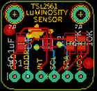

Contents
========

* [PROJ-ADAF-1980-STAN-01>TSL2561 breakout board PCB](#proj-adaf-1980-stan-01tsl2561-breakout-board-pcb)
	* [Images](#images)
	* [OOMP Parts](#oomp-parts)
	* [Tags](#tags)
  
![][im]
# PROJ-ADAF-1980-STAN-01>TSL2561 breakout board PCB

- ID: PROJ-ADAF-1980-STAN-01
- Hex ID: PRA1980
- Name: TSL2561 breakout board PCB
- Description: 

## Images
  
  

|eagleImage|kicadPcb3dFront|kicadPcb3dBack|kicadPcb3d|
| :---: | :---: | :---: | :---: |
|||||

## OOMP Parts
  

|OOMP Parts|
| :---: |
|<table><tr><td></td><td> C1</td><td>[CAPC-0805-X-NF100-V50 SMD (0805) 100 nF Capacitor (Ceramic) 50v](https://github.com/oomlout/oomlout_OOMP_parts/tree/main/CAPC-0805-X-NF100-V50/)</td><td>[C85N100](https://github.com/oomlout/oomlout_OOMP_parts/tree/main/CAPC-0805-X-NF100-V50/)</td></tr></table>|
|<table><tr><td></td><td> JP1</td><td>[HEAD-I01-X-PI06-01 2.54 mm 6 Pin Header](https://github.com/oomlout/oomlout_OOMP_parts/tree/main/HEAD-I01-X-PI06-01/)</td><td>[H06](https://github.com/oomlout/oomlout_OOMP_parts/tree/main/HEAD-I01-X-PI06-01/)</td></tr></table>|
|<table><tr><td></td><td> R1</td><td>[RESE-0805-X-O103-01 SMD (0805) 10k Ohm Resistor](https://github.com/oomlout/oomlout_OOMP_parts/tree/main/RESE-0805-X-O103-01/)</td><td>[R85103](https://github.com/oomlout/oomlout_OOMP_parts/tree/main/RESE-0805-X-O103-01/)</td></tr></table>|
|<table><tr><td></td><td> R2</td><td>[RESE-0805-X-O103-01 SMD (0805) 10k Ohm Resistor](https://github.com/oomlout/oomlout_OOMP_parts/tree/main/RESE-0805-X-O103-01/)</td><td>[R85103](https://github.com/oomlout/oomlout_OOMP_parts/tree/main/RESE-0805-X-O103-01/)</td></tr></table>|
|UNMATCHED-UNMATCHED-X-UNMATCHED-01, U1, 8.889999999999999, 8.889999999999999, 270,U1, TSL2561, TSL2561_FN, microbuilder, (0.35, 0.35), R270|

## Tags

- hexID: PRA1980
- oompType: PROJ
- oompSize: ADAF
- oompColor: 1980
- oompDesc: STAN
- oompIndex: 01
- oompName: TSL2561 breakout board PCB
- sources: All source files from https://github.com/adafruit/TSL2561-breakout-board-PCB (source licence details in srcLicense.md)
- linkBuyPage: http://www.adafruit.com/products/1980
- oompPart: CAPC-0805-X-NF100-V50, C1, 3.8099999999999996, 8.889999999999999, 270
- oompPart: HEAD-I01-X-PI06-01, JP1, 8.889999999999999, 2.54, 0
- oompPart: RESE-0805-X-O103-01, R1, 15.493999999999998, 8.889999999999999, 90
- oompPart: RESE-0805-X-O103-01, R2, 13.208, 8.889999999999999, 90
- oompPart: SKIP-UNMATCHED-X-UNMATCHED-01, U$2, 1.5239999999999998, 11.43, 0
- oompPart: SKIP-UNMATCHED-X-UNMATCHED-01, U$4, 16.764, 5.08, 0
- oompPart: SKIP-UNMATCHED-X-UNMATCHED-01, U$5, 15.239999999999998, 14.477999999999998, 0
- oompPart: SKIP-UNMATCHED-X-UNMATCHED-01, U$6, 2.54, 14.477999999999998, 0
- oompPart: UNMATCHED-UNMATCHED-X-UNMATCHED-01, U1, 8.889999999999999, 8.889999999999999, 270
- rawPart: C1, 0.1uF, C0805, adafruit, (0.15, 0.35), R270
- rawPart: JP1, 1X06_ROUND_76, microbuilder, (0.35, 0.1), R0
- rawPart: R1, 10K, R0805, adafruit, (0.61, 0.35), R90
- rawPart: R2, 10K, R0805, adafruit, (0.52, 0.35), R90
- rawPart: U$2, FIDUCIAL, FIDUCIAL_1MM, adafruit, (0.06, 0.45), R0
- rawPart: U$4, FIDUCIAL, FIDUCIAL_1MM, adafruit, (0.66, 0.2), R0
- rawPart: U$5, MOUNTINGHOLE2.0, MOUNTINGHOLE_2.0_PLATED, microbuilder, (0.6, 0.57), R0
- rawPart: U$6, MOUNTINGHOLE2.0, MOUNTINGHOLE_2.0_PLATED, microbuilder, (0.1, 0.57), R0
- rawPart: U1, TSL2561, TSL2561_FN, microbuilder, (0.35, 0.35), R270
- oompID: PROJ-ADAF-1980-STAN-01

[im]: kicadPcb3d_450.png
