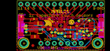
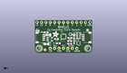
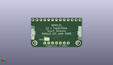
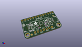

Contents
========

* [PROJ-ADAF-1982-STAN-01>Adafruit MPR121 PCB](#proj-adaf-1982-stan-01adafruit-mpr121-pcb)
	* [Images](#images)
	* [Interactive BOM](#interactive-bom)
	* [OOMP Parts](#oomp-parts)
	* [Tags](#tags)
  
![][im]
# PROJ-ADAF-1982-STAN-01>Adafruit MPR121 PCB

- ID: PROJ-ADAF-1982-STAN-01
- Hex ID: PRA1982
- Name: Adafruit MPR121 PCB
- Description: 

## Images
  
  

|eagleImage|kicadPcb3dFront|kicadPcb3dBack|kicadPcb3d|
| :---: | :---: | :---: | :---: |
|||||

## Interactive BOM

- Interactive BOM page: [ibom.html](kicad/bom/ibom.html)

## OOMP Parts
  

|OOMP Parts|
| :---: |
|CAPE-0603-X-NF100-01, C4, 20.1295, 6.7945, 0,C4, 0.1uF, 0603-NO, microbuilder, (0.7925, 0.2675), R0|
|CAPE-0805-X-UNMATCHED-01, C5, 6.731, 5.08, 180,C5, 10uF, 0805-NO, microbuilder, (0.265, 0.2), R180|
|CAPE-0805-X-UNMATCHED-01, C6, 7.874, 10.413999999999998, 180,C6, 10uF, 0805-NO, microbuilder, (0.31, 0.41), R180|
|CAPE-0603-X-NF100-01, C7, 12.446, 8.001, 180,C7, 0.1uF, 0603-NO, microbuilder, (0.49, 0.315), R180|
|UNMATCHED-UNMATCHED-X-UNMATCHED-01, CONN3, 30.353, 8.889999999999999, 90,CONN3, STEMMA_I2C_QT, JST_SH4, microbuilder, (1.195, 0.35), R90|
|UNMATCHED-UNMATCHED-X-UNMATCHED-01, CONN4, 2.667, 8.889999999999999, 270,CONN4, STEMMA_I2C_QT, JST_SH4, microbuilder, (0.105, 0.35), R270|
|UNMATCHED-UNMATCHED-X-UNMATCHED-01, D1, 22.605999999999998, 6.223, 180,D1, RED, CHIPLED_0603_NOOUTLINE, microbuilder, (0.89, 0.245), R180|
|UNMATCHED-UNMATCHED-X-UNMATCHED-01, D2, 1.5239999999999998, 12.953999999999999, 90,D2, GREEN, CHIPLED_0603_NOOUTLINE, microbuilder, (0.06, 0.51), R90|
|UNMATCHED-UNMATCHED-X-UNMATCHED-01, JP1, 16.509999999999998, 17.779999999999998, 0,JP1, 1X13_ROUND_70, microbuilder, (0.65, 0.7), R0|
|UNMATCHED-UNMATCHED-X-UNMATCHED-01, JP2, 16.509999999999998, 2.54, 0,JP2, 1X07_ROUND_70, microbuilder, (0.65, 0.1), R0|
|UNMATCHED-UNMATCHED-X-UNMATCHED-01, Q3, 25.145999999999997, 5.588, 90,Q3, BSS138, SOT363, microbuilder, (0.99, 0.22), R90|
|<table><tr><td></td><td> R1</td><td>[RESE-0603-X-O103-01 SMD (0603) 10k Ohm Resistor](https://github.com/oomlout/oomlout_OOMP_parts/tree/main/RESE-0603-X-O103-01/)</td><td>[R6103](https://github.com/oomlout/oomlout_OOMP_parts/tree/main/RESE-0603-X-O103-01/)</td></tr></table>|
|RESE-0603-X-O753-01, R5, 20.2565, 8.636000000000001, 180,R5, 75K, 0603-NO, microbuilder, (0.7975, 0.34), R180|
|<table><tr><td></td><td> R6</td><td>[RESE-0603-X-O103-01 SMD (0603) 10k Ohm Resistor](https://github.com/oomlout/oomlout_OOMP_parts/tree/main/RESE-0603-X-O103-01/)</td><td>[R6103](https://github.com/oomlout/oomlout_OOMP_parts/tree/main/RESE-0603-X-O103-01/)</td></tr></table>|
|RESE-0603-X-UNMATCHED-01, R7, 22.605999999999998, 9.143999999999998, 90,R7, 1K, 0603-NO, microbuilder, (0.89, 0.36), R90|
|RESE-UNMATCHED-X-O103-01, R8, 25.145999999999997, 10.033, 270,R8, 10K, RESPACK_4X0603, microbuilder, (0.99, 0.395), R270|
|<table><tr><td></td><td> R9</td><td>[RESE-0603-X-O103-01 SMD (0603) 10k Ohm Resistor](https://github.com/oomlout/oomlout_OOMP_parts/tree/main/RESE-0603-X-O103-01/)</td><td>[R6103](https://github.com/oomlout/oomlout_OOMP_parts/tree/main/RESE-0603-X-O103-01/)</td></tr></table>|
|UNMATCHED-UNMATCHED-X-UNMATCHED-01, SJ1, 22.796499999999998, 5.08, M0,SJ1, SOLDERJUMPER_ARROW_NOPASTE, microbuilder, (0.8975, 0.2), MR0|
|UNMATCHED-UNMATCHED-X-UNMATCHED-01, U1, 16.509999999999998, 9.398, 90,U1, MPR121, QFN20_3MM_NOTHERMAL, microbuilder, (0.65, 0.37), R90|
|UNMATCHED-UNMATCHED-X-UNMATCHED-01, U2, 8.636000000000001, 7.874, 270,U2, AP2112K-3.3, SOT23-5, microbuilder, (0.34, 0.31), R270|

## Tags

- hexID: PRA1982
- oompType: PROJ
- oompSize: ADAF
- oompColor: 1982
- oompDesc: STAN
- oompIndex: 01
- oompName: Adafruit MPR121 PCB
- sources: All source files from https://github.com/adafruit/Adafruit-MPR121-PCB (source licence details in srcLicense.md)
- linkBuyPage: http://www.adafruit.com/products/1982
- oompPart: CAPE-0603-X-NF100-01, C4, 20.1295, 6.7945, 0
- oompPart: CAPE-0805-X-UNMATCHED-01, C5, 6.731, 5.08, 180
- oompPart: CAPE-0805-X-UNMATCHED-01, C6, 7.874, 10.413999999999998, 180
- oompPart: CAPE-0603-X-NF100-01, C7, 12.446, 8.001, 180
- oompPart: UNMATCHED-UNMATCHED-X-UNMATCHED-01, CONN3, 30.353, 8.889999999999999, 90
- oompPart: UNMATCHED-UNMATCHED-X-UNMATCHED-01, CONN4, 2.667, 8.889999999999999, 270
- oompPart: UNMATCHED-UNMATCHED-X-UNMATCHED-01, D1, 22.605999999999998, 6.223, 180
- oompPart: UNMATCHED-UNMATCHED-X-UNMATCHED-01, D2, 1.5239999999999998, 12.953999999999999, 90
- oompPart: SKIP-UNMATCHED-X-UNMATCHED-01, FID3, 5.842, 1.651, 0
- oompPart: SKIP-UNMATCHED-X-UNMATCHED-01, FID4, 30.353, 13.208, 0
- oompPart: UNMATCHED-UNMATCHED-X-UNMATCHED-01, JP1, 16.509999999999998, 17.779999999999998, 0
- oompPart: UNMATCHED-UNMATCHED-X-UNMATCHED-01, JP2, 16.509999999999998, 2.54, 0
- oompPart: UNMATCHED-UNMATCHED-X-UNMATCHED-01, Q3, 25.145999999999997, 5.588, 90
- oompPart: RESE-0603-X-O103-01, R1, 13.5255, 5.460999999999999, 180
- oompPart: RESE-0603-X-O753-01, R5, 20.2565, 8.636000000000001, 180
- oompPart: RESE-0603-X-O103-01, R6, 20.1295, 5.206999999999999, 180
- oompPart: RESE-0603-X-UNMATCHED-01, R7, 22.605999999999998, 9.143999999999998, 90
- oompPart: RESE-UNMATCHED-X-O103-01, R8, 25.145999999999997, 10.033, 270
- oompPart: RESE-0603-X-O103-01, R9, 6.476999999999999, 11.937999999999999, 180
- oompPart: UNMATCHED-UNMATCHED-X-UNMATCHED-01, SJ1, 22.796499999999998, 5.08, M0
- oompPart: SKIP-UNMATCHED-X-UNMATCHED-01, U$34, 2.54, 2.54, 0
- oompPart: SKIP-UNMATCHED-X-UNMATCHED-01, U$35, 30.479999999999997, 2.54, 0
- oompPart: UNMATCHED-UNMATCHED-X-UNMATCHED-01, U1, 16.509999999999998, 9.398, 90
- oompPart: UNMATCHED-UNMATCHED-X-UNMATCHED-01, U2, 8.636000000000001, 7.874, 270
- rawPart: C4, 0.1uF, 0603-NO, microbuilder, (0.7925, 0.2675), R0
- rawPart: C5, 10uF, 0805-NO, microbuilder, (0.265, 0.2), R180
- rawPart: C6, 10uF, 0805-NO, microbuilder, (0.31, 0.41), R180
- rawPart: C7, 0.1uF, 0603-NO, microbuilder, (0.49, 0.315), R180
- rawPart: CONN3, STEMMA_I2C_QT, JST_SH4, microbuilder, (1.195, 0.35), R90
- rawPart: CONN4, STEMMA_I2C_QT, JST_SH4, microbuilder, (0.105, 0.35), R270
- rawPart: D1, RED, CHIPLED_0603_NOOUTLINE, microbuilder, (0.89, 0.245), R180
- rawPart: D2, GREEN, CHIPLED_0603_NOOUTLINE, microbuilder, (0.06, 0.51), R90
- rawPart: FID3, FIDUCIAL_1MM, FIDUCIAL_1MM, microbuilder, (0.23, 0.065), R0
- rawPart: FID4, FIDUCIAL_1MM, FIDUCIAL_1MM, microbuilder, (1.195, 0.52), R0
- rawPart: JP1, 1X13_ROUND_70, microbuilder, (0.65, 0.7), R0
- rawPart: JP2, 1X07_ROUND_70, microbuilder, (0.65, 0.1), R0
- rawPart: Q3, BSS138, SOT363, microbuilder, (0.99, 0.22), R90
- rawPart: R1, 10K, 0603-NO, microbuilder, (0.5325, 0.215), R180
- rawPart: R5, 75K, 0603-NO, microbuilder, (0.7975, 0.34), R180
- rawPart: R6, 10K, 0603-NO, microbuilder, (0.7925, 0.205), R180
- rawPart: R7, 1K, 0603-NO, microbuilder, (0.89, 0.36), R90
- rawPart: R8, 10K, RESPACK_4X0603, microbuilder, (0.99, 0.395), R270
- rawPart: R9, 10K, 0603-NO, microbuilder, (0.255, 0.47), R180
- rawPart: SJ1, SOLDERJUMPER_ARROW_NOPASTE, microbuilder, (0.8975, 0.2), MR0
- rawPart: U$34, MOUNTINGHOLE2.5, MOUNTINGHOLE_2.5_PLATED, microbuilder, (0.1, 0.1), R0
- rawPart: U$35, MOUNTINGHOLE2.5, MOUNTINGHOLE_2.5_PLATED, microbuilder, (1.2, 0.1), R0
- rawPart: U1, MPR121, QFN20_3MM_NOTHERMAL, microbuilder, (0.65, 0.37), R90
- rawPart: U2, AP2112K-3.3, SOT23-5, microbuilder, (0.34, 0.31), R270

[im]: kicadPcb3d_450.png
