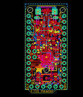
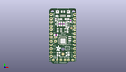
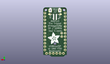
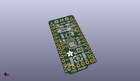

Contents
========

* [PROJ-ADAF-2000-STAN-01>Adafruit Pro Trinket PCBs](#proj-adaf-2000-stan-01adafruit-pro-trinket-pcbs)
	* [Images](#images)
	* [Interactive BOM](#interactive-bom)
	* [OOMP Parts](#oomp-parts)
	* [Tags](#tags)
  
![][im]
# PROJ-ADAF-2000-STAN-01>Adafruit Pro Trinket PCBs

- ID: PROJ-ADAF-2000-STAN-01
- Hex ID: PRA2000
- Name: Adafruit Pro Trinket PCBs
- Description: 

## Images
  
  

|eagleImage|kicadPcb3dFront|kicadPcb3dBack|kicadPcb3d|
| :---: | :---: | :---: | :---: |
|||||

## Interactive BOM

- Interactive BOM page: [ibom.html](kicad/bom/ibom.html)

## OOMP Parts
  

|OOMP Parts|
| :---: |
|UNMATCHED-UNMATCHED-X-UNMATCHED-01, B1, -2.1590000000000003, 28.955999999999996, 270,B1, red, CHIPLED_0805_NOOUTLINE, microbuilder, (-0.085, 1.14), R270|
|ERROR, BAT JST 2-PH, 0, 0, 0,BAT, JST, 2-PH, JSTPH2, microbuilder, (0, 1.28), MR0|
|CAPC-0805-X-UNMATCHED-01, C1, -3.429, 21.462999999999997, 270,C1, 10uF, 0805-NO, microbuilder, (-0.135, 0.845), R270|
|<table><tr><td></td><td> C2</td><td>[CAPC-0805-X-NF100-V50 SMD (0805) 100 nF Capacitor (Ceramic) 50v](https://github.com/oomlout/oomlout_OOMP_parts/tree/main/CAPC-0805-X-NF100-V50/)</td><td>[C85N100](https://github.com/oomlout/oomlout_OOMP_parts/tree/main/CAPC-0805-X-NF100-V50/)</td></tr></table>|
|<table><tr><td></td><td> C3</td><td>[CAPC-0805-X-NF100-V50 SMD (0805) 100 nF Capacitor (Ceramic) 50v](https://github.com/oomlout/oomlout_OOMP_parts/tree/main/CAPC-0805-X-NF100-V50/)</td><td>[C85N100](https://github.com/oomlout/oomlout_OOMP_parts/tree/main/CAPC-0805-X-NF100-V50/)</td></tr></table>|
|CAPC-0805-X-UNMATCHED-01, C8, 3.0225999999999997, 21.081999999999997, 270,C8, 10uF, 0805-NO, microbuilder, (0.119, 0.83), R270|
|UNMATCHED-UNMATCHED-X-UNMATCHED-01, CN1, 0.0, 31.75, 180,CN1, 4UCONN_20329, microbuilder, (0, 1.25), R180|
|UNMATCHED-UNMATCHED-X-UNMATCHED-01, D1, -3.6829999999999994, 25.654, 90,D1, 3.6v, SOD-323, microbuilder, (-0.145, 1.01), R90|
|UNMATCHED-UNMATCHED-X-UNMATCHED-01, D2, 3.6829999999999994, 25.222199999999997, 90,D2, SCHOTTKY, SOD-123FL, adafruit, (0.145, 0.993), R90|
|UNMATCHED-UNMATCHED-X-UNMATCHED-01, D4, 1.9049999999999998, 25.145999999999997, 270,D4, 3.6V, SOD-323, microbuilder, (0.075, 0.99), R270|
|UNMATCHED-UNMATCHED-X-UNMATCHED-01, FTDI, 0.0, 1.27, 0,FTDI, 1X06-CLEANBIG, adafruit, (0, 0.05), R0|
|UNMATCHED-UNMATCHED-X-UNMATCHED-01, IC1, 0.0, 14.097000000000001, 180,IC1, ATmega328P, MLF32-TH, microbuilder, (0, 0.555), R180|
|UNMATCHED-UNMATCHED-X-UNMATCHED-01, IC2, 0.127, 21.209, 270,IC2, MIC5225-5v, SOT23-5L, adafruit, (0.005, 0.835), R270|
|<table><tr><td></td><td> JP1</td><td>[HEAD-I01-X-PI12-01 2.54 mm 12 Pin Header](https://github.com/oomlout/oomlout_OOMP_parts/tree/main/HEAD-I01-X-PI12-01/)</td><td>[H12](https://github.com/oomlout/oomlout_OOMP_parts/tree/main/HEAD-I01-X-PI12-01/)</td></tr></table>|
|<table><tr><td></td><td> JP2</td><td>[HEAD-I01-X-PI02-01 2.54 mm 2 Pin Header](https://github.com/oomlout/oomlout_OOMP_parts/tree/main/HEAD-I01-X-PI02-01/)</td><td>[H02](https://github.com/oomlout/oomlout_OOMP_parts/tree/main/HEAD-I01-X-PI02-01/)</td></tr></table>|
|<table><tr><td></td><td> JP4</td><td>[HEAD-I01-X-PI12-01 2.54 mm 12 Pin Header](https://github.com/oomlout/oomlout_OOMP_parts/tree/main/HEAD-I01-X-PI12-01/)</td><td>[H12](https://github.com/oomlout/oomlout_OOMP_parts/tree/main/HEAD-I01-X-PI12-01/)</td></tr></table>|
|UNMATCHED-UNMATCHED-X-UNMATCHED-01, PWR, 2.667, 29.0195, 90,PWR, green, CHIPLED_0805_NOOUTLINE, microbuilder, (0.105, 1.1425), R90|
|UNMATCHED-UNMATCHED-X-UNMATCHED-01, Q1, 0.0, 5.08, 0,Q1, reset, BTN_KMR2_4.6X2.8, microbuilder, (0, 0.2), R0|
|ERROR, R1 68 (0603), 0, 0, 0,R1, 68, (0603), 0603-NO, microbuilder, (-0.035, 1.005), R270|
|ERROR, R2 68 (0603), 0, 0, 0,R2, 68, (0603), 0603-NO, microbuilder, (-0.085, 1.005), R270|
|ERROR, R3 1.5K (0603), 0, 0, 0,R3, 1.5K, (0603), 0603-NO, microbuilder, (0.02, 1.005), R270|
|ERROR, R4 470 (0603), 0, 0, 0,R4, 470, (0603), 0603-NO, microbuilder, (0.2, 1.085), R270|
|ERROR, R5 470 (0603), 0, 0, 0,R5, 470, (0603), 0603-NO, microbuilder, (-0.19, 1.115), R270|
|<table><tr><td></td><td> R6</td><td>[RESE-0805-X-O103-01 SMD (0805) 10k Ohm Resistor](https://github.com/oomlout/oomlout_OOMP_parts/tree/main/RESE-0805-X-O103-01/)</td><td>[R85103](https://github.com/oomlout/oomlout_OOMP_parts/tree/main/RESE-0805-X-O103-01/)</td></tr></table>|
|UNMATCHED-UNMATCHED-X-UNMATCHED-01, Y1, 4.571999999999999, 15.620999999999999, 90,Y1, 16MHz, RESONATOR-SMD, SparkFun, (0.18, 0.615), R90|

## Tags

- hexID: PRA2000
- oompType: PROJ
- oompSize: ADAF
- oompColor: 2000
- oompDesc: STAN
- oompIndex: 01
- oompName: Adafruit Pro Trinket PCBs
- sources: All source files from https://github.com/adafruit/Adafruit-Pro-Trinket-PCBs (source licence details in srcLicense.md)
- linkBuyPage: http://www.adafruit.com/products/2000
- oompPart: UNMATCHED-UNMATCHED-X-UNMATCHED-01, B1, -2.1590000000000003, 28.955999999999996, 270
- oompPart: ERROR, BAT JST 2-PH, 0, 0, 0
- oompPart: CAPC-0805-X-UNMATCHED-01, C1, -3.429, 21.462999999999997, 270
- oompPart: CAPC-0805-X-NF100-V50, C2, -4.571999999999999, 18.287999999999997, 0
- oompPart: CAPC-0805-X-NF100-V50, C3, 3.8099999999999996, 5.588, 270
- oompPart: CAPC-0805-X-UNMATCHED-01, C8, 3.0225999999999997, 21.081999999999997, 270
- oompPart: UNMATCHED-UNMATCHED-X-UNMATCHED-01, CN1, 0.0, 31.75, 180
- oompPart: UNMATCHED-UNMATCHED-X-UNMATCHED-01, D1, -3.6829999999999994, 25.654, 90
- oompPart: UNMATCHED-UNMATCHED-X-UNMATCHED-01, D2, 3.6829999999999994, 25.222199999999997, 90
- oompPart: UNMATCHED-UNMATCHED-X-UNMATCHED-01, D4, 1.9049999999999998, 25.145999999999997, 270
- oompPart: UNMATCHED-UNMATCHED-X-UNMATCHED-01, FTDI, 0.0, 1.27, 0
- oompPart: UNMATCHED-UNMATCHED-X-UNMATCHED-01, IC1, 0.0, 14.097000000000001, 180
- oompPart: UNMATCHED-UNMATCHED-X-UNMATCHED-01, IC2, 0.127, 21.209, 270
- oompPart: HEAD-I01-X-PI12-01, JP1, 7.619999999999999, 17.779999999999998, 270
- oompPart: HEAD-I01-X-PI02-01, JP2, -5.08, 15.239999999999998, 270
- oompPart: HEAD-I01-X-PI12-01, JP4, -7.619999999999999, 17.779999999999998, 270
- oompPart: UNMATCHED-UNMATCHED-X-UNMATCHED-01, PWR, 2.667, 29.0195, 90
- oompPart: UNMATCHED-UNMATCHED-X-UNMATCHED-01, Q1, 0.0, 5.08, 0
- oompPart: ERROR, R1 68 (0603), 0, 0, 0
- oompPart: ERROR, R2 68 (0603), 0, 0, 0
- oompPart: ERROR, R3 1.5K (0603), 0, 0, 0
- oompPart: ERROR, R4 470 (0603), 0, 0, 0
- oompPart: ERROR, R5 470 (0603), 0, 0, 0
- oompPart: RESE-0805-X-O103-01, R6, -3.556, 5.334, 270
- oompPart: SKIP-UNMATCHED-X-UNMATCHED-01, U$1, 5.588, 22.733, 0
- oompPart: SKIP-UNMATCHED-X-UNMATCHED-01, U$6, 0.0, 5.08, 0
- oompPart: UNMATCHED-UNMATCHED-X-UNMATCHED-01, Y1, 4.571999999999999, 15.620999999999999, 90
- rawPart: B1, red, CHIPLED_0805_NOOUTLINE, microbuilder, (-0.085, 1.14), R270
- rawPart: BAT, JST, 2-PH, JSTPH2, microbuilder, (0, 1.28), MR0
- rawPart: C1, 10uF, 0805-NO, microbuilder, (-0.135, 0.845), R270
- rawPart: C2, 0.1uF, _0805MP, microbuilder, (-0.18, 0.72), R0
- rawPart: C3, 0.1uF, 0805-NO, microbuilder, (0.15, 0.22), R270
- rawPart: C8, 10uF, 0805-NO, microbuilder, (0.119, 0.83), R270
- rawPart: CN1, 4UCONN_20329, microbuilder, (0, 1.25), R180
- rawPart: D1, 3.6v, SOD-323, microbuilder, (-0.145, 1.01), R90
- rawPart: D2, SCHOTTKY, SOD-123FL, adafruit, (0.145, 0.993), R90
- rawPart: D4, 3.6V, SOD-323, microbuilder, (0.075, 0.99), R270
- rawPart: FTDI, 1X06-CLEANBIG, adafruit, (0, 0.05), R0
- rawPart: IC1, ATmega328P, MLF32-TH, microbuilder, (0, 0.555), R180
- rawPart: IC2, MIC5225-5v, SOT23-5L, adafruit, (0.005, 0.835), R270
- rawPart: JP1, 1X12-CB, adafruit, (0.3, 0.7), R270
- rawPart: JP2, 1X02_ROUND, microbuilder, (-0.2, 0.6), R270
- rawPart: JP4, 1X12-CB, adafruit, (-0.3, 0.7), R270
- rawPart: PWR, green, CHIPLED_0805_NOOUTLINE, microbuilder, (0.105, 1.1425), R90
- rawPart: Q1, reset, BTN_KMR2_4.6X2.8, microbuilder, (0, 0.2), R0
- rawPart: R1, 68, (0603), 0603-NO, microbuilder, (-0.035, 1.005), R270
- rawPart: R2, 68, (0603), 0603-NO, microbuilder, (-0.085, 1.005), R270
- rawPart: R3, 1.5K, (0603), 0603-NO, microbuilder, (0.02, 1.005), R270
- rawPart: R4, 470, (0603), 0603-NO, microbuilder, (0.2, 1.085), R270
- rawPart: R5, 470, (0603), 0603-NO, microbuilder, (-0.19, 1.115), R270
- rawPart: R6, 10K, 0805-NO, microbuilder, (-0.14, 0.21), R270
- rawPart: U$1, FIDUCIAL, FIDUCIAL_1MM, adafruit, (0.22, 0.895), R0
- rawPart: U$6, FIDUCIAL, FIDUCIAL_1MM, adafruit, (0, 0.2), R0
- rawPart: Y1, 16MHz, RESONATOR-SMD, SparkFun, (0.18, 0.615), R90
- oompID: PROJ-ADAF-2000-STAN-01

[im]: kicadPcb3d_450.png
