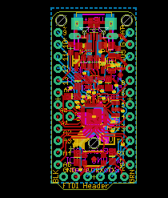

Contents
========

* [PRA2000 > Adafruit Pro Trinket PCBs](#pra2000--adafruit-pro-trinket-pcbs)
	* [Schematic](#schematic)
	* [PCB](#pcb)
	* [Interactive BOM](#interactive-bom)
	* [OOMP Parts](#oomp-parts)
	* [Images](#images)
	* [Tags](#tags)
  
![][im]
# PRA2000 > Adafruit Pro Trinket PCBs

- ID: PROJ-ADAF-2000-STAN-01
- Hex ID: PRA2000
- Name: Adafruit
- Description: Adafruit
- Long Link: [http://oom.lt/PROJ-ADAF-2000-STAN-01](http://oom.lt/PROJ-ADAF-2000-STAN-01)
- Short Link: [http://oom.lt/PRA2000](http://oom.lt/PRA2000)

## Schematic
  

## PCB
  

## Interactive BOM

- Interactive BOM page: [ibom.html](https://htmlpreview.github.io/?https://github.com/oomlout/oomlout_OOMP_projects/blob/main/PROJ-ADAF-2000-STAN-01/kicad/bom/ibom.html)

## OOMP Parts
  

|OOMP Parts|
| :---: |
|[LEDS-0805-R-STAN-01  SMD (0805) Red LED  B1](https://github.com/oomlout/oomlout_OOMP_parts/tree/main/LEDS-0805-R-STAN-01/)|
|UNMATCHED-UNMATCHED-X-UNMATCHED-01 BAT, CN1, IC1, Y1|
|[CAPC-0805-X-UF10-V10  SMD (0805) 10 uF Capacitor (Ceramic) 10v  C1, C8](https://github.com/oomlout/oomlout_OOMP_parts/tree/main/CAPC-0805-X-UF10-V10/)|
|CAPC-0805-X-UF1D-01 C2, C3|
|DIOD-S323-X-UNMATCHED-01 D1, D4|
|DIOD-S123-X-UNMATCHED-01 D2|
|[HEAD-I01-X-PI06-01  2.54 mm 6 Pin Header  FTDI](https://github.com/oomlout/oomlout_OOMP_parts/tree/main/HEAD-I01-X-PI06-01/)|
|[VREG-SO235-X-KMIC5225-V33D  SMD (SOT-23-5) MIC5225 Voltage Regulator 3.3v  IC2](https://github.com/oomlout/oomlout_OOMP_parts/tree/main/VREG-SO235-X-KMIC5225-V33D/)|
|[HEAD-I01-X-PI12-01  2.54 mm 12 Pin Header  JP1, JP4](https://github.com/oomlout/oomlout_OOMP_parts/tree/main/HEAD-I01-X-PI12-01/)|
|[HEAD-I01-X-PI02-01  2.54 mm 2 Pin Header  JP2](https://github.com/oomlout/oomlout_OOMP_parts/tree/main/HEAD-I01-X-PI02-01/)|
|[LEDS-0805-G-STAN-01  SMD (0805) Green LED  PWR](https://github.com/oomlout/oomlout_OOMP_parts/tree/main/LEDS-0805-G-STAN-01/)|
|[BUTA-4628-X-STAN-01  SMD (4628) Pushbutton (Tactile)  Q1](https://github.com/oomlout/oomlout_OOMP_parts/tree/main/BUTA-4628-X-STAN-01/)|
|RESE-0603-X-UNMATCHED-01 R1, R2, R3, R4, R5|
|[RESE-0805-X-O103-01  SMD (0805) 10k Ohm Resistor  R6](https://github.com/oomlout/oomlout_OOMP_parts/tree/main/RESE-0805-X-O103-01/)|

## Images
  
  

|kicadPcb3d|kicadPcb3dFront|kicadPcb3dBack|eagleImage|eagleSchemImage|
| :---: | :---: | :---: | :---: | :---: |
||||||

## Tags

- hexID: PRA2000
- oompType: PROJ
- oompSize: ADAF
- oompColor: 2000
- oompDesc: STAN
- oompIndex: 01
- oompName: Adafruit Pro Trinket PCBs
- sources: All source files from https://github.com/adafruit/Adafruit-Pro-Trinket-PCBs (source licence details in srcLicense.md)
- linkBuyPage: http://www.adafruit.com/products/2000
- oompID: PROJ-ADAF-2000-STAN-01
- oompParts: B1,LEDS-0805-R-STAN-01
- oompParts: BAT,UNMATCHED-UNMATCHED-X-UNMATCHED-01
- oompParts: C1,CAPC-0805-X-UF10-V10
- oompParts: C2,CAPC-0805-X-UF1D-01
- oompParts: C3,CAPC-0805-X-UF1D-01
- oompParts: C8,CAPC-0805-X-UF10-V10
- oompParts: CN1,UNMATCHED-UNMATCHED-X-UNMATCHED-01
- oompParts: D1,DIOD-S323-X-UNMATCHED-01
- oompParts: D2,DIOD-S123-X-UNMATCHED-01
- oompParts: D4,DIOD-S323-X-UNMATCHED-01
- oompParts: FTDI,HEAD-I01-X-PI06-01
- oompParts: IC1,UNMATCHED-UNMATCHED-X-UNMATCHED-01
- oompParts: IC2,VREG-SO235-X-KMIC5225-V33D
- oompParts: JP1,HEAD-I01-X-PI12-01
- oompParts: JP2,HEAD-I01-X-PI02-01
- oompParts: JP4,HEAD-I01-X-PI12-01
- oompParts: PWR,LEDS-0805-G-STAN-01
- oompParts: Q1,BUTA-4628-X-STAN-01
- oompParts: R1,RESE-0603-X-UNMATCHED-01
- oompParts: R2,RESE-0603-X-UNMATCHED-01
- oompParts: R3,RESE-0603-X-UNMATCHED-01
- oompParts: R4,RESE-0603-X-UNMATCHED-01
- oompParts: R5,RESE-0603-X-UNMATCHED-01
- oompParts: R6,RESE-0805-X-O103-01
- oompParts: Y1,UNMATCHED-UNMATCHED-X-UNMATCHED-01
- rawParts: B1,red,LED0805_NOOUTLINE,CHIPLED_0805_NOOUTLINE,LED,,,,,
- rawParts: BAT,JST 2-PH,CON_JST_PH_2PIN,JSTPH2,JST 2-Pin Right-Angle Connector,,,,,
- rawParts: C1,10uF,CAP_CERAMIC0805-NOOUTLINE,0805-NO,Ceramic Capacitors,,,,,
- rawParts: C2,0.1uF,CAP_CERAMIC_0805MP,_0805MP,Ceramic Capacitors,,,,,
- rawParts: C3,0.1uF,CAP_CERAMIC0805-NOOUTLINE,0805-NO,Ceramic Capacitors,,,,,
- rawParts: C8,10uF,CAP_CERAMIC0805-NOOUTLINE,0805-NO,Ceramic Capacitors,,,,,
- rawParts: CN1,,USBMICRO_20329,4UCONN_20329,USB Connectors,,,,,
- rawParts: D1,3.6v,DIODESOD-323,SOD-323,Diode,,,,,
- rawParts: D2,SCHOTTKY,DIODE_SOD-123FL,SOD-123FL,Diode,,,,,
- rawParts: D4,3.6V,DIODESOD-323,SOD-323,Diode,,,,,
- rawParts: FTDI,,PINHD-1X6CB,1X06-CLEANBIG,PIN HEADER,,,,,
- rawParts: IC1,ATmega328P,MEGA8-MI,MLF32-TH,MICROCONTROLLER,,ATMEGA88PA-MU,1715491,15R0272,
- rawParts: IC2,MIC5225-5v,LP298XS,SOT23-5L,,,,,,
- rawParts: JP1,,PINHD-1X12-CB,1X12-CB,PIN HEADER,,,,,
- rawParts: JP2,,HEADER-1X2ROUND,1X02_ROUND,PIN HEADER,,,,,
- rawParts: JP4,,PINHD-1X12-CB,1X12-CB,PIN HEADER,,,,,
- rawParts: PWR,green,LED0805_NOOUTLINE,CHIPLED_0805_NOOUTLINE,LED,,,,,
- rawParts: Q1,reset,SWITCH_TACT_SMT4.6X2.8,BTN_KMR2_4.6X2.8,SMT Tact Switches,,,,,
- rawParts: R1,68 (0603),RESISTOR_0603_NOOUT,0603-NO,Resistors,,,,,
- rawParts: R2,68 (0603),RESISTOR_0603_NOOUT,0603-NO,Resistors,,,,,
- rawParts: R3,1.5K (0603),RESISTOR_0603_NOOUT,0603-NO,Resistors,,,,,
- rawParts: R4,470 (0603),RESISTOR_0603_NOOUT,0603-NO,Resistors,,,,,
- rawParts: R5,470 (0603),RESISTOR_0603_NOOUT,0603-NO,Resistors,,,,,
- rawParts: R6,10K,RESISTOR0805_NOOUTLINE,0805-NO,Resistors,,,,,
- rawParts: U$1,FIDUCIAL,FIDUCIAL,FIDUCIAL_1MM,For use by pick and place machines to calibrate the vision/machine, 1mm,,,,,
- rawParts: U$6,FIDUCIAL,FIDUCIAL,FIDUCIAL_1MM,For use by pick and place machines to calibrate the vision/machine, 1mm,,,,,
- rawParts: Y1,16MHz,RESONATORSMD,RESONATOR-SMD,Resonator,,,,,

[im]: kicadPcb3d_450.png
