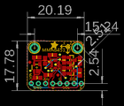
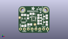
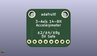
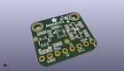

Contents
========

* [PROJ-ADAF-2019-STAN-01>Adafruit MMA8451 Breakout PCB](#proj-adaf-2019-stan-01adafruit-mma8451-breakout-pcb)
	* [Images](#images)
	* [Interactive BOM](#interactive-bom)
	* [OOMP Parts](#oomp-parts)
	* [Tags](#tags)
  
![][im]
# PROJ-ADAF-2019-STAN-01>Adafruit MMA8451 Breakout PCB

- ID: PROJ-ADAF-2019-STAN-01
- Hex ID: PRA2019
- Name: Adafruit MMA8451 Breakout PCB
- Description: 

## Images
  
  

|eagleImage|kicadPcb3dFront|kicadPcb3dBack|kicadPcb3d|
| :---: | :---: | :---: | :---: |
|||||

## Interactive BOM

- Interactive BOM page: [ibom.html](kicad/bom/ibom.html)

## OOMP Parts
  

|OOMP Parts|
| :---: |
|<table><tr><td></td><td> C1</td><td>[CAPC-0805-X-NF100-V50 SMD (0805) 100 nF Capacitor (Ceramic) 50v](https://github.com/oomlout/oomlout_OOMP_parts/tree/main/CAPC-0805-X-NF100-V50/)</td><td>[C85N100](https://github.com/oomlout/oomlout_OOMP_parts/tree/main/CAPC-0805-X-NF100-V50/)</td></tr></table>|
|CAPC-0805-X-UNMATCHED-01, C2, 3.556, 4.571999999999999, 0,C2, 10uF, 0805-NO, microbuilder, (0.14, 0.18), R0|
|CAPC-0805-X-UNMATCHED-01, C3, 3.302, 11.937999999999999, 0,C3, 10uF, 0805-NO, microbuilder, (0.13, 0.47), R0|
|CAPC-UNMATCHED-X-NF100-V50, C4, 6.223, 10.668, 90,C4, 0.1uF, 0805_10MGAP, microbuilder, (0.245, 0.42), R90|
|<table><tr><td></td><td> JP1</td><td>[HEAD-I01-X-PI08-01 2.54 mm 8 Pin Header](https://github.com/oomlout/oomlout_OOMP_parts/tree/main/HEAD-I01-X-PI08-01/)</td><td>[H08](https://github.com/oomlout/oomlout_OOMP_parts/tree/main/HEAD-I01-X-PI08-01/)</td></tr></table>|
|UNMATCHED-UNMATCHED-X-UNMATCHED-01, Q1, 15.748, 10.921999999999999, 270,Q1, BSS138, SOT23-WIDE, microbuilder, (0.62, 0.43), R270|
|UNMATCHED-UNMATCHED-X-UNMATCHED-01, Q2, 15.748, 7.112, 270,Q2, BSS138, SOT23-WIDE, microbuilder, (0.62, 0.28), R270|
|<table><tr><td></td><td> R1</td><td>[RESE-0805-X-O103-01 SMD (0805) 10k Ohm Resistor](https://github.com/oomlout/oomlout_OOMP_parts/tree/main/RESE-0805-X-O103-01/)</td><td>[R85103](https://github.com/oomlout/oomlout_OOMP_parts/tree/main/RESE-0805-X-O103-01/)</td></tr></table>|
|<table><tr><td></td><td> R2</td><td>[RESE-0805-X-O103-01 SMD (0805) 10k Ohm Resistor](https://github.com/oomlout/oomlout_OOMP_parts/tree/main/RESE-0805-X-O103-01/)</td><td>[R85103](https://github.com/oomlout/oomlout_OOMP_parts/tree/main/RESE-0805-X-O103-01/)</td></tr></table>|
|<table><tr><td></td><td> R3</td><td>[RESE-0805-X-O103-01 SMD (0805) 10k Ohm Resistor](https://github.com/oomlout/oomlout_OOMP_parts/tree/main/RESE-0805-X-O103-01/)</td><td>[R85103](https://github.com/oomlout/oomlout_OOMP_parts/tree/main/RESE-0805-X-O103-01/)</td></tr></table>|
|<table><tr><td></td><td> R4</td><td>[RESE-0805-X-O103-01 SMD (0805) 10k Ohm Resistor](https://github.com/oomlout/oomlout_OOMP_parts/tree/main/RESE-0805-X-O103-01/)</td><td>[R85103](https://github.com/oomlout/oomlout_OOMP_parts/tree/main/RESE-0805-X-O103-01/)</td></tr></table>|
|<table><tr><td></td><td> R5</td><td>[RESE-0805-X-O103-01 SMD (0805) 10k Ohm Resistor](https://github.com/oomlout/oomlout_OOMP_parts/tree/main/RESE-0805-X-O103-01/)</td><td>[R85103](https://github.com/oomlout/oomlout_OOMP_parts/tree/main/RESE-0805-X-O103-01/)</td></tr></table>|
|UNMATCHED-UNMATCHED-X-UNMATCHED-01, U1, 9.906, 9.398, 0,U1, MMA8451, MMA845X_QFN_16MM, microbuilder, (0.39, 0.37), R0|
|UNMATCHED-UNMATCHED-X-UNMATCHED-01, U2, 3.302, 8.254999999999999, 0,U2, MIC5225-3.3, SOT23-5, microbuilder, (0.13, 0.325), R0|

## Tags

- hexID: PRA2019
- oompType: PROJ
- oompSize: ADAF
- oompColor: 2019
- oompDesc: STAN
- oompIndex: 01
- oompName: Adafruit MMA8451 Breakout PCB
- sources: All source files from https://github.com/adafruit/Adafruit-MMA8451-Breakout-PCB (source licence details in srcLicense.md)
- linkBuyPage: http://www.adafruit.com/products/2019
- oompPart: CAPC-0805-X-NF100-V50, C1, 8.889999999999999, 12.7, 0
- oompPart: CAPC-0805-X-UNMATCHED-01, C2, 3.556, 4.571999999999999, 0
- oompPart: CAPC-0805-X-UNMATCHED-01, C3, 3.302, 11.937999999999999, 0
- oompPart: CAPC-UNMATCHED-X-NF100-V50, C4, 6.223, 10.668, 90
- oompPart: SKIP-UNMATCHED-X-UNMATCHED-01, FID1, 0.7619999999999999, 10.16, 0
- oompPart: SKIP-UNMATCHED-X-UNMATCHED-01, FID2, 10.795, 5.588, 0
- oompPart: HEAD-I01-X-PI08-01, JP1, 10.16, 2.54, 180
- oompPart: UNMATCHED-UNMATCHED-X-UNMATCHED-01, Q1, 15.748, 10.921999999999999, 270
- oompPart: UNMATCHED-UNMATCHED-X-UNMATCHED-01, Q2, 15.748, 7.112, 270
- oompPart: RESE-0805-X-O103-01, R1, 18.541999999999998, 10.668, 270
- oompPart: RESE-0805-X-O103-01, R2, 18.541999999999998, 6.35, 270
- oompPart: RESE-0805-X-O103-01, R3, 13.081, 10.921999999999999, 90
- oompPart: RESE-0805-X-O103-01, R4, 13.081, 7.112, 270
- oompPart: RESE-0805-X-O103-01, R5, 7.365999999999999, 5.588, 180
- oompPart: SKIP-UNMATCHED-X-UNMATCHED-01, U$3, 2.54, 15.239999999999998, 0
- oompPart: SKIP-UNMATCHED-X-UNMATCHED-01, U$6, 17.779999999999998, 15.239999999999998, 0
- oompPart: UNMATCHED-UNMATCHED-X-UNMATCHED-01, U1, 9.906, 9.398, 0
- oompPart: UNMATCHED-UNMATCHED-X-UNMATCHED-01, U2, 3.302, 8.254999999999999, 0
- rawPart: C1, 0.1uF, 0805-NO, microbuilder, (0.35, 0.5), R0
- rawPart: C2, 10uF, 0805-NO, microbuilder, (0.14, 0.18), R0
- rawPart: C3, 10uF, 0805-NO, microbuilder, (0.13, 0.47), R0
- rawPart: C4, 0.1uF, 0805_10MGAP, microbuilder, (0.245, 0.42), R90
- rawPart: FID1, FIDUCIAL, FIDUCIAL_1MM, microbuilder, (0.03, 0.4), R0
- rawPart: FID2, FIDUCIAL, FIDUCIAL_1MM, microbuilder, (0.425, 0.22), R0
- rawPart: JP1, 1X08_ROUND_70, microbuilder, (0.4, 0.1), R180
- rawPart: Q1, BSS138, SOT23-WIDE, microbuilder, (0.62, 0.43), R270
- rawPart: Q2, BSS138, SOT23-WIDE, microbuilder, (0.62, 0.28), R270
- rawPart: R1, 10K, 0805-NO, microbuilder, (0.73, 0.42), R270
- rawPart: R2, 10K, 0805-NO, microbuilder, (0.73, 0.25), R270
- rawPart: R3, 10K, 0805-NO, microbuilder, (0.515, 0.43), R90
- rawPart: R4, 10K, 0805-NO, microbuilder, (0.515, 0.28), R270
- rawPart: R5, 10K, 0805-NO, microbuilder, (0.29, 0.22), R180
- rawPart: U$3, MOUNTINGHOLE2.5, MOUNTINGHOLE_2.5_PLATED, microbuilder, (0.1, 0.6), R0
- rawPart: U$6, MOUNTINGHOLE2.5, MOUNTINGHOLE_2.5_PLATED, microbuilder, (0.7, 0.6), R0
- rawPart: U1, MMA8451, MMA845X_QFN_16MM, microbuilder, (0.39, 0.37), R0
- rawPart: U2, MIC5225-3.3, SOT23-5, microbuilder, (0.13, 0.325), R0
- oompID: PROJ-ADAF-2019-STAN-01

[im]: kicadPcb3d_450.png
