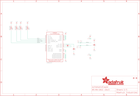

Contents
========

* [PRA2020 > Adafruit](#pra2020--adafruit)
	* [Schematic](#schematic)
	* [Interactive BOM](#interactive-bom)
	* [OOMP Parts](#oomp-parts)
	* [Images](#images)
	* [Tags](#tags)
  
![][im]
# PRA2020 > Adafruit

- ID: PROJ-ADAF-2020-STAN-01
- Hex ID: PRA2020
- Name: Adafruit
- Description: Adafruit
- Long Link: [http://oom.lt/PROJ-ADAF-2020-STAN-01](http://oom.lt/PROJ-ADAF-2020-STAN-01)
- Short Link: [http://oom.lt/PRA2020](http://oom.lt/PRA2020)

## Schematic
  

## Interactive BOM

- Interactive BOM page: [ibom.html](https://htmlpreview.github.io/?https://github.com/oomlout/oomlout_OOMP_projects/blob/main/PROJ-ADAF-2020-STAN-01/kicad/bom/ibom.html)

## OOMP Parts
  

|OOMP Parts|
| :---: |
|C2,CAPC-UNMATCHED-X-UNMATCHED-01,C2,10µF,CAP_CERAMIC0805_10MGAP,0805_10MGAP,Ceramic Capacitors,,|
|C6,CAPC-0805-X-NF220-01,C6,0.22uF,CAP_CERAMIC0805-NOOUTLINE,0805-NO,Ceramic Capacitors,,|
|C7,CAPC-0805-X-UF10-V10,C7,10uF,CAP_CERAMIC0805-NOOUTLINE,0805-NO,Ceramic Capacitors,,|
|GND,UNMATCHED-UNMATCHED-X-UNMATCHED-01,FID1,FIDUCIAL,FIDUCIAL,FIDUCIAL_1MM,Fiducial Alignment Points,,|
|R1,RESE-UNMATCHED-X-O103-01,FID2,FIDUCIAL,FIDUCIAL,FIDUCIAL_1MM,Fiducial Alignment Points,,|
|SCL1,UNMATCHED-UNMATCHED-X-UNMATCHED-01,GND,SEWTAP0.5IN,SEWTAP0.5IN,SEWINGTAP_0.5,,,|
|SCL2,UNMATCHED-UNMATCHED-X-UNMATCHED-01,R1,10K,RESISTOR_4PACK_US,RESPACK_4X0603,Resistor Packs (4 resistors),,|
|SDA1,UNMATCHED-UNMATCHED-X-UNMATCHED-01,SCL1,SEWTAP0.5IN,SEWTAP0.5IN,SEWINGTAP_0.5,,,|
|SDA2,UNMATCHED-UNMATCHED-X-UNMATCHED-01,SCL2,SEWTAP0.5IN,SEWTAP0.5IN,SEWINGTAP_0.5,,,|
|U2,UNMATCHED-UNMATCHED-X-UNMATCHED-01,SDA1,SEWTAP0.5IN,SEWTAP0.5IN,SEWINGTAP_0.5,,,|
|VCC,UNMATCHED-UNMATCHED-X-UNMATCHED-01,SDA2,SEWTAP0.5IN,SEWTAP0.5IN,SEWINGTAP_0.5,,,|

## Images
  
  

|kicadPcb3d|kicadPcb3dFront|kicadPcb3dBack|eagleImage|eagleSchemImage|
| :---: | :---: | :---: | :---: | :---: |
||||||

## Tags

- hexID: PRA2020
- oompType: PROJ
- oompSize: ADAF
- oompColor: 2020
- oompDesc: STAN
- oompIndex: 01
- oompName: Adafruit Flora LSM9DS0 9DOF PCB
- sources: All source files from https://github.com/adafruit/Adafruit-Flora-LSM9DS0-9DOF-PCB (source licence details in srcLicense.md)
- linkBuyPage: http://www.adafruit.com/products/2020
- oompID: PROJ-ADAF-2020-STAN-01
- oompParts: C2,CAPC-UNMATCHED-X-UNMATCHED-01
- oompParts: C6,CAPC-0805-X-NF220-01
- oompParts: C7,CAPC-0805-X-UF10-V10
- oompParts: GND,UNMATCHED-UNMATCHED-X-UNMATCHED-01
- oompParts: R1,RESE-UNMATCHED-X-O103-01
- oompParts: SCL1,UNMATCHED-UNMATCHED-X-UNMATCHED-01
- oompParts: SCL2,UNMATCHED-UNMATCHED-X-UNMATCHED-01
- oompParts: SDA1,UNMATCHED-UNMATCHED-X-UNMATCHED-01
- oompParts: SDA2,UNMATCHED-UNMATCHED-X-UNMATCHED-01
- oompParts: U2,UNMATCHED-UNMATCHED-X-UNMATCHED-01
- oompParts: VCC,UNMATCHED-UNMATCHED-X-UNMATCHED-01
- rawParts: C2,10µF,CAP_CERAMIC0805_10MGAP,0805_10MGAP,Ceramic Capacitors,,
- rawParts: C6,0.22uF,CAP_CERAMIC0805-NOOUTLINE,0805-NO,Ceramic Capacitors,,
- rawParts: C7,10uF,CAP_CERAMIC0805-NOOUTLINE,0805-NO,Ceramic Capacitors,,
- rawParts: FID1,FIDUCIAL,FIDUCIAL,FIDUCIAL_1MM,Fiducial Alignment Points,,
- rawParts: FID2,FIDUCIAL,FIDUCIAL,FIDUCIAL_1MM,Fiducial Alignment Points,,
- rawParts: GND,SEWTAP0.5IN,SEWTAP0.5IN,SEWINGTAP_0.5,,,
- rawParts: R1,10K,RESISTOR_4PACK_US,RESPACK_4X0603,Resistor Packs (4 resistors),,
- rawParts: SCL1,SEWTAP0.5IN,SEWTAP0.5IN,SEWINGTAP_0.5,,,
- rawParts: SCL2,SEWTAP0.5IN,SEWTAP0.5IN,SEWINGTAP_0.5,,,
- rawParts: SDA1,SEWTAP0.5IN,SEWTAP0.5IN,SEWINGTAP_0.5,,,
- rawParts: SDA2,SEWTAP0.5IN,SEWTAP0.5IN,SEWINGTAP_0.5,,,
- rawParts: U2,LSM9DS0TR,LSM9DS0,LGA24_4X4MM,LSM9DS0 3-Axis Accelerometer/Gyroscope/Magnetometer,,
- rawParts: VCC,SEWTAP0.5IN,SEWTAP0.5IN,SEWINGTAP_0.5,,,

[im]: kicadPcb3d_450.png
