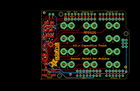
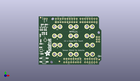
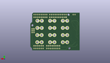
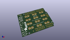

Contents
========

* [PROJ-ADAF-2024-STAN-01>Adafruit MPR121 Capacitive Touch Shield PCB](#proj-adaf-2024-stan-01adafruit-mpr121-capacitive-touch-shield-pcb)
	* [Images](#images)
	* [Interactive BOM](#interactive-bom)
	* [OOMP Parts](#oomp-parts)
	* [Tags](#tags)
  
![][im]
# PROJ-ADAF-2024-STAN-01>Adafruit MPR121 Capacitive Touch Shield PCB

- ID: PROJ-ADAF-2024-STAN-01
- Hex ID: PRA2024
- Name: Adafruit MPR121 Capacitive Touch Shield PCB
- Description: 

## Images
  
  

|eagleImage|kicadPcb3dFront|kicadPcb3dBack|kicadPcb3d|
| :---: | :---: | :---: | :---: |
|||||

## Interactive BOM

- Interactive BOM page: [ibom.html](kicad/bom/ibom.html)

## OOMP Parts
  

|OOMP Parts|
| :---: |
|UNMATCHED-UNMATCHED-X-UNMATCHED-01, ADDR, 6.35, 50.8, 90,ADDR, 1X01_ROUND, microbuilder, (0.25, 2), R90|
|UNMATCHED-UNMATCHED-X-UNMATCHED-01, AL1, 55.88, 11.43, 90,AL1, ALLIGATORCLIP_MICRO, ALLIGATORCLIP, microbuilder, (2.2, 0.45), R90|
|UNMATCHED-UNMATCHED-X-UNMATCHED-01, AL2, 38.099999999999994, 11.43, 90,AL2, ALLIGATORCLIP_MICRO, ALLIGATORCLIP, microbuilder, (1.5, 0.45), R90|
|UNMATCHED-UNMATCHED-X-UNMATCHED-01, AL3, 20.32, 11.43, 270,AL3, ALLIGATORCLIP_MICRO, ALLIGATORCLIP, microbuilder, (0.8, 0.45), R270|
|UNMATCHED-UNMATCHED-X-UNMATCHED-01, AL4, 55.88, 21.59, 90,AL4, ALLIGATORCLIP_MICRO, ALLIGATORCLIP, microbuilder, (2.2, 0.85), R90|
|UNMATCHED-UNMATCHED-X-UNMATCHED-01, AL5, 38.099999999999994, 21.59, 90,AL5, ALLIGATORCLIP_MICRO, ALLIGATORCLIP, microbuilder, (1.5, 0.85), R90|
|UNMATCHED-UNMATCHED-X-UNMATCHED-01, AL6, 20.32, 21.59, 270,AL6, ALLIGATORCLIP_MICRO, ALLIGATORCLIP, microbuilder, (0.8, 0.85), R270|
|UNMATCHED-UNMATCHED-X-UNMATCHED-01, AL7, 55.75299999999999, 31.75, 90,AL7, ALLIGATORCLIP_MICRO, ALLIGATORCLIP, microbuilder, (2.195, 1.25), R90|
|UNMATCHED-UNMATCHED-X-UNMATCHED-01, AL8, 38.099999999999994, 31.75, 90,AL8, ALLIGATORCLIP_MICRO, ALLIGATORCLIP, microbuilder, (1.5, 1.25), R90|
|UNMATCHED-UNMATCHED-X-UNMATCHED-01, AL9, 20.32, 31.75, 90,AL9, ALLIGATORCLIP_MICRO, ALLIGATORCLIP, microbuilder, (0.8, 1.25), R90|
|UNMATCHED-UNMATCHED-X-UNMATCHED-01, AL10, 55.626, 41.91, 90,AL10, ALLIGATORCLIP_MICRO, ALLIGATORCLIP, microbuilder, (2.19, 1.65), R90|
|UNMATCHED-UNMATCHED-X-UNMATCHED-01, AL11, 38.099999999999994, 41.91, 90,AL11, ALLIGATORCLIP_MICRO, ALLIGATORCLIP, microbuilder, (1.5, 1.65), R90|
|UNMATCHED-UNMATCHED-X-UNMATCHED-01, AL12, 20.32, 41.91, 90,AL12, ALLIGATORCLIP_MICRO, ALLIGATORCLIP, microbuilder, (0.8, 1.65), R90|
|CAPE-0805-X-UNMATCHED-01, C2, 2.2859999999999996, 19.049999999999997, 180,C2, 10uF, 0805-NO, microbuilder, (0.09, 0.75), R180|
|CAPE-0805-X-NF100-01, C3, 8.509, 34.416999999999994, 90,C3, 0.1uF, 0805-NO, microbuilder, (0.335, 1.355), R90|
|CAPE-0805-X-NF100-01, C4, 2.2859999999999996, 26.288999999999998, 270,C4, 0.1uF, 0805-NO, microbuilder, (0.09, 1.035), R270|
|CAPE-0805-X-UNMATCHED-01, C5, 3.6829999999999994, 11.937999999999999, 180,C5, 10uF, 0805-NO, microbuilder, (0.145, 0.47), R180|
|UNMATCHED-UNMATCHED-X-UNMATCHED-01, D1, 4.064, 34.416999999999994, 180,D1, RED, CHIPLED_0805_NOOUTLINE, microbuilder, (0.16, 1.355), R180|
|UNMATCHED-UNMATCHED-X-UNMATCHED-01, IRQ, 8.889999999999999, 50.8, 90,IRQ, 1X01_ROUND, microbuilder, (0.35, 2), R90|
|UNMATCHED-UNMATCHED-X-UNMATCHED-01, JP1, 54.60999999999999, 46.99, 0,JP1, 1X08-CLEANBIG, adafruit, (2.15, 1.85), R0|
|UNMATCHED-UNMATCHED-X-UNMATCHED-01, JP2, 20.32, 41.91, 90,JP2, 1X01_ROUND, microbuilder, (0.8, 1.65), R90|
|UNMATCHED-UNMATCHED-X-UNMATCHED-01, JP3, 38.099999999999994, 41.91, 90,JP3, 1X01_ROUND, microbuilder, (1.5, 1.65), R90|
|UNMATCHED-UNMATCHED-X-UNMATCHED-01, JP4, 36.83, 6.35, 180,JP4, 1X08-CLEANBIG, adafruit, (1.45, 0.25), R180|
|UNMATCHED-UNMATCHED-X-UNMATCHED-01, JP5, 55.626, 41.91, 90,JP5, 1X01_ROUND, microbuilder, (2.19, 1.65), R90|
|UNMATCHED-UNMATCHED-X-UNMATCHED-01, JP6, 30.225999999999996, 46.99, 0,JP6, 1X10_ROUND70, microbuilder, (1.19, 1.85), R0|
|UNMATCHED-UNMATCHED-X-UNMATCHED-01, JP7, 20.32, 31.75, 90,JP7, 1X01_ROUND, microbuilder, (0.8, 1.25), R90|
|UNMATCHED-UNMATCHED-X-UNMATCHED-01, JP8, 57.15, 6.35, 180,JP8, 1X06-CLEANBIG, adafruit, (2.25, 0.25), R180|
|UNMATCHED-UNMATCHED-X-UNMATCHED-01, JP9, 38.099999999999994, 31.75, 90,JP9, 1X01_ROUND, microbuilder, (1.5, 1.25), R90|
|UNMATCHED-UNMATCHED-X-UNMATCHED-01, JP10, 55.75299999999999, 31.75, 90,JP10, 1X01_ROUND, microbuilder, (2.195, 1.25), R90|
|UNMATCHED-UNMATCHED-X-UNMATCHED-01, JP11, 20.32, 21.59, 0,JP11, 1X01_ROUND, microbuilder, (0.8, 0.85), R0|
|UNMATCHED-UNMATCHED-X-UNMATCHED-01, JP12, 38.099999999999994, 21.59, 90,JP12, 1X01_ROUND, microbuilder, (1.5, 0.85), R90|
|UNMATCHED-UNMATCHED-X-UNMATCHED-01, JP13, 55.88, 21.59, 90,JP13, 1X01_ROUND, microbuilder, (2.2, 0.85), R90|
|UNMATCHED-UNMATCHED-X-UNMATCHED-01, JP14, 20.32, 11.43, 90,JP14, 1X01_ROUND, microbuilder, (0.8, 0.45), R90|
|UNMATCHED-UNMATCHED-X-UNMATCHED-01, JP15, 38.099999999999994, 11.43, 90,JP15, 1X01_ROUND, microbuilder, (1.5, 0.45), R90|
|UNMATCHED-UNMATCHED-X-UNMATCHED-01, JP16, 55.88, 11.43, 90,JP16, 1X01_ROUND, microbuilder, (2.2, 0.45), R90|
|UNMATCHED-UNMATCHED-X-UNMATCHED-01, Q1, 7.238999999999999, 41.401999999999994, 0,Q1, BSS138, SOT23-WIDE, microbuilder, (0.285, 1.63), R0|
|UNMATCHED-UNMATCHED-X-UNMATCHED-01, Q2, 3.0479999999999996, 41.528999999999996, 0,Q2, BSS138, SOT23-WIDE, microbuilder, (0.12, 1.635), R0|
|<table><tr><td></td><td> R1</td><td>[RESE-0805-X-O103-01 SMD (0805) 10k Ohm Resistor](https://github.com/oomlout/oomlout_OOMP_parts/tree/main/RESE-0805-X-O103-01/)</td><td>[R85103](https://github.com/oomlout/oomlout_OOMP_parts/tree/main/RESE-0805-X-O103-01/)</td></tr></table>|
|<table><tr><td></td><td> R2</td><td>[RESE-0805-X-O103-01 SMD (0805) 10k Ohm Resistor](https://github.com/oomlout/oomlout_OOMP_parts/tree/main/RESE-0805-X-O103-01/)</td><td>[R85103](https://github.com/oomlout/oomlout_OOMP_parts/tree/main/RESE-0805-X-O103-01/)</td></tr></table>|
|<table><tr><td></td><td> R3</td><td>[RESE-0805-X-O103-01 SMD (0805) 10k Ohm Resistor](https://github.com/oomlout/oomlout_OOMP_parts/tree/main/RESE-0805-X-O103-01/)</td><td>[R85103](https://github.com/oomlout/oomlout_OOMP_parts/tree/main/RESE-0805-X-O103-01/)</td></tr></table>|
|<table><tr><td></td><td> R4</td><td>[RESE-0805-X-O103-01 SMD (0805) 10k Ohm Resistor](https://github.com/oomlout/oomlout_OOMP_parts/tree/main/RESE-0805-X-O103-01/)</td><td>[R85103](https://github.com/oomlout/oomlout_OOMP_parts/tree/main/RESE-0805-X-O103-01/)</td></tr></table>|
|RESE-0805-X-O753-01, R5, 2.54, 22.987, 0,R5, 75K, 0805-NO, microbuilder, (0.1, 0.905), R0|
|RESE-0805-X-O753-01, R6, 1.778, 32.385, 270,R6, 75K, 0805-NO, microbuilder, (0.07, 1.275), R270|
|RESE-0805-X-UNMATCHED-01, R7, 6.095999999999999, 34.544000000000004, 270,R7, 1K, 0805-NO, microbuilder, (0.24, 1.36), R270|
|UNMATCHED-UNMATCHED-X-UNMATCHED-01, SW2, 5.842, 5.08, 0,SW2, SPST_TACT-EVQQ2, EVQ-Q2, adafruit, (0.23, 0.2), R0|
|UNMATCHED-UNMATCHED-X-UNMATCHED-01, U2, 7.238999999999999, 27.051, 315,U2, MPR121, QFN20_3MM_NOTHERMAL, microbuilder, (0.285, 1.065), R315|
|UNMATCHED-UNMATCHED-X-UNMATCHED-01, U4, 2.794, 15.620999999999999, 0,U4, MIC5225-3.3, SOT23-5, microbuilder, (0.11, 0.615), R0|

## Tags

- hexID: PRA2024
- oompType: PROJ
- oompSize: ADAF
- oompColor: 2024
- oompDesc: STAN
- oompIndex: 01
- oompName: Adafruit MPR121 Capacitive Touch Shield PCB
- sources: All source files from https://github.com/adafruit/Adafruit-MPR121-Capacitive-Touch-Shield-PCB (source licence details in srcLicense.md)
- linkBuyPage: http://www.adafruit.com/products/2024
- oompPart: UNMATCHED-UNMATCHED-X-UNMATCHED-01, ADDR, 6.35, 50.8, 90
- oompPart: UNMATCHED-UNMATCHED-X-UNMATCHED-01, AL1, 55.88, 11.43, 90
- oompPart: UNMATCHED-UNMATCHED-X-UNMATCHED-01, AL2, 38.099999999999994, 11.43, 90
- oompPart: UNMATCHED-UNMATCHED-X-UNMATCHED-01, AL3, 20.32, 11.43, 270
- oompPart: UNMATCHED-UNMATCHED-X-UNMATCHED-01, AL4, 55.88, 21.59, 90
- oompPart: UNMATCHED-UNMATCHED-X-UNMATCHED-01, AL5, 38.099999999999994, 21.59, 90
- oompPart: UNMATCHED-UNMATCHED-X-UNMATCHED-01, AL6, 20.32, 21.59, 270
- oompPart: UNMATCHED-UNMATCHED-X-UNMATCHED-01, AL7, 55.75299999999999, 31.75, 90
- oompPart: UNMATCHED-UNMATCHED-X-UNMATCHED-01, AL8, 38.099999999999994, 31.75, 90
- oompPart: UNMATCHED-UNMATCHED-X-UNMATCHED-01, AL9, 20.32, 31.75, 90
- oompPart: UNMATCHED-UNMATCHED-X-UNMATCHED-01, AL10, 55.626, 41.91, 90
- oompPart: UNMATCHED-UNMATCHED-X-UNMATCHED-01, AL11, 38.099999999999994, 41.91, 90
- oompPart: UNMATCHED-UNMATCHED-X-UNMATCHED-01, AL12, 20.32, 41.91, 90
- oompPart: CAPE-0805-X-UNMATCHED-01, C2, 2.2859999999999996, 19.049999999999997, 180
- oompPart: CAPE-0805-X-NF100-01, C3, 8.509, 34.416999999999994, 90
- oompPart: CAPE-0805-X-NF100-01, C4, 2.2859999999999996, 26.288999999999998, 270
- oompPart: CAPE-0805-X-UNMATCHED-01, C5, 3.6829999999999994, 11.937999999999999, 180
- oompPart: UNMATCHED-UNMATCHED-X-UNMATCHED-01, D1, 4.064, 34.416999999999994, 180
- oompPart: SKIP-UNMATCHED-X-UNMATCHED-01, FID1, 22.733, 3.556, 0
- oompPart: SKIP-UNMATCHED-X-UNMATCHED-01, FID2, 66.294, 5.715, 0
- oompPart: SKIP-UNMATCHED-X-UNMATCHED-01, FID3, 2.1590000000000003, 51.943, 0
- oompPart: UNMATCHED-UNMATCHED-X-UNMATCHED-01, IRQ, 8.889999999999999, 50.8, 90
- oompPart: UNMATCHED-UNMATCHED-X-UNMATCHED-01, JP1, 54.60999999999999, 46.99, 0
- oompPart: UNMATCHED-UNMATCHED-X-UNMATCHED-01, JP2, 20.32, 41.91, 90
- oompPart: UNMATCHED-UNMATCHED-X-UNMATCHED-01, JP3, 38.099999999999994, 41.91, 90
- oompPart: UNMATCHED-UNMATCHED-X-UNMATCHED-01, JP4, 36.83, 6.35, 180
- oompPart: UNMATCHED-UNMATCHED-X-UNMATCHED-01, JP5, 55.626, 41.91, 90
- oompPart: UNMATCHED-UNMATCHED-X-UNMATCHED-01, JP6, 30.225999999999996, 46.99, 0
- oompPart: UNMATCHED-UNMATCHED-X-UNMATCHED-01, JP7, 20.32, 31.75, 90
- oompPart: UNMATCHED-UNMATCHED-X-UNMATCHED-01, JP8, 57.15, 6.35, 180
- oompPart: UNMATCHED-UNMATCHED-X-UNMATCHED-01, JP9, 38.099999999999994, 31.75, 90
- oompPart: UNMATCHED-UNMATCHED-X-UNMATCHED-01, JP10, 55.75299999999999, 31.75, 90
- oompPart: UNMATCHED-UNMATCHED-X-UNMATCHED-01, JP11, 20.32, 21.59, 0
- oompPart: UNMATCHED-UNMATCHED-X-UNMATCHED-01, JP12, 38.099999999999994, 21.59, 90
- oompPart: UNMATCHED-UNMATCHED-X-UNMATCHED-01, JP13, 55.88, 21.59, 90
- oompPart: UNMATCHED-UNMATCHED-X-UNMATCHED-01, JP14, 20.32, 11.43, 90
- oompPart: UNMATCHED-UNMATCHED-X-UNMATCHED-01, JP15, 38.099999999999994, 11.43, 90
- oompPart: UNMATCHED-UNMATCHED-X-UNMATCHED-01, JP16, 55.88, 11.43, 90
- oompPart: UNMATCHED-UNMATCHED-X-UNMATCHED-01, Q1, 7.238999999999999, 41.401999999999994, 0
- oompPart: UNMATCHED-UNMATCHED-X-UNMATCHED-01, Q2, 3.0479999999999996, 41.528999999999996, 0
- oompPart: RESE-0805-X-O103-01, R1, 7.238999999999999, 38.354, 180
- oompPart: RESE-0805-X-O103-01, R2, 8.254999999999999, 44.323, 0
- oompPart: RESE-0805-X-O103-01, R3, 3.0479999999999996, 38.354, 180
- oompPart: RESE-0805-X-O103-01, R4, 3.937, 44.323, 0
- oompPart: RESE-0805-X-O753-01, R5, 2.54, 22.987, 0
- oompPart: RESE-0805-X-O753-01, R6, 1.778, 32.385, 270
- oompPart: RESE-0805-X-UNMATCHED-01, R7, 6.095999999999999, 34.544000000000004, 270
- oompPart: UNMATCHED-UNMATCHED-X-UNMATCHED-01, SW2, 5.842, 5.08, 0
- oompPart: SKIP-UNMATCHED-X-UNMATCHED-01, U$41, 0.0, 0.0, 0
- oompPart: UNMATCHED-UNMATCHED-X-UNMATCHED-01, U2, 7.238999999999999, 27.051, 315
- oompPart: UNMATCHED-UNMATCHED-X-UNMATCHED-01, U4, 2.794, 15.620999999999999, 0
- rawPart: ADDR, 1X01_ROUND, microbuilder, (0.25, 2), R90
- rawPart: AL1, ALLIGATORCLIP_MICRO, ALLIGATORCLIP, microbuilder, (2.2, 0.45), R90
- rawPart: AL2, ALLIGATORCLIP_MICRO, ALLIGATORCLIP, microbuilder, (1.5, 0.45), R90
- rawPart: AL3, ALLIGATORCLIP_MICRO, ALLIGATORCLIP, microbuilder, (0.8, 0.45), R270
- rawPart: AL4, ALLIGATORCLIP_MICRO, ALLIGATORCLIP, microbuilder, (2.2, 0.85), R90
- rawPart: AL5, ALLIGATORCLIP_MICRO, ALLIGATORCLIP, microbuilder, (1.5, 0.85), R90
- rawPart: AL6, ALLIGATORCLIP_MICRO, ALLIGATORCLIP, microbuilder, (0.8, 0.85), R270
- rawPart: AL7, ALLIGATORCLIP_MICRO, ALLIGATORCLIP, microbuilder, (2.195, 1.25), R90
- rawPart: AL8, ALLIGATORCLIP_MICRO, ALLIGATORCLIP, microbuilder, (1.5, 1.25), R90
- rawPart: AL9, ALLIGATORCLIP_MICRO, ALLIGATORCLIP, microbuilder, (0.8, 1.25), R90
- rawPart: AL10, ALLIGATORCLIP_MICRO, ALLIGATORCLIP, microbuilder, (2.19, 1.65), R90
- rawPart: AL11, ALLIGATORCLIP_MICRO, ALLIGATORCLIP, microbuilder, (1.5, 1.65), R90
- rawPart: AL12, ALLIGATORCLIP_MICRO, ALLIGATORCLIP, microbuilder, (0.8, 1.65), R90
- rawPart: C2, 10uF, 0805-NO, microbuilder, (0.09, 0.75), R180
- rawPart: C3, 0.1uF, 0805-NO, microbuilder, (0.335, 1.355), R90
- rawPart: C4, 0.1uF, 0805-NO, microbuilder, (0.09, 1.035), R270
- rawPart: C5, 10uF, 0805-NO, microbuilder, (0.145, 0.47), R180
- rawPart: D1, RED, CHIPLED_0805_NOOUTLINE, microbuilder, (0.16, 1.355), R180
- rawPart: FID1, FIDUCIAL, FIDUCIAL_1MM, microbuilder, (0.895, 0.14), R0
- rawPart: FID2, FIDUCIAL, FIDUCIAL_1MM, microbuilder, (2.61, 0.225), R0
- rawPart: FID3, FIDUCIAL, FIDUCIAL_1MM, microbuilder, (0.085, 2.045), R0
- rawPart: IRQ, 1X01_ROUND, microbuilder, (0.35, 2), R90
- rawPart: JP1, 1X08-CLEANBIG, adafruit, (2.15, 1.85), R0
- rawPart: JP2, 1X01_ROUND, microbuilder, (0.8, 1.65), R90
- rawPart: JP3, 1X01_ROUND, microbuilder, (1.5, 1.65), R90
- rawPart: JP4, 1X08-CLEANBIG, adafruit, (1.45, 0.25), R180
- rawPart: JP5, 1X01_ROUND, microbuilder, (2.19, 1.65), R90
- rawPart: JP6, 1X10_ROUND70, microbuilder, (1.19, 1.85), R0
- rawPart: JP7, 1X01_ROUND, microbuilder, (0.8, 1.25), R90
- rawPart: JP8, 1X06-CLEANBIG, adafruit, (2.25, 0.25), R180
- rawPart: JP9, 1X01_ROUND, microbuilder, (1.5, 1.25), R90
- rawPart: JP10, 1X01_ROUND, microbuilder, (2.195, 1.25), R90
- rawPart: JP11, 1X01_ROUND, microbuilder, (0.8, 0.85), R0
- rawPart: JP12, 1X01_ROUND, microbuilder, (1.5, 0.85), R90
- rawPart: JP13, 1X01_ROUND, microbuilder, (2.2, 0.85), R90
- rawPart: JP14, 1X01_ROUND, microbuilder, (0.8, 0.45), R90
- rawPart: JP15, 1X01_ROUND, microbuilder, (1.5, 0.45), R90
- rawPart: JP16, 1X01_ROUND, microbuilder, (2.2, 0.45), R90
- rawPart: Q1, BSS138, SOT23-WIDE, microbuilder, (0.285, 1.63), R0
- rawPart: Q2, BSS138, SOT23-WIDE, microbuilder, (0.12, 1.635), R0
- rawPart: R1, 10K, 0805-NO, microbuilder, (0.285, 1.51), R180
- rawPart: R2, 10K, 0805-NO, microbuilder, (0.325, 1.745), R0
- rawPart: R3, 10K, 0805-NO, microbuilder, (0.12, 1.51), R180
- rawPart: R4, 10K, 0805-NO, microbuilder, (0.155, 1.745), R0
- rawPart: R5, 75K, 0805-NO, microbuilder, (0.1, 0.905), R0
- rawPart: R6, 75K, 0805-NO, microbuilder, (0.07, 1.275), R270
- rawPart: R7, 1K, 0805-NO, microbuilder, (0.24, 1.36), R270
- rawPart: SW2, SPST_TACT-EVQQ2, EVQ-Q2, adafruit, (0.23, 0.2), R0
- rawPart: U$41, ARDUINO_R3_ICSP, ARDUINOR3_ICSP, adafruit, (0, 0), R0
- rawPart: U2, MPR121, QFN20_3MM_NOTHERMAL, microbuilder, (0.285, 1.065), R315
- rawPart: U4, MIC5225-3.3, SOT23-5, microbuilder, (0.11, 0.615), R0

[im]: kicadPcb3d_450.png
