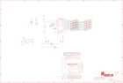

Contents
========

* [PRA2024 > Adafruit](#pra2024--adafruit)
	* [Schematic](#schematic)
	* [Interactive BOM](#interactive-bom)
	* [OOMP Parts](#oomp-parts)
	* [Images](#images)
	* [Tags](#tags)
  
![][im]
# PRA2024 > Adafruit

- ID: PROJ-ADAF-2024-STAN-01
- Hex ID: PRA2024
- Name: Adafruit
- Description: Adafruit
- Long Link: [http://oom.lt/PROJ-ADAF-2024-STAN-01](http://oom.lt/PROJ-ADAF-2024-STAN-01)
- Short Link: [http://oom.lt/PRA2024](http://oom.lt/PRA2024)

## Schematic
  

## Interactive BOM

- Interactive BOM page: [ibom.html](https://htmlpreview.github.io/?https://github.com/oomlout/oomlout_OOMP_projects/blob/main/PROJ-ADAF-2024-STAN-01/kicad/bom/ibom.html)

## OOMP Parts
  

|OOMP Parts|
| :---: |
|ADDR,HEAD-I01-X-PI01-01,ADDR,,HEADER-1X1ROUND,1X01_ROUND,PIN HEADER,,|
|AL1,UNMATCHED-UNMATCHED-X-UNMATCHED-01,AL1,ALLIGATORCLIP_MICRO,ALLIGATORCLIP_MICRO,ALLIGATORCLIP,,,|
|AL2,UNMATCHED-UNMATCHED-X-UNMATCHED-01,AL2,ALLIGATORCLIP_MICRO,ALLIGATORCLIP_MICRO,ALLIGATORCLIP,,,|
|AL3,UNMATCHED-UNMATCHED-X-UNMATCHED-01,AL3,ALLIGATORCLIP_MICRO,ALLIGATORCLIP_MICRO,ALLIGATORCLIP,,,|
|AL4,UNMATCHED-UNMATCHED-X-UNMATCHED-01,AL4,ALLIGATORCLIP_MICRO,ALLIGATORCLIP_MICRO,ALLIGATORCLIP,,,|
|AL5,UNMATCHED-UNMATCHED-X-UNMATCHED-01,AL5,ALLIGATORCLIP_MICRO,ALLIGATORCLIP_MICRO,ALLIGATORCLIP,,,|
|AL6,UNMATCHED-UNMATCHED-X-UNMATCHED-01,AL6,ALLIGATORCLIP_MICRO,ALLIGATORCLIP_MICRO,ALLIGATORCLIP,,,|
|AL7,UNMATCHED-UNMATCHED-X-UNMATCHED-01,AL7,ALLIGATORCLIP_MICRO,ALLIGATORCLIP_MICRO,ALLIGATORCLIP,,,|
|AL8,UNMATCHED-UNMATCHED-X-UNMATCHED-01,AL8,ALLIGATORCLIP_MICRO,ALLIGATORCLIP_MICRO,ALLIGATORCLIP,,,|
|AL9,UNMATCHED-UNMATCHED-X-UNMATCHED-01,AL9,ALLIGATORCLIP_MICRO,ALLIGATORCLIP_MICRO,ALLIGATORCLIP,,,|
|AL10,UNMATCHED-UNMATCHED-X-UNMATCHED-01,AL10,ALLIGATORCLIP_MICRO,ALLIGATORCLIP_MICRO,ALLIGATORCLIP,,,|
|AL11,UNMATCHED-UNMATCHED-X-UNMATCHED-01,AL11,ALLIGATORCLIP_MICRO,ALLIGATORCLIP_MICRO,ALLIGATORCLIP,,,|
|AL12,UNMATCHED-UNMATCHED-X-UNMATCHED-01,AL12,ALLIGATORCLIP_MICRO,ALLIGATORCLIP_MICRO,ALLIGATORCLIP,,,|
|C2,CAPC-0805-X-UF10-V10,C2,10uF,CAP_CERAMIC0805-NOOUTLINE,0805-NO,Ceramic Capacitors,,|
|C3,CAPC-0805-X-NF100-V50,C3,0.1uF,CAP_CERAMIC0805-NOOUTLINE,0805-NO,Ceramic Capacitors,,|
|C4,CAPC-0805-X-NF100-V50,C4,0.1uF,CAP_CERAMIC0805-NOOUTLINE,0805-NO,Ceramic Capacitors,,|
|C5,CAPC-0805-X-UF10-V10,C5,10uF,CAP_CERAMIC0805-NOOUTLINE,0805-NO,Ceramic Capacitors,,|
|D1,LEDS-0805-G-STAN-01,D1,RED,LED0805_NOOUTLINE,CHIPLED_0805_NOOUTLINE,LED,,|
|IRQ,HEAD-I01-X-PI01-01,FID1,FIDUCIAL,FIDUCIAL,FIDUCIAL_1MM,Fiducial Alignment Points,EXCLUDE,|
|JP1,HEAD-I01-X-PI08-01,FID2,FIDUCIAL,FIDUCIAL,FIDUCIAL_1MM,Fiducial Alignment Points,EXCLUDE,|
|JP2,HEAD-I01-X-PI01-01,FID3,FIDUCIAL,FIDUCIAL,FIDUCIAL_1MM,Fiducial Alignment Points,EXCLUDE,|
|JP3,HEAD-I01-X-PI01-01,IRQ,,HEADER-1X1ROUND,1X01_ROUND,PIN HEADER,,|
|JP4,HEAD-I01-X-PI08-01,JP1,,PINHD-1X8CLEANBIG,1X08-CLEANBIG,PIN HEADER,,|
|JP5,HEAD-I01-X-PI01-01,JP2,,HEADER-1X1ROUND,1X01_ROUND,PIN HEADER,,|
|JP6,HEAD-I01-X-PI10-01,JP3,,HEADER-1X1ROUND,1X01_ROUND,PIN HEADER,,|
|JP7,HEAD-I01-X-PI01-01,JP4,,PINHD-1X8CLEANBIG,1X08-CLEANBIG,PIN HEADER,,|
|JP8,HEAD-I01-X-PI06-01,JP5,,HEADER-1X1ROUND,1X01_ROUND,PIN HEADER,,|
|JP9,HEAD-I01-X-PI01-01,JP6,,HEADER-1X1070MIL,1X10_ROUND70,PIN HEADER,,|
|JP10,HEAD-I01-X-PI01-01,JP7,,HEADER-1X1ROUND,1X01_ROUND,PIN HEADER,,|
|JP11,HEAD-I01-X-PI01-01,JP8,,PINHD-1X6CB,1X06-CLEANBIG,PIN HEADER,,|
|JP12,HEAD-I01-X-PI01-01,JP9,,HEADER-1X1ROUND,1X01_ROUND,PIN HEADER,,|
|JP13,HEAD-I01-X-PI01-01,JP10,,HEADER-1X1ROUND,1X01_ROUND,PIN HEADER,,|
|JP14,HEAD-I01-X-PI01-01,JP11,,HEADER-1X1ROUND,1X01_ROUND,PIN HEADER,,|
|JP15,HEAD-I01-X-PI01-01,JP12,,HEADER-1X1ROUND,1X01_ROUND,PIN HEADER,,|
|JP16,HEAD-I01-X-PI01-01,JP13,,HEADER-1X1ROUND,1X01_ROUND,PIN HEADER,,|
|Q1,MOSN-SO23-X-KBSS138-01,JP14,,HEADER-1X1ROUND,1X01_ROUND,PIN HEADER,,|
|Q2,MOSN-SO23-X-KBSS138-01,JP15,,HEADER-1X1ROUND,1X01_ROUND,PIN HEADER,,|
|R1,RESE-0805-X-O103-01,JP16,,HEADER-1X1ROUND,1X01_ROUND,PIN HEADER,,|
|R2,RESE-0805-X-O103-01,Q1,BSS138,MOSFET-NWIDE,SOT23-WIDE,N-Channel Mosfet,,|
|R3,RESE-0805-X-O103-01,Q2,BSS138,MOSFET-NWIDE,SOT23-WIDE,N-Channel Mosfet,,|
|R4,RESE-0805-X-O103-01,R1,10K,RESISTOR0805_NOOUTLINE,0805-NO,Resistors,,|
|R5,RESE-0805-X-O753-01,R2,10K,RESISTOR0805_NOOUTLINE,0805-NO,Resistors,,|
|R6,RESE-0805-X-O753-01,R3,10K,RESISTOR0805_NOOUTLINE,0805-NO,Resistors,,|
|R7,RESE-0805-X-O102-01,R4,10K,RESISTOR0805_NOOUTLINE,0805-NO,Resistors,,|
|SW2,UNMATCHED-UNMATCHED-X-UNMATCHED-01,R5,75K,RESISTOR0805_NOOUTLINE,0805-NO,Resistors,,|
|U$41,UNMATCHED-UNMATCHED-X-UNMATCHED-01,R6,75K,RESISTOR0805_NOOUTLINE,0805-NO,Resistors,,|
|U2,UNMATCHED-UNMATCHED-X-UNMATCHED-01,R7,1K,RESISTOR0805_NOOUTLINE,0805-NO,Resistors,,|
|U4,VREG-SO235-X-KMIC5225-V33D,SW2,SPST_TACT-EVQQ2,SPST_TACT-EVQQ2,EVQ-Q2,SMT 6mm switch, EVQQ2 series,,|

## Images
  
  

|kicadPcb3d|kicadPcb3dFront|kicadPcb3dBack|eagleImage|eagleSchemImage|
| :---: | :---: | :---: | :---: | :---: |
||||||

## Tags

- hexID: PRA2024
- oompType: PROJ
- oompSize: ADAF
- oompColor: 2024
- oompDesc: STAN
- oompIndex: 01
- oompName: Adafruit MPR121 Capacitive Touch Shield PCB
- sources: All source files from https://github.com/adafruit/Adafruit-MPR121-Capacitive-Touch-Shield-PCB (source licence details in srcLicense.md)
- linkBuyPage: http://www.adafruit.com/products/2024
- oompID: PROJ-ADAF-2024-STAN-01
- oompParts: ADDR,HEAD-I01-X-PI01-01
- oompParts: AL1,UNMATCHED-UNMATCHED-X-UNMATCHED-01
- oompParts: AL2,UNMATCHED-UNMATCHED-X-UNMATCHED-01
- oompParts: AL3,UNMATCHED-UNMATCHED-X-UNMATCHED-01
- oompParts: AL4,UNMATCHED-UNMATCHED-X-UNMATCHED-01
- oompParts: AL5,UNMATCHED-UNMATCHED-X-UNMATCHED-01
- oompParts: AL6,UNMATCHED-UNMATCHED-X-UNMATCHED-01
- oompParts: AL7,UNMATCHED-UNMATCHED-X-UNMATCHED-01
- oompParts: AL8,UNMATCHED-UNMATCHED-X-UNMATCHED-01
- oompParts: AL9,UNMATCHED-UNMATCHED-X-UNMATCHED-01
- oompParts: AL10,UNMATCHED-UNMATCHED-X-UNMATCHED-01
- oompParts: AL11,UNMATCHED-UNMATCHED-X-UNMATCHED-01
- oompParts: AL12,UNMATCHED-UNMATCHED-X-UNMATCHED-01
- oompParts: C2,CAPC-0805-X-UF10-V10
- oompParts: C3,CAPC-0805-X-NF100-V50
- oompParts: C4,CAPC-0805-X-NF100-V50
- oompParts: C5,CAPC-0805-X-UF10-V10
- oompParts: D1,LEDS-0805-G-STAN-01
- oompParts: IRQ,HEAD-I01-X-PI01-01
- oompParts: JP1,HEAD-I01-X-PI08-01
- oompParts: JP2,HEAD-I01-X-PI01-01
- oompParts: JP3,HEAD-I01-X-PI01-01
- oompParts: JP4,HEAD-I01-X-PI08-01
- oompParts: JP5,HEAD-I01-X-PI01-01
- oompParts: JP6,HEAD-I01-X-PI10-01
- oompParts: JP7,HEAD-I01-X-PI01-01
- oompParts: JP8,HEAD-I01-X-PI06-01
- oompParts: JP9,HEAD-I01-X-PI01-01
- oompParts: JP10,HEAD-I01-X-PI01-01
- oompParts: JP11,HEAD-I01-X-PI01-01
- oompParts: JP12,HEAD-I01-X-PI01-01
- oompParts: JP13,HEAD-I01-X-PI01-01
- oompParts: JP14,HEAD-I01-X-PI01-01
- oompParts: JP15,HEAD-I01-X-PI01-01
- oompParts: JP16,HEAD-I01-X-PI01-01
- oompParts: Q1,MOSN-SO23-X-KBSS138-01
- oompParts: Q2,MOSN-SO23-X-KBSS138-01
- oompParts: R1,RESE-0805-X-O103-01
- oompParts: R2,RESE-0805-X-O103-01
- oompParts: R3,RESE-0805-X-O103-01
- oompParts: R4,RESE-0805-X-O103-01
- oompParts: R5,RESE-0805-X-O753-01
- oompParts: R6,RESE-0805-X-O753-01
- oompParts: R7,RESE-0805-X-O102-01
- oompParts: SW2,UNMATCHED-UNMATCHED-X-UNMATCHED-01
- oompParts: U$41,UNMATCHED-UNMATCHED-X-UNMATCHED-01
- oompParts: U2,UNMATCHED-UNMATCHED-X-UNMATCHED-01
- oompParts: U4,VREG-SO235-X-KMIC5225-V33D
- rawParts: ADDR,,HEADER-1X1ROUND,1X01_ROUND,PIN HEADER,,
- rawParts: AL1,ALLIGATORCLIP_MICRO,ALLIGATORCLIP_MICRO,ALLIGATORCLIP,,,
- rawParts: AL2,ALLIGATORCLIP_MICRO,ALLIGATORCLIP_MICRO,ALLIGATORCLIP,,,
- rawParts: AL3,ALLIGATORCLIP_MICRO,ALLIGATORCLIP_MICRO,ALLIGATORCLIP,,,
- rawParts: AL4,ALLIGATORCLIP_MICRO,ALLIGATORCLIP_MICRO,ALLIGATORCLIP,,,
- rawParts: AL5,ALLIGATORCLIP_MICRO,ALLIGATORCLIP_MICRO,ALLIGATORCLIP,,,
- rawParts: AL6,ALLIGATORCLIP_MICRO,ALLIGATORCLIP_MICRO,ALLIGATORCLIP,,,
- rawParts: AL7,ALLIGATORCLIP_MICRO,ALLIGATORCLIP_MICRO,ALLIGATORCLIP,,,
- rawParts: AL8,ALLIGATORCLIP_MICRO,ALLIGATORCLIP_MICRO,ALLIGATORCLIP,,,
- rawParts: AL9,ALLIGATORCLIP_MICRO,ALLIGATORCLIP_MICRO,ALLIGATORCLIP,,,
- rawParts: AL10,ALLIGATORCLIP_MICRO,ALLIGATORCLIP_MICRO,ALLIGATORCLIP,,,
- rawParts: AL11,ALLIGATORCLIP_MICRO,ALLIGATORCLIP_MICRO,ALLIGATORCLIP,,,
- rawParts: AL12,ALLIGATORCLIP_MICRO,ALLIGATORCLIP_MICRO,ALLIGATORCLIP,,,
- rawParts: C2,10uF,CAP_CERAMIC0805-NOOUTLINE,0805-NO,Ceramic Capacitors,,
- rawParts: C3,0.1uF,CAP_CERAMIC0805-NOOUTLINE,0805-NO,Ceramic Capacitors,,
- rawParts: C4,0.1uF,CAP_CERAMIC0805-NOOUTLINE,0805-NO,Ceramic Capacitors,,
- rawParts: C5,10uF,CAP_CERAMIC0805-NOOUTLINE,0805-NO,Ceramic Capacitors,,
- rawParts: D1,RED,LED0805_NOOUTLINE,CHIPLED_0805_NOOUTLINE,LED,,
- rawParts: FID1,FIDUCIAL,FIDUCIAL,FIDUCIAL_1MM,Fiducial Alignment Points,EXCLUDE,
- rawParts: FID2,FIDUCIAL,FIDUCIAL,FIDUCIAL_1MM,Fiducial Alignment Points,EXCLUDE,
- rawParts: FID3,FIDUCIAL,FIDUCIAL,FIDUCIAL_1MM,Fiducial Alignment Points,EXCLUDE,
- rawParts: IRQ,,HEADER-1X1ROUND,1X01_ROUND,PIN HEADER,,
- rawParts: JP1,,PINHD-1X8CLEANBIG,1X08-CLEANBIG,PIN HEADER,,
- rawParts: JP2,,HEADER-1X1ROUND,1X01_ROUND,PIN HEADER,,
- rawParts: JP3,,HEADER-1X1ROUND,1X01_ROUND,PIN HEADER,,
- rawParts: JP4,,PINHD-1X8CLEANBIG,1X08-CLEANBIG,PIN HEADER,,
- rawParts: JP5,,HEADER-1X1ROUND,1X01_ROUND,PIN HEADER,,
- rawParts: JP6,,HEADER-1X1070MIL,1X10_ROUND70,PIN HEADER,,
- rawParts: JP7,,HEADER-1X1ROUND,1X01_ROUND,PIN HEADER,,
- rawParts: JP8,,PINHD-1X6CB,1X06-CLEANBIG,PIN HEADER,,
- rawParts: JP9,,HEADER-1X1ROUND,1X01_ROUND,PIN HEADER,,
- rawParts: JP10,,HEADER-1X1ROUND,1X01_ROUND,PIN HEADER,,
- rawParts: JP11,,HEADER-1X1ROUND,1X01_ROUND,PIN HEADER,,
- rawParts: JP12,,HEADER-1X1ROUND,1X01_ROUND,PIN HEADER,,
- rawParts: JP13,,HEADER-1X1ROUND,1X01_ROUND,PIN HEADER,,
- rawParts: JP14,,HEADER-1X1ROUND,1X01_ROUND,PIN HEADER,,
- rawParts: JP15,,HEADER-1X1ROUND,1X01_ROUND,PIN HEADER,,
- rawParts: JP16,,HEADER-1X1ROUND,1X01_ROUND,PIN HEADER,,
- rawParts: Q1,BSS138,MOSFET-NWIDE,SOT23-WIDE,N-Channel Mosfet,,
- rawParts: Q2,BSS138,MOSFET-NWIDE,SOT23-WIDE,N-Channel Mosfet,,
- rawParts: R1,10K,RESISTOR0805_NOOUTLINE,0805-NO,Resistors,,
- rawParts: R2,10K,RESISTOR0805_NOOUTLINE,0805-NO,Resistors,,
- rawParts: R3,10K,RESISTOR0805_NOOUTLINE,0805-NO,Resistors,,
- rawParts: R4,10K,RESISTOR0805_NOOUTLINE,0805-NO,Resistors,,
- rawParts: R5,75K,RESISTOR0805_NOOUTLINE,0805-NO,Resistors,,
- rawParts: R6,75K,RESISTOR0805_NOOUTLINE,0805-NO,Resistors,,
- rawParts: R7,1K,RESISTOR0805_NOOUTLINE,0805-NO,Resistors,,
- rawParts: SW2,SPST_TACT-EVQQ2,SPST_TACT-EVQQ2,EVQ-Q2,SMT 6mm switch, EVQQ2 series,,
- rawParts: U$41,ARDUINO_R3_ICSP,ARDUINO_R3_ICSP,ARDUINOR3_ICSP,,,
- rawParts: U2,MPR121,MPR121Q,QFN20_3MM_NOTHERMAL,MPR121Q - 12 Electrode Cap Touch Sensor,,
- rawParts: U4,MIC5225-3.3,VREG_SOT23-5,SOT23-5,SOT23-5 Fixed Voltage Regulators,,

[im]: kicadPcb3d_450.png
