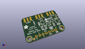
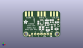
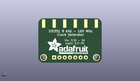
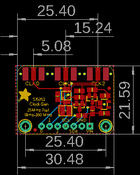
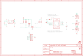

Contents
========

* [PRA2045 > Adafruit](#pra2045--adafruit)
	* [Schematic](#schematic)
	* [Interactive BOM](#interactive-bom)
	* [OOMP Parts](#oomp-parts)
	* [Images](#images)
	* [Tags](#tags)
  
![][im]
# PRA2045 > Adafruit

- ID: PROJ-ADAF-2045-STAN-01
- Hex ID: PRA2045
- Name: Adafruit
- Description: Adafruit
- Long Link: [http://oom.lt/PROJ-ADAF-2045-STAN-01](http://oom.lt/PROJ-ADAF-2045-STAN-01)
- Short Link: [http://oom.lt/PRA2045](http://oom.lt/PRA2045)

## Schematic
  

## Interactive BOM

- Interactive BOM page: [ibom.html](https://htmlpreview.github.io/?https://github.com/oomlout/oomlout_OOMP_projects/blob/main/PROJ-ADAF-2045-STAN-01/kicad/bom/ibom.html)

## OOMP Parts
  

|OOMP Parts|
| :---: |
|C1,CAPC-0805-X-NF470-01,C1,0.47uF,CAP_CERAMIC0805-NOOUTLINE,0805-NO,Ceramic Capacitors,,|
|C2,CAPC-0805-X-NF470-01,C2,0.47uF,CAP_CERAMIC0805-NOOUTLINE,0805-NO,Ceramic Capacitors,,|
|C3,CAPC-0805-X-UNMATCHED-01,C3,10µF,CAP_CERAMIC0805-NOOUTLINE,0805-NO,Ceramic Capacitors,,|
|C5,CAPC-0805-X-UNMATCHED-01,C5,10µF,CAP_CERAMIC0805-NOOUTLINE,0805-NO,Ceramic Capacitors,,|
|JP1,HEAD-I01-X-PI07-01,FID1,FIDUCIAL,FIDUCIAL,FIDUCIAL_1MM,Fiducial Alignment Points,EXCLUDE,|
|Q1,MOSN-SO23-X-KBSS138-01,FID2,FIDUCIAL,FIDUCIAL,FIDUCIAL_1MM,Fiducial Alignment Points,EXCLUDE,|
|Q2,MOSN-SO23-X-KBSS138-01,JP1,,HEADER-1X7THICKER,1X07_ROUND_76,PIN HEADER,,|
|R5,RESE-0805-X-O103-01,Q1,BSS138,MOSFET-NWIDE,SOT23-WIDE,N-Channel Mosfet,,|
|R6,RESE-0805-X-O103-01,Q2,BSS138,MOSFET-NWIDE,SOT23-WIDE,N-Channel Mosfet,,|
|R7,RESE-0805-X-O103-01,R5,10K,RESISTOR0805_NOOUTLINE,0805-NO,Resistors,,|
|R8,RESE-0805-X-O103-01,R6,10K,RESISTOR0805_NOOUTLINE,0805-NO,Resistors,,|
|U1,UNMATCHED-UNMATCHED-X-UNMATCHED-01,R7,10K,RESISTOR0805_NOOUTLINE,0805-NO,Resistors,,|
|U2,UNMATCHED-SO235-X-UNMATCHED-01,R8,10K,RESISTOR0805_NOOUTLINE,0805-NO,Resistors,,|
|X1,UNMATCHED-UNMATCHED-X-UNMATCHED-01,U$10,MOUNTINGHOLE2.5,MOUNTINGHOLE2.5,MOUNTINGHOLE_2.5_PLATED,Mounting Hole,EXCLUDE,|
|X2,UNMATCHED-UNMATCHED-X-UNMATCHED-01,U$11,MOUNTINGHOLE2.5,MOUNTINGHOLE2.5,MOUNTINGHOLE_2.5_PLATED,Mounting Hole,EXCLUDE,|
|X3,UNMATCHED-UNMATCHED-X-UNMATCHED-01,U1,Si5351A-B-GT,SI5351A,MSOP10,Si5351A 8kHz-160MHz I2C Clock Generator,,|
|Y1,UNMATCHED-UNMATCHED-X-UNMATCHED-01,U2,RT9193,VREG_SOT23-5,SOT23-5,SOT23-5 Fixed Voltage Regulators,,|

## Images
  
  

|kicadPcb3d|kicadPcb3dFront|kicadPcb3dBack|eagleImage|eagleSchemImage|
| :---: | :---: | :---: | :---: | :---: |
||||||

## Tags

- hexID: PRA2045
- oompType: PROJ
- oompSize: ADAF
- oompColor: 2045
- oompDesc: STAN
- oompIndex: 01
- oompName: Adafruit Si5351A Clock Generator Breakout PCB
- sources: All source files from https://github.com/adafruit/Adafruit-Si5351A-Clock-Generator-Breakout-PCB (source licence details in srcLicense.md)
- linkBuyPage: http://www.adafruit.com/products/2045
- oompID: PROJ-ADAF-2045-STAN-01
- oompParts: C1,CAPC-0805-X-NF470-01
- oompParts: C2,CAPC-0805-X-NF470-01
- oompParts: C3,CAPC-0805-X-UNMATCHED-01
- oompParts: C5,CAPC-0805-X-UNMATCHED-01
- oompParts: JP1,HEAD-I01-X-PI07-01
- oompParts: Q1,MOSN-SO23-X-KBSS138-01
- oompParts: Q2,MOSN-SO23-X-KBSS138-01
- oompParts: R5,RESE-0805-X-O103-01
- oompParts: R6,RESE-0805-X-O103-01
- oompParts: R7,RESE-0805-X-O103-01
- oompParts: R8,RESE-0805-X-O103-01
- oompParts: U1,UNMATCHED-UNMATCHED-X-UNMATCHED-01
- oompParts: U2,UNMATCHED-SO235-X-UNMATCHED-01
- oompParts: X1,UNMATCHED-UNMATCHED-X-UNMATCHED-01
- oompParts: X2,UNMATCHED-UNMATCHED-X-UNMATCHED-01
- oompParts: X3,UNMATCHED-UNMATCHED-X-UNMATCHED-01
- oompParts: Y1,UNMATCHED-UNMATCHED-X-UNMATCHED-01
- rawParts: C1,0.47uF,CAP_CERAMIC0805-NOOUTLINE,0805-NO,Ceramic Capacitors,,
- rawParts: C2,0.47uF,CAP_CERAMIC0805-NOOUTLINE,0805-NO,Ceramic Capacitors,,
- rawParts: C3,10µF,CAP_CERAMIC0805-NOOUTLINE,0805-NO,Ceramic Capacitors,,
- rawParts: C5,10µF,CAP_CERAMIC0805-NOOUTLINE,0805-NO,Ceramic Capacitors,,
- rawParts: FID1,FIDUCIAL,FIDUCIAL,FIDUCIAL_1MM,Fiducial Alignment Points,EXCLUDE,
- rawParts: FID2,FIDUCIAL,FIDUCIAL,FIDUCIAL_1MM,Fiducial Alignment Points,EXCLUDE,
- rawParts: JP1,,HEADER-1X7THICKER,1X07_ROUND_76,PIN HEADER,,
- rawParts: Q1,BSS138,MOSFET-NWIDE,SOT23-WIDE,N-Channel Mosfet,,
- rawParts: Q2,BSS138,MOSFET-NWIDE,SOT23-WIDE,N-Channel Mosfet,,
- rawParts: R5,10K,RESISTOR0805_NOOUTLINE,0805-NO,Resistors,,
- rawParts: R6,10K,RESISTOR0805_NOOUTLINE,0805-NO,Resistors,,
- rawParts: R7,10K,RESISTOR0805_NOOUTLINE,0805-NO,Resistors,,
- rawParts: R8,10K,RESISTOR0805_NOOUTLINE,0805-NO,Resistors,,
- rawParts: U$10,MOUNTINGHOLE2.5,MOUNTINGHOLE2.5,MOUNTINGHOLE_2.5_PLATED,Mounting Hole,EXCLUDE,
- rawParts: U$11,MOUNTINGHOLE2.5,MOUNTINGHOLE2.5,MOUNTINGHOLE_2.5_PLATED,Mounting Hole,EXCLUDE,
- rawParts: U1,Si5351A-B-GT,SI5351A,MSOP10,Si5351A 8kHz-160MHz I2C Clock Generator,,
- rawParts: U2,RT9193,VREG_SOT23-5,SOT23-5,SOT23-5 Fixed Voltage Regulators,,
- rawParts: X1,,SMACONNECTOR_EDGE,SMA_EDGELAUNCH,SMA Connector,,
- rawParts: X2,,SMACONNECTOR_EDGE,SMA_EDGELAUNCH,SMA Connector,,
- rawParts: X3,,SMACONNECTOR_EDGE,SMA_EDGELAUNCH,SMA Connector,,
- rawParts: Y1,25MHz,CRYSTAL3.2X2.5,CRYSTAL_3.2X2.5,Crystals,,

[im]: kicadPcb3d_450.png
