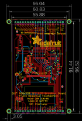
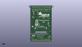
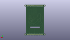
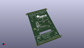

Contents
========

* [PROJ-ADAF-2050-STAN-01>3.5inch TFT Breakout PCB](#proj-adaf-2050-stan-0135inch-tft-breakout-pcb)
	* [Images](#images)
	* [Interactive BOM](#interactive-bom)
	* [OOMP Parts](#oomp-parts)
	* [Tags](#tags)
  
![][im]
# PROJ-ADAF-2050-STAN-01>3.5inch TFT Breakout PCB

- ID: PROJ-ADAF-2050-STAN-01
- Hex ID: PRA2050
- Name: 3.5inch TFT Breakout PCB
- Description: 

## Images
  
  

|eagleImage|kicadPcb3dFront|kicadPcb3dBack|kicadPcb3d|
| :---: | :---: | :---: | :---: |
|||||

## Interactive BOM

- Interactive BOM page: [ibom.html](kicad/bom/ibom.html)

## OOMP Parts
  

|OOMP Parts|
| :---: |
|<table><tr><td></td><td> C1</td><td>[CAPC-0805-X-NF100-V50 SMD (0805) 100 nF Capacitor (Ceramic) 50v](https://github.com/oomlout/oomlout_OOMP_parts/tree/main/CAPC-0805-X-NF100-V50/)</td><td>[C85N100](https://github.com/oomlout/oomlout_OOMP_parts/tree/main/CAPC-0805-X-NF100-V50/)</td></tr></table>|
|<table><tr><td></td><td> C2</td><td>[CAPC-0805-X-UF10-V25 SMD (0805) 10 uF Capacitor (Ceramic) 25v](https://github.com/oomlout/oomlout_OOMP_parts/tree/main/CAPC-0805-X-UF10-V25/)</td><td>[C85U010](https://github.com/oomlout/oomlout_OOMP_parts/tree/main/CAPC-0805-X-UF10-V25/)</td></tr></table>|
|<table><tr><td></td><td> C3</td><td>[CAPC-0805-X-UF10-V25 SMD (0805) 10 uF Capacitor (Ceramic) 25v](https://github.com/oomlout/oomlout_OOMP_parts/tree/main/CAPC-0805-X-UF10-V25/)</td><td>[C85U010](https://github.com/oomlout/oomlout_OOMP_parts/tree/main/CAPC-0805-X-UF10-V25/)</td></tr></table>|
|<table><tr><td></td><td> C4</td><td>[CAPC-0805-X-NF100-V50 SMD (0805) 100 nF Capacitor (Ceramic) 50v](https://github.com/oomlout/oomlout_OOMP_parts/tree/main/CAPC-0805-X-NF100-V50/)</td><td>[C85N100](https://github.com/oomlout/oomlout_OOMP_parts/tree/main/CAPC-0805-X-NF100-V50/)</td></tr></table>|
|<table><tr><td></td><td> C5</td><td>[CAPC-0805-X-UF10-V25 SMD (0805) 10 uF Capacitor (Ceramic) 25v](https://github.com/oomlout/oomlout_OOMP_parts/tree/main/CAPC-0805-X-UF10-V25/)</td><td>[C85U010](https://github.com/oomlout/oomlout_OOMP_parts/tree/main/CAPC-0805-X-UF10-V25/)</td></tr></table>|
|CAPC-UNMATCHED-X-UF10-V25, C16, -10.668, 15.875, 180,C16, 10uF, _0805MP, microbuilder, (-0.42, 0.625), R180|
|<table><tr><td></td><td> C18</td><td>[CAPC-0805-X-NF100-V50 SMD (0805) 100 nF Capacitor (Ceramic) 50v](https://github.com/oomlout/oomlout_OOMP_parts/tree/main/CAPC-0805-X-NF100-V50/)</td><td>[C85N100](https://github.com/oomlout/oomlout_OOMP_parts/tree/main/CAPC-0805-X-NF100-V50/)</td></tr></table>|
|CAPC-0805-X-UNMATCHED-01, C20, -12.191999999999998, -1.397, 0,C20, 1uF, 0805-NO, microbuilder, (-0.48, -0.055), R0|
|UNMATCHED-UNMATCHED-X-UNMATCHED-01, D1, -11.684, 1.397, 0,D1, MM3Z24VT1G, SMADIODE, microbuilder, (-0.46, 0.055), R0|
|UNMATCHED-UNMATCHED-X-UNMATCHED-01, D2, -14.350999999999997, 6.35, 90,D2, MBR0540, SOD-123, microbuilder, (-0.565, 0.25), R90|
|UNMATCHED-UNMATCHED-X-UNMATCHED-01, D4, -3.937, 3.175, 270,D4, 1N4148, SOD-323F, adafruit, (-0.155, 0.125), R270|
|UNMATCHED-UNMATCHED-X-UNMATCHED-01, IC1, 19.558, 3.8099999999999996, 0,IC1, MIC5225-3.3, SOT23-5L, adafruit, (0.77, 0.15), R0|
|UNMATCHED-UNMATCHED-X-UNMATCHED-01, IC2, 0.254, 18.541999999999998, 180,IC2, 74LVC245, SO20W, 74xx-eu, (0.01, 0.73), R180|
|UNMATCHED-UNMATCHED-X-UNMATCHED-01, IC3, 15.239999999999998, 18.287999999999997, 180,IC3, 74LVC245, SO20W, 74xx-eu, (0.6, 0.72), R180|
|UNMATCHED-UNMATCHED-X-UNMATCHED-01, IC4, 5.588, 9.143999999999998, 0,IC4, APX803-SAG, SOT23, adafruit, (0.22, 0.36), R0|
|UNMATCHED-UNMATCHED-X-UNMATCHED-01, JP1, 0.0, 50.291999999999994, 180,JP1, 1X20_ROUND, microbuilder, (0, 1.98), R180|
|UNMATCHED-UNMATCHED-X-UNMATCHED-01, JP2, 0.0, -40.64, 180,JP2, 1X20_ROUND, microbuilder, (0, -1.6), R180|
|ERROR, L1 10uH inductor, 0, 0, 0,L1, 10uH, inductor, INDUCTOR_5X5MM_NR5040_NOTHERMALS, microbuilder, (-0.44, 0.47), R180|
|RESE-UNMATCHED-X-UNMATCHED-01, R1, -7.365999999999999, 4.064, 180,R1, 12?, _0805MP, microbuilder, (-0.29, 0.16), R180|
|<table><tr><td></td><td> R2</td><td>[RESE-0805-X-O103-01 SMD (0805) 10k Ohm Resistor](https://github.com/oomlout/oomlout_OOMP_parts/tree/main/RESE-0805-X-O103-01/)</td><td>[R85103](https://github.com/oomlout/oomlout_OOMP_parts/tree/main/RESE-0805-X-O103-01/)</td></tr></table>|
|<table><tr><td></td><td> R6</td><td>[RESE-0805-X-O103-01 SMD (0805) 10k Ohm Resistor](https://github.com/oomlout/oomlout_OOMP_parts/tree/main/RESE-0805-X-O103-01/)</td><td>[R85103](https://github.com/oomlout/oomlout_OOMP_parts/tree/main/RESE-0805-X-O103-01/)</td></tr></table>|
|<table><tr><td></td><td> R8</td><td>[RESE-0805-X-O103-01 SMD (0805) 10k Ohm Resistor](https://github.com/oomlout/oomlout_OOMP_parts/tree/main/RESE-0805-X-O103-01/)</td><td>[R85103](https://github.com/oomlout/oomlout_OOMP_parts/tree/main/RESE-0805-X-O103-01/)</td></tr></table>|
|<table><tr><td></td><td> R9</td><td>[RESE-0805-X-O103-01 SMD (0805) 10k Ohm Resistor](https://github.com/oomlout/oomlout_OOMP_parts/tree/main/RESE-0805-X-O103-01/)</td><td>[R85103](https://github.com/oomlout/oomlout_OOMP_parts/tree/main/RESE-0805-X-O103-01/)</td></tr></table>|
|<table><tr><td></td><td> R11</td><td>[RESE-0805-X-O103-01 SMD (0805) 10k Ohm Resistor](https://github.com/oomlout/oomlout_OOMP_parts/tree/main/RESE-0805-X-O103-01/)</td><td>[R85103](https://github.com/oomlout/oomlout_OOMP_parts/tree/main/RESE-0805-X-O103-01/)</td></tr></table>|
|<table><tr><td></td><td> R12</td><td>[RESE-0805-X-O103-01 SMD (0805) 10k Ohm Resistor](https://github.com/oomlout/oomlout_OOMP_parts/tree/main/RESE-0805-X-O103-01/)</td><td>[R85103](https://github.com/oomlout/oomlout_OOMP_parts/tree/main/RESE-0805-X-O103-01/)</td></tr></table>|
|UNMATCHED-UNMATCHED-X-UNMATCHED-01, SJ3, -22.352, -3.175, 0,SJ3, SOLDERJUMPER_ARROW_NOPASTE, microbuilder, (-0.88, -0.125), R0|
|UNMATCHED-UNMATCHED-X-UNMATCHED-01, U3, -11.176, 7.112, 270,U3, FAN5333BSX, SOT23-5@1, microbuilder, (-0.44, 0.28), R270|
|UNMATCHED-UNMATCHED-X-UNMATCHED-01, X1, -8.382, 37.846, 270,X1, MICROSD, microbuilder, (-0.33, 1.49), R270|
|UNMATCHED-UNMATCHED-X-UNMATCHED-01, X2, 0.0, 0.0, M0,X2, TFT_3.5IN_320X480_50PIN, microbuilder, (0, 0), MR0|

## Tags

- hexID: PRA2050
- oompType: PROJ
- oompSize: ADAF
- oompColor: 2050
- oompDesc: STAN
- oompIndex: 01
- oompName: 3.5inch TFT Breakout PCB
- sources: All source files from https://github.com/adafruit/3.5inch-TFT-Breakout-PCB (source licence details in srcLicense.md)
- linkBuyPage: http://www.adafruit.com/products/2050
- oompPart: CAPC-0805-X-NF100-V50, C1, -20.32, 21.209, 0
- oompPart: CAPC-0805-X-UF10-V25, C2, 22.605999999999998, -30.987999999999996, 0
- oompPart: CAPC-0805-X-UF10-V25, C3, 19.558, 7.112, 0
- oompPart: CAPC-0805-X-NF100-V50, C4, -5.588, -1.016, 180
- oompPart: CAPC-0805-X-UF10-V25, C5, 21.336, -1.27, 180
- oompPart: CAPC-UNMATCHED-X-UF10-V25, C16, -10.668, 15.875, 180
- oompPart: CAPC-0805-X-NF100-V50, C18, -11.049, 4.064, 180
- oompPart: CAPC-0805-X-UNMATCHED-01, C20, -12.191999999999998, -1.397, 0
- oompPart: UNMATCHED-UNMATCHED-X-UNMATCHED-01, D1, -11.684, 1.397, 0
- oompPart: UNMATCHED-UNMATCHED-X-UNMATCHED-01, D2, -14.350999999999997, 6.35, 90
- oompPart: UNMATCHED-UNMATCHED-X-UNMATCHED-01, D4, -3.937, 3.175, 270
- oompPart: UNMATCHED-UNMATCHED-X-UNMATCHED-01, IC1, 19.558, 3.8099999999999996, 0
- oompPart: UNMATCHED-UNMATCHED-X-UNMATCHED-01, IC2, 0.254, 18.541999999999998, 180
- oompPart: UNMATCHED-UNMATCHED-X-UNMATCHED-01, IC3, 15.239999999999998, 18.287999999999997, 180
- oompPart: UNMATCHED-UNMATCHED-X-UNMATCHED-01, IC4, 5.588, 9.143999999999998, 0
- oompPart: UNMATCHED-UNMATCHED-X-UNMATCHED-01, JP1, 0.0, 50.291999999999994, 180
- oompPart: UNMATCHED-UNMATCHED-X-UNMATCHED-01, JP2, 0.0, -40.64, 180
- oompPart: ERROR, L1 10uH inductor, 0, 0, 0
- oompPart: RESE-UNMATCHED-X-UNMATCHED-01, R1, -7.365999999999999, 4.064, 180
- oompPart: RESE-0805-X-O103-01, R2, -8.128, 7.112, 90
- oompPart: RESE-0805-X-O103-01, R6, 8.382, 9.906, 90
- oompPart: RESE-0805-X-O103-01, R8, -22.224999999999998, -27.432, 90
- oompPart: RESE-0805-X-O103-01, R9, -19.812, -28.066999999999997, 90
- oompPart: RESE-0805-X-O103-01, R11, -17.272000000000002, -28.066999999999997, 270
- oompPart: RESE-0805-X-O103-01, R12, 7.746999999999999, 23.495, 270
- oompPart: UNMATCHED-UNMATCHED-X-UNMATCHED-01, SJ3, -22.352, -3.175, 0
- oompPart: SKIP-UNMATCHED-X-UNMATCHED-01, U$7, -30.479999999999997, -40.64, 0
- oompPart: SKIP-UNMATCHED-X-UNMATCHED-01, U$9, 23.622, -15.493999999999998, 0
- oompPart: SKIP-UNMATCHED-X-UNMATCHED-01, U$11, -22.352, 40.64, 0
- oompPart: SKIP-UNMATCHED-X-UNMATCHED-01, U$15, 30.479999999999997, -40.64, 0
- oompPart: SKIP-UNMATCHED-X-UNMATCHED-01, U$16, -30.479999999999997, 50.8, 0
- oompPart: SKIP-UNMATCHED-X-UNMATCHED-01, U$17, 30.479999999999997, 50.8, 0
- oompPart: SKIP-UNMATCHED-X-UNMATCHED-01, U$23, -16.383, -9.270999999999999, 0
- oompPart: UNMATCHED-UNMATCHED-X-UNMATCHED-01, U3, -11.176, 7.112, 270
- oompPart: UNMATCHED-UNMATCHED-X-UNMATCHED-01, X1, -8.382, 37.846, 270
- oompPart: UNMATCHED-UNMATCHED-X-UNMATCHED-01, X2, 0.0, 0.0, M0
- rawPart: C1, 0.1uF, 0805-NO, microbuilder, (-0.8, 0.835), R0
- rawPart: C2, 10uF, 0805-NO, microbuilder, (0.89, -1.22), R0
- rawPart: C3, 10uF, 0805-NO, microbuilder, (0.77, 0.28), R0
- rawPart: C4, 0.1uF, 0805-NO, microbuilder, (-0.22, -0.04), R180
- rawPart: C5, 10uF, 0805-NO, microbuilder, (0.84, -0.05), R180
- rawPart: C16, 10uF, _0805MP, microbuilder, (-0.42, 0.625), R180
- rawPart: C18, 0.1uF, 0805-NO, microbuilder, (-0.435, 0.16), R180
- rawPart: C20, 1uF, 0805-NO, microbuilder, (-0.48, -0.055), R0
- rawPart: D1, MM3Z24VT1G, SMADIODE, microbuilder, (-0.46, 0.055), R0
- rawPart: D2, MBR0540, SOD-123, microbuilder, (-0.565, 0.25), R90
- rawPart: D4, 1N4148, SOD-323F, adafruit, (-0.155, 0.125), R270
- rawPart: IC1, MIC5225-3.3, SOT23-5L, adafruit, (0.77, 0.15), R0
- rawPart: IC2, 74LVC245, SO20W, 74xx-eu, (0.01, 0.73), R180
- rawPart: IC3, 74LVC245, SO20W, 74xx-eu, (0.6, 0.72), R180
- rawPart: IC4, APX803-SAG, SOT23, adafruit, (0.22, 0.36), R0
- rawPart: JP1, 1X20_ROUND, microbuilder, (0, 1.98), R180
- rawPart: JP2, 1X20_ROUND, microbuilder, (0, -1.6), R180
- rawPart: L1, 10uH, inductor, INDUCTOR_5X5MM_NR5040_NOTHERMALS, microbuilder, (-0.44, 0.47), R180
- rawPart: R1, 12?, _0805MP, microbuilder, (-0.29, 0.16), R180
- rawPart: R2, 10K, 0805-NO, microbuilder, (-0.32, 0.28), R90
- rawPart: R6, 10K, R0805, rcl, (0.33, 0.39), R90
- rawPart: R8, 10K, 0805-NO, microbuilder, (-0.875, -1.08), R90
- rawPart: R9, 10K, 0805-NO, microbuilder, (-0.78, -1.105), R90
- rawPart: R11, 10K, 0805-NO, microbuilder, (-0.68, -1.105), R270
- rawPart: R12, 10K, 0805-NO, microbuilder, (0.305, 0.925), R270
- rawPart: SJ3, SOLDERJUMPER_ARROW_NOPASTE, microbuilder, (-0.88, -0.125), R0
- rawPart: U$7, MOUNTINGHOLE3.0THIN, MOUNTINGHOLE_3.0_PLATEDTHIN, microbuilder, (-1.2, -1.6), R0
- rawPart: U$9, FIDUCIAL, FIDUCIAL_1MM, adafruit, (0.93, -0.61), R0
- rawPart: U$11, FIDUCIAL, FIDUCIAL_1MM, adafruit, (-0.88, 1.6), R0
- rawPart: U$15, MOUNTINGHOLE3.0THIN, MOUNTINGHOLE_3.0_PLATEDTHIN, microbuilder, (1.2, -1.6), R0
- rawPart: U$16, MOUNTINGHOLE3.0THIN, MOUNTINGHOLE_3.0_PLATEDTHIN, microbuilder, (-1.2, 2), R0
- rawPart: U$17, MOUNTINGHOLE3.0THIN, MOUNTINGHOLE_3.0_PLATEDTHIN, microbuilder, (1.2, 2), R0
- rawPart: U$23, FIDUCIAL, FIDUCIAL_1MM, adafruit, (-0.645, -0.365), R0
- rawPart: U3, FAN5333BSX, SOT23-5@1, microbuilder, (-0.44, 0.28), R270
- rawPart: X1, MICROSD, microbuilder, (-0.33, 1.49), R270
- rawPart: X2, TFT_3.5IN_320X480_50PIN, microbuilder, (0, 0), MR0

[im]: kicadPcb3d_450.png
