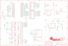

Contents
========

* [PRA2050 > 3.5inch TFT Breakout PCB](#pra2050--35inch-tft-breakout-pcb)
	* [Schematic](#schematic)
	* [PCB](#pcb)
	* [Interactive BOM](#interactive-bom)
	* [OOMP Parts](#oomp-parts)
	* [Images](#images)
	* [Tags](#tags)
  
![][im]
# PRA2050 > 3.5inch TFT Breakout PCB

- ID: PROJ-ADAF-2050-STAN-01
- Hex ID: PRA2050
- Name: Adafruit
- Description: Adafruit
- Long Link: [http://oom.lt/PROJ-ADAF-2050-STAN-01](http://oom.lt/PROJ-ADAF-2050-STAN-01)
- Short Link: [http://oom.lt/PRA2050](http://oom.lt/PRA2050)

## Schematic
  

## PCB
  

## Interactive BOM

- Interactive BOM page: [ibom.html](https://htmlpreview.github.io/?https://github.com/oomlout/oomlout_OOMP_projects/blob/main/PROJ-ADAF-2050-STAN-01/kicad/bom/ibom.html)

## OOMP Parts
  

|OOMP Parts|
| :---: |
|C1 C1,CAPC-0805-X-UF1D-01|
|[C2 CAPC-0805-X-UF10-V10 SMD (0805) 10 uF Capacitor (Ceramic) 10v](https://github.com/oomlout/oomlout_OOMP_parts/tree/main/CAPC-0805-X-UF10-V10/)|
|[C3 CAPC-0805-X-UF10-V10 SMD (0805) 10 uF Capacitor (Ceramic) 10v](https://github.com/oomlout/oomlout_OOMP_parts/tree/main/CAPC-0805-X-UF10-V10/)|
|C4 C4,CAPC-0805-X-UF1D-01|
|[C5 CAPC-0805-X-UF10-V10 SMD (0805) 10 uF Capacitor (Ceramic) 10v](https://github.com/oomlout/oomlout_OOMP_parts/tree/main/CAPC-0805-X-UF10-V10/)|
|[C16 CAPC-0805-X-UF10-V10 SMD (0805) 10 uF Capacitor (Ceramic) 10v](https://github.com/oomlout/oomlout_OOMP_parts/tree/main/CAPC-0805-X-UF10-V10/)|
|C18 C18,CAPC-0805-X-UF1D-01|
|C20 C20,CAPC-0805-X-UF1-01|
|D1 D1,DIOD-UNMATCHED-X-UNMATCHED-01|
|D2 D2,DIOD-S123-X-UNMATCHED-01|
|[D4 DIOD-S323-X-K4148-01 SMD (SOD-323) Diode](https://github.com/oomlout/oomlout_OOMP_parts/tree/main/DIOD-S323-X-K4148-01/)|
|[IC1 VREG-SO235-X-KMIC5225-V33D SMD (SOT-23-5) MIC5225 Voltage Regulator 3.3v](https://github.com/oomlout/oomlout_OOMP_parts/tree/main/VREG-SO235-X-KMIC5225-V33D/)|
|IC2 IC2,UNMATCHED-UNMATCHED-X-UNMATCHED-01|
|IC3 IC3,UNMATCHED-UNMATCHED-X-UNMATCHED-01|
|IC4 IC4,UNMATCHED-SO23-X-UNMATCHED-01|
|[JP1 HEAD-I01-X-PI20-01 2.54 mm 20 Pin Header](https://github.com/oomlout/oomlout_OOMP_parts/tree/main/HEAD-I01-X-PI20-01/)|
|[JP2 HEAD-I01-X-PI20-01 2.54 mm 20 Pin Header](https://github.com/oomlout/oomlout_OOMP_parts/tree/main/HEAD-I01-X-PI20-01/)|
|L1 L1,UNMATCHED-UNMATCHED-X-UNMATCHED-01|
|R1 R1,RESE-0805-X-UNMATCHED-01|
|[R2 RESE-0805-X-O103-01 SMD (0805) 10k Ohm Resistor](https://github.com/oomlout/oomlout_OOMP_parts/tree/main/RESE-0805-X-O103-01/)|
|[R6 RESE-0805-X-O103-01 SMD (0805) 10k Ohm Resistor](https://github.com/oomlout/oomlout_OOMP_parts/tree/main/RESE-0805-X-O103-01/)|
|[R8 RESE-0805-X-O103-01 SMD (0805) 10k Ohm Resistor](https://github.com/oomlout/oomlout_OOMP_parts/tree/main/RESE-0805-X-O103-01/)|
|[R9 RESE-0805-X-O103-01 SMD (0805) 10k Ohm Resistor](https://github.com/oomlout/oomlout_OOMP_parts/tree/main/RESE-0805-X-O103-01/)|
|[R11 RESE-0805-X-O103-01 SMD (0805) 10k Ohm Resistor](https://github.com/oomlout/oomlout_OOMP_parts/tree/main/RESE-0805-X-O103-01/)|
|[R12 RESE-0805-X-O103-01 SMD (0805) 10k Ohm Resistor](https://github.com/oomlout/oomlout_OOMP_parts/tree/main/RESE-0805-X-O103-01/)|
|U3 U3,UNMATCHED-SO235-X-UNMATCHED-01|
|X1 X1,UNMATCHED-UNMATCHED-X-UNMATCHED-01|
|X2 X2,UNMATCHED-UNMATCHED-X-UNMATCHED-01|

## Images
  
  

|kicadPcb3d|kicadPcb3dFront|kicadPcb3dBack|eagleImage|eagleSchemImage|
| :---: | :---: | :---: | :---: | :---: |
||||||

## Tags

- hexID: PRA2050
- oompType: PROJ
- oompSize: ADAF
- oompColor: 2050
- oompDesc: STAN
- oompIndex: 01
- oompName: 3.5inch TFT Breakout PCB
- sources: All source files from https://github.com/adafruit/3.5inch-TFT-Breakout-PCB (source licence details in srcLicense.md)
- linkBuyPage: http://www.adafruit.com/products/2050
- oompID: PROJ-ADAF-2050-STAN-01
- oompParts: C1,CAPC-0805-X-UF1D-01
- oompParts: C2,CAPC-0805-X-UF10-V10
- oompParts: C3,CAPC-0805-X-UF10-V10
- oompParts: C4,CAPC-0805-X-UF1D-01
- oompParts: C5,CAPC-0805-X-UF10-V10
- oompParts: C16,CAPC-0805-X-UF10-V10
- oompParts: C18,CAPC-0805-X-UF1D-01
- oompParts: C20,CAPC-0805-X-UF1-01
- oompParts: D1,DIOD-UNMATCHED-X-UNMATCHED-01
- oompParts: D2,DIOD-S123-X-UNMATCHED-01
- oompParts: D4,DIOD-S323-X-K4148-01
- oompParts: IC1,VREG-SO235-X-KMIC5225-V33D
- oompParts: IC2,UNMATCHED-UNMATCHED-X-UNMATCHED-01
- oompParts: IC3,UNMATCHED-UNMATCHED-X-UNMATCHED-01
- oompParts: IC4,UNMATCHED-SO23-X-UNMATCHED-01
- oompParts: JP1,HEAD-I01-X-PI20-01
- oompParts: JP2,HEAD-I01-X-PI20-01
- oompParts: L1,UNMATCHED-UNMATCHED-X-UNMATCHED-01
- oompParts: R1,RESE-0805-X-UNMATCHED-01
- oompParts: R2,RESE-0805-X-O103-01
- oompParts: R6,RESE-0805-X-O103-01
- oompParts: R8,RESE-0805-X-O103-01
- oompParts: R9,RESE-0805-X-O103-01
- oompParts: R11,RESE-0805-X-O103-01
- oompParts: R12,RESE-0805-X-O103-01
- oompParts: U3,UNMATCHED-SO235-X-UNMATCHED-01
- oompParts: X1,UNMATCHED-UNMATCHED-X-UNMATCHED-01
- oompParts: X2,UNMATCHED-UNMATCHED-X-UNMATCHED-01
- rawParts: C1,0.1uF,CAP_CERAMIC0805-NOOUTLINE,0805-NO,Ceramic Capacitors,,
- rawParts: C2,10uF,CAP_CERAMIC0805-NOOUTLINE,0805-NO,Ceramic Capacitors,,
- rawParts: C3,10uF,CAP_CERAMIC0805-NOOUTLINE,0805-NO,Ceramic Capacitors,,
- rawParts: C4,0.1uF,CAP_CERAMIC0805-NOOUTLINE,0805-NO,Ceramic Capacitors,,
- rawParts: C5,10uF,CAP_CERAMIC0805-NOOUTLINE,0805-NO,Ceramic Capacitors,,
- rawParts: C16,10uF,CAP_CERAMIC_0805MP,_0805MP,Ceramic Capacitors,,
- rawParts: C18,0.1uF,CAP_CERAMIC0805-NOOUTLINE,0805-NO,Ceramic Capacitors,,
- rawParts: C20,1uF,CAP_CERAMIC0805-NOOUTLINE,0805-NO,Ceramic Capacitors,,
- rawParts: D1,MM3Z24VT1G,DIODESMA,SMADIODE,Diode,,
- rawParts: D2,MBR0540,DIODESOD-123,SOD-123,Diode,,
- rawParts: D4,1N4148,DIODESOD-323F,SOD-323F,Diode,,
- rawParts: IC1,MIC5225-3.3,LP298XS,SOT23-5L,,,
- rawParts: IC2,74LVC245,74ACT245DW,SO20W,Octal BUS TRANSCEIVER, 3-state,,
- rawParts: IC3,74LVC245,74ACT245DW,SO20W,Octal BUS TRANSCEIVER, 3-state,,
- rawParts: IC4,APX803-SAG,AXP083-SAG,SOT23,,,
- rawParts: JP1,,HEADER-1X20ROUND,1X20_ROUND,,,
- rawParts: JP2,,HEADER-1X20ROUND,1X20_ROUND,,,
- rawParts: L1,10uH inductor,INDUCTORNR5040,INDUCTOR_5X5MM_NR5040_NOTHERMALS,Inductors,,
- rawParts: R1,12Ω,RESISTOR_0805MP,_0805MP,Resistors,,
- rawParts: R2,10K,RESISTOR0805_NOOUTLINE,0805-NO,Resistors,,
- rawParts: R6,10K,R-US_R0805,R0805,RESISTOR, American symbol,,
- rawParts: R8,10K,RESISTOR0805_NOOUTLINE,0805-NO,Resistors,,
- rawParts: R9,10K,RESISTOR0805_NOOUTLINE,0805-NO,Resistors,,
- rawParts: R11,10K,RESISTOR0805_NOOUTLINE,0805-NO,Resistors,,
- rawParts: R12,10K,RESISTOR0805_NOOUTLINE,0805-NO,Resistors,,
- rawParts: SJ3,,SOLDERJUMPER,SOLDERJUMPER_ARROW_NOPASTE,SMD Solder JUMPER,EXCLUDE,
- rawParts: U$7,MOUNTINGHOLE3.0THIN,MOUNTINGHOLE3.0THIN,MOUNTINGHOLE_3.0_PLATEDTHIN,Mounting Hole,EXCLUDE,
- rawParts: U$9,FIDUCIAL,FIDUCIAL,FIDUCIAL_1MM,For use by pick and place machines to calibrate the vision/machine, 1mm,,
- rawParts: U$11,FIDUCIAL,FIDUCIAL,FIDUCIAL_1MM,For use by pick and place machines to calibrate the vision/machine, 1mm,,
- rawParts: U$15,MOUNTINGHOLE3.0THIN,MOUNTINGHOLE3.0THIN,MOUNTINGHOLE_3.0_PLATEDTHIN,Mounting Hole,EXCLUDE,
- rawParts: U$16,MOUNTINGHOLE3.0THIN,MOUNTINGHOLE3.0THIN,MOUNTINGHOLE_3.0_PLATEDTHIN,Mounting Hole,EXCLUDE,
- rawParts: U$17,MOUNTINGHOLE3.0THIN,MOUNTINGHOLE3.0THIN,MOUNTINGHOLE_3.0_PLATEDTHIN,Mounting Hole,EXCLUDE,
- rawParts: U$23,FIDUCIAL,FIDUCIAL,FIDUCIAL_1MM,For use by pick and place machines to calibrate the vision/machine, 1mm,,
- rawParts: U3,FAN5333BSX,FAN5331,SOT23-5@1,FAN5331 - LED/OLED 20V Boost Converter,,
- rawParts: X1,,MICROSD,MICROSD,MicroSD/Transflash Card Holder with SPI pinout,,
- rawParts: X2,,DISP_LCD_3.5IN_320X480_50PIN,TFT_3.5IN_320X480_50PIN,DT350HV15-T - 3.5 320x480 TFT Display, 50 Pin Connector,,

[im]: kicadPcb3d_450.png
