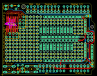
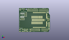
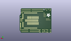
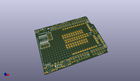

Contents
========

* [PROJ-ADAF-2077-STAN-01>Adafruit Proto Shield PCB](#proj-adaf-2077-stan-01adafruit-proto-shield-pcb)
	* [Images](#images)
	* [Interactive BOM](#interactive-bom)
	* [OOMP Parts](#oomp-parts)
	* [Tags](#tags)
  
![][im]
# PROJ-ADAF-2077-STAN-01>Adafruit Proto Shield PCB

- ID: PROJ-ADAF-2077-STAN-01
- Hex ID: PRA2077
- Name: Adafruit Proto Shield PCB
- Description: 

## Images
  
  

|eagleImage|kicadPcb3dFront|kicadPcb3dBack|kicadPcb3d|
| :---: | :---: | :---: | :---: |
|||||

## Interactive BOM

- Interactive BOM page: [ibom.html](kicad/bom/ibom.html)

## OOMP Parts
  

|OOMP Parts|
| :---: |
|UNMATCHED-UNMATCHED-X-UNMATCHED-01, C1, 63.672699934, 43.571100056, 0,C1, C025-025X050, rcl-ez, (2.50679921, 1.71539764), R0|
|UNMATCHED-UNMATCHED-X-UNMATCHED-01, C2, 66.664899944, 7.411699933999999, 90,C2, C025-025X050, rcl-ez, (2.62460236, 0.29179921), R90|
|UNMATCHED-UNMATCHED-X-UNMATCHED-01, GNDSTRIP1, 56.39810005599999, 27.894300065999996, 180,GNDSTRIP1, 12-STRIP, 12-STRIP, Atmex, (2.22039764, 1.09820079), R180|
|UNMATCHED-UNMATCHED-X-UNMATCHED-01, GNDSTRIP2, 58.938100055999996, 10.114300066, 180,GNDSTRIP2, 12-STRIP, 12-STRIP, Atmex, (2.32039764, 0.39820079), R180|
|UNMATCHED-UNMATCHED-X-UNMATCHED-01, IC1, 6.360100055999999, 37.800300066, 0,IC1, SMD-14, SO-14NMW, carduino, (0.25039764, 1.48820079), R0|
|<table><tr><td></td><td> JP1</td><td>[HEAD-I01-X-PI08-01 2.54 mm 8 Pin Header](https://github.com/oomlout/oomlout_OOMP_parts/tree/main/HEAD-I01-X-PI08-01/)</td><td>[H08](https://github.com/oomlout/oomlout_OOMP_parts/tree/main/HEAD-I01-X-PI08-01/)</td></tr></table>|
|<table><tr><td></td><td> JP4</td><td>[HEAD-I01-X-PI08-01 2.54 mm 8 Pin Header](https://github.com/oomlout/oomlout_OOMP_parts/tree/main/HEAD-I01-X-PI08-01/)</td><td>[H08](https://github.com/oomlout/oomlout_OOMP_parts/tree/main/HEAD-I01-X-PI08-01/)</td></tr></table>|
|<table><tr><td></td><td> JP9</td><td>[HEAD-I01-X-PI06-01 2.54 mm 6 Pin Header](https://github.com/oomlout/oomlout_OOMP_parts/tree/main/HEAD-I01-X-PI06-01/)</td><td>[H06](https://github.com/oomlout/oomlout_OOMP_parts/tree/main/HEAD-I01-X-PI06-01/)</td></tr></table>|
|UNMATCHED-UNMATCHED-X-UNMATCHED-01, LED1, 2.621300066, 50.027899944, 270,LED1, LED3MM, adafruit, (0.10320079, 1.96960236), R270|
|UNMATCHED-UNMATCHED-X-UNMATCHED-01, LED2, 14.869100056, 3.129300066, 270,LED2, LED3MM, adafruit, (0.58539764, 0.12320079), R270|
|UNMATCHED-UNMATCHED-X-UNMATCHED-01, M1, 0.0, 0.0, 0,M1, ARDUINO_R3_ICSP, ARDUINOR3_ICSP, adafruit, (0, 0), R0|
|RESE-UNMATCHED-X-UNMATCHED-01, R1, 9.443699934, 51.318100056, 0,R1, 0207/5V, rcl-ez, (0.37179921, 2.02039764), R0|
|RESE-UNMATCHED-X-UNMATCHED-01, R2, 11.567100056, 4.145300066, 90,R2, 0207/5V, rcl-ez, (0.45539764, 0.16320079), R90|
|UNMATCHED-UNMATCHED-X-UNMATCHED-01, RESET, 5.140099955999999, 3.70150009, 180,RESET, Reset, B3F-10XX, switch-omron, (0.20236614, 0.14572835), R180|
|UNMATCHED-UNMATCHED-X-UNMATCHED-01, S1, 21.600100056, 3.891300066, 0,S1, Reset, B3F-10XX, switch-omron, (0.85039764, 0.15320079), R0|
|UNMATCHED-UNMATCHED-X-UNMATCHED-01, U$1, 30.225999999999996, 46.99, 0,U$1, PINHD-1X10, 1X10-BIG, adafruit, (1.19, 1.85), R0|
|UNMATCHED-UNMATCHED-X-UNMATCHED-01, U$2, 3.058100056, 27.894300065999996, 0,U$2, PERFHOLE, PERFHOLE, Atmex, (0.12039764, 1.09820079), R0|
|UNMATCHED-UNMATCHED-X-UNMATCHED-01, U$3, 66.548, 11.43, 90,U$3, 5-STRIP, 5-STRIP, protoshield, (2.62, 0.45), R90|
|UNMATCHED-UNMATCHED-X-UNMATCHED-01, U$4, 14.996100055999998, 6.812300066000001, 0,U$4, PERFHOLE, PERFHOLE, Atmex, (0.59039764, 0.26820079), R0|
|UNMATCHED-UNMATCHED-X-UNMATCHED-01, U$5, 48.778100056, 20.274300066, 90,U$5, 3-STRIP, 3-STRIP, Atmex, (1.92039764, 0.79820079), R90|
|UNMATCHED-UNMATCHED-X-UNMATCHED-01, U$6, 5.598100056, 27.894300065999996, 0,U$6, PERFHOLE, PERFHOLE, Atmex, (0.22039764, 1.09820079), R0|
|UNMATCHED-UNMATCHED-X-UNMATCHED-01, U$7, 10.170100055999999, 48.976300066, 0,U$7, PERFHOLE, PERFHOLE, Atmex, (0.40039764, 1.92820079), R0|
|UNMATCHED-UNMATCHED-X-UNMATCHED-01, U$8, 5.598100056, 30.434300066, 0,U$8, PERFHOLE, PERFHOLE, Atmex, (0.22039764, 1.19820079), R0|
|UNMATCHED-UNMATCHED-X-UNMATCHED-01, U$9, 8.138100055999999, 27.894300065999996, 0,U$9, PERFHOLE, PERFHOLE, Atmex, (0.32039764, 1.09820079), R0|
|UNMATCHED-UNMATCHED-X-UNMATCHED-01, U$10, 46.23810005599999, 32.974300066, 90,U$10, 3-STRIP, 3-STRIP, Atmex, (1.82039764, 1.29820079), R90|
|UNMATCHED-UNMATCHED-X-UNMATCHED-01, U$11, 46.23810005599999, 20.274300066, 90,U$11, 3-STRIP, 3-STRIP, Atmex, (1.82039764, 0.79820079), R90|
|UNMATCHED-UNMATCHED-X-UNMATCHED-01, U$12, 48.778100056, 32.974300066, 90,U$12, 3-STRIP, 3-STRIP, Atmex, (1.92039764, 1.29820079), R90|
|UNMATCHED-UNMATCHED-X-UNMATCHED-01, U$13, 51.191100056, 32.974300066, 90,U$13, 3-STRIP, 3-STRIP, Atmex, (2.01539764, 1.29820079), R90|
|UNMATCHED-UNMATCHED-X-UNMATCHED-01, U$14, 51.318100056, 20.274300066, 90,U$14, 3-STRIP, 3-STRIP, Atmex, (2.02039764, 0.79820079), R90|
|UNMATCHED-UNMATCHED-X-UNMATCHED-01, U$15, 43.825100056, 32.974300066, 90,U$15, 3-STRIP, 3-STRIP, Atmex, (1.72539764, 1.29820079), R90|
|UNMATCHED-UNMATCHED-X-UNMATCHED-01, U$16, 26.045100056, 4.018300066, 0,U$16, PERFHOLE, PERFHOLE, Atmex, (1.02539764, 0.15820079), R0|
|UNMATCHED-UNMATCHED-X-UNMATCHED-01, U$17, 28.458100056, 32.974300066, 90,U$17, 3-STRIP, 3-STRIP, Atmex, (1.12039764, 1.29820079), R90|
|UNMATCHED-UNMATCHED-X-UNMATCHED-01, U$18, 30.998100056, 20.274300066, 90,U$18, 3-STRIP, 3-STRIP, Atmex, (1.22039764, 0.79820079), R90|
|UNMATCHED-UNMATCHED-X-UNMATCHED-01, U$19, 8.138100055999999, 30.434300066, 0,U$19, PERFHOLE, PERFHOLE, Atmex, (0.32039764, 1.19820079), R0|
|UNMATCHED-UNMATCHED-X-UNMATCHED-01, U$20, 33.538100056, 32.974300066, 90,U$20, 3-STRIP, 3-STRIP, Atmex, (1.32039764, 1.29820079), R90|
|UNMATCHED-UNMATCHED-X-UNMATCHED-01, U$21, 38.618100056, 32.974300066, 90,U$21, 3-STRIP, 3-STRIP, Atmex, (1.52039764, 1.29820079), R90|
|UNMATCHED-UNMATCHED-X-UNMATCHED-01, U$22, 36.078100056, 20.274300066, 90,U$22, 3-STRIP, 3-STRIP, Atmex, (1.42039764, 0.79820079), R90|
|UNMATCHED-UNMATCHED-X-UNMATCHED-01, U$23, 38.618100056, 20.274300066, 90,U$23, 3-STRIP, 3-STRIP, Atmex, (1.52039764, 0.79820079), R90|
|UNMATCHED-UNMATCHED-X-UNMATCHED-01, U$24, 61.467999999999996, 30.479999999999997, 90,U$24, 5-STRIP, 5-STRIP, Atmex, (2.42, 1.2), R90|
|UNMATCHED-UNMATCHED-X-UNMATCHED-01, U$25, 10.678100056, 27.894300065999996, 0,U$25, PERFHOLE, PERFHOLE, Atmex, (0.42039764, 1.09820079), R0|
|UNMATCHED-UNMATCHED-X-UNMATCHED-01, U$26, 28.458100056, 20.274300066, 90,U$26, 3-STRIP, 3-STRIP, Atmex, (1.12039764, 0.79820079), R90|
|UNMATCHED-UNMATCHED-X-UNMATCHED-01, U$27, 10.678100056, 30.434300066, 0,U$27, PERFHOLE, PERFHOLE, Atmex, (0.42039764, 1.19820079), R0|
|UNMATCHED-UNMATCHED-X-UNMATCHED-01, U$28, 41.158100055999995, 32.974300066, 90,U$28, 3-STRIP, 3-STRIP, Atmex, (1.62039764, 1.29820079), R90|
|UNMATCHED-UNMATCHED-X-UNMATCHED-01, U$29, 30.998100056, 32.974300066, 90,U$29, 3-STRIP, 3-STRIP, Atmex, (1.22039764, 1.29820079), R90|
|UNMATCHED-UNMATCHED-X-UNMATCHED-01, U$30, 36.078100056, 32.974300066, 90,U$30, 3-STRIP, 3-STRIP, Atmex, (1.42039764, 1.29820079), R90|
|UNMATCHED-UNMATCHED-X-UNMATCHED-01, U$31, 33.538100056, 20.274300066, 90,U$31, 3-STRIP, 3-STRIP, Atmex, (1.32039764, 0.79820079), R90|
|UNMATCHED-UNMATCHED-X-UNMATCHED-01, U$32, 43.698100056, 20.274300066, 90,U$32, 3-STRIP, 3-STRIP, Atmex, (1.72039764, 0.79820079), R90|
|UNMATCHED-UNMATCHED-X-UNMATCHED-01, U$33, 41.158100055999995, 20.274300066, 90,U$33, 3-STRIP, 3-STRIP, Atmex, (1.62039764, 0.79820079), R90|
|UNMATCHED-UNMATCHED-X-UNMATCHED-01, U$34, 13.218100055999999, 35.514300066, 90,U$34, PERFHOLE, PERFHOLE, Atmex, (0.52039764, 1.39820079), R90|
|UNMATCHED-UNMATCHED-X-UNMATCHED-01, U$35, 15.758100055999998, 35.514300066, 90,U$35, PERFHOLE, PERFHOLE, Atmex, (0.62039764, 1.39820079), R90|
|UNMATCHED-UNMATCHED-X-UNMATCHED-01, U$37, 13.218100055999999, 38.054300065999996, 90,U$37, PERFHOLE, PERFHOLE, Atmex, (0.52039764, 1.49820079), R90|
|UNMATCHED-UNMATCHED-X-UNMATCHED-01, U$38, 15.758100055999998, 38.054300065999996, 90,U$38, PERFHOLE, PERFHOLE, Atmex, (0.62039764, 1.49820079), R90|
|UNMATCHED-UNMATCHED-X-UNMATCHED-01, U$39, 13.218100055999999, 40.594300065999995, 90,U$39, PERFHOLE, PERFHOLE, Atmex, (0.52039764, 1.59820079), R90|
|UNMATCHED-UNMATCHED-X-UNMATCHED-01, U$40, 15.758100055999998, 40.594300065999995, 90,U$40, PERFHOLE, PERFHOLE, Atmex, (0.62039764, 1.59820079), R90|
|UNMATCHED-UNMATCHED-X-UNMATCHED-01, U$41, 15.758100055999998, 43.134300065999994, 90,U$41, PERFHOLE, PERFHOLE, Atmex, (0.62039764, 1.69820079), R90|
|UNMATCHED-UNMATCHED-X-UNMATCHED-01, U$43, 61.467999999999996, 12.7, 90,U$43, 5-STRIP, 5-STRIP, Atmex, (2.42, 0.5), R90|
|UNMATCHED-UNMATCHED-X-UNMATCHED-01, VCCSTRIP1, 58.938100055999996, 43.134300065999994, 180,VCCSTRIP1, 12-STRIP, 12-STRIP, Atmex, (2.32039764, 1.69820079), R180|
|UNMATCHED-UNMATCHED-X-UNMATCHED-01, VCCSTRIP2, 56.39810005599999, 25.354300065999997, 180,VCCSTRIP2, 12-STRIP, 12-STRIP, Atmex, (2.22039764, 0.99820079), R180|

## Tags

- hexID: PRA2077
- oompType: PROJ
- oompSize: ADAF
- oompColor: 2077
- oompDesc: STAN
- oompIndex: 01
- oompName: Adafruit Proto Shield PCB
- sources: All source files from https://github.com/adafruit/Adafruit-Proto-Shield-PCB (source licence details in srcLicense.md)
- linkBuyPage: http://www.adafruit.com/products/2077
- oompPart: UNMATCHED-UNMATCHED-X-UNMATCHED-01, C1, 63.672699934, 43.571100056, 0
- oompPart: UNMATCHED-UNMATCHED-X-UNMATCHED-01, C2, 66.664899944, 7.411699933999999, 90
- oompPart: UNMATCHED-UNMATCHED-X-UNMATCHED-01, GNDSTRIP1, 56.39810005599999, 27.894300065999996, 180
- oompPart: UNMATCHED-UNMATCHED-X-UNMATCHED-01, GNDSTRIP2, 58.938100055999996, 10.114300066, 180
- oompPart: UNMATCHED-UNMATCHED-X-UNMATCHED-01, IC1, 6.360100055999999, 37.800300066, 0
- oompPart: HEAD-I01-X-PI08-01, JP1, 36.83, 6.35, 180
- oompPart: HEAD-I01-X-PI08-01, JP4, 54.60999999999999, 46.99, 180
- oompPart: HEAD-I01-X-PI06-01, JP9, 57.15, 6.35, 0
- oompPart: UNMATCHED-UNMATCHED-X-UNMATCHED-01, LED1, 2.621300066, 50.027899944, 270
- oompPart: UNMATCHED-UNMATCHED-X-UNMATCHED-01, LED2, 14.869100056, 3.129300066, 270
- oompPart: UNMATCHED-UNMATCHED-X-UNMATCHED-01, M1, 0.0, 0.0, 0
- oompPart: RESE-UNMATCHED-X-UNMATCHED-01, R1, 9.443699934, 51.318100056, 0
- oompPart: RESE-UNMATCHED-X-UNMATCHED-01, R2, 11.567100056, 4.145300066, 90
- oompPart: UNMATCHED-UNMATCHED-X-UNMATCHED-01, RESET, 5.140099955999999, 3.70150009, 180
- oompPart: UNMATCHED-UNMATCHED-X-UNMATCHED-01, S1, 21.600100056, 3.891300066, 0
- oompPart: UNMATCHED-UNMATCHED-X-UNMATCHED-01, U$1, 30.225999999999996, 46.99, 0
- oompPart: UNMATCHED-UNMATCHED-X-UNMATCHED-01, U$2, 3.058100056, 27.894300065999996, 0
- oompPart: UNMATCHED-UNMATCHED-X-UNMATCHED-01, U$3, 66.548, 11.43, 90
- oompPart: UNMATCHED-UNMATCHED-X-UNMATCHED-01, U$4, 14.996100055999998, 6.812300066000001, 0
- oompPart: UNMATCHED-UNMATCHED-X-UNMATCHED-01, U$5, 48.778100056, 20.274300066, 90
- oompPart: UNMATCHED-UNMATCHED-X-UNMATCHED-01, U$6, 5.598100056, 27.894300065999996, 0
- oompPart: UNMATCHED-UNMATCHED-X-UNMATCHED-01, U$7, 10.170100055999999, 48.976300066, 0
- oompPart: UNMATCHED-UNMATCHED-X-UNMATCHED-01, U$8, 5.598100056, 30.434300066, 0
- oompPart: UNMATCHED-UNMATCHED-X-UNMATCHED-01, U$9, 8.138100055999999, 27.894300065999996, 0
- oompPart: UNMATCHED-UNMATCHED-X-UNMATCHED-01, U$10, 46.23810005599999, 32.974300066, 90
- oompPart: UNMATCHED-UNMATCHED-X-UNMATCHED-01, U$11, 46.23810005599999, 20.274300066, 90
- oompPart: UNMATCHED-UNMATCHED-X-UNMATCHED-01, U$12, 48.778100056, 32.974300066, 90
- oompPart: UNMATCHED-UNMATCHED-X-UNMATCHED-01, U$13, 51.191100056, 32.974300066, 90
- oompPart: UNMATCHED-UNMATCHED-X-UNMATCHED-01, U$14, 51.318100056, 20.274300066, 90
- oompPart: UNMATCHED-UNMATCHED-X-UNMATCHED-01, U$15, 43.825100056, 32.974300066, 90
- oompPart: UNMATCHED-UNMATCHED-X-UNMATCHED-01, U$16, 26.045100056, 4.018300066, 0
- oompPart: UNMATCHED-UNMATCHED-X-UNMATCHED-01, U$17, 28.458100056, 32.974300066, 90
- oompPart: UNMATCHED-UNMATCHED-X-UNMATCHED-01, U$18, 30.998100056, 20.274300066, 90
- oompPart: UNMATCHED-UNMATCHED-X-UNMATCHED-01, U$19, 8.138100055999999, 30.434300066, 0
- oompPart: UNMATCHED-UNMATCHED-X-UNMATCHED-01, U$20, 33.538100056, 32.974300066, 90
- oompPart: UNMATCHED-UNMATCHED-X-UNMATCHED-01, U$21, 38.618100056, 32.974300066, 90
- oompPart: UNMATCHED-UNMATCHED-X-UNMATCHED-01, U$22, 36.078100056, 20.274300066, 90
- oompPart: UNMATCHED-UNMATCHED-X-UNMATCHED-01, U$23, 38.618100056, 20.274300066, 90
- oompPart: UNMATCHED-UNMATCHED-X-UNMATCHED-01, U$24, 61.467999999999996, 30.479999999999997, 90
- oompPart: UNMATCHED-UNMATCHED-X-UNMATCHED-01, U$25, 10.678100056, 27.894300065999996, 0
- oompPart: UNMATCHED-UNMATCHED-X-UNMATCHED-01, U$26, 28.458100056, 20.274300066, 90
- oompPart: UNMATCHED-UNMATCHED-X-UNMATCHED-01, U$27, 10.678100056, 30.434300066, 0
- oompPart: UNMATCHED-UNMATCHED-X-UNMATCHED-01, U$28, 41.158100055999995, 32.974300066, 90
- oompPart: UNMATCHED-UNMATCHED-X-UNMATCHED-01, U$29, 30.998100056, 32.974300066, 90
- oompPart: UNMATCHED-UNMATCHED-X-UNMATCHED-01, U$30, 36.078100056, 32.974300066, 90
- oompPart: UNMATCHED-UNMATCHED-X-UNMATCHED-01, U$31, 33.538100056, 20.274300066, 90
- oompPart: UNMATCHED-UNMATCHED-X-UNMATCHED-01, U$32, 43.698100056, 20.274300066, 90
- oompPart: UNMATCHED-UNMATCHED-X-UNMATCHED-01, U$33, 41.158100055999995, 20.274300066, 90
- oompPart: UNMATCHED-UNMATCHED-X-UNMATCHED-01, U$34, 13.218100055999999, 35.514300066, 90
- oompPart: UNMATCHED-UNMATCHED-X-UNMATCHED-01, U$35, 15.758100055999998, 35.514300066, 90
- oompPart: UNMATCHED-UNMATCHED-X-UNMATCHED-01, U$37, 13.218100055999999, 38.054300065999996, 90
- oompPart: UNMATCHED-UNMATCHED-X-UNMATCHED-01, U$38, 15.758100055999998, 38.054300065999996, 90
- oompPart: UNMATCHED-UNMATCHED-X-UNMATCHED-01, U$39, 13.218100055999999, 40.594300065999995, 90
- oompPart: UNMATCHED-UNMATCHED-X-UNMATCHED-01, U$40, 15.758100055999998, 40.594300065999995, 90
- oompPart: UNMATCHED-UNMATCHED-X-UNMATCHED-01, U$41, 15.758100055999998, 43.134300065999994, 90
- oompPart: UNMATCHED-UNMATCHED-X-UNMATCHED-01, U$43, 61.467999999999996, 12.7, 90
- oompPart: UNMATCHED-UNMATCHED-X-UNMATCHED-01, VCCSTRIP1, 58.938100055999996, 43.134300065999994, 180
- oompPart: UNMATCHED-UNMATCHED-X-UNMATCHED-01, VCCSTRIP2, 56.39810005599999, 25.354300065999997, 180
- rawPart: C1, C025-025X050, rcl-ez, (2.50679921, 1.71539764), R0
- rawPart: C2, C025-025X050, rcl-ez, (2.62460236, 0.29179921), R90
- rawPart: GNDSTRIP1, 12-STRIP, 12-STRIP, Atmex, (2.22039764, 1.09820079), R180
- rawPart: GNDSTRIP2, 12-STRIP, 12-STRIP, Atmex, (2.32039764, 0.39820079), R180
- rawPart: IC1, SMD-14, SO-14NMW, carduino, (0.25039764, 1.48820079), R0
- rawPart: JP1, 1X08-BIG, carduino, (1.45, 0.25), R180
- rawPart: JP4, 1X08-BIG, carduino, (2.15, 1.85), R180
- rawPart: JP9, 1X06-BIG, carduino, (2.25, 0.25), R0
- rawPart: LED1, LED3MM, adafruit, (0.10320079, 1.96960236), R270
- rawPart: LED2, LED3MM, adafruit, (0.58539764, 0.12320079), R270
- rawPart: M1, ARDUINO_R3_ICSP, ARDUINOR3_ICSP, adafruit, (0, 0), R0
- rawPart: R1, 0207/5V, rcl-ez, (0.37179921, 2.02039764), R0
- rawPart: R2, 0207/5V, rcl-ez, (0.45539764, 0.16320079), R90
- rawPart: RESET, Reset, B3F-10XX, switch-omron, (0.20236614, 0.14572835), R180
- rawPart: S1, Reset, B3F-10XX, switch-omron, (0.85039764, 0.15320079), R0
- rawPart: U$1, PINHD-1X10, 1X10-BIG, adafruit, (1.19, 1.85), R0
- rawPart: U$2, PERFHOLE, PERFHOLE, Atmex, (0.12039764, 1.09820079), R0
- rawPart: U$3, 5-STRIP, 5-STRIP, protoshield, (2.62, 0.45), R90
- rawPart: U$4, PERFHOLE, PERFHOLE, Atmex, (0.59039764, 0.26820079), R0
- rawPart: U$5, 3-STRIP, 3-STRIP, Atmex, (1.92039764, 0.79820079), R90
- rawPart: U$6, PERFHOLE, PERFHOLE, Atmex, (0.22039764, 1.09820079), R0
- rawPart: U$7, PERFHOLE, PERFHOLE, Atmex, (0.40039764, 1.92820079), R0
- rawPart: U$8, PERFHOLE, PERFHOLE, Atmex, (0.22039764, 1.19820079), R0
- rawPart: U$9, PERFHOLE, PERFHOLE, Atmex, (0.32039764, 1.09820079), R0
- rawPart: U$10, 3-STRIP, 3-STRIP, Atmex, (1.82039764, 1.29820079), R90
- rawPart: U$11, 3-STRIP, 3-STRIP, Atmex, (1.82039764, 0.79820079), R90
- rawPart: U$12, 3-STRIP, 3-STRIP, Atmex, (1.92039764, 1.29820079), R90
- rawPart: U$13, 3-STRIP, 3-STRIP, Atmex, (2.01539764, 1.29820079), R90
- rawPart: U$14, 3-STRIP, 3-STRIP, Atmex, (2.02039764, 0.79820079), R90
- rawPart: U$15, 3-STRIP, 3-STRIP, Atmex, (1.72539764, 1.29820079), R90
- rawPart: U$16, PERFHOLE, PERFHOLE, Atmex, (1.02539764, 0.15820079), R0
- rawPart: U$17, 3-STRIP, 3-STRIP, Atmex, (1.12039764, 1.29820079), R90
- rawPart: U$18, 3-STRIP, 3-STRIP, Atmex, (1.22039764, 0.79820079), R90
- rawPart: U$19, PERFHOLE, PERFHOLE, Atmex, (0.32039764, 1.19820079), R0
- rawPart: U$20, 3-STRIP, 3-STRIP, Atmex, (1.32039764, 1.29820079), R90
- rawPart: U$21, 3-STRIP, 3-STRIP, Atmex, (1.52039764, 1.29820079), R90
- rawPart: U$22, 3-STRIP, 3-STRIP, Atmex, (1.42039764, 0.79820079), R90
- rawPart: U$23, 3-STRIP, 3-STRIP, Atmex, (1.52039764, 0.79820079), R90
- rawPart: U$24, 5-STRIP, 5-STRIP, Atmex, (2.42, 1.2), R90
- rawPart: U$25, PERFHOLE, PERFHOLE, Atmex, (0.42039764, 1.09820079), R0
- rawPart: U$26, 3-STRIP, 3-STRIP, Atmex, (1.12039764, 0.79820079), R90
- rawPart: U$27, PERFHOLE, PERFHOLE, Atmex, (0.42039764, 1.19820079), R0
- rawPart: U$28, 3-STRIP, 3-STRIP, Atmex, (1.62039764, 1.29820079), R90
- rawPart: U$29, 3-STRIP, 3-STRIP, Atmex, (1.22039764, 1.29820079), R90
- rawPart: U$30, 3-STRIP, 3-STRIP, Atmex, (1.42039764, 1.29820079), R90
- rawPart: U$31, 3-STRIP, 3-STRIP, Atmex, (1.32039764, 0.79820079), R90
- rawPart: U$32, 3-STRIP, 3-STRIP, Atmex, (1.72039764, 0.79820079), R90
- rawPart: U$33, 3-STRIP, 3-STRIP, Atmex, (1.62039764, 0.79820079), R90
- rawPart: U$34, PERFHOLE, PERFHOLE, Atmex, (0.52039764, 1.39820079), R90
- rawPart: U$35, PERFHOLE, PERFHOLE, Atmex, (0.62039764, 1.39820079), R90
- rawPart: U$37, PERFHOLE, PERFHOLE, Atmex, (0.52039764, 1.49820079), R90
- rawPart: U$38, PERFHOLE, PERFHOLE, Atmex, (0.62039764, 1.49820079), R90
- rawPart: U$39, PERFHOLE, PERFHOLE, Atmex, (0.52039764, 1.59820079), R90
- rawPart: U$40, PERFHOLE, PERFHOLE, Atmex, (0.62039764, 1.59820079), R90
- rawPart: U$41, PERFHOLE, PERFHOLE, Atmex, (0.62039764, 1.69820079), R90
- rawPart: U$43, 5-STRIP, 5-STRIP, Atmex, (2.42, 0.5), R90
- rawPart: VCCSTRIP1, 12-STRIP, 12-STRIP, Atmex, (2.32039764, 1.69820079), R180
- rawPart: VCCSTRIP2, 12-STRIP, 12-STRIP, Atmex, (2.22039764, 0.99820079), R180
- oompID: PROJ-ADAF-2077-STAN-01

[im]: kicadPcb3d_450.png
