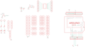

Contents
========

* [PRA2077 > Adafruit Proto Shield PCB](#pra2077--adafruit-proto-shield-pcb)
	* [Schematic](#schematic)
	* [PCB](#pcb)
	* [Interactive BOM](#interactive-bom)
	* [OOMP Parts](#oomp-parts)
	* [Images](#images)
	* [Tags](#tags)
  
![][im]
# PRA2077 > Adafruit Proto Shield PCB

- ID: PROJ-ADAF-2077-STAN-01
- Hex ID: PRA2077
- Name: Adafruit
- Description: Adafruit
- Long Link: [http://oom.lt/PROJ-ADAF-2077-STAN-01](http://oom.lt/PROJ-ADAF-2077-STAN-01)
- Short Link: [http://oom.lt/PRA2077](http://oom.lt/PRA2077)

## Schematic
  

## PCB
  

## Interactive BOM

- Interactive BOM page: [ibom.html](https://htmlpreview.github.io/?https://github.com/oomlout/oomlout_OOMP_projects/blob/main/PROJ-ADAF-2077-STAN-01/kicad/bom/ibom.html)

## OOMP Parts
  

|OOMP ID|Name|Identifier|
| :---: | :---: | :---: |
|CAPX-UNMATCHED-X-NF100-01||C1, C2|
|UNMATCHED-UNMATCHED-X-UNMATCHED-01||GNDSTRIP1, GNDSTRIP2, IC1, M1, RESET, S1, U$3, U$5, U$10, U$11, U$12, U$13, U$14, U$15, U$17, U$18, U$20, U$21, U$22, U$23, U$24, U$26, U$28, U$29, U$30, U$31, U$32, U$33, U$43, VCCSTRIP1, VCCSTRIP2|
|[HEAD-I01-X-PI08-01](https://github.com/oomlout/oomlout_OOMP_parts/tree/main/HEAD-I01-X-PI08-01/)|[2.54 mm 8 Pin Header](https://github.com/oomlout/oomlout_OOMP_parts/tree/main/HEAD-I01-X-PI08-01/)|[JP1, JP4](https://github.com/oomlout/oomlout_OOMP_parts/tree/main/HEAD-I01-X-PI08-01/)|
|[HEAD-I01-X-PI06-01](https://github.com/oomlout/oomlout_OOMP_parts/tree/main/HEAD-I01-X-PI06-01/)|[2.54 mm 6 Pin Header](https://github.com/oomlout/oomlout_OOMP_parts/tree/main/HEAD-I01-X-PI06-01/)|[JP9](https://github.com/oomlout/oomlout_OOMP_parts/tree/main/HEAD-I01-X-PI06-01/)|
|LEDS-UNMATCHED-G-STAN-01||LED1, LED2|
|RESE-UNMATCHED-X-UNMATCHED-01||R1, R2|
|[HEAD-I01-X-PI10-01](https://github.com/oomlout/oomlout_OOMP_parts/tree/main/HEAD-I01-X-PI10-01/)|[2.54 mm 10 Pin Header](https://github.com/oomlout/oomlout_OOMP_parts/tree/main/HEAD-I01-X-PI10-01/)|[U$1](https://github.com/oomlout/oomlout_OOMP_parts/tree/main/HEAD-I01-X-PI10-01/)|

## Images
  
  

|bominteractivefront|bominteractiveback|kicadPcb3d|kicadPcb3dFront|kicadPcb3dBack|eagleImage|eagleSchemImage|pcbdraw|pcbdrawback|
| :---: | :---: | :---: | :---: | :---: | :---: | :---: | :---: | :---: |
||||||||||

## Tags

- hexID: PRA2077
- oompType: PROJ
- oompSize: ADAF
- oompColor: 2077
- oompDesc: STAN
- oompIndex: 01
- oompName: Adafruit Proto Shield PCB
- sources: All source files from https://github.com/adafruit/Adafruit-Proto-Shield-PCB (source licence details in srcLicense.md)
- linkBuyPage: http://www.adafruit.com/products/2077
- oompID: PROJ-ADAF-2077-STAN-01
- oompParts: C1,CAPX-UNMATCHED-X-NF100-01
- oompParts: C2,CAPX-UNMATCHED-X-NF100-01
- oompParts: GNDSTRIP1,UNMATCHED-UNMATCHED-X-UNMATCHED-01
- oompParts: GNDSTRIP2,UNMATCHED-UNMATCHED-X-UNMATCHED-01
- oompParts: IC1,UNMATCHED-UNMATCHED-X-UNMATCHED-01
- oompParts: JP1,HEAD-I01-X-PI08-01
- oompParts: JP4,HEAD-I01-X-PI08-01
- oompParts: JP9,HEAD-I01-X-PI06-01
- oompParts: LED1,LEDS-UNMATCHED-G-STAN-01
- oompParts: LED2,LEDS-UNMATCHED-G-STAN-01
- oompParts: M1,UNMATCHED-UNMATCHED-X-UNMATCHED-01
- oompParts: R1,RESE-UNMATCHED-X-UNMATCHED-01
- oompParts: R2,RESE-UNMATCHED-X-UNMATCHED-01
- oompParts: RESET,UNMATCHED-UNMATCHED-X-UNMATCHED-01
- oompParts: S1,UNMATCHED-UNMATCHED-X-UNMATCHED-01
- oompParts: U$1,HEAD-I01-X-PI10-01
- oompParts: U$3,UNMATCHED-UNMATCHED-X-UNMATCHED-01
- oompParts: U$5,UNMATCHED-UNMATCHED-X-UNMATCHED-01
- oompParts: U$10,UNMATCHED-UNMATCHED-X-UNMATCHED-01
- oompParts: U$11,UNMATCHED-UNMATCHED-X-UNMATCHED-01
- oompParts: U$12,UNMATCHED-UNMATCHED-X-UNMATCHED-01
- oompParts: U$13,UNMATCHED-UNMATCHED-X-UNMATCHED-01
- oompParts: U$14,UNMATCHED-UNMATCHED-X-UNMATCHED-01
- oompParts: U$15,UNMATCHED-UNMATCHED-X-UNMATCHED-01
- oompParts: U$17,UNMATCHED-UNMATCHED-X-UNMATCHED-01
- oompParts: U$18,UNMATCHED-UNMATCHED-X-UNMATCHED-01
- oompParts: U$20,UNMATCHED-UNMATCHED-X-UNMATCHED-01
- oompParts: U$21,UNMATCHED-UNMATCHED-X-UNMATCHED-01
- oompParts: U$22,UNMATCHED-UNMATCHED-X-UNMATCHED-01
- oompParts: U$23,UNMATCHED-UNMATCHED-X-UNMATCHED-01
- oompParts: U$24,UNMATCHED-UNMATCHED-X-UNMATCHED-01
- oompParts: U$26,UNMATCHED-UNMATCHED-X-UNMATCHED-01
- oompParts: U$28,UNMATCHED-UNMATCHED-X-UNMATCHED-01
- oompParts: U$29,UNMATCHED-UNMATCHED-X-UNMATCHED-01
- oompParts: U$30,UNMATCHED-UNMATCHED-X-UNMATCHED-01
- oompParts: U$31,UNMATCHED-UNMATCHED-X-UNMATCHED-01
- oompParts: U$32,UNMATCHED-UNMATCHED-X-UNMATCHED-01
- oompParts: U$33,UNMATCHED-UNMATCHED-X-UNMATCHED-01
- oompParts: U$43,UNMATCHED-UNMATCHED-X-UNMATCHED-01
- oompParts: VCCSTRIP1,UNMATCHED-UNMATCHED-X-UNMATCHED-01
- oompParts: VCCSTRIP2,UNMATCHED-UNMATCHED-X-UNMATCHED-01
- rawParts: C1,,C-US025-025X050,C025-025X050,CAPACITOR, American symbol,,
- rawParts: C2,,C-US025-025X050,C025-025X050,CAPACITOR, American symbol,,
- rawParts: GNDSTRIP1,12-STRIP,12-STRIP,12-STRIP,,,
- rawParts: GNDSTRIP2,12-STRIP,12-STRIP,12-STRIP,,,
- rawParts: IC1,SMD-14,SMD-14,SO-14NMW,,,
- rawParts: JP1,,PINHD-1X8BIG,1X08-BIG,PIN HEADER,,
- rawParts: JP4,,PINHD-1X8BIG,1X08-BIG,PIN HEADER,,
- rawParts: JP9,,PINHD-1X6B,1X06-BIG,PIN HEADER,,
- rawParts: LED1,,LED3MM,LED3MM,LED,,
- rawParts: LED2,,LED3MM,LED3MM,LED,,
- rawParts: M1,ARDUINO_R3_ICSP,ARDUINO_R3_ICSP,ARDUINOR3_ICSP,,,
- rawParts: R1,,R-US_0207/5V,0207/5V,RESISTOR, American symbol,,
- rawParts: R2,,R-US_0207/5V,0207/5V,RESISTOR, American symbol,,
- rawParts: RESET,Reset,10-XX,B3F-10XX,OMRON SWITCH,,
- rawParts: S1,Reset,10-XX,B3F-10XX,OMRON SWITCH,,
- rawParts: U$1,PINHD-1X10,PINHD-1X10,1X10-BIG,Pin header 1x10 0.1 spacing,,
- rawParts: U$2,PERFHOLE,PERFHOLE,PERFHOLE,,,
- rawParts: U$3,5-STRIP,5-STRIP,5-STRIP,,,
- rawParts: U$4,PERFHOLE,PERFHOLE,PERFHOLE,,,
- rawParts: U$5,3-STRIP,3-STRIP,3-STRIP,,,
- rawParts: U$6,PERFHOLE,PERFHOLE,PERFHOLE,,,
- rawParts: U$7,PERFHOLE,PERFHOLE,PERFHOLE,,,
- rawParts: U$8,PERFHOLE,PERFHOLE,PERFHOLE,,,
- rawParts: U$9,PERFHOLE,PERFHOLE,PERFHOLE,,,
- rawParts: U$10,3-STRIP,3-STRIP,3-STRIP,,,
- rawParts: U$11,3-STRIP,3-STRIP,3-STRIP,,,
- rawParts: U$12,3-STRIP,3-STRIP,3-STRIP,,,
- rawParts: U$13,3-STRIP,3-STRIP,3-STRIP,,,
- rawParts: U$14,3-STRIP,3-STRIP,3-STRIP,,,
- rawParts: U$15,3-STRIP,3-STRIP,3-STRIP,,,
- rawParts: U$16,PERFHOLE,PERFHOLE,PERFHOLE,,,
- rawParts: U$17,3-STRIP,3-STRIP,3-STRIP,,,
- rawParts: U$18,3-STRIP,3-STRIP,3-STRIP,,,
- rawParts: U$19,PERFHOLE,PERFHOLE,PERFHOLE,,,
- rawParts: U$20,3-STRIP,3-STRIP,3-STRIP,,,
- rawParts: U$21,3-STRIP,3-STRIP,3-STRIP,,,
- rawParts: U$22,3-STRIP,3-STRIP,3-STRIP,,,
- rawParts: U$23,3-STRIP,3-STRIP,3-STRIP,,,
- rawParts: U$24,5-STRIP,5-STRIP,5-STRIP,,,
- rawParts: U$25,PERFHOLE,PERFHOLE,PERFHOLE,,,
- rawParts: U$26,3-STRIP,3-STRIP,3-STRIP,,,
- rawParts: U$27,PERFHOLE,PERFHOLE,PERFHOLE,,,
- rawParts: U$28,3-STRIP,3-STRIP,3-STRIP,,,
- rawParts: U$29,3-STRIP,3-STRIP,3-STRIP,,,
- rawParts: U$30,3-STRIP,3-STRIP,3-STRIP,,,
- rawParts: U$31,3-STRIP,3-STRIP,3-STRIP,,,
- rawParts: U$32,3-STRIP,3-STRIP,3-STRIP,,,
- rawParts: U$33,3-STRIP,3-STRIP,3-STRIP,,,
- rawParts: U$34,PERFHOLE,PERFHOLE,PERFHOLE,,,
- rawParts: U$35,PERFHOLE,PERFHOLE,PERFHOLE,,,
- rawParts: U$37,PERFHOLE,PERFHOLE,PERFHOLE,,,
- rawParts: U$38,PERFHOLE,PERFHOLE,PERFHOLE,,,
- rawParts: U$39,PERFHOLE,PERFHOLE,PERFHOLE,,,
- rawParts: U$40,PERFHOLE,PERFHOLE,PERFHOLE,,,
- rawParts: U$41,PERFHOLE,PERFHOLE,PERFHOLE,,,
- rawParts: U$43,5-STRIP,5-STRIP,5-STRIP,,,
- rawParts: VCCSTRIP1,12-STRIP,12-STRIP,12-STRIP,,,
- rawParts: VCCSTRIP2,12-STRIP,12-STRIP,12-STRIP,,,

[im]: kicadPcb3d_450.png
