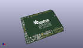
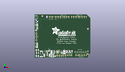
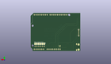
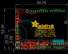
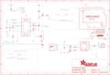

Contents
========

* [PRA2078 > Adafruit](#pra2078--adafruit)
	* [Schematic](#schematic)
	* [Interactive BOM](#interactive-bom)
	* [OOMP Parts](#oomp-parts)
	* [Images](#images)
	* [Tags](#tags)
  
![][im]
# PRA2078 > Adafruit

- ID: PROJ-ADAF-2078-STAN-01
- Hex ID: PRA2078
- Name: Adafruit
- Description: Adafruit
- Long Link: [http://oom.lt/PROJ-ADAF-2078-STAN-01](http://oom.lt/PROJ-ADAF-2078-STAN-01)
- Long Link: [http://oom.lt/PRA2078](http://oom.lt/PRA2078)

## Schematic
  
![][schem]
## Interactive BOM

- Interactive BOM page: [ibom.html](https://htmlpreview.github.io/?https://github.com/oomlout/oomlout_OOMP_projects/blob/main/PROJ-ADAF-2078-STAN-01/kicad/bom/ibom.html)

## OOMP Parts
  

|OOMP Parts|
| :---: |
|ANALOG,UNMATCHED-UNMATCHED-UNMATCHED-UNMATCHED-UNMATCHED,ANALOG,ANALOG,PINHD-1X6,1X06,PIN HEADER,,|
|BATT_IN,UNMATCHED-UNMATCHED-UNMATCHED-UNMATCHED-UNMATCHED,BATT_IN,JST-PH,JST_2PIN-SMT,JST-PH-2-SMT,JST 2-Pin Connectors of various flavors,,|
|C4,UNMATCHED-UNMATCHED-UNMATCHED-UNMATCHED-UNMATCHED,C4,10µF,CAP_CERAMIC0805-NOOUTLINE,0805-NO,Ceramic Capacitors,,|
|C6,UNMATCHED-UNMATCHED-UNMATCHED-UNMATCHED-UNMATCHED,C6,10uF,CAP_CERAMIC0805-NOOUTLINE,0805-NO,Ceramic Capacitors,,|
|C7,UNMATCHED-UNMATCHED-UNMATCHED-UNMATCHED-UNMATCHED,C7,2.2uF,CAP_CERAMIC0805-NOOUTLINE,0805-NO,Ceramic Capacitors,,|
|C8,UNMATCHED-UNMATCHED-UNMATCHED-UNMATCHED-UNMATCHED,C8,0.1uF,CAP_CERAMIC0805-NOOUTLINE,0805-NO,Ceramic Capacitors,,|
|C9,UNMATCHED-UNMATCHED-UNMATCHED-UNMATCHED-UNMATCHED,C9,100uF/6V,CAP_TANTALUMB/3528_REFLOW,EIA3528-21/B-R,Tantalum Capacitors,,|
|D1,UNMATCHED-UNMATCHED-UNMATCHED-UNMATCHED-UNMATCHED,D1,MBR120,DIODE-SCHOTTKYSOD-123,SOD-123,,,|
|F1,UNMATCHED-UNMATCHED-UNMATCHED-UNMATCHED-UNMATCHED,F1,500mA,PTCFUSE-1206,R1206,PTC fuses, resettable thermistors,,|
|L1,UNMATCHED-UNMATCHED-UNMATCHED-UNMATCHED-UNMATCHED,L1,VLC5045-6.8uH,INDUCTORTDK_VLC5045,INDUCTOR_5X5MM_TDK_VLC5045,Inductors,,|
|LED1,UNMATCHED-UNMATCHED-UNMATCHED-UNMATCHED-UNMATCHED,LED1,YELLOW,LED0805_NOOUTLINE,CHIPLED_0805_NOOUTLINE,LED,,|
|LED2,UNMATCHED-UNMATCHED-UNMATCHED-UNMATCHED-UNMATCHED,LED2,GREEN,LED0805_NOOUTLINE,CHIPLED_0805_NOOUTLINE,LED,,|
|LED3,UNMATCHED-UNMATCHED-UNMATCHED-UNMATCHED-UNMATCHED,LED3,BLUE,LED0805_NOOUTLINE,CHIPLED_0805_NOOUTLINE,LED,,|
|LED4,UNMATCHED-UNMATCHED-UNMATCHED-UNMATCHED-UNMATCHED,LED4,RED,LED0805_NOOUTLINE,CHIPLED_0805_NOOUTLINE,LED,,|
|R1,UNMATCHED-UNMATCHED-UNMATCHED-UNMATCHED-UNMATCHED,R1,470,RESISTOR0805_NOOUTLINE,0805-NO,Resistors,,|
|R2,UNMATCHED-UNMATCHED-UNMATCHED-UNMATCHED-UNMATCHED,R2,2K,RESISTOR0805_NOOUTLINE,0805-NO,Resistors,,|
|R3,UNMATCHED-UNMATCHED-UNMATCHED-UNMATCHED-UNMATCHED,R3,1K,RESISTOR0805_NOOUTLINE,0805-NO,Resistors,,|
|R4,UNMATCHED-UNMATCHED-UNMATCHED-UNMATCHED-UNMATCHED,R4,2K,RESISTOR0805_NOOUTLINE,0805-NO,Resistors,,|
|R5,UNMATCHED-UNMATCHED-UNMATCHED-UNMATCHED-UNMATCHED,R5,1K,RESISTOR0805_NOOUTLINE,0805-NO,Resistors,,|
|R9,UNMATCHED-UNMATCHED-UNMATCHED-UNMATCHED-UNMATCHED,R9,1.87Mohm,RESISTOR0805_NOOUTLINE,0805-NO,Resistors,,|
|R10,UNMATCHED-UNMATCHED-UNMATCHED-UNMATCHED-UNMATCHED,R10,200K,RESISTOR0805_NOOUTLINE,0805-NO,Resistors,,|
|R11,UNMATCHED-UNMATCHED-UNMATCHED-UNMATCHED-UNMATCHED,R11,340K,RESISTOR0805_NOOUTLINE,0805-NO,Resistors,,|
|R14,UNMATCHED-UNMATCHED-UNMATCHED-UNMATCHED-UNMATCHED,R14,1.87Mohm,RESISTOR0805_NOOUTLINE,0805-NO,Resistors,,|
|R20,UNMATCHED-UNMATCHED-UNMATCHED-UNMATCHED-UNMATCHED,R20,1K,RESISTOR0805_NOOUTLINE,0805-NO,Resistors,,|
|R23,UNMATCHED-UNMATCHED-UNMATCHED-UNMATCHED-UNMATCHED,R23,340K,RESISTOR0805_NOOUTLINE,0805-NO,Resistors,,|
|S1,UNMATCHED-UNMATCHED-UNMATCHED-UNMATCHED-UNMATCHED,S1,OS102011MA1Q,OS102011MA1Q,OS102011MA1Q,OS10201MA1Q through-hole right angle switch,,|
|SW1,UNMATCHED-UNMATCHED-UNMATCHED-UNMATCHED-UNMATCHED,SJ1,,SOLDERJUMPER,SOLDERJUMPER_ARROW_NOPASTE,SMD Solder JUMPER,EXCLUDE,|
|T1,UNMATCHED-UNMATCHED-UNMATCHED-UNMATCHED-UNMATCHED,SJ2,,SOLDERJUMPER,SOLDERJUMPER_ARROW_NOPASTE,SMD Solder JUMPER,EXCLUDE,|
|U2,UNMATCHED-UNMATCHED-UNMATCHED-UNMATCHED-UNMATCHED,SJ3,,SOLDERJUMPER,SOLDERJUMPER_ARROW_NOPASTE,SMD Solder JUMPER,EXCLUDE,|
|U3,UNMATCHED-UNMATCHED-UNMATCHED-UNMATCHED-UNMATCHED,SJ4,,SOLDERJUMPER,SOLDERJUMPER_ARROW_NOPASTE,SMD Solder JUMPER,EXCLUDE,|
|U4,UNMATCHED-UNMATCHED-UNMATCHED-UNMATCHED-UNMATCHED,SJ5,,SOLDERJUMPER,SOLDERJUMPER_ARROW_NOPASTE,SMD Solder JUMPER,EXCLUDE,|
|X1,UNMATCHED-UNMATCHED-UNMATCHED-UNMATCHED-UNMATCHED,SJ6,,SOLDERJUMPER,SOLDERJUMPER_ARROW_NOPASTE,SMD Solder JUMPER,EXCLUDE,|

## Images
  
  

|kicadPcb3d|kicadPcb3dFront|kicadPcb3dBack|eagleImage|eagleSchemImage|
| :---: | :---: | :---: | :---: | :---: |
||||||

## Tags

- hexID: PRA2078
- oompType: PROJ
- oompSize: ADAF
- oompColor: 2078
- oompDesc: STAN
- oompIndex: 01
- oompName: Adafruit PowerBoost 500 Shield PCB
- sources: All source files from https://github.com/adafruit/Adafruit-PowerBoost-500-Shield-PCB (source licence details in srcLicense.md)
- linkBuyPage: http://www.adafruit.com/products/2078
- oompID: PROJ-ADAF-2078-STAN-01
- oompParts: ANALOG,UNMATCHED-UNMATCHED-UNMATCHED-UNMATCHED-UNMATCHED
- oompParts: BATT_IN,UNMATCHED-UNMATCHED-UNMATCHED-UNMATCHED-UNMATCHED
- oompParts: C4,UNMATCHED-UNMATCHED-UNMATCHED-UNMATCHED-UNMATCHED
- oompParts: C6,UNMATCHED-UNMATCHED-UNMATCHED-UNMATCHED-UNMATCHED
- oompParts: C7,UNMATCHED-UNMATCHED-UNMATCHED-UNMATCHED-UNMATCHED
- oompParts: C8,UNMATCHED-UNMATCHED-UNMATCHED-UNMATCHED-UNMATCHED
- oompParts: C9,UNMATCHED-UNMATCHED-UNMATCHED-UNMATCHED-UNMATCHED
- oompParts: D1,UNMATCHED-UNMATCHED-UNMATCHED-UNMATCHED-UNMATCHED
- oompParts: F1,UNMATCHED-UNMATCHED-UNMATCHED-UNMATCHED-UNMATCHED
- oompParts: L1,UNMATCHED-UNMATCHED-UNMATCHED-UNMATCHED-UNMATCHED
- oompParts: LED1,UNMATCHED-UNMATCHED-UNMATCHED-UNMATCHED-UNMATCHED
- oompParts: LED2,UNMATCHED-UNMATCHED-UNMATCHED-UNMATCHED-UNMATCHED
- oompParts: LED3,UNMATCHED-UNMATCHED-UNMATCHED-UNMATCHED-UNMATCHED
- oompParts: LED4,UNMATCHED-UNMATCHED-UNMATCHED-UNMATCHED-UNMATCHED
- oompParts: R1,UNMATCHED-UNMATCHED-UNMATCHED-UNMATCHED-UNMATCHED
- oompParts: R2,UNMATCHED-UNMATCHED-UNMATCHED-UNMATCHED-UNMATCHED
- oompParts: R3,UNMATCHED-UNMATCHED-UNMATCHED-UNMATCHED-UNMATCHED
- oompParts: R4,UNMATCHED-UNMATCHED-UNMATCHED-UNMATCHED-UNMATCHED
- oompParts: R5,UNMATCHED-UNMATCHED-UNMATCHED-UNMATCHED-UNMATCHED
- oompParts: R9,UNMATCHED-UNMATCHED-UNMATCHED-UNMATCHED-UNMATCHED
- oompParts: R10,UNMATCHED-UNMATCHED-UNMATCHED-UNMATCHED-UNMATCHED
- oompParts: R11,UNMATCHED-UNMATCHED-UNMATCHED-UNMATCHED-UNMATCHED
- oompParts: R14,UNMATCHED-UNMATCHED-UNMATCHED-UNMATCHED-UNMATCHED
- oompParts: R20,UNMATCHED-UNMATCHED-UNMATCHED-UNMATCHED-UNMATCHED
- oompParts: R23,UNMATCHED-UNMATCHED-UNMATCHED-UNMATCHED-UNMATCHED
- oompParts: S1,UNMATCHED-UNMATCHED-UNMATCHED-UNMATCHED-UNMATCHED
- oompParts: SW1,UNMATCHED-UNMATCHED-UNMATCHED-UNMATCHED-UNMATCHED
- oompParts: T1,UNMATCHED-UNMATCHED-UNMATCHED-UNMATCHED-UNMATCHED
- oompParts: U2,UNMATCHED-UNMATCHED-UNMATCHED-UNMATCHED-UNMATCHED
- oompParts: U3,UNMATCHED-UNMATCHED-UNMATCHED-UNMATCHED-UNMATCHED
- oompParts: U4,UNMATCHED-UNMATCHED-UNMATCHED-UNMATCHED-UNMATCHED
- oompParts: X1,UNMATCHED-UNMATCHED-UNMATCHED-UNMATCHED-UNMATCHED
- rawParts: ANALOG,ANALOG,PINHD-1X6,1X06,PIN HEADER,,
- rawParts: BATT_IN,JST-PH,JST_2PIN-SMT,JST-PH-2-SMT,JST 2-Pin Connectors of various flavors,,
- rawParts: C4,10µF,CAP_CERAMIC0805-NOOUTLINE,0805-NO,Ceramic Capacitors,,
- rawParts: C6,10uF,CAP_CERAMIC0805-NOOUTLINE,0805-NO,Ceramic Capacitors,,
- rawParts: C7,2.2uF,CAP_CERAMIC0805-NOOUTLINE,0805-NO,Ceramic Capacitors,,
- rawParts: C8,0.1uF,CAP_CERAMIC0805-NOOUTLINE,0805-NO,Ceramic Capacitors,,
- rawParts: C9,100uF/6V,CAP_TANTALUMB/3528_REFLOW,EIA3528-21/B-R,Tantalum Capacitors,,
- rawParts: D1,MBR120,DIODE-SCHOTTKYSOD-123,SOD-123,,,
- rawParts: F1,500mA,PTCFUSE-1206,R1206,PTC fuses, resettable thermistors,,
- rawParts: L1,VLC5045-6.8uH,INDUCTORTDK_VLC5045,INDUCTOR_5X5MM_TDK_VLC5045,Inductors,,
- rawParts: LED1,YELLOW,LED0805_NOOUTLINE,CHIPLED_0805_NOOUTLINE,LED,,
- rawParts: LED2,GREEN,LED0805_NOOUTLINE,CHIPLED_0805_NOOUTLINE,LED,,
- rawParts: LED3,BLUE,LED0805_NOOUTLINE,CHIPLED_0805_NOOUTLINE,LED,,
- rawParts: LED4,RED,LED0805_NOOUTLINE,CHIPLED_0805_NOOUTLINE,LED,,
- rawParts: R1,470,RESISTOR0805_NOOUTLINE,0805-NO,Resistors,,
- rawParts: R2,2K,RESISTOR0805_NOOUTLINE,0805-NO,Resistors,,
- rawParts: R3,1K,RESISTOR0805_NOOUTLINE,0805-NO,Resistors,,
- rawParts: R4,2K,RESISTOR0805_NOOUTLINE,0805-NO,Resistors,,
- rawParts: R5,1K,RESISTOR0805_NOOUTLINE,0805-NO,Resistors,,
- rawParts: R9,1.87Mohm,RESISTOR0805_NOOUTLINE,0805-NO,Resistors,,
- rawParts: R10,200K,RESISTOR0805_NOOUTLINE,0805-NO,Resistors,,
- rawParts: R11,340K,RESISTOR0805_NOOUTLINE,0805-NO,Resistors,,
- rawParts: R14,1.87Mohm,RESISTOR0805_NOOUTLINE,0805-NO,Resistors,,
- rawParts: R20,1K,RESISTOR0805_NOOUTLINE,0805-NO,Resistors,,
- rawParts: R23,340K,RESISTOR0805_NOOUTLINE,0805-NO,Resistors,,
- rawParts: S1,OS102011MA1Q,OS102011MA1Q,OS102011MA1Q,OS10201MA1Q through-hole right angle switch,,
- rawParts: SJ1,,SOLDERJUMPER,SOLDERJUMPER_ARROW_NOPASTE,SMD Solder JUMPER,EXCLUDE,
- rawParts: SJ2,,SOLDERJUMPER,SOLDERJUMPER_ARROW_NOPASTE,SMD Solder JUMPER,EXCLUDE,
- rawParts: SJ3,,SOLDERJUMPER,SOLDERJUMPER_ARROW_NOPASTE,SMD Solder JUMPER,EXCLUDE,
- rawParts: SJ4,,SOLDERJUMPER,SOLDERJUMPER_ARROW_NOPASTE,SMD Solder JUMPER,EXCLUDE,
- rawParts: SJ5,,SOLDERJUMPER,SOLDERJUMPER_ARROW_NOPASTE,SMD Solder JUMPER,EXCLUDE,
- rawParts: SJ6,,SOLDERJUMPER,SOLDERJUMPER_ARROW_NOPASTE,SMD Solder JUMPER,EXCLUDE,
- rawParts: SW1,SPST_TACT-KMR2,SPST_TACT-KMR2,KMR2,SMT 6mm switch, EVQQ2 series,,
- rawParts: T1,MMUN2133LT1G,MUN2114T1-PNP_DRIVER-SC59-BEC,SC59-BEC,PNP Bias Resistor Transistor,,
- rawParts: U$3,FIDUCIAL,FIDUCIAL,FIDUCIAL_1MM,For use by pick and place machines to calibrate the vision/machine, 1mm,,
- rawParts: U$4,FIDUCIAL,FIDUCIAL,FIDUCIAL_1MM,For use by pick and place machines to calibrate the vision/machine, 1mm,,
- rawParts: U2,ARDUINOR3-NOSILK,ARDUINOR3-NOSILK,ARDUINOR3-NOSILK,This is a new object for the new Arduino R3 - with extra pins that you may want to use (such as IOref, and duplicated A4/A5,,
- rawParts: U3,MCP73831T-2ACI/OT,MCP73831/2,SOT23-5,MCP73831/2 LIPO Charger,,
- rawParts: U4,TPS61030RSAR,VREG_TPS6103X,PVQFN-16,TPS6103x 4A Boost - 1.8-5.5V Input, Adjustable Output to 5.5V,,
- rawParts: X1,MicroUSB,USBMICRO_20329,4UCONN_20329,USB Connectors,,

[im]: kicadPcb3d_450.png
[schem]: eagleSchemImage.png
