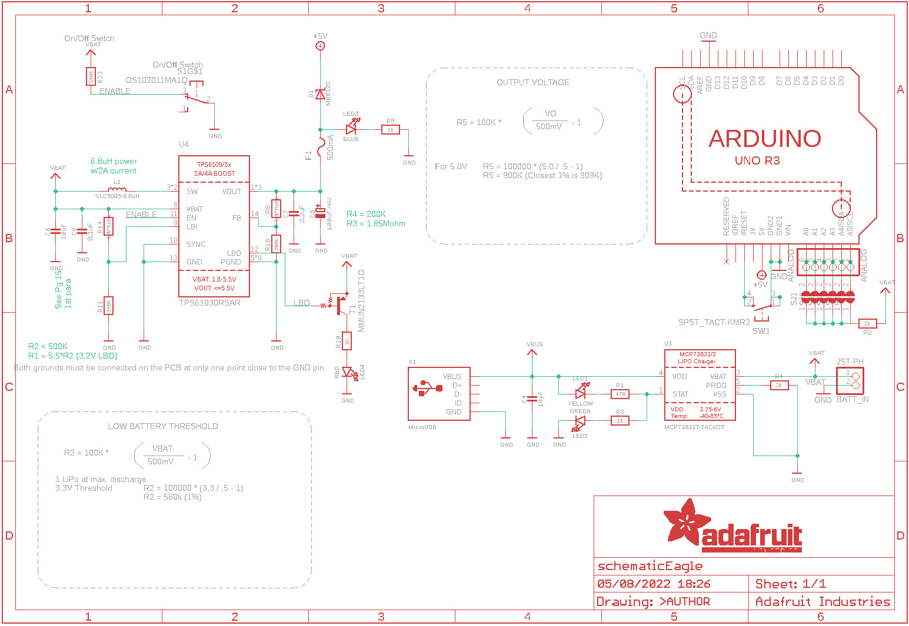
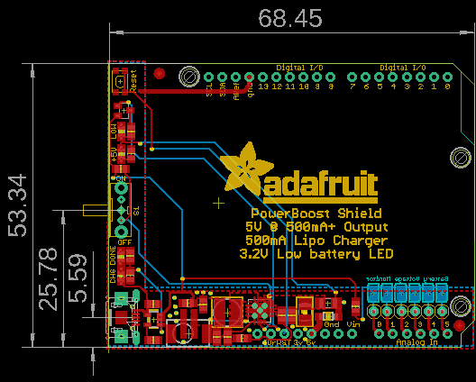

Contents
========

* [PRA2078 > Adafruit PowerBoost 500 Shield PCB](#pra2078--adafruit-powerboost-500-shield-pcb)
	* [Schematic](#schematic)
	* [PCB](#pcb)
	* [Interactive BOM](#interactive-bom)
	* [OOMP Parts](#oomp-parts)
	* [Images](#images)
	* [Tags](#tags)
  
![][im]
# PRA2078 > Adafruit PowerBoost 500 Shield PCB

- ID: PROJ-ADAF-2078-STAN-01
- Hex ID: PRA2078
- Name: Adafruit
- Description: Adafruit
- Long Link: [http://oom.lt/PROJ-ADAF-2078-STAN-01](http://oom.lt/PROJ-ADAF-2078-STAN-01)
- Short Link: [http://oom.lt/PRA2078](http://oom.lt/PRA2078)

## Schematic
  

## PCB
  

## Interactive BOM

- Interactive BOM page: [ibom.html](https://htmlpreview.github.io/?https://github.com/oomlout/oomlout_OOMP_projects/blob/main/PROJ-ADAF-2078-STAN-01/kicad/bom/ibom.html)

## OOMP Parts
  

|OOMP Parts|
| :---: |
|[HEAD-I01-X-PI06-01  2.54 mm 6 Pin Header  ANALOG](https://github.com/oomlout/oomlout_OOMP_parts/tree/main/HEAD-I01-X-PI06-01/)|
|UNMATCHED-UNMATCHED-X-UNMATCHED-01 BATT_IN, L1, S1, T1, U2, U4, X1|
|[CAPC-0805-X-UF10-V10  SMD (0805) 10 uF Capacitor (Ceramic) 10v  C4, C6](https://github.com/oomlout/oomlout_OOMP_parts/tree/main/CAPC-0805-X-UF10-V10/)|
|[CAPC-0805-X-UF22D-V25  SMD (0805) 2.2 uF Capacitor (Ceramic) 25v  C7](https://github.com/oomlout/oomlout_OOMP_parts/tree/main/CAPC-0805-X-UF22D-V25/)|
|CAPC-0805-X-UF1D-01 C8|
|CAPX-3528-X-UNMATCHED-01 C9|
|[DIOD-S123-X-KMBR120-01  SMD (SOD-123) MBR120 Diode  D1](https://github.com/oomlout/oomlout_OOMP_parts/tree/main/DIOD-S123-X-KMBR120-01/)|
|UNMATCHED-1206-X-UNMATCHED-01 F1|
|[LEDS-0805-Y-STAN-01  SMD (0805) Yellow LED  LED1](https://github.com/oomlout/oomlout_OOMP_parts/tree/main/LEDS-0805-Y-STAN-01/)|
|[LEDS-0805-G-STAN-01  SMD (0805) Green LED  LED2](https://github.com/oomlout/oomlout_OOMP_parts/tree/main/LEDS-0805-G-STAN-01/)|
|[LEDS-0805-L-STAN-01  SMD (0805) Blue LED  LED3](https://github.com/oomlout/oomlout_OOMP_parts/tree/main/LEDS-0805-L-STAN-01/)|
|[LEDS-0805-R-STAN-01  SMD (0805) Red LED  LED4](https://github.com/oomlout/oomlout_OOMP_parts/tree/main/LEDS-0805-R-STAN-01/)|
|RESE-0805-X-O471-01 R1|
|[RESE-0805-X-O202-01  SMD (0805) 2k Ohm Resistor  R2, R4](https://github.com/oomlout/oomlout_OOMP_parts/tree/main/RESE-0805-X-O202-01/)|
|[RESE-0805-X-O102-01  SMD (0805) 1k Ohm Resistor  R3, R5, R20](https://github.com/oomlout/oomlout_OOMP_parts/tree/main/RESE-0805-X-O102-01/)|
|RESE-0805-X-UNMATCHED-01 R9, R14|
|RESE-0805-X-O2003-01 R10|
|RESE-0805-X-O3403-01 R11, R23|
|BUTA-UNMATCHED-X-STAN-01 SW1|
|UNMATCHED-SO235-X-UNMATCHED-01 U3|

## Images
  
  

|kicadPcb3d|kicadPcb3dFront|kicadPcb3dBack|eagleImage|eagleSchemImage|
| :---: | :---: | :---: | :---: | :---: |
||||||

## Tags

- hexID: PRA2078
- oompType: PROJ
- oompSize: ADAF
- oompColor: 2078
- oompDesc: STAN
- oompIndex: 01
- oompName: Adafruit PowerBoost 500 Shield PCB
- sources: All source files from https://github.com/adafruit/Adafruit-PowerBoost-500-Shield-PCB (source licence details in srcLicense.md)
- linkBuyPage: http://www.adafruit.com/products/2078
- oompID: PROJ-ADAF-2078-STAN-01
- oompParts: ANALOG,HEAD-I01-X-PI06-01
- oompParts: BATT_IN,UNMATCHED-UNMATCHED-X-UNMATCHED-01
- oompParts: C4,CAPC-0805-X-UF10-V10
- oompParts: C6,CAPC-0805-X-UF10-V10
- oompParts: C7,CAPC-0805-X-UF22D-V25
- oompParts: C8,CAPC-0805-X-UF1D-01
- oompParts: C9,CAPX-3528-X-UNMATCHED-01
- oompParts: D1,DIOD-S123-X-KMBR120-01
- oompParts: F1,UNMATCHED-1206-X-UNMATCHED-01
- oompParts: L1,UNMATCHED-UNMATCHED-X-UNMATCHED-01
- oompParts: LED1,LEDS-0805-Y-STAN-01
- oompParts: LED2,LEDS-0805-G-STAN-01
- oompParts: LED3,LEDS-0805-L-STAN-01
- oompParts: LED4,LEDS-0805-R-STAN-01
- oompParts: R1,RESE-0805-X-O471-01
- oompParts: R2,RESE-0805-X-O202-01
- oompParts: R3,RESE-0805-X-O102-01
- oompParts: R4,RESE-0805-X-O202-01
- oompParts: R5,RESE-0805-X-O102-01
- oompParts: R9,RESE-0805-X-UNMATCHED-01
- oompParts: R10,RESE-0805-X-O2003-01
- oompParts: R11,RESE-0805-X-O3403-01
- oompParts: R14,RESE-0805-X-UNMATCHED-01
- oompParts: R20,RESE-0805-X-O102-01
- oompParts: R23,RESE-0805-X-O3403-01
- oompParts: S1,UNMATCHED-UNMATCHED-X-UNMATCHED-01
- oompParts: SW1,BUTA-UNMATCHED-X-STAN-01
- oompParts: T1,UNMATCHED-UNMATCHED-X-UNMATCHED-01
- oompParts: U2,UNMATCHED-UNMATCHED-X-UNMATCHED-01
- oompParts: U3,UNMATCHED-SO235-X-UNMATCHED-01
- oompParts: U4,UNMATCHED-UNMATCHED-X-UNMATCHED-01
- oompParts: X1,UNMATCHED-UNMATCHED-X-UNMATCHED-01
- rawParts: ANALOG,ANALOG,PINHD-1X6,1X06,PIN HEADER,,
- rawParts: BATT_IN,JST-PH,JST_2PIN-SMT,JST-PH-2-SMT,JST 2-Pin Connectors of various flavors,,
- rawParts: C4,10µF,CAP_CERAMIC0805-NOOUTLINE,0805-NO,Ceramic Capacitors,,
- rawParts: C6,10uF,CAP_CERAMIC0805-NOOUTLINE,0805-NO,Ceramic Capacitors,,
- rawParts: C7,2.2uF,CAP_CERAMIC0805-NOOUTLINE,0805-NO,Ceramic Capacitors,,
- rawParts: C8,0.1uF,CAP_CERAMIC0805-NOOUTLINE,0805-NO,Ceramic Capacitors,,
- rawParts: C9,100uF/6V,CAP_TANTALUMB/3528_REFLOW,EIA3528-21/B-R,Tantalum Capacitors,,
- rawParts: D1,MBR120,DIODE-SCHOTTKYSOD-123,SOD-123,,,
- rawParts: F1,500mA,PTCFUSE-1206,R1206,PTC fuses, resettable thermistors,,
- rawParts: L1,VLC5045-6.8uH,INDUCTORTDK_VLC5045,INDUCTOR_5X5MM_TDK_VLC5045,Inductors,,
- rawParts: LED1,YELLOW,LED0805_NOOUTLINE,CHIPLED_0805_NOOUTLINE,LED,,
- rawParts: LED2,GREEN,LED0805_NOOUTLINE,CHIPLED_0805_NOOUTLINE,LED,,
- rawParts: LED3,BLUE,LED0805_NOOUTLINE,CHIPLED_0805_NOOUTLINE,LED,,
- rawParts: LED4,RED,LED0805_NOOUTLINE,CHIPLED_0805_NOOUTLINE,LED,,
- rawParts: R1,470,RESISTOR0805_NOOUTLINE,0805-NO,Resistors,,
- rawParts: R2,2K,RESISTOR0805_NOOUTLINE,0805-NO,Resistors,,
- rawParts: R3,1K,RESISTOR0805_NOOUTLINE,0805-NO,Resistors,,
- rawParts: R4,2K,RESISTOR0805_NOOUTLINE,0805-NO,Resistors,,
- rawParts: R5,1K,RESISTOR0805_NOOUTLINE,0805-NO,Resistors,,
- rawParts: R9,1.87Mohm,RESISTOR0805_NOOUTLINE,0805-NO,Resistors,,
- rawParts: R10,200K,RESISTOR0805_NOOUTLINE,0805-NO,Resistors,,
- rawParts: R11,340K,RESISTOR0805_NOOUTLINE,0805-NO,Resistors,,
- rawParts: R14,1.87Mohm,RESISTOR0805_NOOUTLINE,0805-NO,Resistors,,
- rawParts: R20,1K,RESISTOR0805_NOOUTLINE,0805-NO,Resistors,,
- rawParts: R23,340K,RESISTOR0805_NOOUTLINE,0805-NO,Resistors,,
- rawParts: S1,OS102011MA1Q,OS102011MA1Q,OS102011MA1Q,OS10201MA1Q through-hole right angle switch,,
- rawParts: SJ1,,SOLDERJUMPER,SOLDERJUMPER_ARROW_NOPASTE,SMD Solder JUMPER,EXCLUDE,
- rawParts: SJ2,,SOLDERJUMPER,SOLDERJUMPER_ARROW_NOPASTE,SMD Solder JUMPER,EXCLUDE,
- rawParts: SJ3,,SOLDERJUMPER,SOLDERJUMPER_ARROW_NOPASTE,SMD Solder JUMPER,EXCLUDE,
- rawParts: SJ4,,SOLDERJUMPER,SOLDERJUMPER_ARROW_NOPASTE,SMD Solder JUMPER,EXCLUDE,
- rawParts: SJ5,,SOLDERJUMPER,SOLDERJUMPER_ARROW_NOPASTE,SMD Solder JUMPER,EXCLUDE,
- rawParts: SJ6,,SOLDERJUMPER,SOLDERJUMPER_ARROW_NOPASTE,SMD Solder JUMPER,EXCLUDE,
- rawParts: SW1,SPST_TACT-KMR2,SPST_TACT-KMR2,KMR2,SMT 6mm switch, EVQQ2 series,,
- rawParts: T1,MMUN2133LT1G,MUN2114T1-PNP_DRIVER-SC59-BEC,SC59-BEC,PNP Bias Resistor Transistor,,
- rawParts: U$3,FIDUCIAL,FIDUCIAL,FIDUCIAL_1MM,For use by pick and place machines to calibrate the vision/machine, 1mm,,
- rawParts: U$4,FIDUCIAL,FIDUCIAL,FIDUCIAL_1MM,For use by pick and place machines to calibrate the vision/machine, 1mm,,
- rawParts: U2,ARDUINOR3-NOSILK,ARDUINOR3-NOSILK,ARDUINOR3-NOSILK,This is a new object for the new Arduino R3 - with extra pins that you may want to use (such as IOref, and duplicated A4/A5,,
- rawParts: U3,MCP73831T-2ACI/OT,MCP73831/2,SOT23-5,MCP73831/2 LIPO Charger,,
- rawParts: U4,TPS61030RSAR,VREG_TPS6103X,PVQFN-16,TPS6103x 4A Boost - 1.8-5.5V Input, Adjustable Output to 5.5V,,
- rawParts: X1,MicroUSB,USBMICRO_20329,4UCONN_20329,USB Connectors,,

[im]: kicadPcb3d_450.png
